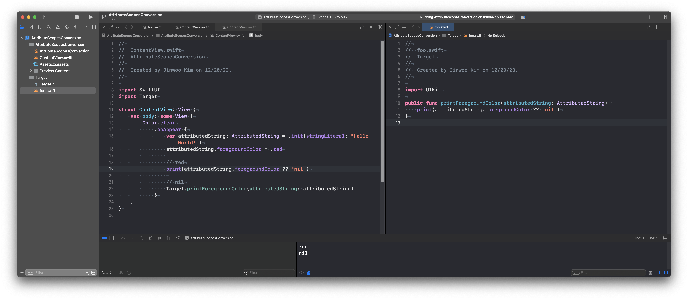

# AttributeString의 AttributeScopes에 대해

iOS 15.0에서 발표된 [AttributedString](https://developer.apple.com/documentation/foundation/attributedstring)의 [AttributeScopes](https://developer.apple.com/documentation/foundation/attributescopes)에 대한 글입니다.

## NSAttributedString와 AttributedString의 차이점

NSAttributedString은 Foundation의 일부이지만, [NSFontAttributeName](https://developer.apple.com/documentation/uikit/nsfontattributename) 및 [NSForegroundColorAttributeName](https://developer.apple.com/documentation/uikit/nsforegroundcolorattributename)은 UIKit 및 AppKit에서 구현된 로직입니다.

예를 들어 Font의 경우 UIKit에서는 UIFont이고 AppKit에서는 NSFont이며, ForegroundColor의 경우 UIKit에서는 UIColor, AppKit에서는 NSColor로 되어 있습니다. 이러한 특정 UI Framework에 의존적인 Key는 Foundation에서 구현하고 있지 않습니다.

NSAttributedString에서는 UIKit과 AppKit만 지원했다면, AttributedString은 UIKit, AppKit, SwiftUI를 모두 지원합니다. 여기서 SwiftUI는 iOS과 macOS를 동시에 지원한다는 것을 인지해야 하며 ('동시'가 핵심입니다.), 이때문에 구조가 전반적으로 바뀌어야 합니다.

예를 들어 UIKit과 AppKit만을 동시에 지원하는 API를 설계한다고 하면, 아래처럼 간단하게 할 수 있습니다.

```swift
#if canImport(UIKit)
import UIKit
typealias OSColorType = UIColor
#elseif canImport(AppKit)
import AppKit
typealias OSColorType = NSColor
#endif

struct MyText {
    let text: String
    let osColor: OSColorType
}

let myText: MyText

let uiLabel: UILabel
uiLabel.textColor = myText.osColor

let nsTextField: NSTextField
nsTextField.textColor = myText.osColor
```

하지만 UIKit, AppKit, SwiftUI를 동시에 지원하는 API를 설계한다면 아래처럼 될 것입니다.

```swift
#if canImport(UIKit)
import UIKit
typealias OSColorType = UIColor
#elseif canImport(AppKit)
import AppKit
typealias OSColorType = NSColor
#endif

import SwiftUI

struct MyText {
    let text: String
    let osColor: OSColorType
    let swiftUIColor: SwiftUI.Color
}

let myText: MyText

let uiLabel: UILabel
uiLabel.textColor = myText.osColor

let nsTextField: NSTextField
nsTextField.textColor = myText.osColor

let swiftUIText: SwiftUI.Text = SwiftUI.Text("Test")
    .foregroundStyle(myText.swiftUIColor)
```

여기서 '왜 osColor와 swiftUIColor을 따로 만드는가? 그냥 osColor 하나만 두고, [`Color(uiColor:)`](https://developer.apple.com/documentation/swiftui/color/init(uicolor:)) 및 [`Color(nsColor:)`](https://developer.apple.com/documentation/swiftui/color/init(nscolor:))를 쓰면 되는게 아닌가?'라고 생각하실 수 있습니다.

그 생각대로 UIColor/NSColor -> SwiftUI.Color로 변환하는 것이 가능하나, 반대로 SwiftUI.Color -> UIColor/NSColor를 제대로 된 방법으로 변환하는 것이 불가능합니다.

SwiftUI.Color -> CGColor -> UIColor/NSColor 이렇게 CGColor로 한 번 변환하면 가능하겠지만 Adaptive Color의 기능을 잃게 됩니다. 예를 들어 Interface Style (Light, Dark)에 따라 색을 분기처리하는 기능을 상실하게 됩니다.

그렇다면 애플은 왜 SwiftUI.Color -> UIColor/NSColor로 변환하는 API를 제공하지 않을까 생각해보면 Adaptive Color가 작동되는 메커니즘이 다르가 때문입니다. SwiftUI.Color는 EnvironmentValues로 분기처리 된다면, UIColor/NSColor는 UITraitCollection으로 분기처리 됩니다. 이를 서로 호환되게 하는 것은 까다로운 작업입니다.

따라서 SwiftUI는 iOS와 macOS를 동시에 호환된다는 특성 때문에, 위에서 보여드린 코드처럼 `MyText.osColor`와 `MyText.swiftUIColor`를 분리해야 하며 서로 상호호환이 어려운 구조입니다. 이러한 로직은 AttributedString에서도 그대로 반영되어 있으며, 이러한 분기처리를 [AttributeScopes](https://developer.apple.com/documentation/foundation/attributescopes)로 합니다.

## AttributeScopes 때문에 발생하는 문제

[AttributeScopesConversion](https://github.com/pookjw/AttributeScopesConversion)라는 샘플 프로젝트를 준비했습니다.



- AttributeScopesConversion라는 SwiftUI App이 있습니다.
- Target이라는 UIKit을 사용하는 Dynamic Framework가 있습니다. Target에는 AttributedString의 foregroundColor를 출력하는 `printForegroundColor(attributedString:)` 함수가 있습니다.
- AttributeScopesConversion에서 AttributedString를 생성하고 foregroundColor를 할당한 뒤, `printForegroundColor(attributedString:)`를 호출합니다.

이런 구조의 샘플 프로젝트 입니다. 분명 빨간색을 할당해주고 있고 AttributeScopesConversion 내에서는 빨간색으로 정상적으로 할당된 것이 확인되지만 `printForegroundColor(attributedString:)`에서는 nil이 나오는 문제가 발생합니다.

하지만 Target에 `import SwiftUI`를 추가하면 print에 빨간색이 제대로 찍히는 기현상을 볼 수 있습니다.

이는 AttributeContainer의 내부 원리를 이해해야 합니다.

### AttributeContainer의 내부 원리

만약에 제가 이런 코드를 짰다고 가정하면

```swift
var container: AttributeContainer = .init()
container.foregroundColor = .red
```

해당 subscript dynamicMember로 foregroundColor 같은 값을 설정할 경우 [`AttributeContainer.contents (또는 storage)`](https://github.com/apple/swift-corelibs-foundation/blob/1b514e4242526690c19fad9f53644065dd50b69d/Sources/Foundation/AttributedString/AttributedString.swift#L32)의 값을 변경하게 됩니다. 이 동작은 [`AttributeDynamicLookup`](https://developer.apple.com/documentation/foundation/attributedynamiclookup)에서 이뤄지지만 이 부분의 소스코드는 공개되어 있지 않습니다.

storage의 값이 설정되는 것은 아래처럼 Mirror를 통해 확인할 수 있습니다.

```swift
var container: AttributeContainer = try! .init(
    [
        .font: UIFont.systemFont(ofSize: 30.0),
        .foregroundColor: UIColor.red,
    ],
    including: \.uiKit
)

container.swiftUI.foregroundColor = .red
container.swiftUI.kern = 30.0

/*
 (label: Optional("storage"), value: {
     NSColor = UIExtendedSRGBColorSpace 1 0 0 1
     NSFont = <UICTFont: 0x10270a7d0> font-family: ".SFUI-Regular"; font-weight: normal; font-style: normal; font-size: 30.00pt
     SwiftUI.ForegroundColor = red
     SwiftUI.Kern = 30.0
 })
 */
Mirror(reflecting: container)
    .children
    .forEach { child in
        print(child)
    }
```

이렇게 storage에 Dictionary 형태로 값이 저장된 것을 볼 수 있으며, 아까 보여드렸던 샘플 프로젝트의 Target에서는 SwiftUI가 import되지 않았기 때문에 `subscript<T>(dynamicMember keyPath: KeyPath<AttributeScopes.SwiftUIAttributes, T>) -> T`의 symbol이 없어서, `SwiftUI.ForegroundColor`의 값을 가져오지 못해서 nil이 나왔던 것입니다.

따라서 `import SwiftUI`를 해주면 위 storage에서 subscript를 통해 `SwiftUI.ForegroundColor`의 값을 가져올 수 있게 됩니다.

또한 위의 storage의 key들 (NSColor, NSFont, SwiftUI.ForegroundColor, SwiftUI.Kern... 등)은 [`_loadDefaultAttributes()`](https://github.com/apple/swift-corelibs-foundation/blob/1b514e4242526690c19fad9f53644065dd50b69d/Sources/Foundation/AttributedString/Conversion.swift#L258)에서 모두 불러와지며,

```swift
var container: AttributeContainer = try! .init(
    [
        .font: UIFont.systemFont(ofSize: 30.0),
        .foregroundColor: UIColor.red,
    ],
    including: \.uiKit
)
```

이 코드는 [`AttributedString.init(_:scope:otherAttributeTypes:options)`](https://github.com/apple/swift-corelibs-foundation/blob/1b514e4242526690c19fad9f53644065dd50b69d/Sources/Foundation/AttributedString/Conversion.swift#L74)를 통해 `NSAttributedString.Key`의 Key들이 위에서 언급한 Key로 변환되는 구조입니다.
