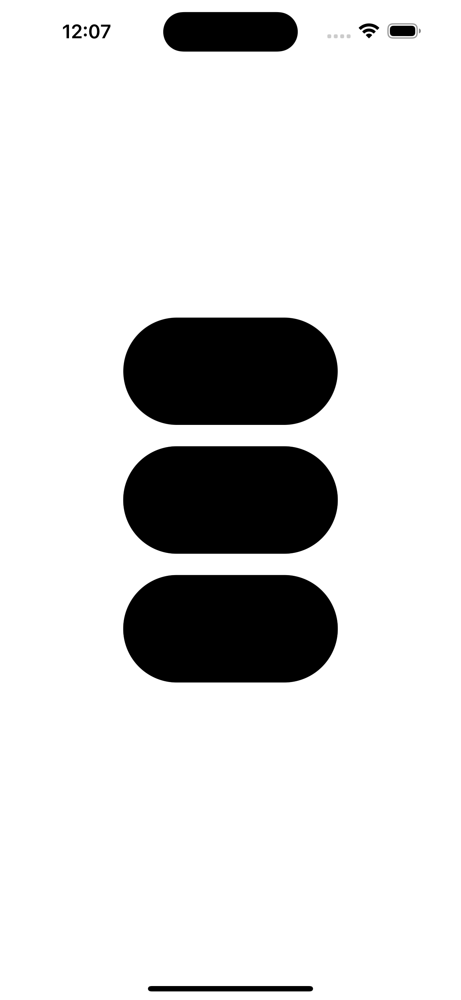
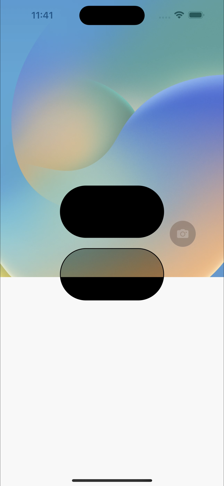

# Dynamic Island에서 쓰이는 도형 랜더링을 써보자

[출처](https://meeco.kr/mini/36020240)

iPhone 14 Pro / Pro Max에 탑재된 Dyanmic Island에는 위 사진처럼 독특한 형태의 Corner Radius가 적용되어 있습니다.

제가 이전에 [iPhone 14 Pro (Max)에서 Dynamic Island 영역을 투명하게 만들기](../Aperture_with_Clear_Color/article.md)이라는 글을 작성했습니다. 보시면 Dynamic Island를 표현하는 View는 `_SBGainMapView`이며 `CAGainMapLayer`라는 커스텀 `CALayer`를 가지고 있다고 말했습니다.

문득... 이걸 직접 써볼까? 해서 직접 써봤습니다. [프로젝트 소스코드](https://github.com/pookjw/GainMap)

중앙에 위치한 첫번째 원은 저희가 일반적으로 구현이 가능한 View입니다. 두번째는 `CAGainMapLayer` + `gainFill`라는 renderMode를 사용한 View 입니다. 세번째는 `CAGainMapLayer` + `gainBorderRenderFill`라는 renderMode를 사용한 View 입니다. 첫번째와 두번째만 확대해보면

직선에서는 차이가 확실히 보이는데... 저는 곡선에서는 별 차이를 모르겠는데 -_-; 동료 직원 분은 확연한 차이가 있다고 하니 뭐 그런 걸로...

이게 특이한 점이, 잠금 화면에 이동해도 View가 계속 남아 있습니다. 하드웨어 level을 다루는 특이한 View인 것 같아요.

iOS 16.0 베타 및 iPadOS 16.1 베타 1에서는 해당 API가 존재하지 않아서 크래시가 납니다. 또한 iPhone 14 Pro / Pro Max 및 Simulator에서만 정상적으로 랜더링되며, 그 외 환경에서는 폰 화면이 검정색으로 변합니다. 아마 디스플레이 전용 칩셋이 없어서 그런 것 같네요...

