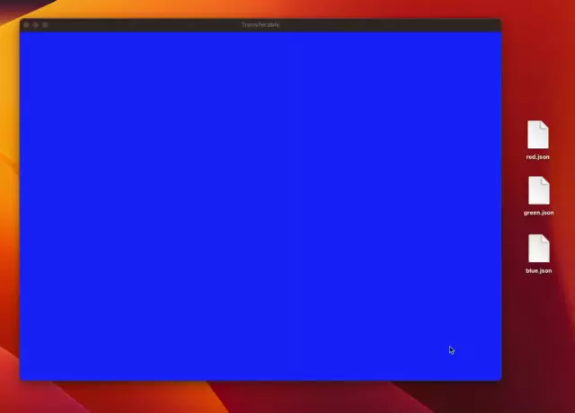

# iOS 16 - Core Transferable

iOS 16.0, macOS 13.0 이후로 [Core Transferable](https://developer.apple.com/documentation/coretransferable)이라는 API가 등장했습니다.

저희는 Drag & Drop 및 커스텀 Pasteboard 형식을 구현하기 위해 iOS 및 Mac Catalyst에서는 [NSItemProviderReading](https://developer.apple.com/documentation/foundation/nsitemproviderreading)와 [NSItemProviderWriting](https://developer.apple.com/documentation/foundation/nsitemproviderwriting)를 써야 했고, macOS에서는 [NSPasteboardReading](https://developer.apple.com/documentation/appkit/nspasteboardreading)와 [NSPasteboardWriting](https://developer.apple.com/documentation/appkit/nspasteboardwriting)를 써야 했습니다.

이러한 API가 `Core Transferable`라는 Swift API로 통합되었다고 보면 될 것 같네요. Swift Concurrency도 지원합니다. macOS에서 `NSPasteboardReading`와 `NSPasteboardWriting` 사용법이 정말 힘들었는데 -_-; Swift로 구현된 대체제가 생기니 정말 좋네요.

또한 UIKit의 [UIImage](https://developer.apple.com/documentation/uikit/uiimage)이 위에서 상기한 `NSItemProviderReading`, `NSItemProviderWriting`을 지원하듯이, SwiftUI의 [Image](https://developer.apple.com/documentation/swiftui/image)도 `Transferable`을 지원해요.

## 예제 앱



위 영상처럼 돌아가는 예제 앱은 [이 링크](https://github.com/pookjw/Practice_Transferable)에서 다운로드 받으실 수 있어요. Drag & Drop으로 배경색을 변경할 수 있어요.

코드를 설명드리자면, 우선 색을 표현하는 `MyColor`라는 데이터 형식을 만들게요.

```swift
import Foundation

struct MyColor: Codable {
    let r: Float
    let g: Float
    let b: Float
}
```

이를 `Transferable`로 conform 시킬게요. 저는 [FileRepresentation](https://developer.apple.com/documentation/coretransferable/filerepresentation)만 구현했는데, 문서보시면 다른 여러가지들도 있으니 필요에 따라 구현하시면 될 것 같아요.

```swift
import CoreTransferable
import UniformTypeIdentifiers

extension MyColor: Transferable {
    static var transferRepresentation: some TransferRepresentation {
        FileRepresentation(contentType: .json) { mixedColor in
            let jsonEncoder: JSONEncoder = .init()
            jsonEncoder.outputFormatting = .prettyPrinted
            let data: Data = try jsonEncoder.encode(mixedColor)
            
            let url: URL = FileManager
                .default
                .temporaryDirectory
                .appending(path: "mixed_color", directoryHint: .notDirectory)
                .appendingPathExtension(UTType.json.preferredFilenameExtension ?? "json")
                
            try data.write(to: url, options: .atomic)
            
            let result: SentTransferredFile = .init(url, allowAccessingOriginalFile: true)
            return result
        } importing: { receivedTransferredFile in
            let data: Data = try .init(contentsOf: receivedTransferredFile.file)
            let jsonDecoder: JSONDecoder = .init()
            let result: MyColor = try jsonDecoder.decode(MyColor.self, from: data)
            return result
        }
    }
}
```

이제 View에서 `MyColor`의 색을 배경색으로 보여주고, Drag & Drop을 지원하도록 만들면 돼요. `NSItemProvider`에서 `Transferable` 데이터 타입이 지원되는 점을 이용했어요.

- `Transferable` -> `NSItemProvider` 변환 : [register(_:)](https://developer.apple.com/documentation/foundation/nsitemprovider/4058750-register)

- `NSItemProvider` -> `Transferable` 변환 : [loadTransferable(type:completionHandler:)](https://developer.apple.com/documentation/foundation/nsitemprovider/3988045-loadtransferable)

```swift
import SwiftUI
import CoreTransferable

struct ContentView: View {
    @State var myColor: MyColor = .init(r: 0.3, g: 0.5, b: 0.3)
    
    var body: some View {
        Color(myColor: myColor)
            .onDrag {
                let itemProvider: NSItemProvider = .init()
                itemProvider.register(myColor)
                return itemProvider
            }
            .onDrop(of: [.json], isTargeted: nil) { providers in
                guard let firstProvider: NSItemProvider = providers.first else {
                    return false
                }
                
                let _: Progress = firstProvider.loadTransferable(type: MyColor.self) { result in
                    switch result {
                    case .success(let myColor):
                        self.myColor = myColor
                    case .failure(let failure):
                        fatalError(failure.localizedDescription)
                    }
                }
                
                return true
            }
    }
}
```
