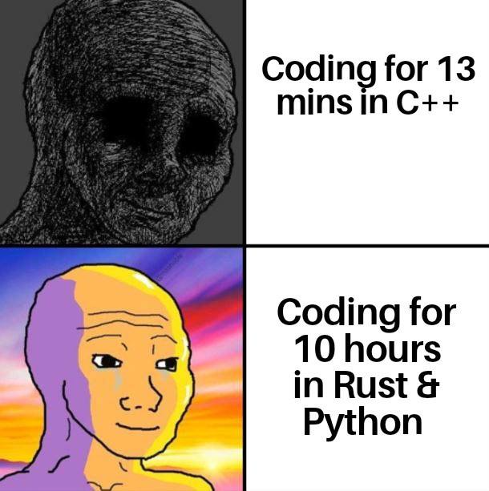

# [C++20] Concepts



C++20에서 concenpt 개념이 나왔다. Swift로 치면 Generic 같은거라 보면 될듯. std에서 기본적으로 제공하는 몇가지 concept들을 다뤄보려고 한다. [링크](https://en.cppreference.com/w/cpp/concepts)

## [std::same_as](https://en.cppreference.com/w/cpp/concepts/same_as)

Type 비교에 쓰이는 concept

### std::same_as은 concept이고 std::is_same는 struct 형태다.

아래처럼 foo 함수를 두 개 만들어보자.

```cpp
template<class T, class U> requires (std::is_same<T, U>::value)
auto foo(T a, T b) { return a + b; };

template<class T, class U> requires ((std::is_same<T, U>::value) && std::integral<T>)
auto foo(T a, T b) { return a + b; };


int main(int argc, const char * argv[]) {
    foo<int, int>(1, 2); // ERROR: Call to 'foo' is ambiguous
    return 0;
}
```

- 첫번째 꺼는 T와 U는 같아야 하는 template 함수다.

- 두번째 꺼는 T와 U는 같아야 하며 T는 숫자 기반이어야 하는 template 함수다.

그리고 main에서 `foo<int, int>(1, 2)`를 호출할 경우, int는 숫자이기에 당연히 두번째 함수가 불릴 것일 예상하겠지만 compiler는 ambiguous하다는 오류를 내뿜는다.


이유는 단순하다. T = int, U = int는 두 함수의 조건을 모두 만족하니까. 두번째 함수가 불리게 하려면 `std::is_same` 대신 `std::same_as`를 쓰면 된다.

```cpp
template<class T, class U> requires (std::same_as<T, U>)
auto foo(T a, T b) { return a + b; };

template<class T, class U> requires (std::same_as<T, U> && std::integral<T>)
auto foo(T a, T b) { return a + b; };


int main(int argc, const char * argv[]) {
    foo<int, int>(1, 2);
    return 0;
}
```

이 현상이 나타나는 이유는 concept를 활용하면 constraint가 생성되고 이는 compiler가 overloading 할 떄 도움이 되는 지표이기 때문이다.

- 처음에 conctept 없이 `std::is_same`을 썼을 때는, 첫번째 함수와 두번쨰 함수가 모두 조건을 충족하므로 overloading에 실패해서 ambiguous 오류가 뜬 것이다. 다시 말해, condition에서 단순한 bit 연산이 일어났기 때문이다.

- `std::same_as<T, U>`라는 concept로 대체할 경우 이것이 하나의 constraint로 생성된다. compiler는 constraint를 우선 확인하고 나머지 bit 연산을 한다. compiler는 그 bit 연산에서 true가 나올 경우 그 함수를 부른다. 그래서 두번째 함수가 불리게 된다.

### std::same_as는 두 번 비교한다.

`same_as.h`를 보면 std::same_as는 아래처럼 정의된다.

```cpp
template<class _Tp, class _Up>
concept __same_as_impl = _IsSame<_Tp, _Up>::value;

template<class _Tp, class _Up>
concept same_as = __same_as_impl<_Tp, _Up> && __same_as_impl<_Up, _Tp>;
```

T, U이라는 type이 들어오면 T == U, U == T를 모두 확인한다.

... T == U만 확인해도 되는 것 아닌가? 라는 생각이 들 것이다. 그렇지 않은 이유를 설명하기 위해, std::same_as 같은 concept를 직접 만들어보자

```cpp
template<class T, class U>
concept my_same_as = std::is_same<T, U>::value;

template<class T, class U> requires (my_same_as<T, U>)
auto foo(T a, T b) { return a + b; };

template<class T, class U> requires (my_same_as<T, U> && std::integral<T>)
auto foo(T a, T b) { return a + b; };


int main(int argc, const char * argv[]) {
    foo<int, int>(1, 2);
    return 0;
}
```

위 코드에서는 T == U만 비교해도 문제가 없다. 이제 두번째 함수의 T와 U를 바꿔보자

```cpp
template<class T, class U>
concept my_same_as = std::is_same<T, U>::value;

template<class T, class U> requires (my_same_as<T, U>)
auto foo(T a, T b) { return a + b; };

template<class T, class U> requires (my_same_as<U, T> && std::integral<T>)
auto foo(T a, T b) { return a + b; };


int main(int argc, const char * argv[]) {
    foo<int, int>(1, 2); // ERROR: Call to 'foo' is ambiguous
    return 0;
}
```

ambiguous 오류가 뜬다. `my_same_as<T, U>`와 `my_same_as<U, T>`은 서로 다른 constraint를 가지고 있기 때문이기에 상기한 compiler 로직이 작동되지 않아서 ambiguous 오류가 뜨게 된다.

위 코드가 작동되게 하려면 `my_same_as<T, U>`와 `my_same_as<U, T>`은 서로 같은 constraint를 갖게 해야 한다. 아래처럼 말이다.

```cpp
template<class T, class U>
concept __my_same_as_impl = std::is_same<T, U>::value;

template<class T, class U>
concept my_same_as = __my_same_as_impl<T, U> && __my_same_as_impl<U, T>;

template<class T, class U> requires (my_same_as<T, U>)
auto foo(T a, T b) { return a + b; };

template<class T, class U> requires (my_same_as<U, T> && std::integral<T>)
auto foo(T a, T b) { return a + b; };


int main(int argc, const char * argv[]) {
    foo<int, int>(1, 2);
    return 0;
}
```
`__my_same_as_impl`라는 concept를 새로 추가했고, my_same_as에서 T == U, U == T를 비교하게 했더니 문제가 없다. 이렇게 하면 my_same_as<T, U>와 my_same_as<U, T>는 같은 constraint를 갖게 되기 때문이다.

같은 constraint를 갖는 이유는, __my_same_as_impl<T, U>를 A라는 constraint라고 하고 __my_same_as_impl<U, T>를 B라는 constraint라고 가정하자

그러면 my_same_as<T, U>은 A && B가 되고, my_same_as<U, T>은 B && A다. 같은 constraint가 형성된다.

하지만 `__my_same_as_impl`은 왜 있어야 하는 것인가? 라는 의문이 가질 수 있다. 한 번 `__my_same_as_impl` 없이 해보자

```cpp
template<class T, class U>
concept my_same_as = std::is_same<T, U>::value && std::is_same<U, T>::value;

template<class T, class U> requires (my_same_as<T, U>)
auto foo(T a, T b) { return a + b; };

template<class T, class U> requires (my_same_as<U, T> && std::integral<T>)
auto foo(T a, T b) { return a + b; };


int main(int argc, const char * argv[]) {
    foo<int, int>(1, 2); // ERROR: Call to 'foo' is ambiguous
    return 0;
}
```

ambiguous 오류가 뜬다. 이유는 `std::is_same`은 concept가 아니기 때문에, my_same_as<T, U>와 my_same_as<U, T>는 서로 다른 constraint를 지니기 때문에 오류가 뜬다.

## [std::convertible_to](https://en.cppreference.com/w/cpp/concepts/convertible_to), [std::common_reference_with](https://en.cppreference.com/w/cpp/concepts/common_reference_with), [std::common_with](https://en.cppreference.com/w/cpp/concepts/common_with)

cppreference에서는 각각 아래처럼 설명한다.

- std::convertible_to : from type에서 to type 변환이 가능한지 판별

- std::common_reference_with : specifies that two types share a common reference type 

- std::common_with : specifies that two types share a common type

std::convertible_to은 쉽게 이해가고, std::common_reference_with과 std::common_with은 두 type의 공통점을 찾아 주는데, 그게 reference type인지 아닌지에 따라 다른 것 같다... 인데 이해는 가는데 와닿지는 않는다.

각각 하나씩 살펴보자

### std::convertible_to

class에서 public 상속 관계일 경우 아래처럼 활용할 수 있다. 당연히 protected/private 상속일 떄는 불가능하다. 이거는 dynamic_cast에서도 마찬가지

```cpp
class MyObjectA {};
class MyObjectB: public MyObjectA {};

int main(int argc, const char * argv[]) {
    if constexpr(std::convertible_to<MyObjectB, MyObjectA>) {
        std::printf("True\n");
    }
    
    MyObjectB *b = new MyObjectB {};
    if (dynamic_cast<MyObjectA *>(b)) {
        std::printf("Casted\n");
    }
    delete b;
    
    return 0;
}
```

operator 관계일 경우에도 가능하다. operator는 public이어야 한다. 참고로 dynamic_cast는 operator 관계를 판별하지 못한다.

```cpp
class MyObjectA {};
class MyObjectB {
public:
    operator MyObjectA() { return {}; };
};

int main(int argc, const char * argv[]) {
    if constexpr(std::convertible_to<MyObjectB, MyObjectA>) {
        std::printf("True\n");
    }
    
    return 0;
}
```

### std::common_reference_with

두 type이 공통 참조 관계에 있는지 확인한다. std::convertible_to는 순서가 중요하지만 std::common_reference_with은 순서가 중요하지 않다.

```cpp
class MyObjectA {};
class MyObjectB {
public:
    operator MyObjectA() const { return {}; };
};

int main(int argc, const char * argv[]) {
    if constexpr(std::common_reference_with<MyObjectA&, const MyObjectB&>) {
        std::printf("True\n");
    }
    
    return 0;
}
```

만약 operator에 const 키워드가 없다면 위는 성립하지 않는다.

위 코드는 operator 관계일 때인데 class 상속 관계에서도 성립한다.

### std::common_with

두 type의 값 공통 관계에 있는지 확인한다.

```cpp
class MyObjectA {};
class MyObjectB {
public:
    operator MyStructA() const { return {}; };
};

int main(int argc, const char * argv[]) {
    if constexpr(std::common_with<MyObjectA, const MyObjectB>) {
        std::printf("True\n");
    }
    
    return 0;
}
```

만약 operator에 const 키워드가 없다면 위는 성립하지 않는다.

위 코드는 operator 관계일 때인데 class 상속 관계에서도 성립한다.

## 마치며

> concept는 Swift의 Generic 개념과 같네! 별거 없네!

라는 가벼운 마음으로 공부하다가 전혀 그렇지 않다는 것을 느꼈다 😥

사실 Swift도 내부적으로 비슷하게 동작할거다. 하지만 개발자에게 이런 micro control을 요구하지 않을 뿐

Objective-C에서도 Generic 기능이 있긴 한데 그냥 없다시피한 기능이고 내부 동작도 다르기에, concept와 Objective-C++ 상호 호환성은 없어 보인다.

## 참고하면 좋은 글

[Why does same_as concept check type equality twice?](https://stackoverflow.com/q/58509147/17473716)
