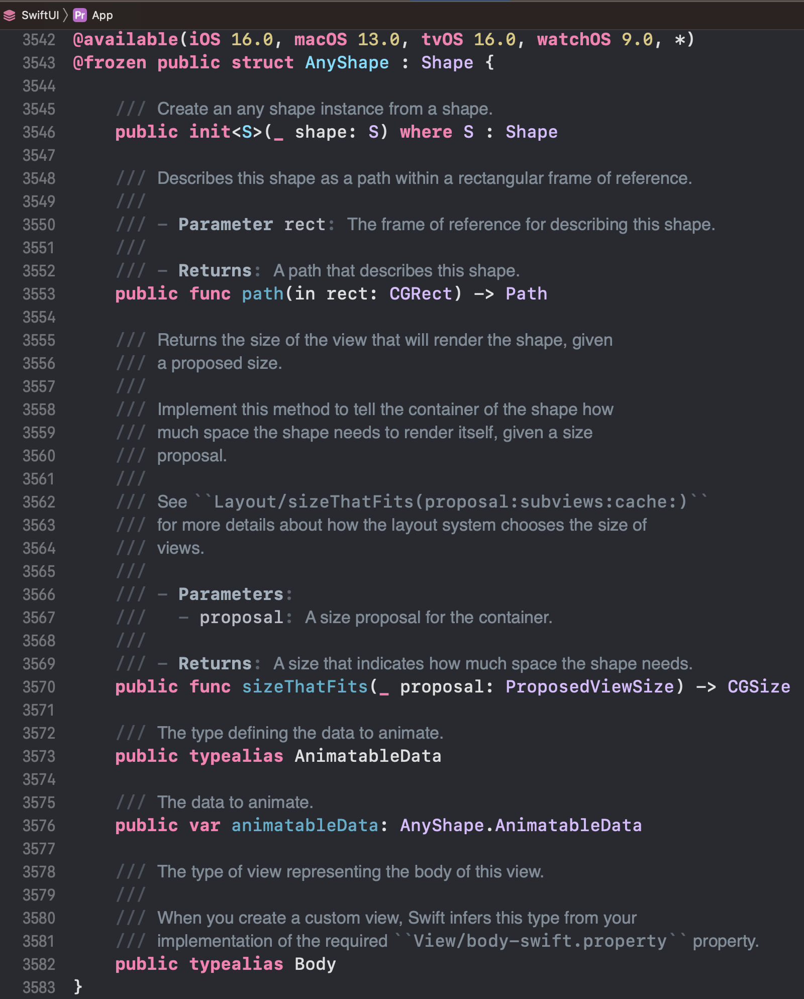

# Swift Interface

Objective-C의 경우 closed-source framework를 배포할 경우 Header 파일을 공개하면 framework의 API를 활용할 수 있었습니다.

하지만 Swift는 Header 파일은 존재하지 않습니다. 그렇다면 Apple에서 제공하는 Swift 라이브러리 (Combine, SwiftUI 등...) 및 xcframeworks 같은 closed-source framework에서 어떻게 API를 활용할 수 있는지 설명하려고 합니다.

(사실 개인적으로 옛날부터 궁금했던 부분인데... Playgorunds에서 앱 개발하는 방법을 공부하는데 애플이 `AppleProductTypes`라는 framework의 문서화를 아예 안해놔서 -_- 삽질하다가 우연히 알게 된 정보입니다.)

## swiftinterface

`swiftinterface`은 Header 파일과 유사한 역할을 합니다. 아래는 Combine의 swiftinterface 파일 경로입니다.

```
/Applications/Xcode.app/Contents/Developer/Platforms/iPhoneSimulator.platform/Developer/SDKs/iPhoneSimulator.sdk/System/Library/Frameworks/Combine.framework/Modules/Combine.swiftmodule/x86_64-apple-ios-simulator.swiftinterface
```

이 파일의 일부는 아래와 같습니다. Header 파일처럼 API의 정보를 공개하고 있기 때문에, closed-source framework이어도 API를 활용할 수 있습니다.

```
// swift-interface-format-version: 1.0
// swift-compiler-version: Apple Swift version 5.7.1 (swiftlang-5.7.1.134.3 clang-1400.0.29.51)
// swift-module-flags: -target x86_64-apple-ios16.1-simulator -enable-objc-interop -enable-library-evolution -swift-version 5 -enforce-exclusivity=checked -O -library-level api -enable-library-evolution -enable-library-evolution -enable-library-evolution -enable-library-evolution -enable-library-evolution -module-name Combine -disable-availability-checking
// swift-module-flags-ignorable: -enable-bare-slash-regex -user-module-version 310
import Darwin
import Swift
import _Concurrency
import _StringProcessing
@available(macOS 10.15, iOS 13.0, tvOS 13.0, watchOS 6.0, *)
extension Combine.Publisher {
  public func multicast<S>(_ createSubject: @escaping () -> S) -> Combine.Publishers.Multicast<Self, S> where S : Combine.Subject, Self.Failure == S.Failure, Self.Output == S.Output
  public func multicast<S>(subject: S) -> Combine.Publishers.Multicast<Self, S> where S : Combine.Subject, Self.Failure == S.Failure, Self.Output == S.Output
}
@available(macOS 10.15, iOS 13.0, tvOS 13.0, watchOS 6.0, *)
extension Combine.Publishers {
  final public class Multicast<Upstream, SubjectType> : Combine.ConnectablePublisher where Upstream : Combine.Publisher, SubjectType : Combine.Subject, Upstream.Failure == SubjectType.Failure, Upstream.Output == SubjectType.Output {
    public typealias Output = Upstream.Output
    public typealias Failure = Upstream.Failure
    final public let upstream: Upstream
    final public let createSubject: () -> SubjectType
    public init(upstream: Upstream, createSubject: @escaping () -> SubjectType)
    @objc deinit
    final public func receive<S>(subscriber: S) where S : Combine.Subscriber, SubjectType.Failure == S.Failure, SubjectType.Output == S.Input
    final public func connect() -> Combine.Cancellable
  }
}
@available(macOS 10.15, iOS 13.0, tvOS 13.0, watchOS 6.0, *)
public protocol Cancellable {
  func cancel()
}
```

TODO : `swift-module-flags`는 뭘까?

## swiftdoc

Xcode에서 SwiftUI의 API를 활용한 코드에 `Jump to Definition` 버튼을 누르면 아래처럼 보입니다.



보시다시피 SwiftUI의 API 목록과 함께 문서도 같이 제공하고 있습니다. 이러한 문서는 swiftdoc라는 파일에서 별도로 정의하고 있습니다.

swiftinterface의 경우 demangled name을 정의하고 있지만, swiftdoc는 mangled name을 통해 문서를 정의하고 있네요.

```
Combine9PublisherPAAE13tryCompactMapyAA10PublishersO03TrydE0Vy_xqd__Gqd__Sg6OutputQzKclFp

/// Calls an error-throwing closure with each received element and publishes any returned optional that has a value.

/// Use ``Publisher/tryCompactMap(_:)`` to remove `nil` elements from a publisher’s stream based on an error-throwing closure you provide. If the closure throws an error, the publisher cancels the upstream publisher and sends the thrown error to the downstream subscriber as a ``Publisher/Failure``.
```
