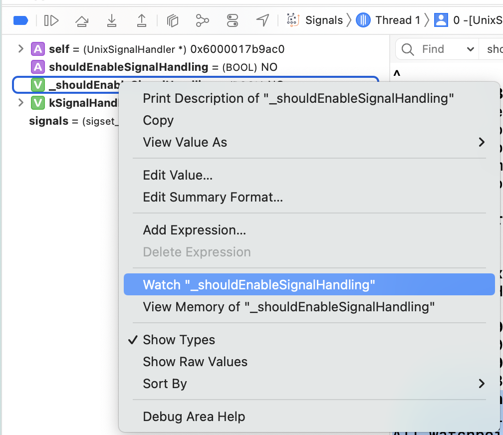
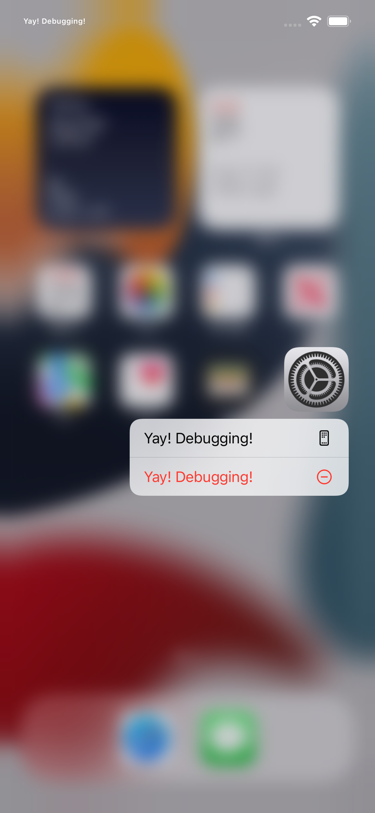
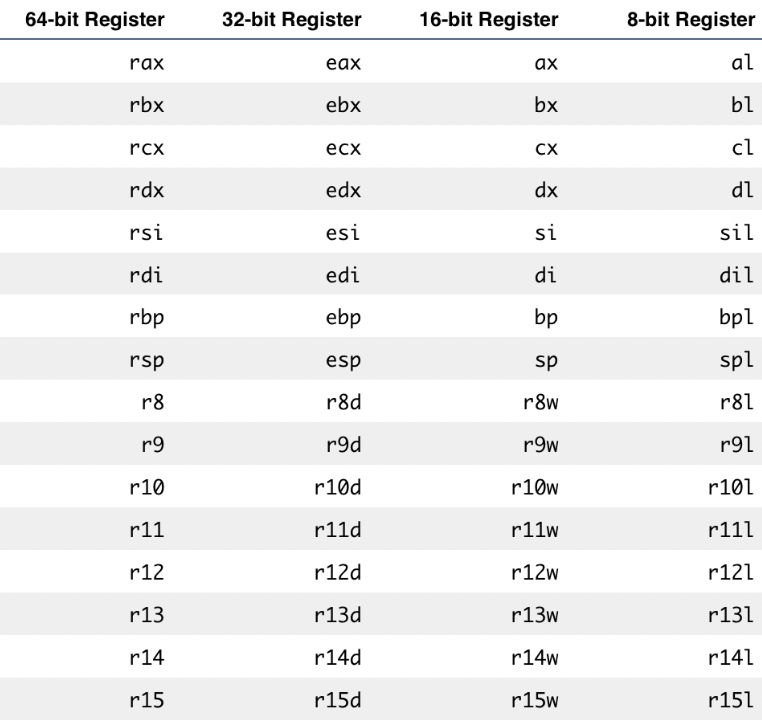
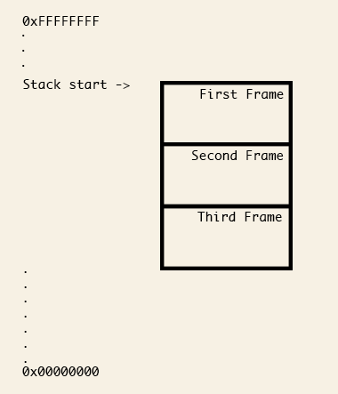
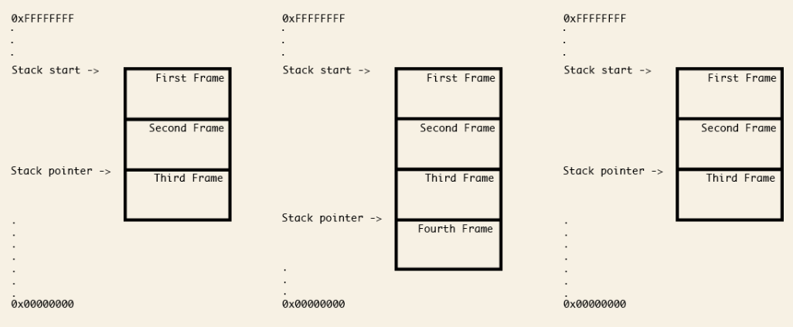
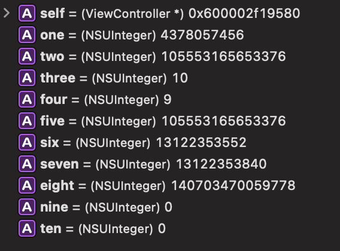
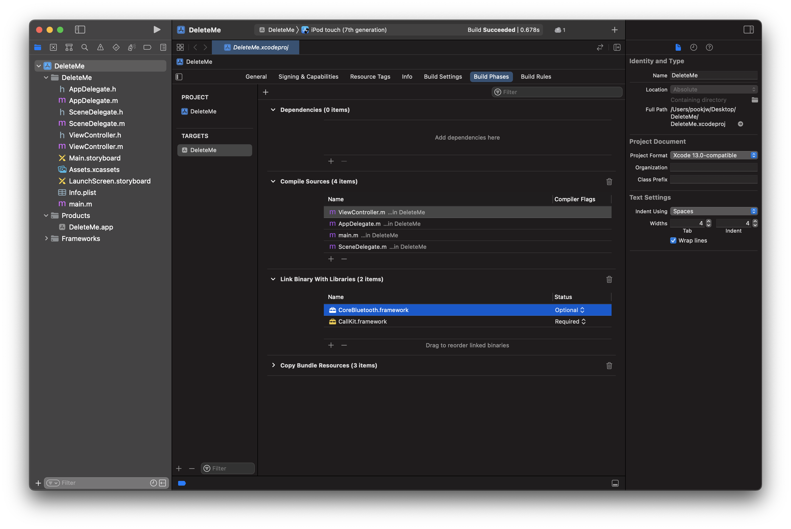
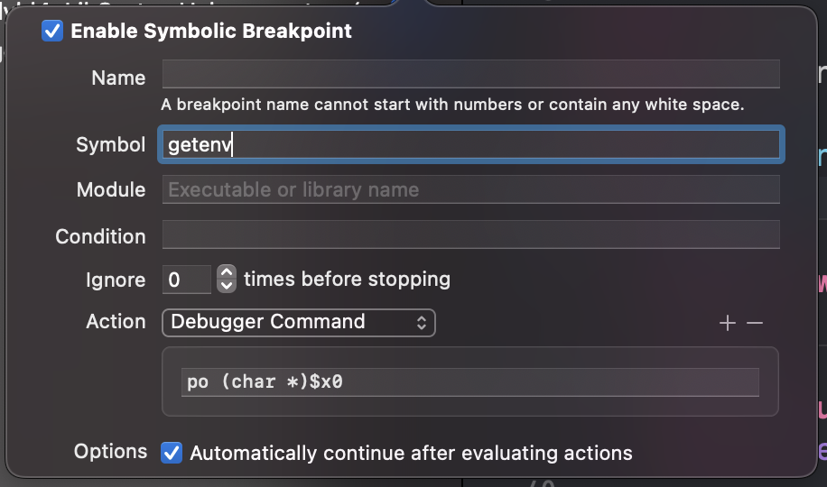

[Advanced Apple Debugging & Reverse Engineering (raywenderlich.com)](https://www.raywenderlich.com/books/advanced-apple-debugging-reverse-engineering)의 내용을 정리한 글이다.

- [Chapter 1: Getting Started](#chapter-1)

- [Chapter 2: Help & Apropos](#chapter-2)

- [Chapter 3: Attaching with LLDB](#chapter-3)

- [Chapter 4: Stopping in Code](#chapter-4)

- [Chapter 5: Expression](#chapter-5)

- [Chapter 6: Thread, Frame & Stepping Around](#chapter-6)

- [Chapter 7: Image](#chapter-7)

- [Chapter 8: Watchpoints](#chapter-8)

- [Chapter 9: Persisting and Customizing Commands](#chapter-9)

- [Chapter 10: Regex Commands](#chapter-10)

- [Chapter 11: Assembly Register Calling Convention](#chapter-11)

- [Chapter 12: Assembly & Memory](#chapter-12)

- [Chapter 13: Assembly & the Stack](#chapter-13)

- [Chapter 14: Hello, Ptrace](#chapter-14)

- [Chapter 15: Dynamic Frameworks](#chapter-15)

- [Chapter 16: Hooking & Executing Code with dlopen & dlsym](#chapter-16)

- [Chapter 17: Exploring & Method Swizzling Objective-C Frameworks](#chapter-17)

# <a name="chapter-1">Chapeter 1: Getting Started</a>

```
(lldb) file /Applications/Xcode.app/Contents/MacOS/Xcode
Current executable set to '/Applications/Xcode.app/Contents/MacOS/Xcode' (arm64).
(lldb) process launch -e /dev/ttys001 --
Process 1809 launched: '/Applications/Xcode.app/Contents/MacOS/Xcode' (arm64)
```

이렇게 하면 lldb로 `Xcode`에 attach 및 실행을 할 수 있으며, 로그는 `/dev/ttys001`에 찍힌다. `Ctrl` + `C`를 누르면 pause를 할 수 있다.

```
(lldb) b -[NSView hitTest:]
Breakpoint 1: where = AppKit`-[NSView hitTest:], address = 0x00000001c74542d8
(lldb) c # 또는 continue
Process 1809 resuming
```

이렇게 되면 `-[NSView hitTest:]`에 breakpoint가 걸리며 실행될 때마다 아래처럼 pause가 걸린다.

```
Process 1809 stopped
* thread #1, queue = 'com.apple.main-thread', stop reason = breakpoint 1.1
    frame #0: 0x00000001c74542d8 AppKit` -[NSView hitTest:] 
AppKit`-[NSView hitTest:]:
->  0x1c74542d8 <+0>:  pacibsp 
    0x1c74542dc <+4>:  sub    sp, sp, #0x60
    0x1c74542e0 <+8>:  stp    x26, x25, [sp, #0x10]
    0x1c74542e4 <+12>: stp    x24, x23, [sp, #0x20]
    0x1c74542e8 <+16>: stp    x22, x21, [sp, #0x30]
    0x1c74542ec <+20>: stp    x20, x19, [sp, #0x40]
    0x1c74542f0 <+24>: stp    x29, x30, [sp, #0x50]
    0x1c74542f4 <+28>: add    x29, sp, #0x50
Target 0: (Xcode) stopped.
```

현재 멈춘 곳의 정보를 알기 위해서는 `po $rdi`라고 입력하면 된다던데... 이건 `x86_64` 기준 register이다. (`rdi`, `rsi`, `rdx`, `rcx`, `r8`, `r9`, ..., `r15`)

Apple Silicon 맥을 쓰는 유저라면 `arm64`이므로 register는 `x0`, `x1`, `x2`, `x3`, ..., `x30`이 된다.

```
(lldb) po $rd1
error: expression failed to parse:
error: <user expression 1>:1:1: use of undeclared identifier '$rd1'
$rd1
^

(lldb) po $x0
<NSThemeFrame: 0x11c30f610>
```

이 상태에서 `continue`를 해도 계속 걸린다... `NSView`가 엄청나게 많은 구조여서 그런듯? 일단 pause가 계속 걸리는게 성가시니 지우자

```
(lldb) breakpoint delete
About to delete all breakpoints, do you want to do that?: [Y/n] y
All breakpoints removed. (1 breakpoint)
```

그리고 아래같은 새로운 breakpoint를 만들어준다. `-n`은 symbol 이름이며, `-C`는 breakpoint가 걸릴 때 실행할 명령어, `-G1`은 breapoint가 걸려도 pause하지 않겠다는 것이다. (`-G0`일 경우 pause한다.)

```
(lldb) breakpoint set -n "-[NSView hitTest:]" -C "po $x0" -G1
Breakpoint 2: where = AppKit`-[NSView hitTest:], address = 0x00000001c74542d8
```

이렇게 하고 `continue`를 하면 굉장히 많은 부분에서 breakpoint가 걸리며, `-C`가 실행되는 것을 볼 수 있다.

```
(lldb) c
Process 1809 resuming
(lldb)  po $x0
<NSTitlebarContainerView: 0x12662dab0>
(lldb)  po $x0
<DVTControllerContentView_ControlledBy_IDEWorkspaceTabController: 0x11c3bcc80>
(lldb)  po $x0
<NSView: 0x11c0148b0>
(lldb)  po $x0
<IDEWorkspaceDesignAreaSplitView:0x11c3bd9c0 delegate="(IDEWorkspaceDesignAreaSplitViewController)0x60000303d710" layout="constraints", dividers="views", arrangesAllSubviews="no">
```

이제 conditional breakpoint을 걸어본다. `-c`을 쓰면 할 수 있는데, 위에서 명령어를 실행하는 `-C`와 다른 것에 유의하자.

```
(lldb) breakpoint modify -c '(BOOL)[NSStringFromClass((id)[$x0 class]) containsString:@"IDESourceEditorView"]' -G0
```

이렇게 하면 Xcode에서 코드 입력창을 누를 때만 아래처럼 pause가 걸린다.

```
(lldb)  po $x0
IDESourceEditorView: Frame: (0.0, 0.0, 866.0, 900.0), Bounds: (0.0, 0.0, 866.0, 900.0) contentViewOffset: 0.0
Process 1809 stopped
* thread #1, queue = 'com.apple.main-thread', stop reason = breakpoint 2.1
    frame #0: 0x00000001c74542d8 AppKit` -[NSView hitTest:] 
AppKit`-[NSView hitTest:]:
->  0x1c74542d8 <+0>:  pacibsp 
    0x1c74542dc <+4>:  sub    sp, sp, #0x60
    0x1c74542e0 <+8>:  stp    x26, x25, [sp, #0x10]
    0x1c74542e4 <+12>: stp    x24, x23, [sp, #0x20]
    0x1c74542e8 <+16>: stp    x22, x21, [sp, #0x30]
    0x1c74542ec <+20>: stp    x20, x19, [sp, #0x40]
    0x1c74542f0 <+24>: stp    x29, x30, [sp, #0x50]
    0x1c74542f4 <+28>: add    x29, sp, #0x50
Target 0: (Xcode) stopped.
```

여기서 `p/x` 명령어로 breakpoint가 걸린 곳의 포인터 참조 주소를 알 수 있다.

```
(lldb) p/x $x0
(unsigned long) $192 = 0x0000000111ccf200
```

`po $x0` 했던 것 처럼, `po`에 참조 주소를 넣으면 해당 객체의 정보를 알 수 있다.

```
(lldb) po 0x0000000111ccf200
IDESourceEditorView: Frame: (0.0, 0.0, 866.0, 900.0), Bounds: (0.0, 0.0, 866.0, 900.0) contentViewOffset: 0.0
```

만약에 breakpoint가 걸린 `NSView`의 `isHidden` 상태를 바꾸고 싶다면 아래와 같이 하면 된다.

```
(lldb) po [$x0 setHidden:!(BOOL)[$x0 isHidden]]; [CATransaction flush]
 nil
```

마찬가지로 이런 식의 Selector 전송도 된다.

```
(lldb) po [$x0 string]
//
//  ViewController.swift
//  Hello Debugger
//
//  Created by Jinwoo Kim on 5/5/22.
//

import UIKit

class ViewController: UIViewController {

    override func viewDidLoad() {
        super.viewDidLoad()
        // Do any additional setup after loading the view.
    }

}


```

만약에 Swift로 하고 싶은 경우 우선 필요한 module들을 import해준다.

```
(lldb) ex -l swift -- import Foundation
(lldb) ex -l swift -- import AppKit
```

이런 식으로 Swift 코드를 실행할 수 있다.

```
(lldb) ex -l swift -o -- unsafeBitCast(0x0000000111ccf200, to: NSView.self)
IDESourceEditorView: Frame: (0.0, 0.0, 866.0, 900.0), Bounds: (0.0, 0.0, 866.0, 900.0) contentViewOffset: 0.0
```

이런 식으로 `insertText(_:)`라는 함수 실행도 되는데... `string`은 안 된다. 아마 `insertText(_:)`은 `NSView`의 method가 아니더라도 어딘가에서 저렇게 생긴 Selector가 존재해서 그거 가져다가 쓰는 것 같은데, `string`이란 Selector는 없어서 그런듯? `AnyObject`가 Selector dispatch하는 방식을 생각하면 이해가 될지도 모른다. [`perform(_:)`](https://developer.apple.com/documentation/objectivec/nsobjectprotocol/1418867-perform)을 쓰면 될 것 같기도...

```
(lldb) ex -l swift -o -- unsafeBitCast(0x0000000111ccf200, to: NSView.self).insertText("Yay! Swift!")
0 elements

(lldb) po [$x0 string]
//
//  ViewController.swift
//  Hello Debugger
//
//  Created by Jinwoo Kim on 5/5/22.
//

import UIKit

class ViewController: UIViewController {

    override func viewDidLoad() {
        super.viewDidLoad()
        // Do any additional setup after loading the view.
    }

}

Yay! Swift!

(lldb) ex -l swift -o -- unsafeBitCast(0x0000000111ccf200, to: NSView.self).string
error: expression failed to parse:
error: <EXPR>:3:52: error: value of type 'NSView' has no member 'string'
unsafeBitCast(0x0000000111ccf200, to: NSView.self).string
~~~~~~~~~~~~~~~~~~~~~~~~~~~~~~~~~~~~~~~~~~~~~~~~~~ ^~~~~~
```

# <a name="chapter-2">Chapter 2: Help & Apropos</a>

`help` 명령어를 치면 무진장 많은 명령어들의 도움말들을 볼 수 있다.

```
(lldb) help
Debugger commands:
  apropos           -- List debugger commands related to a word or subject.
  breakpoint        -- Commands for operating on breakpoints (see 'help b' for shorthand.)
  command           -- Commands for managing custom LLDB commands.
  disassemble       -- Disassemble specified instructions in the current target.  Defaults to the
                       current function for the current thread and stack frame.
  expression        -- Evaluate an expression on the current thread.  Displays any returned value
                       with LLDB's default formatting.
  frame             -- Commands for selecting and examing the current thread's stack frames.
# 생략...

For more information on any command, type 'help <command-name>'.
```

이는 [DerekSelander/LLDB](https://github.com/DerekSelander/LLDB)을 `~/.lldbinit`에 설치했을 경우 그 명령어들의 도움말도 뜬다. 더 상세히 알고 싶으면 `help breakpoint`, `help breakpoint name` 이런 식으로 치면 된다.

```
(lldb) help breakpoint
Commands for operating on breakpoints (see 'help b' for shorthand.)

Syntax: breakpoint <subcommand> [<command-options>]

The following subcommands are supported:

      clear   -- Delete or disable breakpoints matching the specified source file and line.
      command -- Commands for adding, removing and listing LLDB commands executed when a breakpoint
                 is hit.
      delete  -- Delete the specified breakpoint(s).  If no breakpoints are specified, delete them
                 all.
      disable -- Disable the specified breakpoint(s) without deleting them.  If none are specified,
                 disable all breakpoints.
# 생략...

For more help on any particular subcommand, type 'help <command> <subcommand>'.
```

`apropos`를 쓸 경우 단어 검색이 가능하다.

```
(lldb) apropos swift
The following commands may relate to 'swift':
  swift             -- A set of commands for operating on the Swift Language Runtime.
  demangle          -- Demangle a Swift mangled name
  refcount          -- Inspect the reference count data for a Swift object
  swift-healthcheck -- Show the LLDB debugger health check diagnostics.
  dclass            -- Dumps info about objc/swift classes
# 생략...
```

만약에 reference count을 알아내는 명령어가 기억 안 난다! 싶으면 아래처럼 하면 `refcount`을 쓰면 된다는 것을 알 수 있다.

```
(lldb) apropos "reference count"
The following commands may relate to 'reference count':
  refcount -- Inspect the reference count data for a Swift object
```

# <a name="chapter-3">Chapter 3: Attaching with LLDB</a>

아래처럼 lldb에서 이미 실행된 프로세스에 attach 할 수 있다. (참고로 `pgrep -x Xcode` 명령어로 PID를 받아 올 수 있다.)

```
% lldb -n Xcode
(lldb) process attach --name "Xcode"

...

% lldb -p 3386
(lldb) process attach --pid 3386
```

만약 다음 번에 실행될 프로세스에 attach하고 싶은 경우, `-w` (`--waitFor`)를 쓰면 된다. 이럴 경우 파일 경로로 통해서도 설정할 수 있는데 이때는 `-w`가 필요 없다.

```
% lldb -n Finder -w
(lldb) process attach --name "Finder" --waitfor

...

% lldb -f /System/Library/CoreServices/Finder.app/Contents/MacOS/Finder
(lldb) target create "/System/Library/CoreServices/Finder.app/Contents/MacOS/Finder"
Current executable set to '/System/Library/CoreServices/Finder.app/Contents/MacOS/Finder' (arm64e).
```

`-f`을 통해 파일 경로로 지정했을 경우, `process launch` 명령어로 바로 실행시킬 수 있다.

```
(lldb) process launch
Process 3473 launched: '/System/Library/CoreServices/Finder.app/Contents/MacOS/Finder' (arm64e)
```

아래 명령어로 설정된 target을 지울 수 있다.

```
(lldb) target delete
```

이제 `/bin/ls`를 통해 실행 중에 옵션을 넣는 방법에 대해 알자면, 일단 `/bin/ls`로 설정한 후

```
% lldb -f /bin/ls
(lldb) target create "/bin/ls"
Current executable set to '/bin/ls' (arm64e).
```

위에서 설명했듯이 `process launch`를 실행하면 해당 프로그램을 실행할 수 있다.

```
(lldb) process launch
Process 3502 launched: '/bin/ls' (arm64e)
Applications	Documents	Movies		Postman		git
Brewfile	Downloads	Music		Public		lldb_commands
Desktop		Library		Pictures	Sites		theos
Process 3502 exited with status = 0 (0x00000000) 
```

`-w` 옵션을 쓰면 `cd`를 한 다음에 프로그램을 실행하게 된다. 예를 들어 아래와 같이 명령어를 입력하면

```
(lldb) process launch -w /Applications
Process 3512 launched: '/bin/ls' (arm64e)

# /Applications의 내용...
```

아래와 같은 내용이라 할 수 있다.

```
% cd /Applications
% ls
```

`--` 옵션을 쓰면 프로그램 실행의 arguments를 지정할 수 있다.

```
(lldb) process launch -w /Applications
Process 3512 launched: '/bin/ls' (arm64e)

# /Applications의 내용...
```

이는 `% ls /Applications`와 같은거라 할 수 있다. 하지만 `--`는 아래이 `~` 문구가 같은 경우는 에러가 난다.

```
(lldb) process launch -- ~/Desktop
Process 3557 launched: '/bin/ls' (arm64e)
ls: ~/Desktop: No such file or directory
Process 3557 exited with status = 1 (0x00000001) 
```

이럴 경우 `-X true`를 써주면 된다.

```
(lldb) process launch -X true -- ~/Desktop
Process 3574 launched: '/bin/ls' (arm64e)

# ~/Desktop의 내용...
```

이는 `run` 명령어로도 할 수 있다.

```
(lldb) run ~/Desktop
Process 3583 launched: '/bin/ls' (arm64e)

# ~/Desktop의 내용...
```

만약에 현재 설정된 environment variable들을 보고 싶으면, `env` 명령어를 쓰면 된다.

```
(lldb) env
target.env-vars (dictionary of strings) =
```

책에서는 이런 식으로 environment variable을 설정할 수 있다는데... 내가 해보니 안 됨. shell이 달라서 그런듯...

```
(lldb) process launch -v LSCOLORS=Af -v CLICOLOR=1  -- /Applications/
```

이거는 터미널에서 아래 명령어와 같은거라 함.

```
$ LSCOLORS=Af CLICOLOR=1 ls /Applications/
```

만약에 출력 결과물을 파일로 저장하고 싶으면, `-o`를 쓰면 된다. 터미널에서 `>` 기호라고 생각하면 될듯하다.

```
(lldb) process launch -o /tmp/ls_output.txt -- /Applications
```

이러면 아래 터미널 명령어로 잘 저장되었는지 볼 수 있다.

```
% cat /tmp/ls_output.txt
```

`-i`을 쓰면 터미널의 `<` 기호같은 것을 쓸 수 있다.

```
(lldb) target create /usr/bin/wc

(lldb) process launch -i /tmp/ls_output.txt

(lldb) run
```

마지막 명령어의 경우 `wc`에 아무런 input이 없어서 멈출텐데, 해당 프로세스를 강제종로 시키고 싶으면 `Ctrl` + `D`를 누르면 된다.

# <a name="chapter-4">Chapter 4: Stopping in Code</a>

Symbol 검색하기

```
(lldb) image lookup -n "-[UIViewController viewDidLoad]"
1 match found in /Applications/Xcode.app/Contents/Developer/Platforms/iPhoneOS.platform/Library/Developer/CoreSimulator/Profiles/Runtimes/iOS.simruntime/Contents/Resources/RuntimeRoot/System/Library/PrivateFrameworks/UIKitCore.framework/UIKitCore:
        Address: UIKitCore[0x00000000004bd8d0] (UIKitCore.__TEXT.__text + 4957852)
        Summary: UIKitCore`-[UIViewController viewDidLoad]
```

정규식으로 Symbol 검색하기

```
(lldb) image lookup -rn test
1 match found in /Users/pookjw/Library/Developer/Xcode/DerivedData/Signals-byjsnxuqpxeyyddvxghkubpurqlj/Build/Products/Debug-iphonesimulator/Signals.app/Signals:
        Address: Signals[0x0000000100005e78] (Signals.__TEXT.__text + 15360)
        Summary: Signals`Signals.DetailViewController.test() throws -> () at DetailViewController.swift:52
```

Swift Symbol 검색하기

```
(lldb) image lookup -rn Signals.SwiftTestClass.name.setter
1 match found in /Users/pookjw/Library/Developer/Xcode/DerivedData/Signals-byjsnxuqpxeyyddvxghkubpurqlj/Build/Products/Debug-iphonesimulator/Signals.app/Signals:
        Address: Signals[0x000000010000b5fc] (Signals.__TEXT.__text + 37764)
        Summary: Signals`Signals.SwiftTestClass.name.setter : Swift.Optional<Swift.String> at SwiftTestClass.swift:32

(lldb) image lookup -rn Signals.SwiftTestClass.name.(getter|setter)
2 matches found in /Users/pookjw/Library/Developer/Xcode/DerivedData/Signals-byjsnxuqpxeyyddvxghkubpurqlj/Build/Products/Debug-iphonesimulator/Signals.app/Signals:
        Address: Signals[0x000000010000b58c] (Signals.__TEXT.__text + 37652)
        Summary: Signals`Signals.SwiftTestClass.name.getter : Swift.Optional<Swift.String> at SwiftTestClass.swift:32        Address: Signals[0x000000010000b5fc] (Signals.__TEXT.__text + 37764)
        Summary: Signals`Signals.SwiftTestClass.name.setter : Swift.Optional<Swift.String> at SwiftTestClass.swift:32
```

Swift Symbol로 breakpoint 걸기 (위에서 얻은 정확한 Symbol 이름을 넣어주면 된다)

```
(lldb) b Signals`Signals.SwiftTestClass.name.setter : Swift.Optional<Swift.String>
Breakpoint 3: where = Signals`Signals.SwiftTestClass.name.setter : Swift.Optional<Swift.String> at SwiftTestClass.swift:32, address = 0x00000001027d75fc
```

단축어로 breakpoint를 걸 수 있다.

```
(lldb) b -[UIViewController viewDidLoad]
Breakpoint 4: where = UIKitCore`-[UIViewController viewDidLoad], address = 0x000000018462b8d0

(lldb) b Signals.SwiftTestClass.name.setter : Swift.Optional<Swift.String>
Breakpoint 5: where = Signals`Signals.SwiftTestClass.name.setter : Swift.Optional<Swift.String> at SwiftTestClass.swift:32, address = 0x00000001027d75fc
```

정규식을 통해서도 걸 수 있다.

```
(lldb) rb SwiftTestClass.name.setter
Breakpoint 6: where = Signals`Signals.SwiftTestClass.name.setter : Swift.Optional<Swift.String> at SwiftTestClass.swift:32, address = 0x00000001027d75fc

(lldb) rb name\.setter
Breakpoint 7: 8 locations.

(lldb) rb '\-\[UIViewController\ '
Breakpoint 8: 796 locations.

# Category들만
(lldb) rb '\-\[UIViewController(\(\w+\))?\ '
Breakpoint 9: 796 locations.

# DetailViewController.swift 안에 있는 모드 코드에
(lldb) rb . -f DetailViewController.swift
Breakpoint 10: 65 locations.

# 모든 Symbol에 breakpoint 걸기...
(lldb) rb .

# 특정 Module에 있는 모든 Symbol에 breakpoint 걸기...
(lldb) rb . -s Commons
(lldb) rb . -s UIKitCore
```

만약에 breakpoint가 몇번 이상 걸리면 자동으로 delete되게 처리하려면 `-o` (one-shot)을 쓰면 된다.

```
(lldb) rb . -s UIKitCore -o 1
```

breakpoint 명령어들 예제를 적자면

```
# Commons moudle 안의 Swift 언어로 된 모든 Symbol들에 breakpoint를 건다.
(lldb) breakpoint set -L swift -r . -s Commons

# 모든 소스코드 파일 (-A)에서 "if let"이 포함되어 있으면 breakpoint를 건다.
(lldb) breakpoint set -A -p "if let"

# 특정 파일만 하고 싶으면
(lldb) breakpoint set -p "if let" -f MasterViewController.swift -f DetailViewController.swift

# Signals model 안에 있는 모든 소스코드에서 "if let"이 포함되어 있는 곳에 breakpoint를 건다.
(lldb) breakpoint set -p "if let" -s Signals -A

# `-[UIViewController viewDidLoad]`가 걸리면 명령어를 실행하고 pause하지 않는다.
(lldb) breakpoint set -n "-[UIViewController viewDidLoad]` -C "po $arg1" -G1
```

여담으로 디버깅 결과물들을 파일로 쓸 수 있다.

```
(lldb) breakpoint write -f /tmp/br.json
(lldb) platform shell cat /tmp/br.json

# re-import
(lldb) breakpoint read -f /tmp/br.json
```

현재 설정된 breakpoint 목록보기

```
# 전체 breakpoint
(lldb) breakpoint list

# 첫번째꺼만
(lldb) breakpoint list 1

# 간략하게 (briefly)
(lldb) breakpoint list 1 -b

# 첫번째꺼의 첫번째 symbol만
(lldb) breakpoint list 1.1

# 특정 breakpoint만 지우기
(lldb) breakpoint delete 1
(lldb) breakpoint delete 1.1
```

# <a name="chapter-5">Chapter 5: Expression</a>

`NSObject.description`을 override 해보면

```swift
override var description: String {
  return "Yay! debugging " + super.description
}
```

`print("\(self)")`로 찍어보면 위에서 정의한 `description`이 나오는 것을 확인할 수 있다.

```
Yay! debugging <Signals.MasterViewController: 0x7f8a0ac06b70>
```

마찬가지로 lldb에서 `po self`를 하면 똑같이 나온다.

```
(lldb) po self
Yay! debugging <Signals.MasterViewController: 0x7f8a0ac06b70>
```

이제 `NSObject.debugDescription`을 override 해보면

```swift
override var debugDescription: String {
  return "debugDescription: " + super.debugDescription
}
```

`print(_:)`에서는 여전히 `description`이 나오지만, `po self`에서는 `debugDescription`이 나오는 것을 확인할 수 있다.

```
(lldb) po self
debugDescription: Yay! debugging <Signals.MasterViewController: 0x7fb71fd04080>
```

이제 `p self`를 해보면 raw를 볼 수 있다.

```
(lldb) p self
(Signals.MasterViewController) $R0 = 0x0000000149615e70 {
  UIKit.UITableViewController = {
    baseUIViewController@0 = {
      baseUIResponder@0 = {
        baseNSObject@0 = {
          isa = Signals.MasterViewController
        }
      }
      _overrideTransitioningDelegate = 0x0000000000000000
      _view = some {
        some = 0x000000014a02ee00 {
          baseUIScrollView@0 = {
            baseUIView@0 = {

# 생략...
```

또한 `po`나 `p`가 불릴 경우, 출력의 메모리 주소는 `$R0`, `$R1`, `$R2`... 이런 식으로 register에 저장되며, `continue`가 되면 다 날라간다.

```
(lldb) p self
(Signals.MasterViewController) $R0 = 0x00000001286053c0 {
# 생략

(lldb) p self
(Signals.MasterViewController) $R1 = 0x00000001286053c0 {
# 생략

(lldb) p self
(Signals.MasterViewController) $R2 = 0x00000001286053c0 {
# 생략

(lldb) po self
debugDescription: Yay! debugging <Signals.MasterViewController: 0x1286053c0>

(lldb) p self
(Signals.MasterViewController) $R4 = 0x00000001286053c0 {
# 생략

(lldb) po $R5
debugDescription: Yay! debugging <Signals.MasterViewController: 0x1286053c0>

(lldb) po $R6
debugDescription: Yay! debugging <Signals.MasterViewController: 0x1286053c0>
```

또한 `type` 명령어로 통해 `p`에서 나오는 결과를 커스텀 할 수 있다.

```
(lldb) type summary add Signals.MasterViewController --summary-string "Wahho!"
(lldb) p self
(Signals.MasterViewController) $R8 = 0x00000001286053c0 Wahho!

# 초기화
(lldb) type summary clear
```

`po`에 대해 좀 더 알아보자면, `po`는 코드 실행도 가능하다. 다만 현재 context 언어 (Swift, Objective-C)에 맞게 써야 한다.


- Swift Context

```
(lldb) po [UIApplication sharedApplication]
error: expression failed to parse:
error: <EXPR>:8:16: error: expected ',' separator
[UIApplication sharedApplication]
               ^
              ,

(lldb) po UIApplication.shared
<UIApplication: 0x1485042c0>
```

- Objective-C Context

```
(lldb) po [UIApplication sharedApplication]
<UIApplication: 0x1485042c0>

(lldb) po UIApplication.shared
error: expression failed to parse:
error: No module map file in /Users/pookjw/Library/Developer/Xcode/DerivedData/Signals-cwkqbgfljqhkztfcsvolnunfygne/Build/Products/Debug-iphonesimulator/Commons.framework

error: <user expression 2>:1:15: property 'shared' not found on object of type 'UIApplication'
UIApplication.shared
```

Context에 상관 없이 특정 언어를 지정해서 실행할 수도 있다.

```
(lldb) expression -l objc -O -- [UIApplication sharedApplication]
<UIApplication: 0x1485042c0>

(lldb) expression -l swift -O -- UIApplication.shared
<UIApplication: 0x1485042c0>
```

`expression`의 `-O`는 아래와 같다.

```
-O ( --object-description )
            Display using a language-specific description API, if possible.
```

변수를 선언할 수도 있다. 물론 ARC는 안 된다.

```
# 이렇게 하면 안 된다.
(lldb) po id test = [NSObject new]
(lldb) po test
error: use of undeclared identifier 'test

# 이렇게 해야 한다.
(lldb) po id $test = [NSObject new]
(lldb) po $test
<NSObject: 0x600000718100>

(lldb) po [$test release]
0x0000000104af8000

# Swift에서...
(lldb) po id $test = [NSObject new]
(lldb) expression -l swift -O -- $test
<NSObject: 0x600000f580c0>

# 이런건 아직 안 되는듯? Bridging이 생각하는 것 처럼 되진 않는다 함
(lldb) expression -l swift -O -- $test.description
error: expression failed to parse:
error: <EXPR>:3:1: error: cannot find '$test' in scope
$test.description
^~~~~
```

`expression`의 `-i` 플래그에 대해서도 알아보자. `expression`을 통해 명령어가 실행됐을 때, 그 명령어를 현재 breakpoint에도 걸리게 할지를 정할 수 있다.

```
-i <boolean> ( --ignore-breakpoints <boolean> )
            Ignore breakpoint hits while running expressions
```

```
# `-[UIViewController viewDidLoad]`에 breakpoint를 설정한다.
(lldb) b -[UIViewController viewDidLoad]
Breakpoint 3: where = UIKitCore`-[UIViewController viewDidLoad], address = 0x000000018462b8d0

# `-i` 플래그를 안 쓰면 위에서 정의한 breakpoint가 기본적으로 무시된다.
(lldb) expression -l swift -O -- self.viewDidLoad()
Yay! debugging <Signals.MasterViewController: 0x135510060>
0 elements

# 하지만 `-i 0`으로 설정하면 breakpoint 때문에 에러가 난다.
(lldb) expression -l swift -O -i 0 -- self.viewDidLoad()
error: Execution was interrupted, reason: breakpoint 3.1.
The process has been left at the point where it was interrupted, use "thread return -x" to return to the state before expression evaluation.
```

마지막으로 `expression`은 format을 지정해서 출력할 수 있다. 예를 들어, `-G`의 경우 GDB format이다. 이건 지엽적이라 그냥 책을 보고 공부하자.

```
(lldb) expression -G x -- 10
(int) $0 = 0x0000000a
```

# <a name="chapter-6">Chapter 6: Thread, Frame & Stepping Around</a>

[Stack과 Heap](https://sklubmk.github.io/2021/11/01/0a6d4d441931/)

lldb로 backtrace를 볼 수 있다.

```
(lldb) b Signals.MasterViewController.viewWillAppear(Swift.Bool) -> ()
Breakpoint 2: where = Signals`Signals.MasterViewController.viewWillAppear(Swift.Bool) -> () at MasterViewController.swift:53, address = 0x0000000104c0ad44
(lldb) c
Process 19367 resuming

# breakpoint가 걸리면

# backtrace 보기
(lldb) thread backtrace
* thread #1, queue = 'com.apple.main-thread', stop reason = breakpoint 2.1
  * frame #0: 0x0000000104c0ad44 Signals`MasterViewController.viewWillAppear(animated=false, self=0x0000000000000000) at MasterViewController.swift:53
    frame #1: 0x0000000104c0b27c Signals`@objc MasterViewController.viewWillAppear(_:) at <compiler-generated>:0
    frame #2: 0x0000000184631720 UIKitCore`-[UIViewController _setViewAppearState:isAnimating:] + 604

# 현재 frame 정보
(lldb) frame info
frame #0: 0x0000000104c0ad44 Signals`MasterViewController.viewWillAppear(animated=false, self=0x0000000000000000) at MasterViewController.swift:53

# Thread 목록 보기
(lldb) thread list
Process 19367 stopped
* thread #1: tid = 0x72601, 0x0000000104c0ad44 Signals`MasterViewController.viewWillAppear(animated=false, self=0x0000000000000000) at MasterViewController.swift:53, queue = 'com.apple.main-thread', stop reason = breakpoint 2.1
  thread #2: tid = 0x726ad, 0x00000001cba33ce4 libsystem_kernel.dylib`__workq_kernreturn + 8
  thread #3: tid = 0x726ae, 0x00000001cba888fc libsystem_pthread.dylib`start_wqthread

# Thread 변경
(lldb) thread select 7
(lldb) thread backtrace
* thread #7, queue = 'com.apple.UIKit.KeyboardManagement'
  * frame #0: 0x00000001cba33dd4 libsystem_kernel.dylib`__ulock_wait + 8
    frame #1: 0x0000000104ff25fc libdispatch.dylib`_dlock_wait + 52
    frame #2: 0x0000000104ff23ac libdispatch.dylib`_dispatch_thread_event_wait_slow + 52

# frame 변경
(lldb) frame select 10
frame #10: 0x00000001809258d8 Foundation`__88-[NSXPCConnection _sendInvocation:orArguments:count:methodSignature:selector:withProxy:]_block_invoke_3 + 208
Foundation`__88-[NSXPCConnection _sendInvocation:orArguments:count:methodSignature:selector:withProxy:]_block_invoke_3:
->  0x1809258d8 <+208>: b      0x180925c38               ; <+1072>
    0x1809258dc <+212>: adrp   x8, 385088
    0x1809258e0 <+216>: ldr    x8, [x8, #0xf50]
    0x1809258e4 <+220>: cmp    x21, x8
    0x1809258e8 <+224>: b.eq   0x1809259dc               ; <+468>
    0x1809258ec <+228>: adrp   x8, 385088
    0x1809258f0 <+232>: ldr    x8, [x8, #0xf58]
    0x1809258f4 <+236>: cmp    x21, x8
(lldb) frame info
frame #10: 0x00000001809258d8 Foundation`__88-[NSXPCConnection _sendInvocation:orArguments:count:methodSignature:selector:withProxy:]_block_invoke_3 + 208
```

step은 아래처럼 할 수 있다.

```
# 둘이 같은듯? 코드를 step 할 수 있음
(lldb) next
(lldb) step -a 1

# 얘는 Assembly를 step
(lldb) step
(lldb) step -a 0

# Assembly step을 끝냄 (코드 step으로 돌아가는거임)
(lldb) finish
```

현재 frame에 존재하는 변수들 알아볼 수 있다. Xcode에서 뜨는거랑 같은 원리.

```
(lldb) frame variable
(Bool) animated = false
(Signals.MasterViewController) self = 0x0000000137d27740 {
  UIKit.UITableViewController = {
    baseUIViewController@0 = {
      baseUIResponder@0 = {
        baseNSObject@0 = {
          isa = Signals.MasterViewController
        }
      }
# 생략...

# Flat하게 보기
(lldb) frame variable -F
animated._value = 0
self = 0x0000000137d27740
self =
self.isa = Signals.MasterViewController
self._overrideTransitioningDelegate = 0x0000000000000000
self._view = some
# 생략...

# 특정 이름만 보기
(lldb) frame variable -F animated
animated._value = 0

(lldb) frame variable -F self
self = 0x0000000137d27740
self =
self.isa = Signals.MasterViewController
self._overrideTransitioningDelegate = 0x0000000000000000
self._view = some
self._view.some = 0x0000000140851400
self._view.some.isa = UITableView
# 생략...
```

# <a name="chapter-7">Chapter 7: Image</a>

현재 load된 Image 목록을 아래처럼 알아낼 수 있다.

```
(lldb) image list
[  0] 73AB11C0-1DF9-3381-87D6-C9CF673C054C 0x0000000104c08000 /Users/pookjw/Library/Developer/Xcode/DerivedData/Signals-akjtdbeivvcitldylztlxnerzrbj/Build/Products/Debug-iphonesimulator/Signals.app/Signals 
[  1] F82A5CF7-0669-37E6-949A-963C97AA692C 0x0000000104f38000 /usr/lib/dyld 
[  2] 6E6188A1-7B04-3AE8-BE81-CB35B05B8358 0x0000000104e50000 /Applications/Xcode.app/Contents/Developer/Platforms/iPhoneOS.platform/Library/Developer/CoreSimulator/Profiles/Runtimes/iOS.simruntime/Contents/Resources/RuntimeRoot/usr/lib/dyld_sim 
# 생략...

(lldb) image list Foundation
[  0] C5E56BF5-55BE-3ABB-947C-CDC542A7B3B5 0x00000001806fd000 /Applications/Xcode.app/Contents/Developer/Platforms/iPhoneOS.platform/Library/Developer/CoreSimulator/Profiles/Runtimes/iOS.simruntime/Contents/Resources/RuntimeRoot/System/Library/Frameworks/Foundation.framework/Foundation 
```

모든 symbol을 dump 뜰 수도 있다.

```
(lldb) image dump symtab UIKitCore -s address
Symtab, file = /Applications/Xcode.app/Contents/Developer/Platforms/iPhoneOS.platform/Library/Developer/CoreSimulator/Profiles/Runtimes/iOS.simruntime/Contents/Resources/RuntimeRoot/System/Library/PrivateFrameworks/UIKitCore.framework/UIKitCore, num_symbols = 167998 (sorted by address):
               Debug symbol
               |Synthetic symbol
               ||Externally Visible
               |||
Index   UserID DSX Type            File Address/Value Load Address       Size               Flags      Name
------- ------ --- --------------- ------------------ ------------------ ------------------ ---------- ----------------------------------
[    0]      0     Code            0x0000000000003234 0x0000000184171234 0x0000000000000168 0x000e0000 -[UIColorWell _commonInit]
[    1]      1     Code            0x000000000000339c 0x000000018417139c 0x0000000000000058 0x000e0000 -[UIColorWell initWithFrame:]

# 생략...
```

symbol을 검색할 수도 있다.

```
(lldb) image lookup -n "-[UIViewController viewDidLoad]"
1 match found in /Applications/Xcode.app/Contents/Developer/Platforms/iPhoneOS.platform/Library/Developer/CoreSimulator/Profiles/Runtimes/iOS.simruntime/Contents/Resources/RuntimeRoot/System/Library/PrivateFrameworks/UIKitCore.framework/UIKitCore:
        Address: UIKitCore[0x00000000004bd8d0] (UIKitCore.__TEXT.__text + 4957852)
        Summary: UIKitCore`-[UIViewController viewDidLoad]

(lldb) image lookup -rn '\[UIViewController\ '
843 matches found in /Applications/Xcode.app/Contents/Developer/Platforms/iPhoneOS.platform/Library/Developer/CoreSimulator/Profiles/Runtimes/iOS.simruntime/Contents/Resources/RuntimeRoot/System/Library/PrivateFrameworks/UIKitCore.framework/UIKitCore:
        Address: UIKitCore[0x00000000004b16c8] (UIKitCore.__TEXT.__text + 4908180)
        Summary: UIKitCore`-[UIViewController _presentationControllerClassName]        Address: UIKitCore[0x00000000004b16e8] (UIKitCore.__TEXT.__text + 4908212)
        Summary: UIKitCore`-[UIViewController navigationInsetAdjustment]        Address: UIKitCore[0x00000000004b1734] (UIKitCore.__TEXT.__text + 4908288)
# 생략...
```

Type의 정보를 알아낼 수도 있다.

```
# C 구조체
(lldb) image lookup -t sigaction
Best match found in /Users/pookjw/Library/Developer/Xcode/DerivedData/Signals-akjtdbeivvcitldylztlxnerzrbj/Build/Products/Debug-iphonesimulator/Signals.app/Signals:
id = {0x000057ee}, name = "sigaction", byte-size = 16, decl = signal.h:286, compiler_type = "struct sigaction {
    __sigaction_u __sigaction_u;
    sigset_t sa_mask;
    int sa_flags;
}"

(lldb) image lookup -t NSObject
Best match found in /Users/pookjw/Library/Developer/Xcode/DerivedData/Signals-akjtdbeivvcitldylztlxnerzrbj/Build/Products/Debug-iphonesimulator/Signals.app/Signals:
id = {0x000002b8}, name = "NSObject", byte-size = 8, decl = NSObject.h:53, compiler_type = "@interface NSObject{
    Class isa;
}
@end"
```

또한 `NSObject(IvarDescription)` Category에는 재밌는 것들이 있는데,

```
(lldb) image lookup -rn NSObject\(IvarDescription\)
7 matches found in /Applications/Xcode.app/Contents/Developer/Platforms/iPhoneOS.platform/Library/Developer/CoreSimulator/Profiles/Runtimes/iOS.simruntime/Contents/Resources/RuntimeRoot/System/Library/PrivateFrameworks/UIKitCore.framework/UIKitCore:
        Address: UIKitCore[0x0000000001002368] (UIKitCore.__TEXT.__text + 16773428)
        Summary: UIKitCore`-[NSObject(IvarDescription) __ivarDescriptionForClass:]        Address: UIKitCore[0x000000000100251c] (UIKitCore.__TEXT.__text + 16773864)
        Summary: UIKitCore`-[NSObject(IvarDescription) _ivarDescription]        Address: UIKitCore[0x000000000100262c] (UIKitCore.__TEXT.__text + 16774136)
        Summary: UIKitCore`-[NSObject(IvarDescription) __propertyDescriptionForClass:]        Address: UIKitCore[0x0000000001002ab0] (UIKitCore.__TEXT.__text + 16775292)
        Summary: UIKitCore`-[NSObject(IvarDescription) _propertyDescription]        Address: UIKitCore[0x0000000001002ba8] (UIKitCore.__TEXT.__text + 16775540)
        Summary: UIKitCore`-[NSObject(IvarDescription) __methodDescriptionForClass:]        Address: UIKitCore[0x0000000001003088] (UIKitCore.__TEXT.__text + 16776788)
        Summary: UIKitCore`-[NSObject(IvarDescription) _methodDescription]        Address: UIKitCore[0x0000000001003180] (UIKitCore.__TEXT.__text + 16777036)
        Summary: UIKitCore`-[NSObject(IvarDescription) _shortMethodDescription]
```

요약하면 `_ivarDescription`으로 ivar들을 볼 수 있다. 예를 들어 `UIApplication` 같은 경우

```
(lldb) po [[UIApplication sharedApplication] _ivarDescription]
<UIApplication: 0x15e504610>:
in UIApplication:
	_delegate (<UIApplicationDelegate>*): <Signals.AppDelegate: 0x600002d610a0>
	_remoteControlEventObservers (long): 0
	_topLevelNibObjects (NSArray*): nil
	_networkResourcesCurrentlyLoadingCount (long): 0
	_hideNetworkActivityIndicatorTimer (NSTimer*): nil
	_editAlertController (UIAlertController*): nil
	_statusBar (UIStatusBar*): nil
	_statusBarRequestedStyle (long): 0
	_statusBarWindow (UIStatusBarWindow*): nil
# 생략
```

이런 재밌는 정보들이 나온다. `UIStatusBar`는 iOS 13 이후로 `UIScene`의 등장에 따라 사라진 것 같다.

```
(lldb) po [UIApplication sharedApplication]->_statusBar
 nil
```

# <a name="chapter-8">Chapter 8: Watchpoints</a>

breakpoint의 경우 Stack 영역만 관찰이 가능하고 Heap 영역의 변화는 감지할 수 없다. 예를 들어 특정 포인터의 값을 변경하는 것을 관찰하고 싶다면, setter/getter가 존재하지 않을 경우 (ivar에 직접 접근하는 경우) 관찰이 불가능하다. 이런 경우 watchpoint를 써야 한다.

아래처럼 `shouldEnableSignalHandling`라는 property가 있다고 하자. ivar는 `_shouldEnableSignalHandling`로 된다.

```objc
@interface UnixSignalHandler : NSObject
@property (nonatomic) BOOL shouldEnableSignalHandling;
@end
```

`UnixSignalHandler`의 메모리가 할당될 경우, 시작 포인터 주소로부터 offset을 더하면 `_shouldEnableSignalHandling`의 포인터 주소가 나온다. 이 offset을 구하기 위해 dump를 해준다. (가끔 명령어 실행해도 안 뜰 때가 있는듯? 로드가 덜 되어서 그런가)

```
(lldb) language objc class-table dump UnixSignalHandler -v
isa = 0x1006145d8 name = UnixSignalHandler instance size = 56 num ivars = 4 superclass = NSObject
  ivar name = source type = id size = 8 offset = 24
  ivar name = _shouldEnableSignalHandling type = bool size = 1 offset = 32
```

`_shouldEnableSignalHandling`의 경우 사이즈가 1 byte, **offset은 32**인 것을 알 수 있다. 만약 `UnixSignalHandler`의 포인터 값이 `0x6000017b9ac0`일 경우,

```
(lldb) po 0x6000017b9ac0
<UnixSignalHandler: 0x6000017b9ac0>

(lldb) p/x 0x6000017b9ac0 + 32
(long) $1 = 0x00006000017b9ae0

(lldb) watchpoint set expression -s 1 -w write -- 0x00006000017b9ae0
Watchpoint created: Watchpoint 1: addr = 0x6000017b9ae0 size = 1 state = enabled type = w
    new value: 0
```

이런 식으로 `_shouldEnableSignalHandling`에 watchpoint를 정의할 수 있다. `-s`는 size를 정의할 수 있으며 위에서 사이즈는 1인 것을 알 수 있었다. 실제로 아래 코드에서 자동으로 pause가 걸리는 것을 확인할 수 있다.

```objc
- (void)setShouldEnableSignalHandling:(BOOL)shouldEnableSignalHandling {
  self->_shouldEnableSignalHandling = shouldEnableSignalHandling;
  // 생략
}
```

정확히 어떤 부분이 watchpoint에 걸렸는지 보고 싶을 경우, disassemble을 해보면

```
(lldb) disassemble -m

# 생략

** 146 	  self->_shouldEnableSignalHandling = shouldEnableSignalHandling;
   147 	  sigset_t signals;

    0x10060a9b0 <+32>:  ldrb   w8, [sp, #0xf]
    0x10060a9b4 <+36>:  ldur   x9, [x29, #-0x8]
    0x10060a9b8 <+40>:  and    w8, w8, w10
    0x10060a9bc <+44>:  strb   w8, [x9, #0x20]
->  0x10060a9c0 <+48>:  mov    w8, #-0x1

# 생략
```

이런 식으로 끈다. `strb`을 보면 `x9`랑 `0x20`을 더한 값을 `w8`에 할당하고, `w8`에 `-0x1`을 할당하는 것을 확인할 수 있다. 이를 검증하기 위해 `x9`랑 `0x20`의 값을 보면

```
(lldb) po $x9
<UnixSignalHandler: 0x6000017b9ac0>

(lldb) p/d 0x20
(int) $6 = 32
```

이렇게 예상이 맞는걸 볼 수 있다.

아래 명령어로 현재 설정된 watchpoint들을 볼 수 있다.

```
(lldb) watchpoint list
Number of supported hardware watchpoints: 4
Current watchpoints:
Watchpoint 2: addr = 0x6000017b9ae0 size = 1 state = enabled type = w
    new value: 0

# 짧게 (brief)
(lldb) watchpoint list -b
Number of supported hardware watchpoints: 4
Current watchpoints:
Watchpoint 2: addr = 0x6000017b9ae0 size = 1 state = enabled type = w
```

수정할 수도 있다.

```
# condition을 설정
(lldb) watchpoint modify 2 -c '*(BOOL*)0x6000017b9ae0 == 0'
1 watchpoints modified.

# 명령어 추가 - backtrace (bt) 보기
(lldb) watchpoint command add 2
Enter your debugger command(s).  Type 'DONE' to end.
> bt 5
> continue
> DONE

# condition을 비롯한 모든 arguments 제거
(lldb) watchpoint modify 2
1 watchpoints modified.

# 명령어만 제거
(lldb) watchpoint command delete 2
```

또한 아래 명령어로 watchpoint를 모두 지울 수 있다.

```
# 모두 삭제
(lldb) watchpoint delete
About to delete all watchpoints, do you want to do that?: [Y/n] y
All watchpoints removed. (1 watchpoints)
```

참고로 Xcode에서 GUI로 watchpoint 설정을 편하게 할 수 있긴 하다.



# <a name="chapter-9">Chapter 9: Persisting and Customizing Commands</a>

`~/.lldbinit` 파일을 통해 `lldb`가 실행될 떄 명령어를 실행시키도록 할 수 있는데, 이를 통해 커스텀 명령어 설정이 가능하다. 예를 들어 아래 명령어를 등록하면

```
command alias Yay_Autolayout expression -l objc -O -- [[[[[UIApplication sharedApplication] keyWindow] rootViewController] view] recursiveDescription]
```

`Yay_Autolayout` 명령어를 실행하면 `recursiveDescription`를 볼 수 있다.

```
(lldb) Yay_Autolayout
<_UISplitViewControllerPanelImplView: 0x13fe065d0; frame = (0 0; 428 926); autoresize = W+H; gestureRecognizers = <NSArray: 0x600003178090>; layer = <CALayer: 0x600003fa6f40>>
   | <_UIPanelControllerContentView: 0x13fe0bf10; frame = (0 0; 428 926); autoresize = W+H; layer = <CALayer: 0x600003fa6d00>>
# 생략
```

`help`를 보면

```
(lldb) help Yay_Autolayout
Evaluate an expression on the current thread.  Displays any returned value with
LLDB's default formatting.  Expects 'raw' input (see 'help raw-input'.)

Syntax: Yay_Autolayout <cmd-options> -- <expr>

Command Options Usage:
  Yay_Autolayout [-AFLORTgp] [-f <format>] [-G <gdb-format>] [-a <boolean>] [-j <boolean>] [-X <source-language>] [-v[<description-verbosity>]] [-i <boolean>] [-l <source-language>] [-t <unsigned-integer>] [-u <boolean>] [-d <none>] [-S <boolean>] [-D <count>] [-P <count>] [-Y[<count>]] [-V <boolean>] [-Z <count>] -- <expr>

# 생략
```

이렇게 기본적으로 설정된 도움말 문구들이 보이는데... `-H`를 통해 문구를 지정할 수 있다.

```
command alias -H "Yay_Autolayout will get the root view and recursively dump all the subviews and their frames" -h "Recursively dump views" -- Yay_Autolayout expression -l objc -O -- [[[[[UIApplication sharedApplication] keyWindow] rootViewController] view] recursiveDescription]
```

이러면 기본 문구 + 커스텀 문구를 볼 수 있다.

```
(lldb) help Yay_Autolayout
Evaluate an expression on the current thread.  Displays any returned value with
LLDB's default formatting.  Expects 'raw' input (see 'help raw-input'.)

Syntax: Yay_Autolayout <cmd-options> -- <expr>

Command Options Usage:
  Yay_Autolayout [-AFLORTgp] [-f <format>] [-G <gdb-format>] [-a <boolean>] [-j <boolean>] [-X <source-language>] [-v[<description-verbosity>]] [-i <boolean>] [-l <source-language>] [-t <unsigned-integer>] [-u <boolean>] [-d <none>] [-S <boolean>] [-D <count>] [-P <count>] [-Y[<count>]] [-V <boolean>] [-Z <count>] -- <expr>

# 생략

Yay_Autolayout will get the root view and recursively dump all the subviews and
their frames

# 생략
```

argument를 받을 수 있는 커스텀 명령어를 만들 경우, 아래처럼 할 수 있다.

```
command alias _cpo expression -l objc -O --
```

이를 실험해보기 위해 `viewDidLoad`에서 breakpoint를 설정하고 아래처럼 해보면 된다.

```
(lldb) po self
<Signals.MasterViewController: 0x125e0f320>

(lldb) _cpo 0x125e0f320
<Signals.MasterViewController: 0x125e0f320>
```

# <a name="chapter-10">Chapter 10: Regex Commands</a>

Chapter 9에서 `alias`를 통해 커스텀 명령어를 하는 법을 익혔지만 한계점이 있어서 정규식을 써야 할 때가 있다. 아래와 같은 구조다.

```
s/<regex>/<subst>/
```

만약에 모든 조건을 다 받아 들일 수 있는 명령어를 만들고 싶을 경우, `(.+)`로 쓰면 된다.

```
(lldb) command regex rlook 's/(.+)/image lookup -rn %1/'
```

그러면 위에서 생성한 `rlook` 명령어를 아래처럼 쓸 수 있다.

```
(lldb) rlook viewDidLoad
6 matches found in /Users/pookjw/Library/Developer/Xcode/DerivedData/Signals-gjiobvqhhrhmpabmuvxjbklzgovn/Build/Products/Debug-iphonesimulator/Signals.app/Signals:
        Address: Signals[0x0000000100002558] (Signals.__TEXT.__text + 736)
        Summary: Signals`Signals.MasterViewController.viewDidLoad() -> () at MasterViewController.swift:37        Address: Signals[0x0000000100002d08] (Signals.__TEXT.__text + 2704)

# 생략
```

좀 더 응용하면 아래처럼도 할 수 있다.

```
(lldb) command regex -- tv 's/(.+)/expression -l objc -O -- @import QuartzCore; [%1 setHidden:!(BOOL)[%1 isHidden]]; (void)[CATransaction flush];/'
(lldb) tv [[[UIApp keyWindow] rootViewController] view]
```

특정 조건일 경우에만 발동시키고 싶으면 `<regex>` 부분을 고치면 된다. 아래는 1) 0~9까지의 숫자가 들어 오거나, 2) $로 시작하거나 3) @로 시작하거나 4) [로 시작할 때의 조건이다.

```
(lldb) command regex getcls 's/(([0-9]|\$|\@|\[).*)/cpo [%1 class]/'
(lldb) getcls @""
__NSCFConstantString

(lldb) getcls @[]
__NSArray0

(lldb) getcls @[@""]
__NSSingleObjectArrayI

(lldb) getcls @[@"", @3]
__NSArrayI

(lldb) getcls [UIDevice currentDevice]
UIDevice
```

하지만 `getcls self`를 치면 위 조건에 부합하지 않아서 에러가 뜬다.

```
(lldb) getcls self
error: getcls
```

이럴 경우 조건에 따라 명령어를 다르게 실행시키는 것이 가능하다.

```
(lldb) command regex getcls 's/(([0-9]|\$|\@|\[).*)/cpo [%1 class]/' 's/(.+)/expression -l swift -O -- type(of: %1)/'

(lldb) getcls self
Signals.MasterViewController

(lldb) getcls self .title
Swift.Optional<Swift.String>
```

여러가지 argument를 받을 수 있게 할 수도 있다.

```
(lldb) command regex swiftpersel 's/(.+)\s+(\w+)/expression -l swift -O -- %1.perform(NSSelectorFromString("%2"))/'
(lldb) swiftpersel UIApplication.shared statusBar
```

# <a name="chapter-11">Chapter 11: Assembly Register Calling Convention</a>

```asm
pushq   %rbx
subq    $0x228, %rsp
movq    %rdi, %rbx
```

이런 식으로 x86_64 Assembly 코드가 있을 경우 `pushq`, `mov` 같은 것들은 **opcode**라고 부르며, `rbx`, `rsp` 같은 것은 **registers**라고 부른다. `%`나 `$` 기호가 있을 경우 AT&T 포맷이며 없을 경우 Intel 포맷이라 한다. 이는 Rosetta 환경에서 확
인이 가능하다.

```
(lldb) disassemble -m -F att

** 55  	  override func viewDidLoad() {

Registers`ViewController.viewDidLoad():
    0x104a964c0 <+0>:   pushq  %rbp
    0x104a964c1 <+1>:   movq   %rsp, %rbp
    0x104a964c4 <+4>:   pushq  %r13
    0x104a964c6 <+6>:   subq   $0x88, %rsp


(lldb) disassemble -m -F intel

** 55  	  override func viewDidLoad() {

Registers`ViewController.viewDidLoad():
    0x104a964c0 <+0>:   push   rbp
    0x104a964c1 <+1>:   mov    rbp, rsp
    0x104a964c4 <+4>:   push   r13
    0x104a964c6 <+6>:   sub    rsp, 0x88
```

이제 registers에 대해 알아보자면, 아래 Objective-C 코드의 경우

```objc
@implementation ViewController

- (void)logWithName:(NSString *)name old:(int)old location:(NSString *)location {
    NSLog(@"Hello world, I am %@. I'm %d, and I live in %@.", name, old, location);
}

@end
```

```objc
NSString *name = @"Zoltan";
[self logWithName:name old:30 location:@"my father's basement"];
```

arm64 registers는 아래처럼 된다.

```
(lldb) register read
General Purpose Registers:
        x0 = 0x0000600003bb8c00
        x1 = 0x0000000102153360  "logWithName:old:location:"
        x2 = 0x0000000102154040  @"Zoltan"
        x3 = 0x000000000000001e
        x4 = 0x0000000102154060  @"my father's basement"
# 생략

(lldb) po $x0
<ViewController: 0x600003bb8c00>

(lldb) p/d $x3
(unsigned long) $1 = 30
```

Objective-C에서 registers에 대해 알아 보자면, 아래와 같은 호출이 있다고 하면

```objc
[NSApplication sharedApplication];

NSString *helloWorldString = [@"Can't Sleep; " stringByAppendingString:@"Clowns will eat me"];
```

컴파일러는 아래처럼 처리한다.

```
id NSApplicationClass = [NSApplication class];
((void (*)(id, SEL))objc_msgSend)(NSApplicationClass, @selector(sharedApplication));

NSString *helloWorldString2;
helloWorldString2 = ((NSString * (*)(NSString *, SEL, NSString *))objc_msgSend)(@"Can't sleep; ", @selector(stringByAppendingString:), @"Clowns will eat me");
```

  [`objc_msgSend()`](https://developer.apple.com/documentation/objectivec/1456712-objc_msgsend)를 써보고 싶으면 `#import <objc/message.h>`를 하면 된다. 또한 type casting을 해줘야 하는 이유는 [여기](https://www.mikeash.com/pyblog/objc_msgsends-new-prototype.html)에 설명되어 있다.

이제 parameters들이 registers에 어떻게 작동하는지 보면

```swift
func executeLotsOfArguments(one: Int, two: Int, three: Int, four: Int, five: Int, six: Int, seven: Int, eight: Int, nine: Int, ten: Int, eleven: Int) -> Int {
  print("arguments are: \(one), \(two), \(three), \(four), \(five), \(six), \(seven), \(eight), \(nine), \(ten), \(eleven)")
  return 100
}

_ = executeLotsOfArguments(one: 1, two: 2, three: 3, four: 4, five: 5, six: 6, seven: 7, eight: 8, nine: 9, ten: 10, eleven: 11)
```

x86_64의 경우 `RDI`, `RSI`, `RDX`, `RCX`, `R8`, `R9` 순서인 것을 볼 수 있다. 6개가 넘어가는 나머지 parameter는 다음 Stack으로 넘어 간다고 한다.

```
(lldb) register read -f d
General Purpose Registers:
       rax = 4301950400  MyApp2`MyApp2.ViewController.executeLotsOfArguments(one: Swift.Int, two: Swift.Int, three: Swift.Int, four: Swift.Int, five: Swift.Int, six: Swift.Int, seven: Swift.Int, eight: Swift.Int, nine: Swift.Int, ten: Swift.Int, eleven: Swift.Int) -> Swift.Int at ViewController.swift:27
       rbx = 105553143088512
       rcx = 4
       rdx = 3
       rdi = 1
       rsi = 2
       rbp = 12968306944
       rsp = 12968306728
        r8 = 5
        r9 = 6
       r10 = 2043
       r11 = 101
       r12 = 140703316248320  libobjc.A.dylib`objc_msgSend
       r13 = 105553143088512
       r14 = 104
       r15 = 140703316248320  libobjc.A.dylib`objc_msgSend
       rip = 4301950400  MyApp2`MyApp2.ViewController.executeLotsOfArguments(one: Swift.Int, two: Swift.Int, three: Swift.Int, four: Swift.Int, five: Swift.Int, six: Swift.Int, seven: Swift.Int, eight: Swift.Int, nine: Swift.Int, ten: Swift.Int, eleven: Swift.Int) -> Swift.Int at ViewController.swift:27
    rflags = 514
        cs = 43
        fs = 0
        gs = 0
```

arm64의 경우 `x0`, `x1`, `x2`, `x3`, `x4`, `x5`, `x6`, `x7`, `x9`이며, 총 9개 까지만 하나의 Stack에 받을 수 있다. 특이한 점은 마지막 `x9`은 마지막 parameter라는 것이다.

```
2022-05-21 20:46:00.258362+0900 MyApp2[3130:93721] Hello world, I am Zoltan. I'm 30, and I lve in my fathers' basement.
(lldb) register read -f d
General Purpose Registers:
        x0 = 1
        x1 = 2
        x2 = 3
        x3 = 4
        x4 = 5
        x5 = 6
        x6 = 7
        x7 = 8
        x8 = 4334657492  MyApp2`MyApp2.ViewController.executeLotsOfArguments(one: Swift.Int, two: Swift.Int, three: Swift.Int, four: Swift.Int, five: Swift.Int, six: Swift.Int, seven: Swift.Int, eight: Swift.Int, nine: Swift.Int, ten: Swift.Int, eleven: Swift.Int) -> Swift.Int at ViewController.swift:27
        x9 = 11
       x10 = 6132230160
       x11 = 2045
       x12 = 36
       x13 = 3171026983
       x14 = 3173126144
       x15 = 66
       x16 = 6729930300  libswiftCore.dylib`swift_bridgeObjectRelease
       x17 = 1025507328
       x18 = 0
       x19 = 105553177138944
       x20 = 105553177138944
       x21 = 7744348115  
       x22 = 105553156183536
       x23 = 105553166615104
       x24 = 7986454528  (void *)0x00000001dc0780b8: NSNumber
       x25 = 7999535768  @"contentViewController"
       x26 = 7744345436  
       x27 = 7744347429  
       x28 = 7744351469  
        fp = 6132230368
        lr = 4334655412  MyApp2`MyApp2.ViewController.viewDidLoad() -> () + 584 at ViewController.swift:18:13
        sp = 6132230160
        pc = 4334657492  MyApp2`MyApp2.ViewController.executeLotsOfArguments(one: Swift.Int, two: Swift.Int, three: Swift.Int, four: Swift.Int, five: Swift.Int, six: Swift.Int, seven: Swift.Int, eight: Swift.Int, nine: Swift.Int, ten: Swift.Int, eleven: Swift.Int) -> Swift.Int at ViewController.swift:27
      cpsr = 1610616832
```

만약에 `func executeLotsOfArguments(one:two:three:four:five:six:seven:eight:nine:ten:eleven:)`의 return 값을 알고 싶을 경우, `func`에서 breakpoint를 걸고

```
(lldb) finish
arguments are: 1, 2, 3, 4, 5, 6, 7, 8, 9, 10, 11

# arm64
(lldb) register read
General Purpose Registers:
        x0 = 0x0000000000000064
# 생략
(lldb) register read x0 -fd
      x0 = 100

# x86_64
(lldb) register read
General Purpose Registers:
       rax = 0x0000000000000064
# 생략
(lldb) register read rax -fd
     rax = 100
```

이렇게 `x0` 또는 `rax`에 return 값이 있는 것을 알 수 있다.

이렇게 배운 register로 SpringBoard에 장난을 치자면, 우선 아래 명령어로 Simulator의 UUID를 가져온다.

```
% xcrun simctl list
-- iOS 15.5 --
    iPhone 13 Pro Max (98093B34-CB15-492E-8553-0BBCCEB8BF6C) (Shutdown)

% open /Applications/Xcode.app/Contents/Developer/Applications/Simulator.app --args -CurrentDeviceUDID 98093B34-CB15-492E-8553-0BBCCEB8BF6C

% lldb -n SpringBoard
(lldb) process attach --name "SpringBoard"
```

이러면 원하는 Simulator를 실행할 수 있고, SpringBoard에 attach 할 수 있다. 그리고 아래 string을 할당해주고 주소를 가져온다. autoreleasepool은 존재하지 않을 것이기에, 메모리는 계속 살아 있을 것이다.

```
(lldb) p/x @"Yay! Debugging!"
(__NSCFString *) $0 = 0x00006000010a57a0 @"Yay! Debugging!"
```

그리고 모든 `UILabel`의 글자를 방금 만든 string 값으로 대체해준다. arm64는 `x2`, x86_64는 `rdx`가 되어야 한다.

```
(lldb) breakpoint set -n "-[UILabel setText:]" -C "po $x2 = 0x00006000010a57a0" -G1
Breakpoint 1 where = UIKitCore`-[UILabel setText:], address = 0x000000018523a010
```

그러면 아래처럼 잘 작동하는 것을 확인할 수 있다.



# <a name="chapter-12">Chapter 12: Assembly & Memory</a>

AT&T Assembly의 경우 대략적으로 아래 형태인데

```asm
movq  $ox78,  %rax
```

이는 각각 **opcode**, **source**, **destination**이라 할 수 있다. `0x78`이라는 hex 값을 `RAX` register에 옮긴다는 것이다.

또한 `~/.lldbinit` 파일에 아래와 같은 setting들을 추가할 수 있다. prologue/epilogue에 대한 설명은 [여기](https://allblackk.tistory.com/89)에서 잘 되어 있는듯...

```
settings set target.x86-disassembly-flavor intel
settings set target.skip-prologue false
```

이렇게 Intel로 설정한다면, 아래처럼 더 깔끔하게 보인다.

```asm
mov rax,  0x78
```

아래를 등록하면 `cpx` 명령어도 만들 수 있다. Objective-C context에서 명령을 실행하고 hex값을 받아 올 수 있다. (참고로 마지막에 띄어쓰기 있다.)

```
command alias -H "Print value in ObjC context in hexadecimal" -h "Print in hex" -- cpx expression -f x -l objc -- 
```

이제 `rip`, `pc` register에 대해 알아보자면, `NSApplicationDelegate`에 아래처럼 짜고 `aBadMethod()`에서 breakpoint를 걸어준다.

```swift
@NSApplicationMain
class AppDelegate: NSObject, NSApplicationDelegate {
  func applicationWillBecomeActive(_ notification: Notification) {
    print("\(#function)")
    self.aBadMethod()
  }
  
  func aBadMethod() {
    print("\(#function)")
  }
  
  func aGoodMethod() {
    print("\(#function)")
  }
}
```

breapoint가 걸렸을 때 register들을 보면

```
# x86_64 (Rosetta)
(lldb) register read
General Purpose Registers:
       rax = 0x00000001040c5610  Registers`Registers.AppDelegate.aBadMethod() -> () at AppDelegate.swift:38
       rbx = 0x000000030c38e4f8
       rcx = 0x00007ffffffffff8
       rdx = 0x00000000c6a1809d
       rdi = 0x00000000000000d4
       rsi = 0x0000600001762700
       rbp = 0x000000030c38e420
       rsp = 0x000000030c38e338
        r8 = 0x0000000000002700
        r9 = 0x0000000000000040
       r10 = 0x00000000000007fb
       r11 = 0x00000000000000ff
       r12 = 0x0000000000001400
       r13 = 0x00006000000109e0
       r14 = 0x0000000000000000
       r15 = 0x0000000000000000
       rip = 0x00000001040c5610  Registers`Registers.AppDelegate.aBadMethod() -> () at AppDelegate.swift:38
    rflags = 0x0000000000000206
        cs = 0x000000000000002b
        fs = 0x0000000000000000
        gs = 0x0000000000000000

# arm64
(lldb) register read
General Purpose Registers:
        x0 = 0x000000012c5070e0
        x1 = 0x00000001cc52b43
        x2 = 0x000000012c5070e0
        x3 = 0x0000600000dd0d80
        x4 = 0x0000000000000018
        x5 = 0x00000001cc52b43e
        x6 = 0x0000000000006690
        x7 = 0x0000000000000002
        x8 = 0x0300000104cc9209 (0x0000000104cc9209) (void *)0x380000000104cc95
        x9 = 0x0100000000000000
       x10 = 0x0000000000000000
       x11 = 0x000000000000000f
       x12 = 0x000000000000000e
       x13 = 0x00006000031cc0d0
       x14 = 0x0000000000000000
       x15 = 0x0000000104cc9208  (void *)0x0000000104cc9538: _TtC6MyApp413SceneDelegate
       x16 = 0x000000010503bf30  libobjc.A.dylib`objc_retain
       x17 = 0x0000000104cc1a8c  MyApp4`@objc MyApp4.SceneDelegate.sceneWillEnterForeground(__C.UIScene) -> () at <compiler-generated>
       x18 = 0x0000000000000000
       x19 = 0x0000600000dd1148
       x20 = 0x0000600000dd0d80
       x21 = 0x00000001cc52b43e
       x22 = 0x000000012c5070e0
       x23 = 0x0000600000dd0d80
       x24 = 0x000000012c5070e0
       x25 = 0x00000001cc52c044
       x26 = 0x00006000031e8100
       x27 = 0x0000000000000001
       x28 = 0x000000012c5070e0
        fp = 0x000000016b13bc30
        lr = 0x0000000104cc1ac0  MyApp4`@objc MyApp4.SceneDelegate.sceneWillEnterForeground(__C.UIScene) -> () + 52 at <compiler-generated>
        sp = 0x000000016b13bc10
        pc = 0x0000000104cc1a5c  MyApp4`MyApp4.SceneDelegate.sceneWillEnterForeground(__C.UIScene) -> () at SceneDelegate.swift:14
      cpsr = 0x00001000
```

현재 method의 register는 `rip` 또는 `pc`에 할당된 것을 볼 수 있다.

```
# x86_64 (Rosetta)
(lldb) cpx $rip
(unsigned long) $0 = 0x00000001040c5610

# arm64
(lldb) cpx $pc
(unsigned long) $0 = 0x0000000104cc1a5c
```

여기서 나는 lldb 상에서 `aBadMethod()` 대신에 `aGoodMethod()`가 불리도록 설정하고 싶어서, lldb로 `aGoodMethod`의 주소를 알아내기 위해 아래처럼 하면

```
(lldb) image lookup -vrn ^Registers.*aGoodMethod
1 match found in /Users/pookjw/Library/Developer/Xcode/DerivedData/Registers-adpzdnequcnjmhaupcjnjugkrbto/Build/Products/Debug/Registers.app/Contents/MacOS/Registers:
        Address: Registers[0x0000000100008810] (Registers.__TEXT.__text + 20512)
        Summary: Registers`Registers.AppDelegate.aGoodMethod() -> () at AppDelegate.swift:42
         Module: file = "/Users/pookjw/Library/Developer/Xcode/DerivedData/Registers-adpzdnequcnjmhaupcjnjugkrbto/Build/Products/Debug/Registers.app/Contents/MacOS/Registers", arch = "x86_64"
    CompileUnit: id = {0x00000000}, file = "/Users/pookjw/Downloads/dbg-materials-editions-3.0/12. Assembly & Memory/projects/starter/Registers/Registers/AppDelegate.swift", language = "swift"
       Function: id = {0x4000000fd}, name = "Registers.AppDelegate.aGoodMethod() -> ()", mangled = "$s9Registers11AppDelegateC11aGoodMethodyyF", range = [0x00000001040c5810-0x00000001040c5a09)
       FuncType: id = {0x4000000fd}, byte-size = 8, decl = AppDelegate.swift:42, compiler_type = "() -> ()
"
         Blocks: id = {0x4000000fd}, range = [0x1040c5810-0x1040c5a09)
      LineEntry: [0x00000001040c5810-0x00000001040c582c): /Users/pookjw/Downloads/dbg-materials-editions-3.0/12. Assembly & Memory/projects/starter/Registers/Registers/AppDelegate.swift:42
         Symbol: id = {0x00000362}, range = [0x00000001040c5810-0x00000001040c5a10), name="Registers.AppDelegate.aGoodMethod() -> ()", mangled="$s9Registers11AppDelegateC11aGoodMethodyyF"
       Variable: id = {0x40000011a}, name = "self", type = "Registers.AppDelegate", location = DW_OP_fbreg -16, decl = AppDelegate.swift:42
```

`0x00000001040c5810`인 것을 알 수 있다. 이걸 현재 `rip` 또는 `pc`에 써주면 된다.

```
# x86_64 (Rosetta)
(lldb) register write rip 0x00000001040c5810

# arm64
(lldb) register write pc 0x00000001040c5810
```

여기서 중요한 점은 lldb에서 `continue` 명령어를 치면 안 되고, Xcode에서 직접 버튼으로 continue를 해야 한다. 버그인듯? 암튼 그러면 `aBadMethod()`가 안 불리고 `aGoodMethod()`가 불리는 것을 확인할 수 있다.

x86에서의 8비트~64비트 registers는 아래와 같다.



그러면 아래처럼 64비트로 정의된 hex 값을 낮은 비트에서 아래처럼 볼 수 있다. 여기서 `dl`, `dh`는 `dx`를 쪼갰을 때 low와 high를 뜻한다고 한다.

```
(lldb) register write rdx 0x123456789ABCDEF
(lldb) p/x $rdx
(unsigned long) $0 = 0x0123456789abcdef
(lldb) p/x $edx
(unsigned int) $1 = 0x89abcdef
(lldb) p/x $dx
(unsigned short) $2 = 0xcdef
(lldb) p/x $dl
(unsigned char) $3 = 0xef
(lldb) p/x $dh
(unsigned char) $4 = 0xcd
```

이제 메모리에 대해 알아보자면, method에서 breakpoint를 찍을 경우

```
(lldb) cpx $rip
(unsigned long) $0 = 0x000000010454f610
```

이렇게 현재 `rip`의 주소를 가져오는게 있다. 그리고 아래 명령어를 통해 memory에 로드된 assembly 코드를 볼 수 있다. `-fi`는 instruction 포맷으로 보겠다는 것이고, `-c1`은 1개만 보겠다는건데 이건 나중에 자세히 설명하겠다.

```
(lldb) memory read -fi -c1 0x000000010454f610
->  0x10454f610: 55  push   rbp
```

이는 `disassemble` 명령어로도 볼 수 있다. `-b`가 붙으면 opcode (예시는 opcode가 `55`이다)도 같이 볼 수 있다.

```
(lldb) disassemble -b
Registers`AppDelegate.aBadMethod():
->  0x10454f610 <+0>:   55                       push   rbp
```

만약에 opcode만 알고 있을 경우 assembly를 알고 싶으면 아래처럼 하면 된다.

```
(lldb) expression -f i -l objc -- 0x55
(int) $5 = 55  push   rbp

# 이미 Objective-C context일 경우
(lldb) p/i 0x55
(int) $6 = 55  push   rbp
```

이제 다른 장난을 쳐보자면, `-c4`로 보면 더 많은 assembly 코드를 볼 수 있는데

```
(lldb) memory read -fi -c4 $rip
->  0x7ff819137f6e: 4c 89 ef           mov    rdi, r13
    0x7ff819137f71: 48 8b 75 d0        mov    rsi, qword ptr [rbp - 0x30]
    0x7ff819137f75: ff 15 95 52 4d 3d  call   qword ptr [rip + 0x3d4d5295] ; (void *)0x00007ff8165a4700: objc_msgSend
    0x7ff819137f7b: e9 6e ff ff ff     jmp    0x7ff819137eee            ; <+495>
```

`0x7ff819137f71`를 보면 `48 8b 75 d0`라는 opcode를 가지고 있다. 이 opcode로 assembly를 보려고 하면

```
# 예시처럼 아예 안 뜨거나 엉뚱한 코드가 뜬다.
(lldb) p/i 0x488b75d0
(int) $8 =

(lldb) p/i 0xd0758b48
(unsigned int) $9 = 48 8b 75 d0  mov    rsi, qword ptr [rbp - 0x30]
```

위처럼 배열 순서를 바꿔줘야 원하는 값이 나오는 것을 알 수 있다. 이것을 endianness라고 부른다. 이걸 `memory` 명령어에서 간단하게 해결하고 싶을 경우

- `48 8b 75 d0` : 사이즈는 4이다. 즉 `-s4`를 써야 한다.

- 우리는 `0x7ff819137f71`만 알고 싶은 것이므로 `-c1`만 쓴다.

- `-fx`를 통해 endianness이 해결된 주소를 가져온다.

```
(lldb) memory read -s4 -c1 -fx 0x7ff819137f71
0x7ff819137f71: 0xd0758b48

(lldb) p/i 0xd0758b48
(unsigned int) $10 = 48 8b 75 d0  mov    rsi, qword ptr [rbp - 0x30]
```

이렇게 해결된 것을 볼 수 있다.

# <a name="chapter-13">Chapter 13: Assembly & the Stack</a>



Stack은 사진처럼 높은 주소에서 낮은 주소로 내려가는 방식이며, 이 사이즈는 커널에서 유한한 값으로 크기를 정해준다. 만약 이 크기를 넘길 경우 stack overflow가 일어나게 된다.

## x86_64

### `RSP`와 `RBP`



- `RSP` : Stack Pointer Register이다. 말 그대로 특정 스레드의 Stack의 주소를 나타낸다. 사진처럼 frame이 늘어날 수록 낮은 주소가 할당된다.

- `RBP` : local variables나 function parameters 안에 있는 값에 접근할 때 쓰인다. Xcode에서 Variables 값을 받아 올 때 이 `RBP`에서 offset을 통해 값을 가져오는 방식이다.

`RSP`와 `RBP` 값의 설정은 function prologue에서 일어난다. Xcode나 lldb 상에서 현재 frame을 바꿀 경우, `RSP`와 `RBP`의 값이 바뀌는 것을 볼 수 있다.

### `push` opcode

`push`는 `RSP`의 pointer 값을 낮춘다. 64비트 architecture의 경우 보통 8 bytes 만큼의 pointer 값을 낮춘다고 한다. 다시 말하자면 `RSP`는 pointer이며, `push`는 `RSP` pointer에 새로운 값을 할당해 주기도 한다. 예를 들어 `push  0x5`일 경우 pseudocode는 아래처럼 된다.

```
RSP = RSP - 0x8
*RSP = 0x5
```

### `pop` opcode

`pop`은 `push`의 반대 역할을 한다. `RSP`의 값을 가져오고 pointer 값을 올려준다. 예를 들어 `pop  rdx`일 경우 pseudocode는 아래처럼 된다.

```
RDX = *RSP // 0x5
RSP = RSP + 0x8
```

### `call` opcode

`call`은 함수 호출을 해준다. `push`를 통해 함수 호출이 끝날 경우 어디로 가야 할지 알려주는 구조다. 만약에 `0x7fffb34df410`이라는 함수가 있을 경우,

```asm
0x7fffb34de913 <+227>: call   0x7fffb34df410            
0x7fffb34de918 <+232>: mov    edx, eax
```

여기서 `call`이 불리면 아래처럼 된다.

```asm
mov   rip, 0x7fffb34de918 // RIP = 0x7fffb34de918 -> 함수 호출이 끝날 경우 돌아 올 경로 지정

// 함수 시작

// Prologue
push  rip                 // RSP = RSP - 0x8; *RSP = RIP  -> RIP의 값을 백업
mov   rip, rsp            // RIP = RSP

// 함수 내용
/* */

// Epilogue
pop   rsp                 // RDI = *RSP; RSP = RSP + 0x8 -> 백업한 RIP 값을 되돌림
ret                       // RDI (0x7fffb34de918)으로 이동함
```

잘 이해가 안 간다면 [이 사이트](https://godbolt.org)에서 아래처럼 코드 작성하고 **x86_64 gcc 12.1**로 설정하고 아래 코드를 입력하면

```c
int hello() { return 3; }

int walk(int i) { return i + hello(); };
```

이렇게 Assembly 코드가 나온다. 여기서는 `rbp`가 `rip`과 같은 역할을 하는듯? 이걸 보면 이해가 될지도.

```asm
hello:
        push    rbp
        mov     rbp, rsp
        mov     eax, 3
        pop     rbp
        ret
walk:
        push    rbp
        mov     rbp, rsp
        sub     rsp, 8
        mov     DWORD PTR [rbp-4], edi
        mov     eax, 0
        call    hello
        mov     edx, DWORD PTR [rbp-4]
        add     eax, edx
        leave
        ret
```

`hello`를 보면 알다시피, `pop`과 `push`는 서로 상응해야 한다. 그렇지 않을 경우 `ret`이 불릴 때 엉뚱한 곳으로 가버릴 것이다.

### `RBP`와 `RSP` 실습

이제 위에서 배운 이론이 정말 뜻대로 작동하는지 보자. `RSP`, `RDP`, `RDI`, `RDX`의 값을 쉽게 보기 위해 아래와 같은 alias를 만들어준다.

```
(lldb) command alias dumpreg register read rsp rbp rdi rdx
```

아래처럼 생긴 코드가 있다고 가정하자.

```c
#ifndef StackWalkthrough_h
#define StackWalkthrough_h

void StackWalkthrough(int x);

#endif /* StackWalkthrough_h */
```

```asm
.globl _StackWalkthrough


_StackWalkthrough:
      push  %rbp
      movq  %rsp, %rbp
      movq  $0x0, %rdx
      movq  %rdi, %rdx
      push  %rdx
      movq  $0x0, %rdx
      pop   %rdx
      pop   %rbp
      ret
```

첫번째 줄부터 breakpoint를 걸어보고 `StackWalkthrough(5)`로 실행해보면

```asm
push   rbp        <- paused
mov    rbp, rsp
mov    rdx, 0x0
mov    rdx, rdi
push   rdx
mov    rdx, 0x0
pop    rdx
pop    rbp
ret 
```

`dumpreg`, `x/gx $rsp`, `p/x $rsp` 치면 아래처럼 된다. 참고로 `p/x`는 그 자체의 값만을 출력하는데, 만약에 pointer일 경우 `x/gx`로 통해 pointer의 값을 알려준다. C에서 `void *p`가 있을 경우 `p`를 그대로 출력할지, 아니면 `*p`를 출력할지의 차이라고 생각하면 된다. `x/gx`는 `memory read`의 alias라고 한다.

```
(lldb) dumpreg
     rsp = 0x0000000304aa9368
     rbp = 0x0000000304aa9390
     rdi = 0x0000000000000005
     rdx = 0x000000000000001c

(lldb) x/gx $rsp
0x304aa9368: 0x000000010046fefc

(lldb) p/x $rsp
(unsigned long) $1 = 0x0000000304aa9368
```

`si` (step-inst)를 실행하면 다음 instruction으로 이동하게 되는데

```asm
push   rbp
mov    rbp, rsp <- paused
mov    rdx, 0x0
mov    rdx, rdi
push   rdx
mov    rdx, 0x0
pop    rdx
pop    rbp
ret 
```

```
(lldb) dumpreg
     rsp = 0x0000000304aa9360
     rbp = 0x0000000304aa9390
     rdi = 0x0000000000000005
     rdx = 0x000000000000001c

(lldb) x/gx $rsp
0x304aa9360: 0x0000000304aa9390
```

이렇게 `push rbp`가 잘 된 것을 볼 수 있다. 또 `si`를 해보면

```asm
push   rbp
mov    rbp, rsp
mov    rdx, 0x0 <- paused
mov    rdx, rdi
push   rdx
mov    rdx, 0x0
pop    rdx
pop    rbp
ret 
```

```
(lldb) p/x $rbp
(unsigned long) $10 = 0x0000000304aa9360

(lldb) p (BOOL)($rbp == $rsp)
(BOOL) $11 = YES
```

```asm
push   rbp
mov    rbp, rsp
mov    rdx, 0x0
mov    rdx, rdi <- paused
push   rdx
mov    rdx, 0x0
pop    rdx
pop    rbp
ret 
```

```
(lldb) p/x $rdx
(unsigned long) $12 = 0x0000000000000000
```

```asm
push   rbp
mov    rbp, rsp
mov    rdx, 0x0
mov    rdx, rdi
push   rdx      <- paused
mov    rdx, 0x0
pop    rdx
pop    rbp
ret 
```

```
(lldb) p/x $rdx
(unsigned long) $13 = 0x0000000000000005 // parameter에 5가 들어 왔으므로 rdi는 5이며, 이를 rdx에 할당해준 것.
```

```asm
push   rbp
mov    rbp, rsp
mov    rdx, 0x0
mov    rdx, rdi
push   rdx
mov    rdx, 0x0 <- paused
pop    rdx
pop    rbp
ret 
```

```
(lldb) p/x $rsp
(unsigned long) $15 = 0x0000000304aa9358

(lldb) x/gx $rsp
0x304aa9358: 0x0000000000000005
```

여기서는 `rsp`가 0x2 만큼 감소한 것을 알 수 있고, `rsp`의 값이 `rdx`의 주소값이 된 것을 알 수 있다.

```asm
push   rbp
mov    rbp, rsp
mov    rdx, 0x0
mov    rdx, rdi
push   rdx
mov    rdx, 0x0
pop    rdx      <- paused
pop    rbp
ret 
```

```
(lldb) dumpreg
     rsp = 0x0000000304aa9358
     rbp = 0x0000000304aa9360
     rdi = 0x0000000000000005
     rdx = 0x0000000000000000
```

```asm
push   rbp
mov    rbp, rsp
mov    rdx, 0x0
mov    rdx, rdi
push   rdx
mov    rdx, 0x0
pop    rdx
pop    rbp      <- paused
ret
```

```
(lldb) dumpreg
     rsp = 0x0000000304aa9360
     rbp = 0x0000000304aa9360
     rdi = 0x0000000000000005
     rdx = 0x0000000000000005
```

```asm
push   rbp
mov    rbp, rsp
mov    rdx, 0x0
mov    rdx, rdi
push   rdx
mov    rdx, 0x0
pop    rdx
pop    rbp
ret             <- paused
```

```
(lldb) dumpreg
     rsp = 0x0000000304aa9368
     rbp = 0x0000000304aa9390
     rdi = 0x0000000000000005
     rdx = 0x0000000000000005
```

이런 식으로 `pop`과 `push`가 상응했기 때문에 `rsp`, `rbp`가 처음 주소와 똑같은 값을 지닌 것을 알 수 있다. 또한 `rdx`에 return할 값이 있으므로, 계속 진행되는 코드에서 `rdx`를 받아서 처리할 것이다.

### 여러 개의 Parameter가 들어 올 경우

아래처럼 여러 개의 Parameter가 들어 오는 함수가 있다고 가정하자.

```objc
@implementation ViewController

- (void)viewDidLoad {
    [super viewDidLoad];

    [self executeLotsOfArgumentsWithOne:1 two:2 three:3 four:4 five:5 six:6 seven:7 eight:8 nine:9 ten:10];
}

- (NSString *)executeLotsOfArgumentsWithOne:(NSUInteger)one two:(NSUInteger)two three:(NSUInteger)three four:(NSUInteger)four five:(NSUInteger)five six:(NSUInteger)six seven:(NSUInteger)seven eight:(NSUInteger)eight nine:(NSUInteger)nine ten:(NSUInteger)ten {
    return @"Mom, what happened to the cat?";
}

@end
```

그리고 `- (NSString *)`에 breakpoint를 걸면 아래처럼 보인다. 내가 주석넣은 부분들이 각 parameter의 위치를 말한다. 보면 6개까지는 `rbp`의 아래쪽에 할당되는데, 7개로 넘어가면 `rbp`의 위쪽(바깥쪽)에 할당된다. 아마 컴파일러가 frame의 크기를 더 크게 잡아주고, 윗부분에 공간을 만들어서 그 부분에 초과되는 parameter를 담는 것이라 추측된다.

```asm
MyApp3`-[ViewController executeLotsOfArgumentsWithOne:two:three:four:five:six:seven:eight:nine:ten:]:
->  0x104f38170 <+0>:  push   rbp
    0x104f38171 <+1>:  mov    rbp, rsp
    0x104f38174 <+4>:  mov    rax, qword ptr [rbp + 0x38]   // ten
    0x104f38178 <+8>:  mov    rax, qword ptr [rbp + 0x30]   // nine
    0x104f3817c <+12>: mov    rax, qword ptr [rbp + 0x28]   // eight
    0x104f38180 <+16>: mov    rax, qword ptr [rbp + 0x20]   // seven
    0x104f38184 <+20>: mov    rax, qword ptr [rbp + 0x18]   // six
    0x104f38188 <+24>: mov    rax, qword ptr [rbp + 0x10]   // five
    0x104f3818c <+28>: mov    qword ptr [rbp - 0x8], rdi    // self
    0x104f38190 <+32>: mov    qword ptr [rbp - 0x10], rsi   // Selector
    0x104f38194 <+36>: mov    qword ptr [rbp - 0x18], rdx   // one
    0x104f38198 <+40>: mov    qword ptr [rbp - 0x20], rcx   // two
    0x104f3819c <+44>: mov    qword ptr [rbp - 0x28], r8    // three
    0x104f381a0 <+48>: mov    qword ptr [rbp - 0x30], r9    // four
    0x104f381a4 <+52>: lea    rdi, [rip + 0xe65]        ; @"Mom, what happened to the cat?"
    0x104f381ab <+59>: pop    rbp
    0x104f381ac <+60>: jmp    0x104f382dc               ; symbol stub for: objc_retainAutoreleaseReturnValue
```

### Debugging Info

그러면 난 각 parameter의 위치를 어떻게 알았을까?를 설명하자면, 일단 Xcode를 보면 아직 `push rbp`에 코드가 멈춰 있어서 값 할당이 되지 않아 Xcode에서는 아래처럼 쓰레기값들이 보인다.



모든 symbol을 dump 해보자. 참고로 `symfile`은 'Dump the debug symbol file for one or more target modules.'이라고 한다. 그리고 `"one"` 이렇게 검색하면 아래처럼 우리가 원하는 정보가 나오는데,

```
(lldb) image dump symfile MyApp3

0x2cdd125e8:     Variable{0x1000000c3}, name = "self", type = {000000010000018a} 0x000060001C02DEB8 (ViewController *const), scope = parameter, location = DW_OP_fbreg -8, artificial
0x2cdd10dd8:     Variable{0x1000000cf}, name = "_cmd", type = {0000000100000194} 0x000060000078B538 (SEL), scope = parameter, location = DW_OP_fbreg -16, artificial
0x2cdd0fee8:     Variable{0x1000000db}, name = "one", type = {00000001000001bd} 0x000060002001F178 (NSUInteger), scope = parameter, decl = ViewController.m:18, location = DW_OP_fbreg -24
0x2cdd50d58:     Variable{0x1000000e9}, name = "two", type = {00000001000001bd} 0x000060002001F178 (NSUInteger), scope = parameter, decl = ViewController.m:18, location = DW_OP_fbreg -32
0x2bdb31078:     Variable{0x1000000f7}, name = "three", type = {00000001000001bd} 0x000060002001F178 (NSUInteger), scope = parameter, decl = ViewController.m:18, location = DW_OP_fbreg -40
0x2cdd13c78:     Variable{0x100000105}, name = "four", type = {00000001000001bd} 0x000060002001F178 (NSUInteger), scope = parameter, decl = ViewController.m:18, location = DW_OP_fbreg -48
0x2cdd13d98:     Variable{0x100000113}, name = "five", type = {00000001000001bd} 0x000060002001F178 (NSUInteger), scope = parameter, decl = ViewController.m:18, location = DW_OP_fbreg +16
0x2cdd13eb8:     Variable{0x100000121}, name = "six", type = {00000001000001bd} 0x000060002001F178 (NSUInteger), scope = parameter, decl = ViewController.m:18, location = DW_OP_fbreg +24
0x2cdd13fd8:     Variable{0x10000012f}, name = "seven", type = {00000001000001bd} 0x000060002001F178 (NSUInteger), scope = parameter, decl = ViewController.m:18, location = DW_OP_fbreg +32
0x2cdd140f8:     Variable{0x10000013d}, name = "eight", type = {00000001000001bd} 0x000060002001F178 (NSUInteger), scope = parameter, decl = ViewController.m:18, location = DW_OP_fbreg +40
0x2cdd14218:     Variable{0x10000014b}, name = "nine", type = {00000001000001bd} 0x000060002001F178 (NSUInteger), scope = parameter, decl = ViewController.m:18, location = DW_OP_fbreg +48
0x2cdd14338:     Variable{0x100000159}, name = "ten", type = {00000001000001bd} 0x000060002001F178 (NSUInteger), scope = parameter, decl = ViewController.m:18, location = DW_OP_fbreg +56
```

`DW_OP_fbreg -48` 이것을 보면 `rbp`에서의 offset을 말하는 것이다. 이런 식으로 내가 알아냈던 것이다. 이제 `lea`까지 이동해보면
```
MyApp3`-[ViewController executeLotsOfArgumentsWithOne:two:three:four:five:six:seven:eight:nine:ten:]:
    0x1046c6170 <+0>:  push   rbp
    0x1046c6171 <+1>:  mov    rbp, rsp
    0x1046c6174 <+4>:  mov    rax, qword ptr [rbp + 0x38]
    0x1046c6178 <+8>:  mov    rax, qword ptr [rbp + 0x30]
    0x1046c617c <+12>: mov    rax, qword ptr [rbp + 0x28]
    0x1046c6180 <+16>: mov    rax, qword ptr [rbp + 0x20]
    0x1046c6184 <+20>: mov    rax, qword ptr [rbp + 0x18]
    0x1046c6188 <+24>: mov    rax, qword ptr [rbp + 0x10]
    0x1046c618c <+28>: mov    qword ptr [rbp - 0x8], rdi
    0x1046c6190 <+32>: mov    qword ptr [rbp - 0x10], rsi
    0x1046c6194 <+36>: mov    qword ptr [rbp - 0x18], rdx
    0x1046c6198 <+40>: mov    qword ptr [rbp - 0x20], rcx
    0x1046c619c <+44>: mov    qword ptr [rbp - 0x28], r8
    0x1046c61a0 <+48>: mov    qword ptr [rbp - 0x30], r9
->  0x1046c61a4 <+52>: lea    rdi, [rip + 0xe65]        ; @"Mom, what happened to the cat?"
    0x1046c61ab <+59>: pop    rbp
    0x1046c61ac <+60>: jmp    0x1046c62dc               ; symbol stub for: objc_retainAutoreleaseReturnValue
```

Xcode에서 값이 정상적으로 나오는 것을 확인할 수 있고, 아래처럼 lldb 상에서도 값을 확인할 수 있다.

```
(lldb) x/gx '$rbp - 0x18'
0x30cf4c8e8: 0x0000000000000001

(lldb) p/x $rbp - 0x18
(unsigned long) $3 = 0x000000030cf4c8e8

(lldb) p/d $rbp - 0x18 # 사실 이건 필요 없다. 메모리 주소값을 10진수로 변환시킨 것 뿐이니까.
(unsigned long) $4 = 13102270696
```

참고로 `qword ptr`은 Assembly에서 pointer의 값이라고 한다. `mov    qword ptr [rbp - 0x8], rdi`의 경우 `rbp - 0x8`의 값을 `rdi`에 할당해준 셈이다.

# <a name="chapter-14">Chapter 14: Hello, Ptrace</a>

**System call**은 커널에서 제공하는 low-level 서비스다. 아래 명령어로 그 목록을 볼 수 있다. `-l`은 list이며, `-n` argument를 지정할 수 있다고 한다.

```
# 총 개수
% sudo dtrace -ln 'syscall:::entry' | wc -l
    533

% sudo dtrace -ln 'syscall:::entry'
   ID   PROVIDER            MODULE                          FUNCTION NAME
  164    syscall                                             syscall entry
  166    syscall                                                exit entry
  168    syscall                                                fork entry
  170    syscall                                                read entry
# 생략...
```

`-l`이 없으면 조건문이 해당될 때마다 명령을 실행한다. `syscall`, `ptrace`, `entry` 조건일 경우 `printf`가 실행된다.

```
% sudo dtrace -n 'syscall::ptrace:entry { printf("%s(%d, %d, %d, %d) from %s\n", probefunc, arg0, arg1, arg2, arg3, execname); }'
dtrace: description 'syscall::ptrace:entry ' matched 1 probe
CPU     ID                    FUNCTION:NAME
  0    216                     ptrace:entry ptrace(8, 1489, 0, 0) from debugserver

  0    216                     ptrace:entry ptrace(13, 1489, 6147, 0) from debugserver
```

깔끔하게 보고 싶을 경우 (명령에 대한 출력만 보고 싶을 경우) `-q`를 쓰면 된다.

```
% sudo dtrace -qn 'syscall::ptrace:entry { printf("%s(%d, %d, %d, %d) from %s\n", probefunc, arg0, arg1, arg2, arg3, execname); }'
ptrace(14, 1460, 0, 0) from debugserver
ptrace(13, 1460, 6403, 0) from debugserver
```

만약에 **Finder**에 attach를 시도할 경우 위처럼 로그가 찍히는데

```
% lldb -n Finder
(lldb) process attach --name "Finder"
Process 664 stopped
* thread #1, queue = 'com.apple.main-thread', stop reason = signal SIGSTOP
    frame #0: 0x00000001a6ea2890 libsystem_kernel.dylib` mach_msg_trap  + 8
libsystem_kernel.dylib`mach_msg_trap:
->  0x1a6ea2890 <+8>: ret    
libsystem_kernel.dylib'mach_msg_overwrite_trap:    0x1a6ea2894 <+0>: mov    x16, #-0x20
    0x1a6ea2898 <+4>: svc    #0x80
    0x1a6ea289c <+8>: ret    
libsystem_kernel.dylib'semaphore_signal_trap:    0x1a6ea28a0 <+0>: mov    x16, #-0x21
    0x1a6ea28a4 <+4>: svc    #0x80
    0x1a6ea28a8 <+8>: ret    
libsystem_kernel.dylib'semaphore_signal_all_trap:    0x1a6ea28ac <+0>: mov    x16, #-0x22
Target 0: (Finder) stopped.
Executable module set to "/System/Library/CoreServices/Finder.app/Contents/MacOS/Finder".
Architecture set to: arm64e-apple-macosx-.
(lldb)
```

이때 `debugserver`라는 프로세스가 생성되고 `ptrace`를 호출해서 Finder에 attach한다. 그러면 이 `debugserver`는 어떻게 생성된 프로세스일까?를 알아보면

```
% pgrep debugserver
1624

# PPID는 parent process id인듯?
% ps -fp `pgrep -x debugserver`
  UID   PID  PPID   C STIME   TTY           TIME CMD
  501  1624  1620   0 10:19PM ttys007    0:00.12 /Applications/Xcode.app/Contents/SharedFrameworks/LLDB.framework/Resources/debugserver --fd=5 --native-regs --setsid
  
# 이런 식으로 PPID 알 수도 있고
% ps -o ppid=$(pgrep -x debugserver)
 1620
  
# PPID가 뭔지 보려면
% ps -a 1620
  PID TTY           TIME CMD
 1620 ttys007    0:04.90 /Applications/Xcode.app/Contents/Developer/usr/bin/lldb -n Finder
```

Finder에서 `ptrace`를 호출해서 `debugserver`가 실행되고 `lldb`와 통신하는 구조다.

이제 Xcode에서 아래와 같은 스크립트를 생성하고 실행하면

```swift
while true {
    sleep(2)
    print("helloptrace")
}
```

아까 `dtrace` 명령어에서 아래와 같이 나온다.

```
ptrace(14, 2028, 0, 0) from debugserver
ptrace(13, 2028, 6147, 0) from debugserver
```

이 `ptrace`가 뭔지 알기 위해 Xcode에서 ⌘ + Shift + O를 누르고 `/usr/include/sys/ptrace.h`로 이동하면 아래와 같이 나온다.

```c
enum {
    ePtAttachDeprecated __deprecated_enum_msg("PT_ATTACH is deprecated. See PT_ATTACHEXC") = 10
};

#define PT_TRACE_ME     0       /* child declares it's being traced */
#define PT_READ_I       1       /* read word in child's I space */
#define PT_READ_D       2       /* read word in child's D space */
#define PT_READ_U       3       /* read word in child's user structure */
#define PT_WRITE_I      4       /* write word in child's I space */
#define PT_WRITE_D      5       /* write word in child's D space */
#define PT_WRITE_U      6       /* write word in child's user structure */
#define PT_CONTINUE     7       /* continue the child */
#define PT_KILL         8       /* kill the child process */
#define PT_STEP         9       /* single step the child */
#define PT_ATTACH       ePtAttachDeprecated     /* trace some running process */
#define PT_DETACH       11      /* stop tracing a process */
#define PT_SIGEXC       12      /* signals as exceptions for current_proc */
#define PT_THUPDATE     13      /* signal for thread# */
#define PT_ATTACHEXC    14      /* attach to running process with signal exception */

#define PT_FORCEQUOTA   30      /* Enforce quota for root */
#define PT_DENY_ATTACH  31

#define PT_FIRSTMACH    32      /* for machine-specific requests */

__BEGIN_DECLS


int     ptrace(int _request, pid_t _pid, caddr_t _addr, int _data);


__END_DECLS
```

`man ptrace`로 보면 더 자세한 설명을 볼 수 있다. 다만 애플은 이 부분을 자세히 공개하지 않는 편이라 몇개만 나와 있다.

```
     PT_TRACE_ME   This request is one of two used by the traced process; it declares that
                   the process expects to be traced by its parent.  All the other
                   arguments are ignored.  (If the parent process does not expect to trace
                   the child, it will probably be rather confused by the results; once the
                   traced process stops, it cannot be made to continue except via
                   ptrace().) When a process has used this request and calls execve(2) or
                   any of the routines built on it (such as execv(3)), it will stop before
                   executing the first instruction of the new image.  Also, any setuid or
                   setgid bits on the executable being executed will be ignored.

     PT_DENY_ATTACH
                   This request is the other operation used by the traced process; it
                   allows a process that is not currently being traced to deny future
                   traces by its parent.  All other arguments are ignored.  If the process
                   is currently being traced, it will exit with the exit status of
                   ENOTSUP; otherwise, it sets a flag that denies future traces.  An
                   attempt by the parent to trace a process which has set this flag will
                   result in a segmentation violation in the parent.

     PT_CONTINUE   The traced process continues execution.  addr is an address specifying
                   the place where execution is to be resumed (a new value for the program
                   counter), or (caddr_t)1 to indicate that execution is to pick up where
                   it left off.  data provides a signal number to be delivered to the
                   traced process as it resumes execution, or 0 if no signal is to be
                   sent.

     PT_STEP       The traced process continues execution for a single step.  The
                   parameters are identical to those passed to PT_CONTINUE.

     PT_KILL       The traced process terminates, as if PT_CONTINUE had been used with
                   SIGKILL given as the signal to be delivered.

     PT_ATTACH     This call has been replaced with PT_ATTACHEXC.

     PT_ATTACHEXC  This request allows a process to gain control of an otherwise unrelated
                   process and begin tracing it.  It does not need any cooperation from
                   the to-be-traced process.  In this case, pid specifies the process ID
                   of the to-be-traced process, and the other two arguments are ignored.
                   This request requires that the target process must have the same real
                   UID as the tracing process, and that it must not be executing a setuid
                   or setgid executable.  (If the tracing process is running as root,
                   these restrictions do not apply.)  The tracing process will see the
                   newly-traced process stop and may then control it as if it had been
                   traced all along. Note that this call differs from the prior call (
                   PT_ATTACH) in that signals from the child are delivered to the parent
                   as Mach exceptions (see EXC_SOFT_SIGNAL).

     PT_DETACH     This request is like PT_CONTINUE, except that it does not allow
                   specifying an alternate place to continue execution, and after it
                   succeeds, the traced process is no longer traced and continues
                   execution normally.
```

첫번째로 `ptrace(14, 2028, 0, 0)`를 보면, `_request`는 14번, 즉 `PT_ATTACHEXC`이 불린 것을 확인할 수 있다. 또한 설명에 의하면 `PT_ATTACHEXC`는 나머지 두 개의 argument는 무시된다고 한다. (the other two arguments are ignored)

두번째로 `ptrace(13, 2028, 6147, 0)`는 13번, `PT_THUPDATE`인데 `signal for thread#`라고만 나와 있고 자세한 정보는 안 나와 있다.

## attach 거부하기

이 방법은 Revserse Enginering을 막기 위해 쓰인다. lldb로 attach를 시도해서 프로그램의 내부 구조를 알아내는 것을 방지하기 위함이다.

### `ptrace`

`ptrace`에는 `PT_DENY_ATTACH`라는 request가 존재한다. 다른 argument는 필요하지 않으며 만약 tracing되고 있을 경우 `exit(ENOTSUP)`이 불린다고 한다.

```objc
#import <sys/ptrace.h>
```

```swift
ptrace(PT_DENY_ATTACH, 0, nil, 0)
```

이렇게 코드를 삽입하고 Xcode에서 Run을 하면 lldb로 자동으로 attach가 되면서 실행되는데, 위 코드때문에 `ENOTSUP` (45) 값이 반환되면서 강제종료된다.

```
Program ended with exit code: 45
```

여기서 생각을 해보면 어딘가에서 `ptrace`가 불려야지만 tracing을 막을 수 있다. 즉, `ptrace`가 불리기 전에 `ptrace`에 breakpoint를 찍고 함수 실행을 무력화시키면 tracing 방어 코드를 무력화시킬 수 있다.

이를 하기 위해 `-w` 옵션을 쓰자.

```
% sudo lldb -n "helloptrace" -w
(lldb) process attach --name "helloptrace" --waitfor
```

그리고 프로그램을 실행하면 lldb에서 아래처럼 뜬다.

```
Process 2216 stopped
* thread #1, stop reason = signal SIGSTOP
    frame #0: 0x0000000100018560 dyld` _dyld_start 
dyld`_dyld_start:
->  0x100018560 <+0>:  mov    x0, sp
    0x100018564 <+4>:  and    sp, x0, #0xfffffffffffffff0
    0x100018568 <+8>:  mov    x29, #0x0
    0x10001856c <+12>: mov    x30, #0x0
    0x100018570 <+16>: b      0x100018e84               ; start
dyld'mach_init:    0x100018574 <+0>: pacibsp 
    0x100018578 <+4>:  stp    x20, x19, [sp, #-0x20]!
    0x10001857c <+8>:  stp    x29, x30, [sp, #0x10]
Target 0: (helloptrace) stopped.
Executable module set to "/Users/pookjw/Library/Developer/Xcode/DerivedData/helloptrace-feiyuwxjcaporybbozwhdvquecxd/Build/Products/Debug/helloptrace".
Architecture set to: arm64e-apple-macosx-.
(lldb)
```

여기서 `ptrace`에 대해 조사해보면

```
(lldb) image lookup -n ptrace
1 match found in /usr/lib/system/libsystem_kernel.dylib:
        Address: libsystem_kernel.dylib[0x00000001802f70b0] (libsystem_kernel.dylib.__TEXT.__text + 35792)
        Summary: libsystem_kernel.dylib`__ptrace
```

`__ptrace`에 breakpoint를 걸면 된다는 것을 알 수 있다.

```
(lldb) breakpoint set -n '__ptrace'
Breakpoint 2: where = libsystem_kernel.dylib`__ptrace, address = 0x00000001a6eab0b0
```

아니면 regex로 해도 되고... 경고가 뜨는데 왜인지 잘 됨...

```
(lldb) rb ptrace -s libsystem_kernel.dylib
Breakpoint 1: no locations (pending).
WARNING:  Unable to resolve breakpoint to any actual locations.
```

그리고 `continue`를 하면 `ptrace` 호출이 일어날 때 pause가 걸리는데, 이때 아래처럼 처리하면 `ptrace` 함수가 호출될 때 아무것도 안하게 처리하면서 tracing 방어 코드를 무력화 할 수 있다.

```
(lldb) thread return 0
```

### `sysctl`

과거 macOS의 iTunes 앱에서 `sysctl`를 통해 tracing을 막았다고 한다. 아래가 예시 코드다.

```swift
import Darwin

let mib: UnsafeMutablePointer<Int32> = .allocate(capacity: 4)
mib[0] = CTL_KERN
mib[1] = KERN_PROC
mib[2] = KERN_PROC_PID
mib[3] = getpid()

var size: Int = MemoryLayout<kinfo_proc>.size
var info: kinfo_proc? = nil

sysctl(mib, 4, &info, &size, nil, 0)

while true {
    if (info.unsafelyUnwrapped.kp_proc.p_flag & P_TRACED) > 0 {
        exit(0)
    }
    sleep(2)
}
```

```objc
#import <Foundation/Foundation.h>
@import Darwin;

int main(int argc, const char * argv[]) {
    int mib[4];
    mib[0] = CTL_KERN;
    mib[1] = KERN_PROC;
    mib[2] = KERN_PROC_PID;
    mib[3] = getpid();
    
    size_t size = sizeof(struct kinfo_proc);
    struct kinfo_proc info;
    
    while (YES) {
        sysctl(mib, 4, &info, &size, NULL, 0);
        
        if (info.kp_proc.p_flag & P_TRACED) {
            exit(0);
        }
        [NSThread sleepForTimeInterval:2.0f];
    }
    
    return 0;
}
```

마찬가지로 이 코드를 무력화시키려면 아래 symbol에서 비슷하게 하면 된다.

```
(lldb) image lookup -n sysctl
1 match found in /usr/lib/system/libsystem_c.dylib:
        Address: libsystem_c.dylib[0x00000001801f20e0] (libsystem_c.dylib.__TEXT.__text + 18484)
        Summary: libsystem_c.dylib`sysctl
```

# <a name="chapter-15">Chapter 15: Dynamic Frameworks</a>

iOS 8 이후로 서드파티 dynamic library가 허용되었다. 이러한 dynamic library들은 런타임 상에서 dyld를 통해 required framework와 optional framework를 메모리에 불러온다. required framework를 불러 올 때 문제가 발생하면 프로그램이 종료된다. optional framework는 불러 올 떄 문제가 발생해도 실행에 문제는 없지만 해당 framework에 있는 기능을 쓸 수 없다.

연습을 위해 사진처럼 Objective-C 기반 iOS 앱을 만들고 `CoreBluetooth`는 Optional, `CallKit`은 Required로 설정한다.



이제 `otool`로 컴파일된 Mach-O 파일을 본다. `-l`와 `-L` 옵션을 쓸건데 `man otool`로 설명을 보면 아래와 같다.

```
       -l     Display the load commands.

       -L     Display the names and version numbers of the shared libraries that the
              object file uses, as well as the shared library ID if the file is a shared
              library.
```

`-L`는 shared library들만 보여준다.

```
% otool -L /Users/pookjw/Library/Developer/Xcode/DerivedData/DeleteMe-cscvhbosmipliudcpaymflapbzrg/Build/Products/Debug-iphonesimulator/DeleteMe.app/DeleteMe
/Users/pookjw/Library/Developer/Xcode/DerivedData/DeleteMe-cscvhbosmipliudcpaymflapbzrg/Build/Products/Debug-iphonesimulator/DeleteMe.app/DeleteMe:
    /System/Library/Frameworks/CoreBluetooth.framework/CoreBluetooth (compatibility version 1.0.0, current version 1.0.0, weak)
    /System/Library/Frameworks/CallKit.framework/CallKit (compatibility version 1.0.0, current version 1.0.0)
    /System/Library/Frameworks/Foundation.framework/Foundation (compatibility version 300.0.0, current version 1860.0.0)
    /usr/lib/libobjc.A.dylib (compatibility version 1.0.0, current version 228.0.0)
    /usr/lib/libSystem.B.dylib (compatibility version 1.0.0, current version 1311.120.1)
    /System/Library/Frameworks/CoreFoundation.framework/CoreFoundation (compatibility version 150.0.0, current version 1860.0.0)
    /System/Library/Frameworks/UIKit.framework/UIKit (compatibility version 1.0.0, current version 5610.0.0)
```

Optional로 설정된 framework는 `weak`로 표기된 것을 볼 수 있다.

`-l`는 모든 load command를 보여준다. 너무 많으므로 shared library 부분만 보여주고 나머지는 생략하겠다.

```
 % otool -l /Users/pookjw/Library/Developer/Xcode/DerivedData/DeleteMe-cscvhbosmipliudcpaymflapbzrg/Build/Products/Debug-iphonesimulator/DeleteMe.app/DeleteMe
/Users/pookjw/Library/Developer/Xcode/DerivedData/DeleteMe-cscvhbosmipliudcpaymflapbzrg/Build/Products/Debug-iphonesimulator/DeleteMe.app/DeleteMe:
Load command 14
          cmd LC_LOAD_WEAK_DYLIB
      cmdsize 96
         name /System/Library/Frameworks/CoreBluetooth.framework/CoreBluetooth (offset 24)
   time stamp 2 Thu Jan  1 09:00:02 1970
      current version 1.0.0
compatibility version 1.0.0
Load command 15
          cmd LC_LOAD_DYLIB
      cmdsize 80
         name /System/Library/Frameworks/CallKit.framework/CallKit (offset 24)
   time stamp 2 Thu Jan  1 09:00:02 1970
      current version 1.0.0
compatibility version 1.0.0
Load command 16
          cmd LC_LOAD_DYLIB
      cmdsize 88
         name /System/Library/Frameworks/Foundation.framework/Foundation (offset 24)
   time stamp 2 Thu Jan  1 09:00:02 1970
      current version 1860.0.0
compatibility version 300.0.0
Load command 17
          cmd LC_LOAD_DYLIB
      cmdsize 56
         name /usr/lib/libobjc.A.dylib (offset 24)
   time stamp 2 Thu Jan  1 09:00:02 1970
      current version 228.0.0
compatibility version 1.0.0
Load command 18
          cmd LC_LOAD_DYLIB
      cmdsize 56
         name /usr/lib/libSystem.B.dylib (offset 24)
   time stamp 2 Thu Jan  1 09:00:02 1970
      current version 1311.120.1
compatibility version 1.0.0
Load command 19
          cmd LC_LOAD_DYLIB
      cmdsize 96
         name /System/Library/Frameworks/CoreFoundation.framework/CoreFoundation (offset 24)
   time stamp 2 Thu Jan  1 09:00:02 1970
      current version 1860.0.0
compatibility version 150.0.0
Load command 20
          cmd LC_LOAD_DYLIB
      cmdsize 80
         name /System/Library/Frameworks/UIKit.framework/UIKit (offset 24)
   time stamp 2 Thu Jan  1 09:00:02 1970
      current version 5610.0.0
compatibility version 1.0.0
```

Optional로 설정된 framework는 `LC_LOAD_WEAK_DYLIB`, Required로 설정된 framework는 `LC_LOAD_DYLIB`로 설정된 것을 볼 수 있다.

### load command 수정하기

lldb에서 현재 CallKit이 load 됐을 경우, 아래와 같이 확인할 수 있고 경로를 얻을 수 있다.

```
(lldb) image list CallKit
[  0] E3559B5C-5EFD-32BA-AFD4-5029B235A5D9 0x000000019006d000 /Applications/Xcode.app/Contents/Developer/Platforms/iPhoneOS.platform/Library/Developer/CoreSimulator/Profiles/Runtimes/iOS.simruntime/Contents/Resources/RuntimeRoot/System/Library/Frameworks/CallKit.framework/CallKit 
```

또한 `pgrep -fl` 명령어로 프로세스의 경로를 얻을 수 있다.

```
% pgrep -fl DeleteMe
1873 /Users/pookjw/Library/Developer/CoreSimulator/Devices/B2EBBD70-5B97-4BB3-A82F-B56D8C1B3BAF/data/Containers/Bundle/Application/AA081877-0D2C-4A69-A2D4-C8E42988DF85/DeleteMe.app/DeleteMe
```

우리는 `CallKit` 대신에 `NotificationCenter`를 load 하도록 변경할 것이다. 이를 위해 아래와 같이 변수를 할당한다.

```
app=/Users/pookjw/Library/Developer/CoreSimulator/Devices/B2EBBD70-5B97-4BB3-A82F-B56D8C1B3BAF/data/Containers/Bundle/Application/AA081877-0D2C-4A69-A2D4-C8E42988DF85/DeleteMe.app/DeleteMe
CK=/System/Library/Frameworks/CallKit.framework/CallKit
NC=/System/Library/Frameworks/NotificationCenter.framework/NotificationCenter
```

`install_name_tool`을 통해 `CallKit` 대신에 `NotificationCenter`를 load 하도록 변경할 수 있다. code signature가 망가진다는 경고문이 뜨는 것을 볼 수 있다.

```
% install_name_tool -change "$CK" "$NC" "$app"
/Applications/Xcode.app/Contents/Developer/Toolchains/XcodeDefault.xctoolchain/usr/bin/install_name_tool: warning: changes being made to the file will invalidate the code signature in: /Users/pookjw/Library/Developer/CoreSimulator/Devices/B2EBBD70-5B97-4BB3-A82F-B56D8C1B3BAF/data/Containers/Bundle/Application/AA081877-0D2C-4A69-A2D4-C8E42988DF85/DeleteMe.app/DeleteMe
```

변경이 잘 되었는지 확인하기 위해 `otool -L`로 보면 잘 된 것을 볼 수 있다.

```
% otool -L "$app"
/Users/pookjw/Library/Developer/CoreSimulator/Devices/B2EBBD70-5B97-4BB3-A82F-B56D8C1B3BAF/data/Containers/Bundle/Application/AA081877-0D2C-4A69-A2D4-C8E42988DF85/DeleteMe.app/DeleteMe:
    /System/Library/Frameworks/CoreBluetooth.framework/CoreBluetooth (compatibility version 1.0.0, current version 1.0.0, weak)
    /System/Library/Frameworks/NotificationCenter.framework/NotificationCenter (compatibility version 1.0.0, current version 1.0.0)
    /System/Library/Frameworks/Foundation.framework/Foundation (compatibility version 300.0.0, current version 1860.0.0)
    /usr/lib/libobjc.A.dylib (compatibility version 1.0.0, current version 228.0.0)
    /usr/lib/libSystem.B.dylib (compatibility version 1.0.0, current version 1311.120.1)
    /System/Library/Frameworks/CoreFoundation.framework/CoreFoundation (compatibility version 150.0.0, current version 1860.0.0)
    /System/Library/Frameworks/UIKit.framework/UIKit (compatibility version 1.0.0, current version 5610.0.0)
```

lldb 상에서도 확인이 가능하다. 참고로 Xcode로 다시 빌드하면 안 되며 앱 재실행이 필요하다.

```
(lldb) image list CallKit
error: no modules found that match 'CallKit'
(lldb) image list NotificationCenter
[  0] C5ECD0DA-BAC5-31F8-B5A9-00E1C286F306 0x0000000196ba1000 /Applications/Xcode.app/Contents/Developer/Platforms/iPhoneOS.platform/Library/Developer/CoreSimulator/Profiles/Runtimes/iOS.simruntime/Contents/Resources/RuntimeRoot/System/Library/Frameworks/NotificationCenter.framework/NotificationCenter 
```

### 런타임에서 framework load하기

우선 `~/.lldbinit`에 `ls`라는 명령어를 만들어준다.

```
command regex ls 's/(.+)/expression -l objc -O -- @import Foundation; [[NSFileManager defaultManager] contentsOfDirectoryAtPath:@"%1" error:nil]/'
```

이미 lldb가 실행된 상태면 아래 명령어로 `~/.lldbinit`를 새로고침 할 수 있다.

```
(lldb) command source ~/.lldbinit
```

`image list -d` (`-d`는 directory) 명령어로 load된 framework의 경로를 알 수 있는데

```
(lldb) image list -d UIKit
[  0] /Applications/Xcode.app/Contents/Developer/Platforms/iPhoneOS.platform/Library/Developer/CoreSimulator/Profiles/Runtimes/iOS.simruntime/Contents/Resources/RuntimeRoot/System/Library/Frameworks/UIKit.framework
```

`/Applications/Xcode.app/Contents/Developer/Platforms/iPhoneOS.platform/Library/Developer/CoreSimulator/Profiles/Runtimes/iOS.simruntime/Contents/Resources/RuntimeRoot/System/Library/Frameworks`에 Public Framework들이 모여 있는 것을 알 수 있으므로, 방금 만든 `ls`로 그 목록들을 볼 수 있다.

```
(lldb) ls /Applications/Xcode.app/Contents/Developer/Platforms/iPhoneOS.platform/Library/Developer/CoreSimulator/Profiles/Runtimes/iOS.simruntime/Contents/Resources/RuntimeRoot/System/Library/Frameworks
<__NSArrayM 0x600002dc8030>(
MetricKit.framework,
Network.framework,
GameKit.framework,
AddressBookUI.framework,
Speech.framework,
# 생략...
```

만약에 lldb로 framework를 load하고 싶으면 아래 명령어로 할 수 있다.

```
(lldb) process load /Applications/Xcode.app/Contents/Developer/Platforms/iPhoneOS.platform/Library/Developer/CoreSimulator/Profiles/Runtimes/iOS.simruntime/Contents/Resources/RuntimeRoot/System/Library/Frameworks/Speech.framework/Speech
Loading "/Applications/Xcode.app/Contents/Developer/Platforms/iPhoneOS.platform/Library/Developer/CoreSimulator/Profiles/Runtimes/iOS.simruntime/Contents/Resources/RuntimeRoot/System/Library/Frameworks/Speech.framework/Speech"...ok
Image 0 loaded.

(lldb) process load MessageUI.framework/MessageUI
Loading "MessageUI.framework/MessageUI"...ok
Image 1 loaded.
```

### frmaework 탐색하기

책에는 아래 명령어로 모든 Objective-C class(+) method들을 볼 수 있게 한다는데 내가 했을 때는 안 됐다.

```
command regex dump_stuff "s/(.+)/image lookup -rn '\+\[\w+(\(\w+\))?\ \w+\]$' %1 /"
```

대신 이렇게 고치니 되더라...

```
command regex dump_stuff "s/(.+)/image lookup -rn '\+\[\w*(\(\w*\))?(\ \w*\])?' %1 /"
```

아래처럼 활용하면 된다.

```
(lldb) dump_stuff CoreBluetooth
42 matches found in /Applications/Xcode.app/Contents/Developer/Platforms/iPhoneOS.platform/Library/Developer/CoreSimulator/Profiles/Runtimes/iOS.simruntime/Contents/Resources/RuntimeRoot/System/Library/Frameworks/CoreBluetooth.framework/CoreBluetooth:
        Address: CoreBluetooth[0x000000000000e81c] (CoreBluetooth.__TEXT.__text + 53080)
        Summary: CoreBluetooth`+[CBCentralManager supportsFeatures:]        Address: CoreBluetooth[0x000000000001889c] (CoreBluetooth.__TEXT.__text + 94168)
        Summary: CoreBluetooth`+[CBUtil preSSPStringToPairingCode:]        Address: CoreBluetooth[0x0000000000018930] (CoreBluetooth.__TEXT.__text + 94316)
# 생략...
```

마찬가지로 `ivars`, `methods`, `lmethods` 명령어들도 만들 수 있다. `methods`는 class 내에서만 정의된 method들을 볼 수 있고, `lmethods`는 superclass까지 포함해서 볼 수 있다.

```
command regex ivars 's/(.+)/expression -l objc -O -- [%1 _ivarDescription]/'

command regex methods 's/(.+)/expression -l objc -O -- [%1 _shortMethodDescription]/'

command regex lmethods 's/(.+)/expression -l objc -O -- [%1 _methodDescription]/'
```

# <a name="chapter-16">Chapter 16: Hooking & Executing Code with dlopen & dlsym</a>

`dlopen`과 `dlsym`을 통해 C, C++, Swift의 코드를 hook 해본다.

## C



사진처럼 `getenv`에 breakpoint를 걸고 `po (char *)$x0` (x86_64는 `$rdi`)로 하고 자동으로 `continue` 되도록 하고 앱을 실행하면 로그창에 아래와 같이 뜬다.

```
"MallocDebugReport"

"MallocErrorStop"

"MallocErrorSleep"

"MallocNanoMaxMagazines"

"_MallocNanoMaxMagazines"

"LIBDISPATCH_STRICT"

"LIBDISPATCH_COOPERATIVE_POOL_STRICT"

"DYLD_INSERT_LIBRARIES"

"NSZombiesEnabled"

# 생략...
```

    만약에 모든 Environment Variables를 앱 실행시 보고 싶다면, **Edit Scheme** -> **Environment Variables** -> `DYLD_PRINT_ENV`을 value 없이 추가하면 된다.
    
    여담으로 `dyld`가 load command를 통해 함수를 로드하기 전에는 함수 hook이 쉽다고 한다. 함수가 최초로 실행될 경우 `dyld`가 module 내에서 location을 찾는 활동이 최초 한 번 발생하고 그 다음 호출부터는 발생하지 않는다. 이러한 과정이 일어나기 전에 hook을 하면 쉽지만, 과정이 일어난 이후에 hook을 하려면 어렵다고 한다.

우리가 C 함수를 hook하는 가장 간단한 방법은 똑같은 함수를 만드는 것이다.

```c
#import <dlfcn.h>
#import <assert.h>
#import <stdio.h>
#import <dispatch/dispatch.h>
#import <string.h>

char * getenv(const char *name) {
    return "YAY!";
}
```

이 `getenv`를 호출하면

```swift
if let cString: UnsafeMutablePointer<CChar> = getenv("HOME") {
    let homeEnv: String = String(cString: cString)
    print("HOME env: \(homeEnv)")
}
```

원래는 아래같이 나오는데

```
HOME env: /Users/pookjw/Library/Developer/CoreSimulator/Devices/B2EBBD70-5B97-4BB3-A82F-B56D8C1B3BAF/data/Containers/Data/Application/4286ECFA-E4FA-4104-93E9-6A9A19CCEC2A

```

아래처럼 hook이 제대로 되는 것을 볼 수 있다.

```
HOME env: YAY!
```

그렇다면 원래 함수도 같이 실행하고 싶다면? 만약 아래와 같이 하면 recursive가 되어서 stack overflow가 일어날 것이다.

```c
char * getenv(const char *name) {
    return getenv(name);
    return "YAY!";
}
```

이를 해결하기 위해 `dlopen`와 `dlsym`이 쓰인다. 우선 `getenv`의 symbol을 조사하자.

```
(lldb) image lookup -s getenv
1 symbols match 'getenv' in /Applications/Xcode.app/Contents/Developer/Platforms/iPhoneOS.platform/Library/Developer/CoreSimulator/Profiles/Runtimes/iOS.simruntime/Contents/Resources/RuntimeRoot/usr/lib/system/libsystem_c.dylib:
        Address: libsystem_c.dylib[0x0000000000056814] (libsystem_c.dylib.__TEXT.__text + 350220)
        Summary: libsystem_c.dylib`getenv
```

handle의 주소는 ``, symble은 ``이므로

```c
char * getenv(const char *name) {
    void *handle = dlopen("/usr/lib/system/libsystem_c.dylib", RTLD_NOW);
    assert(handle);
    void *real_getenv = dlsym(handle, "getenv");
    printf("Real getenv: %p\nFake getenv: %p\n", real_getenv, getenv);
    return "YAY!";
}
```

```
Real getenv: 0x103f2e814
Fake getenv: 0x1024fbdf8
HOME env: YAY!
```

이렇게 원래 함수의 주소를 얻어 올 수 있다. 좀 더 수정을 거치면

```c
char * getenv(const char *name) {
    static void *handle;
    static char * (*real_getenv)(const char *);

    static dispatch_once_t onceToken;

    dispatch_once(&onceToken, ^{
        handle = dlopen("/usr/lib/system/libsystem_c.dylib", RTLD_NOW);
        assert(handle);
        real_getenv = dlsym(handle, "getenv");
    });
    
    if (strcmp(name, "HOME") == 0) {
        return "/WOOT";
    }
  
    return real_getenv(name);
}
```

이렇게 parameter에 `HOME`이 들어 올 때만 `/WOOT`라는 값을 반환하도록 설정할 수 있다. 참고로 C에서 함수는 포인터이므로, `char * (*real_getenv)`이라고 표기되었다.

이제 아래 코드를 호출해보면 아래와 같은 결과가 나온다.

```swift
if let cString: UnsafeMutablePointer<CChar> = getenv("HOME") {
    let homeEnv: String = String(cString: cString)
    print("HOME env: \(homeEnv)")
}

if let cString: UnsafeMutablePointer<CChar> = getenv("PATH") {
    let homeEnv: String = String(cString: cString)
    print("PATH env: \(homeEnv)")
}
```

```
HOME env: /WOOT
PATH env: /Applications/Xcode.app/Contents/Developer/Platforms/iPhoneOS.platform/Library/Developer/CoreSimulator/Profiles/Runtimes/iOS.simruntime/Contents/Resources/RuntimeRoot/usr/bin:/Applications/Xcode.app/Contents/Developer/Platforms/iPhoneOS.platform/Library/Developer/CoreSimulator/Profiles/Runtimes/iOS.simruntime/Contents/Resources/RuntimeRoot/bin:/Applications/Xcode.app/Contents/Developer/Platforms/iPhoneOS.platform/Library/Developer/CoreSimulator/Profiles/Runtimes/iOS.simruntime/Contents/Resources/RuntimeRoot/usr/sbin:/Applications/Xcode.app/Contents/Developer/Platforms/iPhoneOS.platform/Library/Developer/CoreSimulator/Profiles/Runtimes/iOS.simruntime/Contents/Resources/RuntimeRoot/sbin:/Applications/Xcode.app/Contents/Developer/Platforms/iPhoneOS.platform/Library/Developer/CoreSimulator/Profiles/Runtimes/iOS.simruntime/Contents/Resources/RuntimeRoot/usr/local/bin
```

## Swift

Swift로 아래와 같은 코드가 있다고 하자.

```swift
public class CopyrightImageGenerator {

  // MARK: - Properties
  private var imageData: Data? {
    guard let data = ds_private_data else { return nil }
    return Data(bytes: data, count: Int(ds_private_data_len))
  }

  private var originalImage: UIImage? {
    guard let imageData = imageData else { return nil }

    return UIImage(data: imageData)
  }

  public var watermarkedImage: UIImage? {
    guard let originalImage = originalImage,
      let topImage = UIImage(named: "copyright",
                             in: Bundle(identifier: "com.razeware.HookingSwift"),
                             compatibleWith: nil) else {
        return nil
    }

    let size = originalImage.size
    UIGraphicsBeginImageContext(size)

    let area = CGRect(x: 0, y: 0, width: size.width, height: size.height)
    originalImage.draw(in: area)

    topImage.draw(in: area, blendMode: .normal, alpha: 0.50)

    let mergedImage = UIGraphicsGetImageFromCurrentImageContext()
    UIGraphicsEndImageContext()
    return mergedImage
  }

  // MARK: - Initializers
  public init() {}
}
```

설명을 붙이자면, private로 `originalImage`라는 이미지가 있고, public으로 `watermarkedImage`가 있다. `watermarkedImage`는 `originalImage`에 watermark를 붙이는 역할을 한다. 우리는 private로 정의된 `originalImage`을 호출해서 watermark를 붙이는 과정을 없애려고 한다.

우선 `originalImage`의 binary 파일 주소를 알아내면

```
(lldb) image lookup -rn HookingSwift.*originalImage
1 match found in /Users/pookjw/Library/Developer/Xcode/DerivedData/Watermark-awdrgxtzjdbtczaizjthfqodngfq/Build/Products/Debug-iphonesimulator/Watermark.app/Frameworks/HookingSwift.framework/HookingSwift:
        Address: HookingSwift[0x0000000000003208] (HookingSwift.__TEXT.__text + 328)
        Summary: HookingSwift`HookingSwift.CopyrightImageGenerator.originalImage.getter : Swift.Optional<__C.UIImage> at CopyrightImageGenerator.swift:41
```

`./Frameworks/HookingSwift.framework/HookingSwift`이다. 또한 `symtab` (symbol table)도 보면 우리가 봐야 할 주소는 `0x0000000000003208`이므로

```
(lldb) image dump symtab -m HookingSwift
Symtab, file = /Users/pookjw/Library/Developer/Xcode/DerivedData/Watermark-awdrgxtzjdbtczaizjthfqodngfq/Build/Products/Debug-iphonesimulator/Watermark.app/Frameworks/HookingSwift.framework/HookingSwift, num_symbols = 112:
               Debug symbol
               |Synthetic symbol
               ||Externally Visible
               |||
Index   UserID DSX Type            File Address/Value Load Address       Size               Flags      Name
------- ------ --- --------------- ------------------ ------------------ ------------------ ---------- ----------------------------------
# 생략...
[    8]     55 D X Code            0x0000000000003208 0x000000010070b208 0x00000000000000d4 0x000f0000 $s12HookingSwift23CopyrightImageGeneratorC08originalD033_71AD57F3ABD678B113CF3AD05D01FF41LLSo7UIImageCSgvg
# 생략...
```

symbol이 `$s12HookingSwift23CopyrightImageGeneratorC08originalD033_71AD57F3ABD678B113CF3AD05D01FF41LLSo7UIImageCSgvg`인 것을 알 수 있다.

따라서 우리는 아래와 같은 코드를 짤 수 있다.

```swift
if let handle: UnsafeMutableRawPointer = dlopen("./Frameworks/HookingSwift.framework/HookingSwift", RTLD_NOW),
    let sym: UnsafeMutableRawPointer = dlsym(handle, "$s12HookingSwift23CopyrightImageGeneratorC08originalD033_71AD57F3ABD678B113CF3AD05D01FF41LLSo7UIImageCSgvg") {
    print(sym)
}
```

그러면 콘솔에 `0x000000010436f208` 같은 주소가 찍힌다. 여담으로 이걸로 breakpoint를 설정할 수 있다.

```
(lldb) breakpoint set -a 0x000000010436f208
Breakpoint 1: where = HookingSwift`HookingSwift.CopyrightImageGenerator.originalImage.getter : Swift.Optional<__C.UIImage> at CopyrightImageGenerator.swift:41, address = 0x000000010436f208

# b (_regexp-break)로 해도 된다.
(lldb) b HookingSwift`HookingSwift.CopyrightImageGenerator.originalImage.getter : Swift.Optional<__C.UIImage>
Breakpoint 2: where = HookingSwift`HookingSwift.CopyrightImageGenerator.originalImage.getter : Swift.Optional<__C.UIImage> at CopyrightImageGenerator.swift:41, address = 0x000000010436f208
```

아래와 같이 private로 호출된 `originalImage`를 호출할 수 있게 된다.

```swift
if let handle: UnsafeMutableRawPointer = dlopen("./Frameworks/HookingSwift.framework/HookingSwift", RTLD_NOW),
    let sym: UnsafeMutableRawPointer = dlsym(handle, "$s12HookingSwift23CopyrightImageGeneratorC08originalD033_71AD57F3ABD678B113CF3AD05D01FF41LLSo7UIImageCSgvg") {
    let imageGenerator = CopyrightImageGenerator()
      
    typealias privateMethodAlias = @convention(c) (Any) -> UIImage?
    let originalImageFunction: privateMethodAlias = unsafeBitCast(sym, to: privateMethodAlias.self)
    let originalImage: UIImage? = originalImageFunction(imageGenerator)
    self.imageView.image = originalImage
}
```

# <a name="chapter-17">Chapter 17: Exploring & Method Swizzling Objective-C Frameworks</a>

[UIDebuggingInformationOverlay를 iOS 15 arm64 환경에서 써보자](../UIDebuggingInformationOverlay_iOS_15_arm64/article.md)
