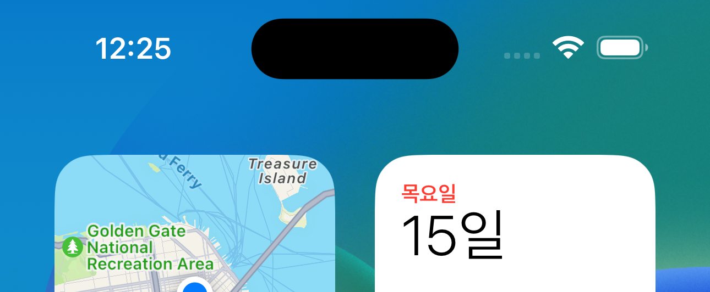
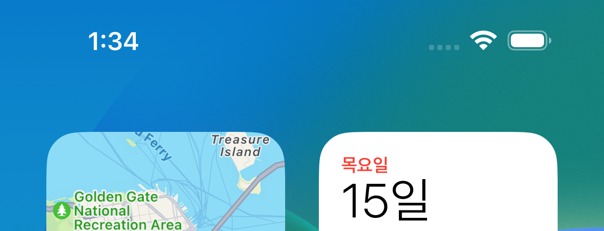

# iPhone 14 Pro (Max)에서 Dynamic Island 영역을 투명하게 만들기



iPhone 14 Pro (Max)에서 스크린샷을 찍으면 위 사진처럼 까만색 알약 모양이 뜨는데...



짠

이렇게 없애는 방법을 올립니다. iOS 16.0 기준입니다.

## 조건

- Simulator

- 또는 탈옥된 기기... (`SpringBoard`를 조작하는거라...)

순정 기기에서는 안 됩니다 ㅎㅎ Dynamic Island 영역은 `SBSystemApertureWindowScene`와 `SBSystemApertureCurtainWindowScene`라고 하는 scene들에 의해 관리되며 이는 `SpringBoard` 영역이라, 제가 아는 선에서는 절대 불가능합니다 ㅎㅎ

또한 서드파티 앱에서 이를 접근하는 Public/Private API는 전혀 존재하지 않아요. 서트파티 앱에서 Dynamic Island의 위치 및 크기(Safe Area 말하는거 아님)를 받아 오는 것도 존재하지 않아요.

## 방법

```
% lldb -n SpringBoard -w

# 새로운 Terminal 창에서 SpringBoard 재시작 (Simulator일 경우)
% xcrun simctl spawn booted launchctl stop com.apple.SpringBoard

# 새로운 Terminal 창에서 SpringBoard 재시작 (실제 iOS 기기일 경우)
% killall -9 backboardd

# breakpoint 설정 - 아직 image load가 전혀 안 된 상태이고 symbolic breakpoint를 설정하는거라 경고가 나지만, 무시하셔도 됩니다.
(lldb) breakpoint set -n '-[CAGainMapLayer setRenderMode:]' -C "register write x2 0x0" -G1
Breakpoint 1: no locations (pending).
WARNING:  Unable to resolve breakpoint to any actual locations.

# continue
(lldb) c
Process 75226 resuming
```

끝...

탈옥 트윅을 만드시면 '-[CAGainMapLayer setRenderMode:]'를 hooking (swizzling)하시면 됩니다...

## 원리

Dynamic Island의 View Hirachy를 보면

```
- SBSystemApertureCurtainWindowScene 또는 SBSystemApertureWindowScene
    - SBSystemApertureWindow
        - SBFTouchPassThroughView (SBSystemApertureCaptureVisibilityShimViewController)
            - UIView (SBSystemApertureCurtainViewController)
                - _SBSystemApertureMagiciansCurtainView (SBSystemApertureCurtainViewController)
                    - _SBGainMapView
                    - UIView
```

이렇게 되어 있는데, Dynamic Island의 배경색을 담당하는건 `_SBGainMapView` 입니다.

```
(lldb) expression -l objc -O -- [_SBGainMapView _shortMethodDescription]
<_SBGainMapView: 0x10668cd28>:
in _SBGainMapView:
    Class Methods:
        + (Class) layerClass; (0x105c10bd8)
    Properties:
        @property (nonatomic) BOOL supportsHitTesting;  (@synthesize supportsHitTesting = _supportsHitTesting;)
    Instance Methods:
        - (id) gainMapLayer; (0x105c10be4)
        - (id) initWithFrame:(struct CGRect)arg1; (0x105c10be8)
        - (id) hitTest:(struct CGPoint)arg1 withEvent:(id)arg2; (0x105c10c30)
        - (BOOL) supportsHitTesting; (0x105c10cac)
        - (void) setSupportsHitTesting:(BOOL)arg1; (0x105c10cbc)
(UIView ...)
```

`CALayer`를 커스텀하고 있는 것으로 보이네요. 이게 뭔지 봅시다.

```
(lldb) expression -l objc -O -- [_SBGainMapView layerClass]
CAGainMapLayer
```

`CAGainMapLayer`라는 것을 쓰고 있네요. `QuartzCore`에 소속되어 있으며, 아마 Dynamic Island의 View의 Layer를 관리하기 위해 iOS 16 부터 새로 생긴 것으로 추정되네요. 이것도 뭔지 보면

```
(lldb) expression -l objc -O -- [CAGainMapLayer _shortMethodDescription]
<CAGainMapLayer: 0x1b6e167f8>:
in CAGainMapLayer:
    Class Methods:
        + (id) defaultValueForKey:(id)arg1; (0x187d86154)
        + (BOOL) CA_automaticallyNotifiesObservers:(Class)arg1; (0x187d861e8)
        + (BOOL) _hasRenderLayerSubclass; (0x187d8614c)
    Properties:
        @property (copy) NSString* renderMode;
    Instance Methods:
        - (void) didChangeValueForKey:(id)arg1; (0x187d86278)
        - (void*) _copyRenderLayer:(void*)arg1 layerFlags:(unsigned int)arg2 commitFlags:(unsigned int*)arg3; (0x187d86384)
        - (BOOL) _renderLayerDefinesProperty:(unsigned int)arg1; (0x187d86314)
        - (id) renderMode; (0x187d86520)
        - (void) setRenderMode:(id)arg1; (0x187d86580)
(CALayer ...)
```

`-[CAGainMapLayer setRenderMode:]`에서 breakpoint를 찍어보고 `$x2` register를 읽어보니 `gainFill`라는 값을 넣어주고 있네요. 이 값을 날려 버리고 `0x0` 값을 주입할게요.

```
(lldb) breakpoint set -n '-[CAGainMapLayer setRenderMode:]' -C "register write x2 0x0" -G1
```

이렇게 하니 되네요... 과정이 많이 생략되긴 했는데 ㅎㅎ assembly 코드 하나하나 다 읽어주기엔 글이 너무 길어져서 ㅎㅎ


## 여담

- Dynamic Island의 코드 네임은 Aperture이다. Dynamic Island에서 우리가 보는 섬의 이름은 [`Jindo`](https://en.wikipedia.org/wiki/Jindo_(island))라고 한다.

```
(lldb) expression -l objc -O -- 0x160282710 
<SBSystemApertureWindow: 0x160282710; Jindo Window-0x160282710-4; baseClass = UIWindow; frame = (0 0; 430 932); gestureRecognizers = <NSArray: 0x600001bb1170>; layer = <UIWindowLayer: 0x600001bb0750>>

(lldb) expression -l objc -O -- [0x160282710 accessibilityIdentifier]
jindo
```

- `손쉬운 사용`에서 `색상 반전`을 해도 Dynamic Island의 배경색은 바뀌지 않는다.

```
(lldb) expression -l objc -O -- [SBSystemApertureWindow _shortMethodDescription]
<SBSystemApertureWindow: 0x1065ebb20>:
in SBSystemApertureWindow:
    Class Methods:
        + (Class) safeCategoryBaseClass; (0x1538eb478)
    Instance Methods:
        - (BOOL) _accessibilityPrefersNonAttributedHint; (0x1318d2c58)
        - (BOOL) _accessibilityPrefersNonAttributedValue; (0x1318d2c3c)
        - (BOOL) _accessibilityPrefersNonAttributedLabel; (0x1318d2c58)
        - (BOOL) _accessibilityIsInJindo; (0x1538eb488)
        - (BOOL) _accessibilityInvertColorsIsDarkWindow; (0x10605de20)
        - (BOOL) accessibilityIgnoresInvertColors; (0x10605de28)
        - (void) accessibilityApplyInvertFilter; (0x10605de30)
        - (void) setAutorotates:(BOOL)arg1 forceUpdateInterfaceOrientation:(BOOL)arg2; (0x10605de34)
(SBFSecureTouchPassThroughWindow ...)

(lldb) disassemble -a 0x10605de28
SpringBoard`-[SBSystemApertureWindow accessibilityIgnoresInvertColors]:
    0x10605de28 <+0>: mov    w0, #0x1
    0x10605de2c <+4>: ret    
```

- 궁금한건...

```
- _SBSystemApertureMagiciansCurtainView (SBSystemApertureCurtainViewController)
    - _SBGainMapView
    - UIView
```

여기서 `UIView`의 정체가 뭔지를 모르겠음... 아래처럼 `_SBSystemApertureMagiciansCurtainView`에서 `_clonedGainMapSubstituteView`라는 이름으로 들고 있고

```
(lldb) expression -l objc -O -- [0x146725070 _ivarDescription]
<_SBSystemApertureMagiciansCurtainView: 0x146725070>:
in _SBSystemApertureMagiciansCurtainView:
in _SBSystemApertureGainMapView:
    _gainMapView (_SBGainMapView*): <_SBGainMapView: 0x146725230>
    _clonedGainMapSubstituteView (UIView*): <UIView: 0x1467253f0>
```

검정색이고... `_gainMapView`와 frame도 완전히 같음... 근데 `isHidden`은 `0x0`임... 왜 얘를 안 건드렸는데 Dynamic Island가 사라지는 것일까? @_@...

```
(lldb) expression -l objc -O -- [[0x1467253f0 backgroundColor] isEqual:[UIColor blackColor]]
0x0000000000000001

(lldb) expression -l objc -O -- [0x1467253f0 isHidden]
 nil
```

- `SBSystemApertureController`은 뭘까?

궁금한게 참 많은데... [ActivityKit](https://developer.apple.com/documentation/activitykit)이 공개적으로 풀리고 Dynamic Island 관련 API가 나오면 다시 한 번 제대로 보기로...
