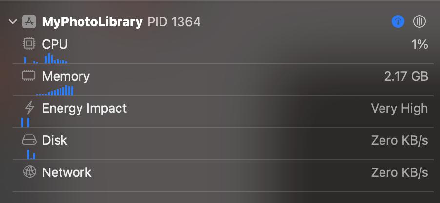

# 성능 좋은 Photo Library 만들기


[UICollectionView](https://developer.apple.com/documentation/uikit/uicollectionview)와 [PhotoKit](https://developer.apple.com/documentation/photokit)을 사용하여 성능이 좋은 Photo Library를 만드는 팁들을 소개해요.

샘플 프로젝트는 [여기](https://github.com/pookjw/MyPhotoLibrary) 있어요. (코드 많이 더러움 ㅎ)

## [`PHFetchResult.enumerateObjects(at:options:using:)`](https://developer.apple.com/documentation/photokit/phfetchresult/1620998-enumerateobjects) 사용은 삼가해야 합니다.

[`NSDiffableDataSourceSnapshot`](https://developer.apple.com/documentation/uikit/nsdiffabledatasourcesnapshot)를 쓰기 위해 아래처럼 [`enumerateObjects(at:options:using:)`](https://developer.apple.com/documentation/photokit/phfetchresult/1620998-enumerateobjects)를 많이 사용할 것 같아요.

```swift
let imageAssets: PHFetchResult<PHAsset> = PHAsset.fetchAssets(with: .image, options: imageOptions)

var snapshot: NSDiffableDataSourceSnapshot<PhotosSectionModel, PhotosItemModel> = .init()

// TMI: enumeration block 안에서 appendItems(_:toSection:)을 호출하지 마세요. transaction method를 호출할 때마다 dispatch_sync가 호출되기 때문에 성능에 매우 안 좋습니다. NSDiffableDataSourceSnapshot에서 transaction method는 최소한으로 호출해야 합니다.
var itemModels: [PhotosItemModel] = .init()
imageAssets.enumerateObjects { asset, index, stopPointer in
    let itemModel: PhotosItemModel = .init(asset: asset)
    itemModels.append(itemModel)
}

snapshot.appendItems(itemModels, toSection: sectionModel)
```

만약 사용자의 Photo Library에 300,000장의 사진이 있다면, 300,000번의 loop를 돌게 됩니다.

하지만 [`PHFetchResult`](https://developer.apple.com/documentation/photokit/phfetchresult)은 [`count`](https://developer.apple.com/documentation/photokit/phfetchresult/1620996-count)와 [`object(at:)`](https://developer.apple.com/documentation/photokit/phfetchresult/1621002-object) 기능들을 제공해요.

따라서 `NSDiffableDataSourceSnapshot`를 사용하지 않고, [`UICollectionViewDataSource`](https://developer.apple.com/documentation/uikit/uicollectionviewdatasource)의 [`numberOfItemsInSection)`](https://developer.apple.com/documentation/uikit/uicollectionviewdatasource/1618058-collectionview)와 [`cellForItemAt:`](https://developer.apple.com/documentation/uikit/uicollectionviewdatasource/1618029-collectionview)를 활용하면 loop를 불필요하게 돌 일이 없어질 것 같아요. `cellForItemAt:`에서 `PHFetchResult.object(at:)`를 호출해서 필요한 `PHAsset`을 필요할 때만 가져오면 되니까요.

## `PHFetchResult.object(at:)` 보다는 Private API?

이제부터 설명드릴 이야기는 Private API를 활용하여 성능을 끌어 올리는 방법이며, 때로는 빠르지만 때로는 느려질 수도 있는 방법이에요. 하지만 `UICollectionView`을 활용하여 Photo Library를 제작한다면 이 방법으로 성능을 끌어 올릴 수 있다고 생각해요. Private API이기에 선택은 개발자의 몫이에요.

우선 `PHFetchResult.object(at:)`의 원리부터 설명드릴게요. `PHFetchResult.object(at:)`를 호출하면 `PHFetchResult`은 모든 `PHAsset`을 Memory에 불러와요. 만약에 개발자가 300,000개의 `PHAsset` 중 세번째의 `PHAsset`만 획득하고 싶어도, `PHFetchResult`은 300,000개를 모두 불러오고 거기서 세번째의 PHAsset을 반환해요.

> `-[PHFetchResult objectIDAtIndex:]`의 IMP의 Assembly를 보면 `-[PHFetchResult fetchedObjectIDs]`를 호출해서 `-[NSArray objectAtIndex:]`를 호출하는 것을 보실 수 있어요.

만약 300,000개를 모두 불러오지 않고 세번째의 `PHAsset`만 fetch 해오는 Private API를 호출한다면 성능을 끌어 올릴 수 있을 것 같아요. 코드는 아래와 같아요.

```objc
//  PHFetchResult+FastFetching.h
#import <Photos/Photos.h>

NS_HEADER_AUDIT_BEGIN(nullability, sendability)

@interface PHFetchResult (FastFetching)
- (PHAsset *)ff_PHAssetAtIndex:(NSInteger)index;
@end

NS_HEADER_AUDIT_END(nullability, sendability)


//  PHFetchResult+FastFetching.mm
#import "PHFetchResult+FastFetching.h"
#import <objc/message.h>

@implementation PHFetchResult (FastFetching)

#if __has_feature(objc_arc)
#error "ARC is not supported."
#else
- (PHAsset *)ff_PHAssetAtIndex:(NSInteger)index {
    id objectID = reinterpret_cast<id (*)(PHFetchResult *, SEL, NSUInteger)>(objc_msgSend)(self, NSSelectorFromString(@"objectIDAtIndex:"), index);
    auto fetchResult = reinterpret_cast<PHFetchResult<PHAsset *> * (*)(Class, SEL, NSArray *, PHFetchOptions *)>(objc_msgSend)(PHAsset.class, NSSelectorFromString(@"fetchAssetsWithObjectIDs:options:"), @[objectID], nil);
    return fetchResult.firstObject;
}
#endif

@end
```

성능 차이를 비교해보면

```swift
var total: ContinuousClock.Instant.Duration = .zero

for index in 0..<1_000 {
    let clock = ContinuousClock()
    
    let result = clock.measure {
        // fetchResult.object(at: 2)
        fetchResult.ff_PHAsset(at: 2)
    }
    
    total += result
}

// object(at:) -> 4.8373086e-05 seconds
// ff_PHAsset(at:) -> 0.014322118421 seconds
print(total / 1_000)
```

Private API를 활용하면 성능을 크게 올라간 것을 확인하실 수 있어요. 하지만 모든 `PHAsset`을 fetch 해올 때는 결과가 많이 달라져요.

```swift
let clock = ContinuousClock()

let result = clock.measure {
    for index in 0..<fetchResult.count {
        // _ = fetchResult.object(at: index)
        _ = fetchResult.ff_PHAsset(at: index)
    }
}

// object(at:) -> 1.372607958 seconds
// ff_PHAsset(at:) -> 25.693060834 seconds
print(result)
```

위처럼 모든 `PHAsset`을 fetch 해올 때는 Private API가 많이 느린 것을 확인하실 수 있어요.

`object(at:)`은 모든 `PHAsset`을 한 번에 다 가져오지만, 제가 만든 Private API를 호출하는 코드는 하나하나 가져오는 방식이에요. 따라서 위처럼 모든 `PHAsset`을 가져오는 경우는 Private API가 훨씬 느린 것을 확인하실 수 있어요.

하지만 `UICollectionView`에서 Photo Library를 만든다면 Private API를 활용하는 것이 성능에 더 좋을 것 같아요.

## Cell의 크기에 맞는 Image를 가져오기

[`PHImageManager.requestImage(for:targetSize:contentMode:options:resultHandler:)`](https://developer.apple.com/documentation/photokit/phimagemanager/1616964-requestimage)에서 `targetSize` parameter를 활용해서 Cell의 사이즈에 맞는 Image를 가져와 주세요. [`PHImageManagerMaximumSize`](https://developer.apple.com/documentation/photokit/phimagemanagermaximumsize) 같은 것으로 불필요하게 큰 크기의 Image를 불러오는 것은 삼가해 주세요.

만약에 Cell의 bounds가 바뀌면 다시 request하는 것도 넣어주시면 좋을 것 같아요.



🔼 `PHImageManagerMaximumSize` 사용할 때 - 약 2.17GB의 Memory 사용


🔼 Cell의 크기에 맞는 Image를 가져왔을 때 - 약 49.9MB의 Memory 사용

유의하셔야 할 점은 Cell의 Size에 [`UIScreen.scale`](https://developer.apple.com/documentation/uikit/uiscreen/1617836-scale)을 곱하셔야 해요.

> 만약 Multi Display 환경 및 Screen의 Scale 변화에 대응하고 싶으시다면 Private API로 View가 속한 Screen 및 Scale의 변화를 Observing하셔야 해요. [저의 샘플 프로젝트](https://github.com/pookjw/MyPhotoLibrary)는 아직 해당 부분이 구현되어 있지 않으며, 구현하고 싶으시다면 [`-[UIWindowScene _screenDidChangeFromScreen:toScreen:]`](https://gist.github.com/pookjw/44f712226552e59cb5597114558aade3)를 활용하시면 돼요.

## [`PHCachingImageManager`](https://developer.apple.com/documentation/photokit/phcachingimagemanager)

Image를 Disk에서 불러오고 크기를 조정하는 작업을 반복하는 것은 불필요 할 수 있어요. 이때는 Caching을 하면 좋을 것 같아요.

하지만 너무 불필요하게 Caching을 많이 하면 Memory 사용 용량이 증가하므로 유의해 주세요. 저는 Memory를 적게 사용하고 싶고 필요할 때 [`stopCachingImages(for:targetSize:contentMode:options:)
`](https://developer.apple.com/documentation/photokit/phcachingimagemanager/1616968-stopcachingimages)을 호출해야 하는 것이 번거로워서 개인적으로 사용하지 않아요.

## [`UICollectionViewDataSourcePrefetching`](https://developer.apple.com/documentation/uikit/uicollectionviewdatasourceprefetching) 사용하기

`UICollectionViewDataSourcePrefetching`은 Cell이 화면에 뜨기 전에 준비할 때 쓰여요. `UICollectionViewDataSource.collectionView(_:cellForItemAt:)`랑 차이점을 설명드리면

- `collectionView(_:cellForItemAt:)` : "지금 당장 Cell이 화면에 뜰거니까 준비해줘"

- `collectionView(_:prefetchItemsAt:)` : "왠지 화면에 Cell이 뜰 것 같아. 미리 준비해줘"

- `collectionView(_:cancelPrefetchingForItemsAt:)` : "앗 착각했네 화면에 안 뜰듯 ㅎㅎ ㅈㅅ"

이렇게 이해하시면 돼요. Prefetching을 지원한다면 Cell에 사진이 더 빨리 뜰 수 있어요. 하지만 화면이 뜨지 않았는데 미리 사진을 Memory에 불러오기 때문에 Memory를 더 소모할 수 있어요.

개인적으로 [샘플 프로젝트](https://github.com/pookjw/MyPhotoLibrary)를 만들 때 가장 어려웠던 부분이었어요. prefetching 도중에 `cellForItemAt:`이 불려버리면 prefetching 중인 내용을 Cell에 넘겨줘야 하고, 그 도중에 Cell의 크기가 바뀌면 prefetching을 취소해서 다시 request를 하고, 이 모든 상태들을 `actor`에 담고 있다보니 온갖 Race Condition이 발생해서 애를 먹었네요.

## [`UIImage.prepareForDisplay(completionHandler:)`](https://developer.apple.com/documentation/uikit/uiimage/3750844-preparefordisplay)을 활용하면 좋아요.

`UIImage`가 화면에 뜨기 위해서는 몇몇 작업이 필요해요. 이는 무거운 작업이기에 Main Thread에서 진행하면 UI가 멈출 수 있어요. 따라서 이 작업을 `UIImage.prepareForDisplay(completionHandler:)`로 Backgroud Thread에서 진행하면 좋을 것 같아요.

실제로 iPhone 15 Pro Max에서 Scroll을 빠르게 할 때 90fps까지 떨어지는데, `UIImage.prepareForDisplay(completionHandler:)`을 사용하면 110fps 이상이 유지돼요.
