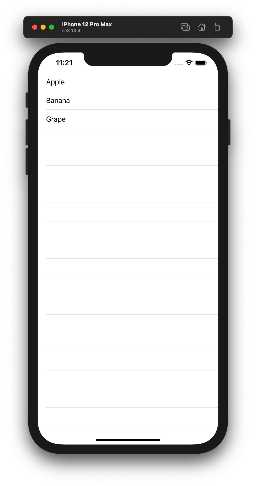
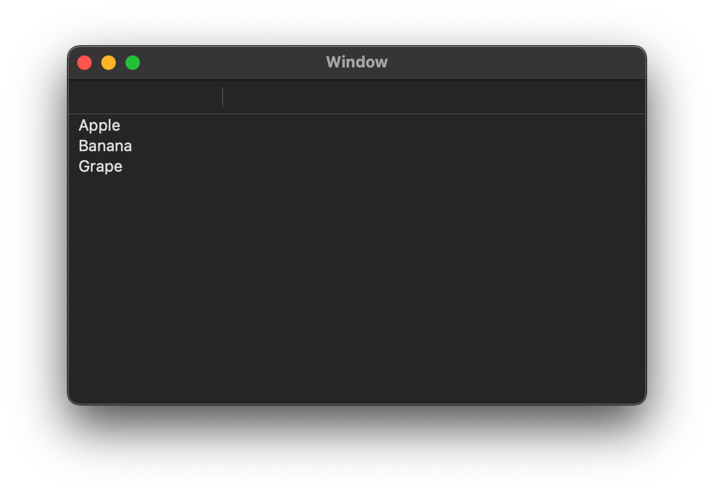

# DiffableDataSource, 그리고 Cocoa

macOS 11.0 이후로 Cocoa에 [NSTableViewDiffableDataSource](https://developer.apple.com/documentation/appkit/nstableviewdiffabledatasource), [NSCollectionViewDiffableDataSource](https://developer.apple.com/documentation/appkit/nscollectionviewdiffabledatasource?language=objc), 그리고 [NSDiffableDataSourceSnapshot](https://developer.apple.com/documentation/uikit/nsdiffabledatasourcesnapshot)가 추가되었습니다. 마찬가지로 UIKit에도 [UITableViewDiffableDataSource](https://developer.apple.com/documentation/uikit/uitableviewdiffabledatasource)와 [UICollectionViewDiffableDataSource](https://developer.apple.com/documentation/uikit/uicollectionviewdiffabledatasource)도 추가되었죠.

이들은 [RxDataSources](https://github.com/RxSwiftCommunity/RxDataSources)를 대체할 수 있으며, 더 이상 이 때문에 [RxSwift](https://github.com/ReactiveX/RxSwift)를 써야 할 이유도 사라졌다고 생각합니다. (다만 RxCocoa나 [RxAlamofire](https://github.com/RxSwiftCommunity/RxAlamofire)가 필요하시거나, RxSwift만 있는 매력적인 전용기능들을 원하신다면 여전히 RxSwift는 필요하겠죠.)

raywenderlich에서 이 사용법과 [UICollectionLayoutListConfiguration](https://developer.apple.com/documentation/uikit/uicollectionlayoutlistconfiguration)까지 한꺼번에 학습할 수 있는 매우 좋은 자료가 있습니다. [iOS 14 Tutorial: UICollectionView List (www.raywenderlich.com/)](https://www.raywenderlich.com/16906182-ios-14-tutorial-uicollectionview-list)

하지만 위 가이드는 iOS용입니다. 근데 macOS의 Cocoa도 대충 비슷하게 작동하지 않겠어??? 라는 생각으로 한 번 아래와 같이 짜봅시다.

```swift
import Cocoa

class ViewController: NSViewController {
    @IBOutlet weak var tableView: NSTableView!
    var viewModel: ViewModel = .init()
    
    override func viewDidLoad() {
        super.viewDidLoad()
        configureDataSource()
    }
    
    func configureDataSource() {
        viewModel.dataSource = makeDataSource()
        viewModel.updateData()
    }
    
    func makeDataSource() -> ViewModel.DataSource {
        return .init(tableView: tableView) { (tableView, column, row, item) -> NSView in
            let cell: NSTableCellView = tableView.makeView(withIdentifier: column.identifier, owner: self)! as! NSTableCellView
            cell.textField?.stringValue = item
            return cell
        }
    }
}

class ViewModel {
    typealias DataSource = NSTableViewDiffableDataSource<Int, String>
    typealias Snapshot = NSDiffableDataSourceSnapshot<Int, String>
    
    var dataSource: DataSource!
    
    func updateData() {
        var snapshot: Snapshot = dataSource.snapshot()
        
        snapshot.deleteAllItems()
        let section: Int = 0
        snapshot.appendSections([section])
        snapshot.appendItems(["Apple", "Banana", "Grape"], toSection: section)
        dataSource.apply(snapshot, animatingDifferences: true)
    }
}

```

실행해보면... 아래와 같이 런타임 에러가 발생하네요.

```
2021-04-02 23:07:02.264562+0900 DataSource[2599:29512] *** Assertion failure in -[NSTableViewDiffableDataSourceImpl _applyDifferencesFromSnapshot:completion:], _NSDiffableDataSourceImpl.m:919
```

음... 검색해도 안 나오네요. 한 번 똑같은 로직을 iOS에도 적용해 볼게요.

```swift
import UIKit

class ViewController: UIViewController {
    @IBOutlet weak var tableView: UITableView!
    var viewModel: ViewModel = .init()
    
    override func viewDidLoad() {
        super.viewDidLoad()
        configureDataSource()
    }

    func configureDataSource() {
        viewModel.dataSource = makeDataSource()
        viewModel.updateData()
    }
    
    func makeDataSource() -> ViewModel.DataSource {
        return .init(tableView: tableView) { (tableView, indexPath, item) -> UITableViewCell? in
            let cell: UITableViewCell = .init()
            cell.textLabel?.text = item
            return cell
        }
    }
}

class ViewModel {
    typealias DataSource = UITableViewDiffableDataSource<Int, String>
    typealias Snapshot = NSDiffableDataSourceSnapshot<Int, String>
    
    var dataSource: DataSource!
    
    func updateData() {
        var snapshot: Snapshot = dataSource.snapshot()
        
        snapshot.deleteAllItems()
        let section: Int = 0
        snapshot.appendSections([section])
        snapshot.appendItems(["Apple", "Banana", "Grape"], toSection: section)
        dataSource.apply(snapshot, animatingDifferences: true)
    }
}
```



잘 나오네요. -_-; 로직에는 문제가 없다는 소리인데요. 여기서 한 번 고민을 해봅시다.

- `**-[NSTableViewDiffableDataSourceImpl _applyDifferencesFromSnapshot:completion:]**`는 Objective-C 런타임 에러입니다. 하지만 [NSTableViewDiffableDataSource](https://developer.apple.com/documentation/appkit/nstableviewdiffabledatasource)는 NSObject난 Swift Object, Swift 전용입니다. 다시 말해 Swift Object -> NSObject로 Bridging되는 로직이 내부적으로 존재합니다.
- 검색해보니 Objective-C로 작동하는 [NSTableViewDiffableDataSourceReference](https://developer.apple.com/documentation/appkit/nstableviewdiffabledatasourcereference)도 존재하네요. 즉, `NSTableViewDiffableDataSource`와 `NSTableViewDiffableDataSourceReference`의 Bridging 방식은 다르다는 것을 추측할 수 있으며, `NSTableViewDiffableDataSource`의 Bridging에서 버그가 있을 것이란 가설을 세웠습니다.

그럼 한 번 `NSTableViewDiffableDataSource` 대신에 `NSTableViewDiffableDataSourceReference`로 바꾸면 문제가 해결될지 볼가요? 일단 알고 가야 할 점이 있습니다.

- `NSTableViewDiffableDataSource`는 `SectionIdentifierType`, `ItemIdentifierType`에 `Hashable`, `Equatable`를 conform하는 모든 Type이 들어갈 수 있습니다.
- 하지만 `NSTableViewDiffableDataSourceReference`는 NSObject만 가능합니다. Item 비교를 위해 `isEqual(:)`를 override해야 하며, 이걸 하지 않으면 Item이 새로 생성될 때마다 무조건 서로 다른 데이터로 취급되어서 성능면에서 안 좋고 animation도 자연스럽게 작동하지 않을겁니다. [예시](https://github.com/pookjw/YTPIPHelper/blob/main/YTPIPHelper/Entity/MainResultIem.m) - Objective-C로 쓰긴 했는데 Swift로도 똑같이 동작함

자 그럼 한 번 바꿔봅시다. `<Int, String>`에서 `<NSNumber, NSString>`으로 바뀐 걸 볼 수 있습니다.

```swift
import Cocoa

class ViewController: NSViewController {
    @IBOutlet weak var tableView: NSTableView!
    var viewModel: ViewModel = .init()
    
    override func viewDidLoad() {
        super.viewDidLoad()
        configureDataSource()
    }
    
    func configureDataSource() {
        viewModel.dataSource = makeDataSource()
        viewModel.updateData()
    }
    
    func makeDataSource() -> ViewModel.DataSource {
        return .init(tableView: tableView) { (tableView, column, row, item) -> NSView in
            let cell: NSTableCellView = tableView.makeView(withIdentifier: column.identifier, owner: self)! as! NSTableCellView
            cell.textField?.stringValue = item as! String
            return cell
        }
    }
}

class ViewModel {
    typealias DataSource = NSTableViewDiffableDataSourceReference<NSNumber, NSString>
    typealias Snapshot = NSDiffableDataSourceSnapshotReference
    
    var dataSource: DataSource!
    
    func updateData() {
        let snapshot: Snapshot = dataSource.snapshot()
        
        snapshot.deleteAllItems()
        let section: Int = 0
        snapshot.appendSections(withIdentifiers: [section])
        snapshot.appendItems(withIdentifiers: ["Apple", "Banana", "Grape"], intoSectionWithIdentifier: section)
        dataSource.applySnapshot(snapshot, animatingDifferences: true)
    }
}
```



잘 되네요.😕 일해라 애플... (이거때문에 3시간 동안 삽질...)

다만 `animatingDifferences`도 `NSTableViewDiffableDataSourceReference`에 버그가 있으므로, 잘 살펴보시는 걸 추천합니다.