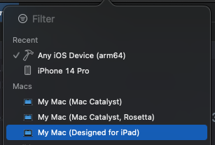

# Mac Catalyst: Behind the scenes (1)

Mac Catalyst에 적는 글입니다.

## 역사

### WWDC 2019 이전

[Bringing iOS Apps to macOS Using Marzipanify](https://www.highcaffeinecontent.com/blog/20190301-Bringing-iOS-Apps-to-macOS-Using-Marzipanify)

macOS Mojave에 iOSMac/Marzipan이라는 이름으로 최초 등장한 것으로 보이며, 당시 Steven Troughton-Smith라는 사람이 분석했던 글입니다.

(4년 전에 저런 수준의 글을 썼다는게 정말 놀라움... 존경하는 개발자 중 한 명...) 

### WWDC 2019 이후

[WWDC 2019 - Project Catalyst](https://youtu.be/psL_5RIBqnY?t=6832)

애플이 macOS Catalina를 발표하면서 공식적으로 Project Catalyst를 공식화 했습니다. iOS 프로젝트를 macOS에서 실행할 수 있게 하는 프로젝트 입니다.

이후로 애플은 Mac Catalyst라는 이름으로 매년 많은 개선을 이뤘으며, 수많은 AppKit API를 UIKit으로 port해주고 있습니다. iOS 앱 개발자들은 AppKit을 몰라도 macOS 앱을 개발할 수 있게 해줍니다. 

## 종류



- Mac Catalyst : `arm64-apple-ios-macabi`

- Mac Catalyst, Rosetta : `x86_64-apple-ios-macabi`

- Designed for iPad : `arm64-apple-ios`

만약에 여러분이 iOS 앱을 App Store에 등록한다면 Designed for iPad로 작동합니다. Designed for iPad는 arm64만 지원하기 때문에 Apple Silicon Mac만 지원합니다. Intel/AMD Mac에서는 지원하지 않습니다.

Designed for iPad는 iOS와 같은 UI를 가지고 있기에, 기존 iOS 프로젝트와 호환성이 좋습니다. 하지만 Mac Catalyst 전용 API를 직접 호출할 수 없으며, [objc_msgSend](https://developer.apple.com/documentation/objectivec/1456712-objc_msgsend) 같은 Rutime 함수로 강제로 호출하면 되긴 합니다.

Mac Catalyst는 UIKit 코드를 macOS와 같은 UI로 변환해 줍니다. 따라서 Desktop 수준의 앱을 UIKit 코드로 개발할 수 있습니다.

더 자세히 알고 싶으시면 [WWDC22 - Bring your iOS app to the Mac](https://developer.apple.com/videos/play/wwdc2022/10076/)에서 7분 25초 부분부터 보시면 됩니다.

## 기본 구조

    `arm64-apple-ios-macabi` 기준입니다.
    
애플은 UIKit을 iOS와 macOS에 호환성을 갖게 하기 위해 UIKitCore라는 Private Framework를 도입했습니다. 과거에는 UIKit이 구현 코드 (implementation)들을 갖고 있었다면, Mac Catalyst 이후로 UIKit은 wrapper 역할만 하고 있고 구현 코드는 UIKitCore로 이관되었습니다.

UIKit은 iOS와 macOS가 공통된 로직을 가지고 있으나, UIKitCore는 별개로 처리되어 있습니다. 또한 macOS의 UIKitCore는 내부적으로 UIKitMacHelper라는 Private Frameworks를 참조하고 있으며, UIKitMacHelper에서는 AppKit API를 호출합니다.

즉, 정리하면 Mac Catalyst는 UIKit을 AppKit으로 변환해주는 역할을 합니다. iOS의 UIKit이랑 동작 방식이 다릅니다.

Mac Catalyst는 UIKit 이외에도 Photos 같은 iOS 전용 Framework들도 지원합니다. 이는 `/System/iOSSupport/System/Library`에서 Framework들의 목록을 보실 수 있습니다.

### UIKit -> AppKit

위에서 말한대로 Mac Catalyst는 결국 AppKit으로 동작하므로 AppKit API를 호출할 수 있습니다. 즉, 아래처럼 `-[NSApplication orderedWindows]`를 호출하면 Mac Catalyst에서 NSWindow 객체를 생성해준 것을 볼 수 있습니다.

```
(lldb) expression -l objc -O -- [NSApp orderedWindows]
<__NSArrayM 0x600003737540>(
<UINSWindow: 0x130f56f20> frame : {{1006, 1139}, {1024, 768}}
)
```

UINSWindow는 NSWindow를 subclassing하고 있습니다. 만약에 UIWindow를 가져오고 싶다면 `-[UINSWindow uiWindows]`를 전송하면 됩니다.

```
(lldb) expression -l objc -O -- [0x130f56f20 uiWindows]
<__NSArrayI 0x6000039884a0>(
<UIWindow: 0x130f410e0; frame = (0 0; 1330 998); gestureRecognizers = <NSArray: 0x60000373bf30>; layer = <UIWindowLayer: 0x60000373e4f0>>,
<UITextEffectsWindow: 0x131069a00; frame = (0 0; 1330 998); opaque = NO; autoresize = W+H; layer = <UIWindowLayer: 0x600003722a60>>
)
```

AppKit에서는 NSWindow를 관리하는 NSWindowController가 존재합니다. 마찬가지로 UINSWindow는 UINSSceneWindowController를 가지고 있으며, `-[UINSWindow sceneWindowController]`를 전송하면 해당 객체를 가져 올 수 있습니다.

```
(lldb) expression -l objc -O -- [0x130f56f20 sceneWindowController]
<UINSSceneWindowController: 0x600000bb82d0>
```

이 UINSSceneWindowController은 `-[UINSSceneWindowController setUIScene]`을 통해 UIScene을 NSWindowController로 변환해주는 역할을 합니다. UIKit 코드를 AppKit으로 변환해주는 첫번째 관문인 셈입니다.

```
(lldb) expression -l objc -O -- [0x600000bb82d0 UIScene]
<UIWindowScene: 0x13de07060>
```

## 마치며

여기까지가 Mac Catalyst: Behind the scenes의 1편입니다. 1편은 Mac Catalyst의 소개와 UIKit API들이 어떻게 AppKit으로 변환되는지 간략하게 소개드렸습니다. 2편은 API 변환의 과정을 더 깊게 다루게 될 것 같네요.
