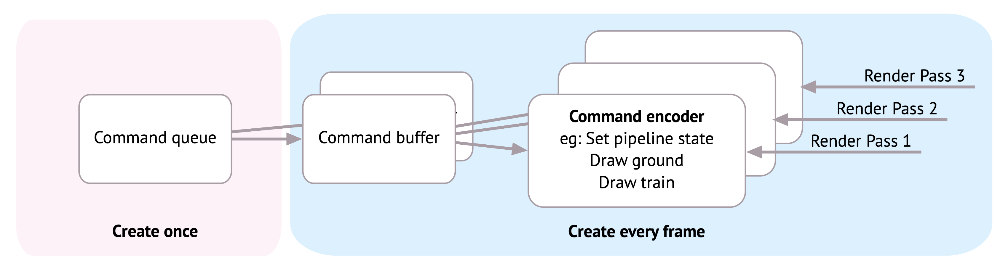
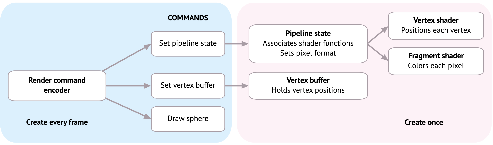
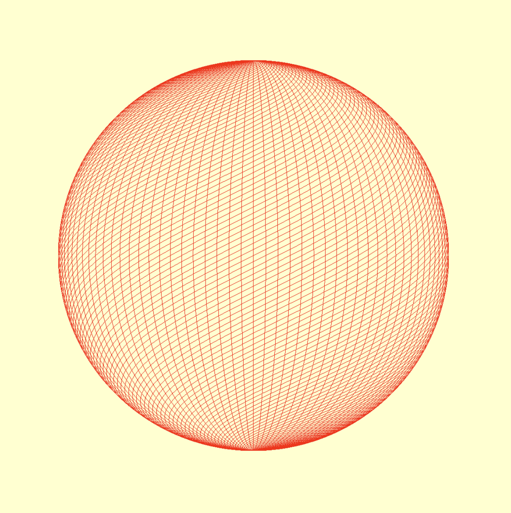
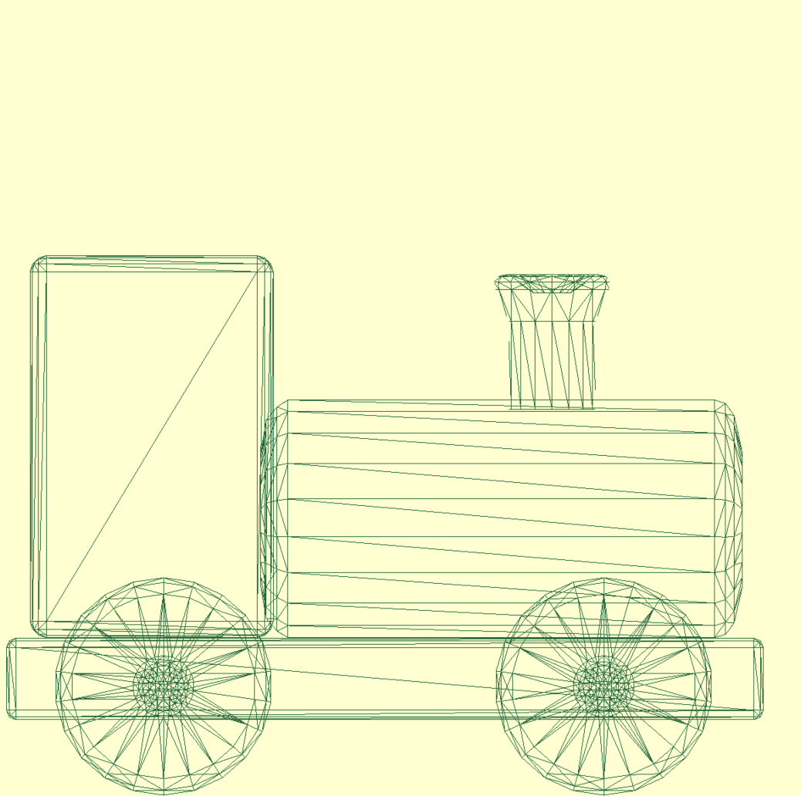
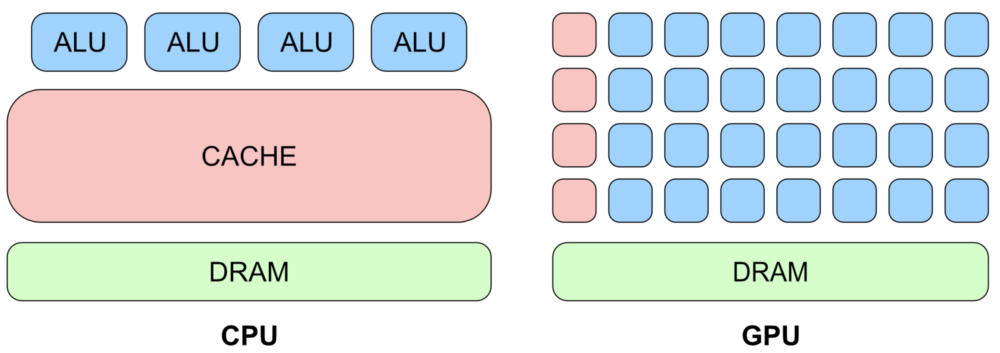
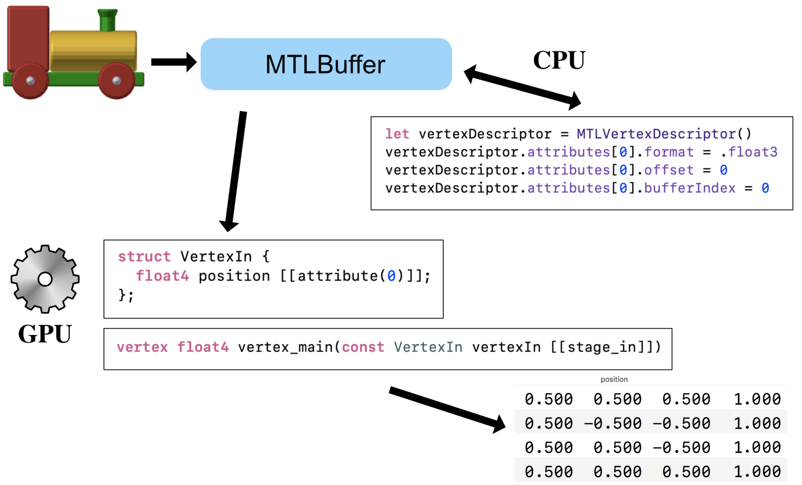
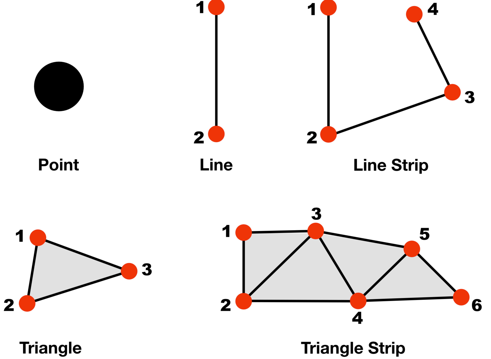
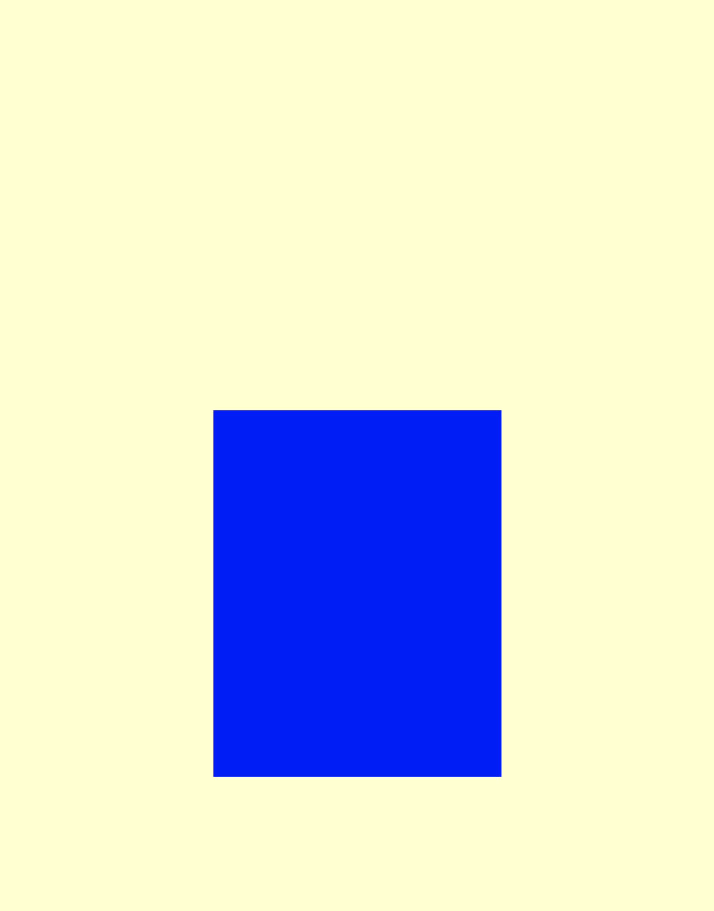
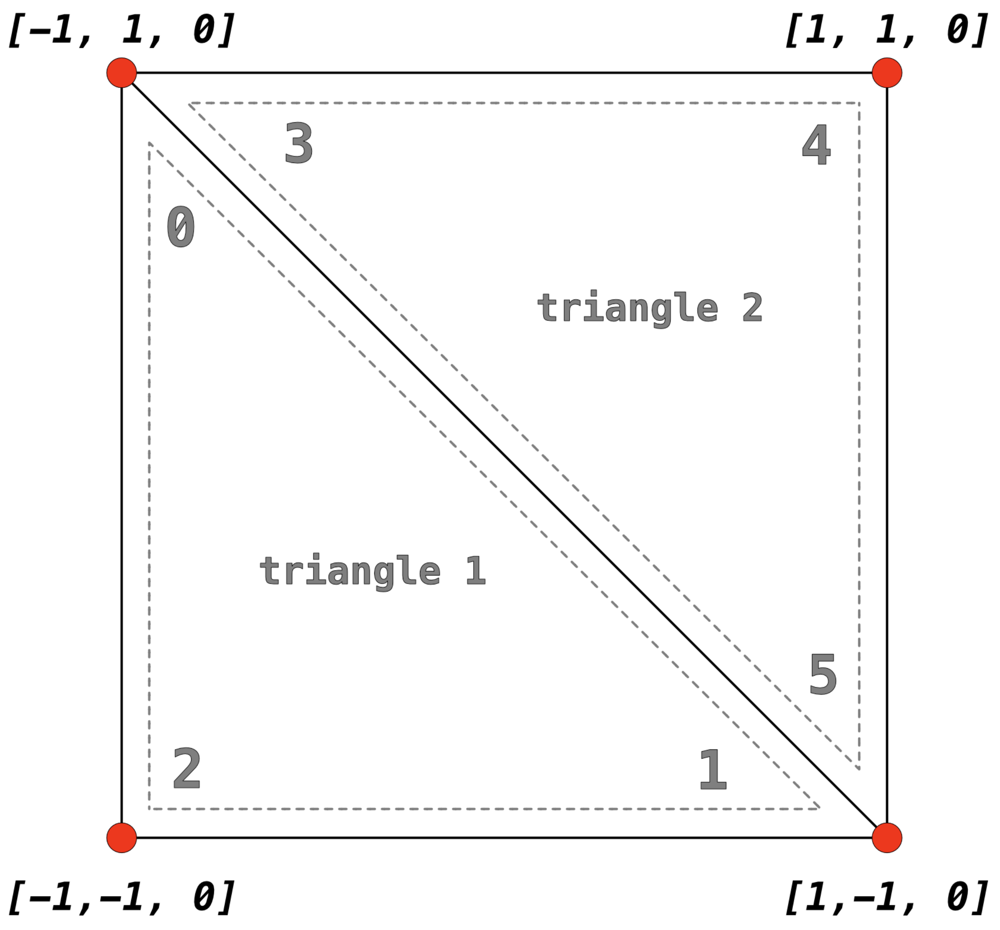
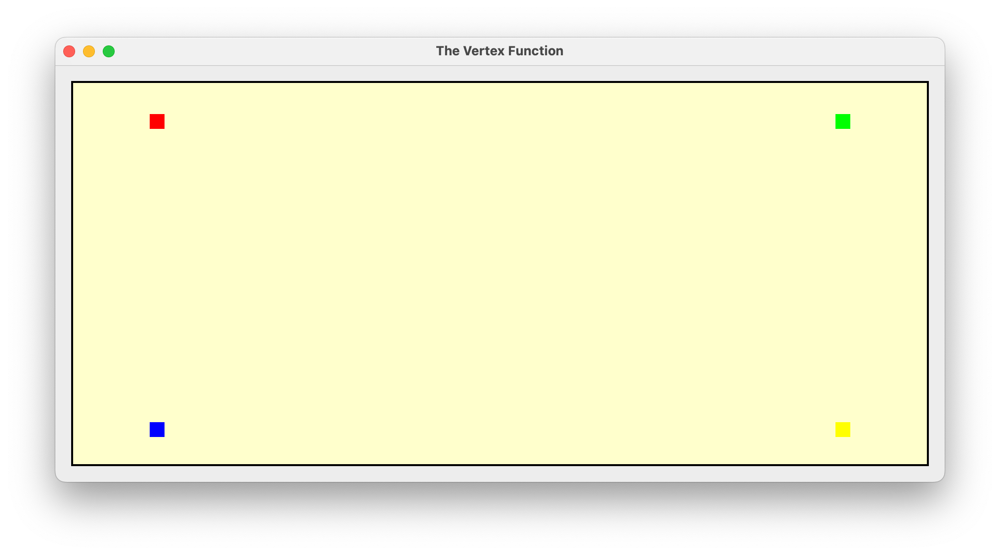

# Metal by Tutorials

[Metal by Tutorials (raywenderlich.com)](https://www.raywenderlich.com/books/metal-by-tutorials) 책을 정리한 글입니다.


- [Chapter 1: Hello, Metal!](#chapter-1)

- [Chapter 2: 3D Models](#chapter-2)

- [Chapeter 3: The Rendering Pipeline](#chapter-3)

- [Chapeter 4: The Vertex Function](#chapter-4)

# <a name="chapter-1">Chapeter 1: Hello, Metal!</a>

Metal을 사용할 때는 'Metal 초기 설정 (Initialize Metal)' -> 'Model을 불러 옴 (Load a model)' -> 'Set up the pipeline (pipeline 설정)' -> 'Render' 과정을 거치게 된다.

queue, buffer, encoder, pipeline이라는 개념이 등장한다. queue, pipeline는 한 번만 생성되며 이 queue를 통해 매 frame마다 command를 처리한다. 각 command들을 buffer라고 부르며 매 frame마다 새로 생성된다, buffer는 encoder를 포함한다. encoder는 매 frame마다 pipeline을 통해 GPU에 연산할 값을 전송하고 받아 오며 draw를 담당한다.





## Practice



```swift
import UIKit
import MetalKit

class ViewController: UIViewController {
    private var commandQueue: MTLCommandQueue!
    private var mtkMesh: MTKMesh!
    private var pipelineState: MTLRenderPipelineState!
    
    override func viewDidLoad() {
        super.viewDidLoad()
        
        let device: MTLDevice = MTLCreateSystemDefaultDevice()!
        print(device.name) // 'Apple iOS simulator GPU' or 'Apple M1 Ultra'
        
        let frame: CGRect = .init(x: .zero, y: .zero, width: 600.0, height: 600.0)
        let mtkView: MTKView = .init(frame: frame, device: device)
        mtkView.clearColor = MTLClearColor(red: 1.0, green: 1.0, blue: 0.8, alpha: 1.0)
        mtkView.delegate = self
        
        view.addSubview(mtkView)
        mtkView.translatesAutoresizingMaskIntoConstraints = false
        NSLayoutConstraint.activate([
            mtkView.centerXAnchor.constraint(equalTo: view.centerXAnchor),
            mtkView.centerYAnchor.constraint(equalTo: view.centerYAnchor),
            mtkView.widthAnchor.constraint(equalToConstant: frame.width),
            mtkView.heightAnchor.constraint(equalToConstant: frame.height)
        ])
        
        //
        
        // mesh data를 관리할 메모리를 할당해주는 객체
        let allocator: MTKMeshBufferAllocator = .init(device: device)
        
        // 구(sphere) 생성
        // extent: 비율
        // segments: 구의 각의 개수 (숫자가 클 수록 더 완벽한 원에 가까워 질 것)
        // inwardNormals: https://mathinsight.org/applet/sphere_inward_normal_vector - 뭔 차이지???
        // geometryType: mesh를 그리는 방식 - 삼각형 방식으로 mesh를 그림
        let mdlMesh: MDLMesh = .init(sphereWithExtent: [0.75, 0.75, 0.75],
                                     segments: [100, 100],
                                     inwardNormals: false,
                                     geometryType: .triangles,
                                     allocator: allocator)
        
        // MetalKit에서 쓸 수 있는 Mesh 생성
        let mtkMesh: MTKMesh = try! .init(mesh: mdlMesh, device: device)
        self.mtkMesh = mtkMesh
        
        // queue 생성
        let commandQueue: MTLCommandQueue = device.makeCommandQueue()!
        self.commandQueue = commandQueue
        
        // Library 정의
        let shader: String = """
        #include <metal_stdlib>
        using namespace metal;
        
        struct VertexIn {
            float4 position [[attribute(0)]];
        };
        
        vertex float4 vertex_main(const VertexIn vertex_in [[stage_in]])
        {
            return vertex_in.position;
        }
        
        fragment float4 fragment_main() {
            return float4(1, 0, 0, 1);
        }
        """
        
        let library: MTLLibrary = try! device.makeLibrary(source: shader, options: nil)
        let vertexFunction: MTLFunction = library.makeFunction(name: "vertex_main")!
        let fragmentFunction: MTLFunction = library.makeFunction(name: "fragment_main")!
        
        // Pipline 설정
        let pipelineDescriptor: MTLRenderPipelineDescriptor = .init()
        pipelineDescriptor.colorAttachments[0].pixelFormat = .bgra8Unorm
        pipelineDescriptor.vertexFunction = vertexFunction
        pipelineDescriptor.fragmentFunction = fragmentFunction
        pipelineDescriptor.vertexDescriptor = MTKMetalVertexDescriptorFromModelIO(mtkMesh.vertexDescriptor)
        
        let pipelineState: MTLRenderPipelineState = try! device.makeRenderPipelineState(descriptor: pipelineDescriptor)
        self.pipelineState = pipelineState
    }
}

extension ViewController: MTKViewDelegate {
    func mtkView(_ view: MTKView, drawableSizeWillChange size: CGSize) {
        
    }
    
    func draw(in view: MTKView) {
        // command buffer 생성
        let commandBuffer: MTLCommandBuffer = commandQueue.makeCommandBuffer()!
        
        // View의 Render Pass Descriptor를 생성한다. 이 descriptor는 render를 어디로 해야 할지 (attachments)를 담고 있다.
        let renderPassDescriptor: MTLRenderPassDescriptor = view.currentRenderPassDescriptor!
        
        // encoder 생성
        let renderEncoder: MTLRenderCommandEncoder = commandBuffer.makeRenderCommandEncoder(descriptor: renderPassDescriptor)!
        
        renderEncoder.setRenderPipelineState(pipelineState)
        renderEncoder.setVertexBuffer(mtkMesh.vertexBuffers[0].buffer, offset: 0, index: 0)
        renderEncoder.setTriangleFillMode(.lines)
        
        let submesh: MTKSubmesh = mtkMesh.submeshes.first!
        
        renderEncoder.drawIndexedPrimitives(type: .line,
                                            indexCount: submesh.indexCount,
                                            indexType: submesh.indexType,
                                            indexBuffer: submesh.indexBuffer.buffer,
                                            indexBufferOffset: 0)
        
        renderEncoder.endEncoding()
        
        let drawable: CAMetalDrawable = view.currentDrawable!
        commandBuffer.present(drawable)
        commandBuffer.commit()
    }
}
```

# <a name="chapter-2">Chapter 2: 3D Models</a>

- `MTLVertexDescriptor`, `MDLVertexDescriptor`을 통해 pipeline에서 통신되는 데이터 구조를 정의하며

- `train.obj`이라는 3D Model을 불러 온다.



```swift
import UIKit
import MetalKit

class ViewController: UIViewController {
    private var commandQueue: MTLCommandQueue!
    private var mtkMesh: MTKMesh!
    private var pipelineState: MTLRenderPipelineState!
    
    override func viewDidLoad() {
        super.viewDidLoad()
        
        let device: MTLDevice = MTLCreateSystemDefaultDevice()!
        print(device.name) // 'Apple iOS simulator GPU' or 'Apple M1 Ultra'
        
        let frame: CGRect = .init(x: .zero, y: .zero, width: 600.0, height: 600.0)
        let mtkView: MTKView = .init(frame: frame, device: device)
        mtkView.clearColor = MTLClearColor(red: 1.0, green: 1.0, blue: 0.8, alpha: 1.0)
        mtkView.delegate = self
        
        view.addSubview(mtkView)
        mtkView.translatesAutoresizingMaskIntoConstraints = false
        NSLayoutConstraint.activate([
            mtkView.centerXAnchor.constraint(equalTo: view.centerXAnchor),
            mtkView.centerYAnchor.constraint(equalTo: view.centerYAnchor),
            mtkView.widthAnchor.constraint(equalToConstant: frame.width),
            mtkView.heightAnchor.constraint(equalToConstant: frame.height)
        ])
        
        //
        
        // mesh data를 관리할 메모리를 할당해주는 객체
        let allocator: MTKMeshBufferAllocator = .init(device: device)
        
        // Model 불러 오기
        let vertexDescriptor: MTLVertexDescriptor = .init()
        vertexDescriptor.attributes[0].format = .float3 // train.obj이 3차원임
        vertexDescriptor.attributes[0].offset = 0
        vertexDescriptor.attributes[0].bufferIndex = 0
        vertexDescriptor.layouts[0].stride = MemoryLayout<SIMD3<Float>>.stride
        
        let meshDescriptor: MDLVertexDescriptor = MTKModelIOVertexDescriptorFromMetal(vertexDescriptor)
        (meshDescriptor.attributes[0] as! MDLVertexAttribute).name = MDLVertexAttributePosition
        
        let assetUrl: URL = Bundle.main.url(forResource: "train", withExtension: "obj")!
        let mdlAsset: MDLAsset = .init(url: assetUrl, vertexDescriptor: meshDescriptor, bufferAllocator: allocator)
        let mdlMesh: MDLMesh = mdlAsset.childObjects(of: MDLMesh.self).first as! MDLMesh
        
        // MetalKit에서 쓸 수 있는 Mesh 생성
        let mtkMesh: MTKMesh = try! .init(mesh: mdlMesh, device: device)
        self.mtkMesh = mtkMesh
        
        // queue 생성
        let commandQueue: MTLCommandQueue = device.makeCommandQueue()!
        self.commandQueue = commandQueue
        
        // Library 정의
        let shader: String = """
        #include <metal_stdlib>
        using namespace metal;
        
        struct VertexIn {
            float4 position [[attribute(0)]];
        };
        
        vertex float4 vertex_main(const VertexIn vertex_in [[stage_in]])
        {
            return vertex_in.position;
        }
        
        fragment float4 fragment_main() {
            return float4(0, 0.4, 0.21, 1);
        }
        """
        
        let library: MTLLibrary = try! device.makeLibrary(source: shader, options: nil)
        let vertexFunction: MTLFunction = library.makeFunction(name: "vertex_main")!
        let fragmentFunction: MTLFunction = library.makeFunction(name: "fragment_main")!
        
        // Pipline 설정
        let pipelineDescriptor: MTLRenderPipelineDescriptor = .init()
        pipelineDescriptor.colorAttachments[0].pixelFormat = .bgra8Unorm
        pipelineDescriptor.vertexFunction = vertexFunction
        pipelineDescriptor.fragmentFunction = fragmentFunction
        pipelineDescriptor.vertexDescriptor = MTKMetalVertexDescriptorFromModelIO(mtkMesh.vertexDescriptor)
        
        let pipelineState: MTLRenderPipelineState = try! device.makeRenderPipelineState(descriptor: pipelineDescriptor)
        self.pipelineState = pipelineState
    }
}

extension ViewController: MTKViewDelegate {
    func mtkView(_ view: MTKView, drawableSizeWillChange size: CGSize) {
        
    }
    
    func draw(in view: MTKView) {
        // command buffer 생성
        let commandBuffer: MTLCommandBuffer = commandQueue.makeCommandBuffer()!
        
        // View의 Render Pass Descriptor를 생성한다. 이 descriptor는 render를 어디로 해야 할지 (attachments)를 담고 있다.
        let renderPassDescriptor: MTLRenderPassDescriptor = view.currentRenderPassDescriptor!
        
        // encoder 생성
        let renderEncoder: MTLRenderCommandEncoder = commandBuffer.makeRenderCommandEncoder(descriptor: renderPassDescriptor)!
        
        renderEncoder.setRenderPipelineState(pipelineState)
        renderEncoder.setVertexBuffer(mtkMesh.vertexBuffers[0].buffer, offset: 0, index: 0)
        renderEncoder.setTriangleFillMode(.lines)
        
        mtkMesh.submeshes.forEach { submesh in
            renderEncoder.drawIndexedPrimitives(type: .triangle,
                                                indexCount: submesh.indexCount,
                                                indexType: submesh.indexType,
                                                indexBuffer: submesh.indexBuffer.buffer,
                                                indexBufferOffset: submesh.indexBuffer.offset)
        }
        
        renderEncoder.endEncoding()
        
        let drawable: CAMetalDrawable = view.currentDrawable!
        commandBuffer.present(drawable)
        commandBuffer.commit()
    }
}
```

# <a name="chapter-3">Chapeter 3: The Rendering Pipeline</a>

- GPU : 사진, 영상처럼 거대한 양을 빠른 속도로 처리하는데 특화되어 있다. 캐시 메모리의 양이 적은 대신 코어가 엄청 많다.

- CPU : 자원과 컴퓨터의 작업들(operations)을 관리한다. CPU는 GPU처럼 거대한 양의 데이터를 처리하진 못하지만 연속적인 작업을 빠르게 처리할 수 있다. 캐시 메모리를 통해 저지연(low latency)인 것이 장점이다.







## Practice



### `Renderer.swift`

```swift
import MetalKit

class Renderer: NSObject {
    static var device: MTLDevice!
    static var commandQueue: MTLCommandQueue!
    static var library: MTLLibrary!
    var mesh: MTKMesh!
    var vertexBuffer: MTLBuffer!
    var pipelineState: MTLRenderPipelineState!
    
    init(metalView: MTKView) {
        let device: MTLDevice = MTLCreateSystemDefaultDevice()!
        let commandQueue: MTLCommandQueue = device.makeCommandQueue()!
        
        Self.device = device
        Self.commandQueue = commandQueue
        
        metalView.device = device
        metalView.clearColor = MTLClearColor(red: 1.0, green: 1.0, blue: 0.8, alpha: 1.0)
        
        super.init()
        
        metalView.delegate = self
        
        // create the mesh
        let allocator: MTKMeshBufferAllocator = .init(device: device)
        let size: Float = 0.8
        let mdlMesh: MDLMesh = .init(boxWithExtent: [size, size, size],
                                     segments: [1, 1, 1],
                                     inwardNormals: false,
                                     geometryType: .triangles,
                                     allocator: allocator)
        
        self.mesh = try! .init(mesh: mdlMesh, device: device)
        vertexBuffer = self.mesh.vertexBuffers[0].buffer
        
        // create the shader function library
        let library: MTLLibrary = device.makeDefaultLibrary()!
        Self.library = library
        let vertexFunction: MTLFunction = library.makeFunction(name: "vertex_main")!
        let fragmentFunction: MTLFunction = library.makeFunction(name: "fragment_main")!
        
        // create the pipeline state object
        let pipelineDescriptor: MTLRenderPipelineDescriptor = .init()
        pipelineDescriptor.vertexFunction = vertexFunction
        pipelineDescriptor.fragmentFunction = fragmentFunction
        pipelineDescriptor.colorAttachments[0].pixelFormat = metalView.colorPixelFormat
        pipelineDescriptor.vertexDescriptor = MTKMetalVertexDescriptorFromModelIO(mdlMesh.vertexDescriptor)
        
        self.pipelineState = try! device.makeRenderPipelineState(descriptor: pipelineDescriptor)
    }
}

extension Renderer: MTKViewDelegate {
    func mtkView(_ view: MTKView, drawableSizeWillChange size: CGSize) {
        
    }
    
    func draw(in view: MTKView) {
        let commandBuffer: MTLCommandBuffer = Self.commandQueue.makeCommandBuffer()!
        let descriptor: MTLRenderPassDescriptor = view.currentRenderPassDescriptor!
        let renderEncoder: MTLRenderCommandEncoder = commandBuffer.makeRenderCommandEncoder(descriptor: descriptor)!
        
        renderEncoder.setRenderPipelineState(pipelineState)
        renderEncoder.setVertexBuffer(vertexBuffer, offset: 0, index: 0)
        
        mesh.submeshes.forEach { submesh in
            renderEncoder.drawIndexedPrimitives(type: .triangle,
                                                indexCount: submesh.indexCount,
                                                indexType: submesh.indexType,
                                                indexBuffer: submesh.indexBuffer.buffer,
                                                indexBufferOffset: submesh.indexBuffer.offset)
        }
        
        renderEncoder.endEncoding()
        let drawable: CAMetalDrawable = view.currentDrawable!
        
        commandBuffer.present(drawable)
        commandBuffer.commit()
    }
}
```

### `Shaders.metal`

```cpp
#include <metal_stdlib>
using namespace metal;

// vertex descriptor와 대응하는 데이터
/*
 let vertexDescriptor: MTLVertexDescriptor = .init()
 vertexDescriptor.attributes[0].format = .float3
 vertexDescriptor.attributes[0].offset = 0
 vertexDescriptor.attributes[0].bufferIndex = 0
 */
struct VertexIn {
    float4 position [[attribute(0)]];
};

vertex float4 vertex_main(const VertexIn vertexIn [[stage_in]]) {
    float4 position = vertexIn.position;
    position.y -= 0.3;
    return position;
}

fragment float4 fragment_main() {
    return float4(0, 0, 1, 1);
}
```

# <a name="chapter-4">Chapeter 4: The Vertex Function</a>

- `MDLVertexDescriptor` : `.obj` 파일 안에 있는 정보를 담고 있는 Model I/O이다. Model I/O는 attributes, position, normals 같은 texture coordinates 정보를 담고 있다.

- `MTLVertexDescriptor` : pipeline state를 만들어서 `[[stage_in]]` 같은 attribute를 정의한다.



## shader에 데이터 넣기

shader의 parameter에 데이터를 전달하려면 여러가지 방법이 있는데, 그 중 `MTLBuffer`를 이용하는 방법과 직접 넣는 방법이 있다. 아래처럼 `Quad.vertices`와 `Quad.indices` - 2개의 데이터가 있고, 전자는 `MTLBuffer`를 쓸 것이며 후자는 직접 넣어 보겠다.

`MTLBuffer`는 데이터 및 데이터의 규격을 담은 데이터라 할 수 있다.

```swift
import MetalKit

struct Quad {
    var vertices: [Float] = [
        -1, 1, 0,
         1, 1, 0,
         -1, -1, 0,
         1, -1, 0
    ]
    
    var indices: [UInt16] = [
        0, 3, 2,
        0, 1, 3
    ]
    
    let vertexBuffer: MTLBuffer
    
    init(device: MTLDevice, scale: Float = 1) {
        vertices = vertices.map { $0 * scale }
        
        self.vertexBuffer = device.makeBuffer(bytes: &vertices, length: MemoryLayout<Float>.stride * vertices.count, options: [])!
    }
}
```

`draw(in:)`에서...

```swift
extension Renderer: MTKViewDelegate {
    func draw(in view: MTKView) {
        let renderEncoder: MTLRenderCommandEncoder = /* */
        
        timer += 0.005
        var currentTime = sin(timer)
        
        // [[buffer(11)]
        renderEncoder.setVertexBytes(&currentTime, length: MemoryLayout<Float>.stride, index: 11)
        
        // [[buffer(0)]
        renderEncoder.setVertexBuffer(quad.vertexBuffer, offset: 0, index: 0)
        
        // [[buffer(1)]
        renderEncoder.setVertexBytes(&quad.indices, length: MemoryLayout<UInt16>.stride * quad.indices.count, index: 1)
        
        // [[vertex_id]]에 0부터 quad.indices.count까지 넣어준다.
        renderEncoder.drawPrimitives(type: .triangle, vertexStart: 0, vertexCount: quad.indices.count)
        
        renderEncoder.endEncoding()
    }
}
```

이제 shader의 vertex 함수를 보면, `[Float]`는 `packed_float3` (`float3`랑은 데이터 사이즈가 다름)으로 되며, 각각 데이터가 들어 온 것을 볼 수 있다.

```cpp
vertex float4 vertex_main(constant packed_float3 *vertices [[buffer(0)]], constant ushort *indices [[buffer(1)]], constant float &timer [[buffer(11)]], uint vertexID [[vertex_id]]) {
    ushort index = indices[vertexID];
    float4 position = float4(vertices[index], 1);
    position.y += timer;
    return position;
}
```

## `MTLVertexDescriptor`와 `[[stage_in]]`

위처럼 pipeline에 Array 전체 데이터를 넣어주는 것은 성능에 안 좋으므로 [`drawIndexedPrimitives(type:indexCount:indexType:indexBuffer:indexBufferOffset:)`](https://developer.apple.com/documentation/metal/mtlrendercommandencoder/1515542-drawindexedprimitives)로 개선할 수 있다. 우선 `MTLVertexDescriptor`를 정의해준다.

```swift
import MetalKit

extension MTLVertexDescriptor {
    static var defaultLayout: MTLVertexDescriptor {
        let vertexDescriptor = MTLVertexDescriptor()
        vertexDescriptor.attributes[0].format = .float3
        vertexDescriptor.attributes[0].offset = 0
        vertexDescriptor.attributes[0].bufferIndex = 0
        
        vertexDescriptor.layouts[0].stride = MemoryLayout<Float>.stride * 3
        
        return vertexDescriptor
    }
}
```

이걸 `MTLRenderPipelineDescriptor`에 넣어 준다.

```swift
class Renderer: NSObject {
    init(metalView: MTKView) {
        /* ... */
        
        let pipelineDescriptor = MTLRenderPipelineDescriptor()
        pipelineDescriptor.vertexDescriptor = MTLVertexDescriptor.defaultLayout
        
        /* ... */
    }
```

`draw(in:)`에서...

```swift
extension Renderer: MTKViewDelegate {
    func draw(in view: MTKView) {
        let renderEncoder: MTLRenderCommandEncoder = /* */
        
        timer += 0.005
        var currentTime = sin(timer)
        
        // [[buffer(11)]
        renderEncoder.setVertexBytes(&currentTime, length: MemoryLayout<Float>.stride, index: 11)
        
        renderEncoder.setVertexBuffer(quad.vertexBuffer, offset: 0, index: 0)
        
        // quad.indices에 있는 값들을 quad.vertexBuffer (offset: 0)의 index의 값을 [[stage_in]]에 전달한다.
        renderEncoder.drawIndexedPrimitives(type: .triangle,
                                            indexCount: quad.indices.count,
                                            indexType: .uint16,
                                            indexBuffer: quad.indexBuffer,
                                            indexBufferOffset: 0)
        
        renderEncoder.endEncoding()
    }
}
```

이제 shader에서...

```cpp
// [[attribute(0)]]는 `MTLVertexDescriptor.defaultLayout`에서 정의한 것이다.
vertex float4 vertex_main(float4 position [[attribute(0)]] [[stage_in]], constant float &timer [[buffer(11)]]) {
    float4 _position = float4(position.x,
                              position.y + timer,
                              position.z,
                              position.w);
    return _position;
}
```

## `[[stage_in]]`, 그리고 색 정의

Quad에 색상값 정의를 만들어준다.

```swift
import MetalKit

struct Quad {
    /* ... */
    
    var colors: [simd_float3] = [
        [1, 0, 0], // red
        [0, 1, 0], // green
        [0, 0, 1], // blue
        [1, 1, 0] // yellow
    ]
    
    let colorBuffer: MTLBuffer
    
    init(device: MTLDevice, scale: Float = 1) {
        /* ... */
        
        self.colorBuffer = device.makeBuffer(bytes: &colors, length: MemoryLayout<simd_float3>.stride * colors.count, options: [])!
    }
}
```

`draw(in:)`에서 위에서 만든 색상값 데이터를 vertex에 넣어주고

```swift
extension Renderer: MTKViewDelegate {
    func draw(in view: MTKView) {
        /* ... */
                
        renderEncoder.setVertexBuffer(quad.colorBuffer, offset: 0, index: 1)
        
        /* ... */
    }
}
```

위에서 `index: 1`을 해줬으므로, `MTLVertexDescriptor`에도 해당 값을 정의해준다.

```swift
import MetalKit

extension MTLVertexDescriptor {
    static var defaultLayout: MTLVertexDescriptor {
        let vertexDescriptor = MTLVertexDescriptor()
        vertexDescriptor.attributes[0].format = .float3
        vertexDescriptor.attributes[0].offset = 0
        vertexDescriptor.attributes[0].bufferIndex = 0
        
        vertexDescriptor.attributes[1].format = .float3
        vertexDescriptor.attributes[1].offset = 0
        vertexDescriptor.attributes[1].bufferIndex = 1
        
        vertexDescriptor.layouts[0].stride = MemoryLayout<Float>.stride * 3
        vertexDescriptor.layouts[1].stride = MemoryLayout<simd_float3>.stride
        
        return vertexDescriptor
    }
}
```

`[[stage_in]]`을 처리할 데이터가 여러 개이고 위에서 `offset = 0`으로 정의했으므로, input은 아래처럼 `VertexIn`이라는 구조체로 정리할 수 있다.

그리고 vertex -> fragment에 값을 전달하기 위해 `VertexOut`를 정의하며, Metal은 `[[position]]`을 통해 좌표를 가져 온다. 또한 `[[point_size]]`을 통해 point의 크기도 정의할 수 있다.

```cpp
#include <metal_stdlib>
using namespace metal;

struct VertexIn {
    float4 position [[attribute(0)]];
    float4 color [[attribute(1)]];
};

struct VertexOut {
    float4 position [[position]];
    float4 color;
    float pointSize [[point_size]];
};

vertex VertexOut vertex_main(VertexIn in [[stage_in]], constant float &timer [[buffer(11)]]) {
    float4 position = float4(in.position.x,
                             in.position.y + timer,
                             in.position.z,
                             in.position.w);
    VertexOut out {
        .position = position,
        .color = in.color,
        .pointSize = 30
    };
    
    return out;
}

fragment float4 fragment_main(VertexOut in [[stage_in]]) {
    return in.color;
}

```


