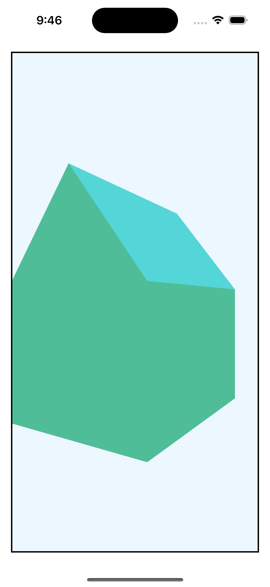

# [Metal by Tutorials] Chapter 8 - obj 랜더링

[Metal by Tutorials](https://www.kodeco.com/books/metal-by-tutorials/v2.0)의 Chapter 8을 보면 Blender로 만들어진 `.obj` 파일을 Metal로 랜더링하는 방법이 나온다.

해당 `.obj` 파일을 보면 아래와 같고

```
# Blender v2.79 (sub 0) OBJ File: 'lowpoly-house.blend'
# www.blender.org
mtllib lowpoly-house.mtl
o Cube
v -1.000000 0.003767 1.316114
v -1.000000 1.698017 1.316114
v -1.000000 0.003767 -1.326478
v -1.000000 1.698017 -1.326478
v 1.000000 0.003767 1.316114
v 1.000000 1.698017 1.316114
v 1.000000 0.003767 -1.326478
v 1.000000 1.698017 -1.326478
v 0.000000 0.003767 -1.326478
v 0.000000 3.009113 -1.326478
v 0.000000 0.003767 1.316114
v 0.000000 3.009113 1.316114
vt 0.219114 0.652658
vt 0.023366 0.652658
vt 0.023366 0.347341
vt 0.219114 0.347341
vt 0.334651 0.347341
vt 0.334651 0.000113
vt 0.450188 0.151593
vt 0.450188 0.347341
vt 0.645937 0.347341
vt 0.645937 0.652658
vt 0.450188 0.652658
vt 0.334651 0.652658
vt 0.334651 0.999887
vt 0.219114 0.848407
vt 0.984034 0.792101
vt 0.984034 0.982614
vt 0.678717 0.982614
vt 0.678717 0.792102
vt 0.984034 0.601589
vt 0.678717 0.601589
vt 0.450188 0.848407
vt 0.219115 0.151593
vn -1.0000 0.0000 0.0000
vn 0.0000 0.0000 -1.0000
vn 1.0000 0.0000 0.0000
vn 0.0000 0.0000 1.0000
vn 0.0000 -1.0000 0.0000
vn -0.7951 0.6065 0.0000
vn 0.7951 0.6065 0.0000
usemtl Material
s off
f 1/1/1 2/2/1 4/3/1 3/4/1
f 9/5/2 10/6/2 8/7/2 7/8/2
f 7/8/3 8/9/3 6/10/3 5/11/3
f 11/12/4 12/13/4 2/14/4 1/1/4
f 9/5/5 7/8/5 5/11/5 11/12/5
f 10/15/6 4/16/6 2/17/6 12/18/6
f 8/19/7 10/15/7 12/18/7 6/20/7
f 3/4/5 9/5/5 11/12/5 1/1/5
f 5/11/4 6/21/4 12/13/4 11/12/4
f 3/4/2 4/22/2 10/6/2 9/5/2
```

starter 프로젝트로 아래처럼 랜더링 된다.



Chapter 8에서 배우는 내용과 무관하지만 starter 프로젝트 코드를 보고 대체 무슨 소리인가 한참 고민했기에 -_-; 원리에 대해서 정리합니다.

## obj 파일에 대해

obj 파일은 아래와 같은 요소가 있다.

- `v` : 3차원계의 좌표를 정의한다.

- `vt` : UV를 정의한다.

- `vn` : 법선벡터를 정의한다. 평면의 방정식의 그 법선벡터

- `f` : 위 세 가지 요소를 하나의 면으로 정의

https://www.cs.cmu.edu/~mbz/personal/graphics/obj.html

## `-[MTKMesh vertexBuffers]`

Mesh를 불러오면 [`-[MTKMesh vertexBuffers]`](https://developer.apple.com/documentation/metalkit/mtkmesh/1536021-vertexbuffers?language=objc)에 buffer들이 불러와질 것이다.

위 obj 파일을 불러오면 2개의 buffer가 불러와진다.

- 첫번째 : v + vn이 합쳐짐

- 두번째 : vt만

즉 아래처럼 두개의 layout을 구성할 수 있다. 첫번째 layout에는 v와 vt가 합쳐져 있다.

```swift
extension MDLVertexDescriptor {
  static var defaultLayout: MDLVertexDescriptor {
    let vertexDescriptor = MDLVertexDescriptor()
    var offset = 0
    vertexDescriptor.attributes[Position.index] = MDLVertexAttribute(
      name: MDLVertexAttributePosition,
      format: .float3,
      offset: 0,
      bufferIndex: VertexBuffer.index)
    offset += MemoryLayout<float3>.stride
    vertexDescriptor.attributes[Normal.index] = MDLVertexAttribute(
      name: MDLVertexAttributeNormal,
      format: .float3,
      offset: offset,
      bufferIndex: VertexBuffer.index)
    offset += MemoryLayout<float3>.stride
    
    // VertexBuffer.index = 0
    vertexDescriptor.layouts[VertexBuffer.index]
      = MDLVertexBufferLayout(stride: offset)

    vertexDescriptor.attributes[UV.index] = MDLVertexAttribute(
      name: MDLVertexAttributeTextureCoordinate,
      format: .float2,
      offset: 0,
      bufferIndex: UVBuffer.index)
      
    // UVBuffer.index = 0
    vertexDescriptor.layouts[UVBuffer.index]
      = MDLVertexBufferLayout(stride: MemoryLayout<float2>.stride)
    return vertexDescriptor
  }
}
```

## 랜더링

이제 랜더링을 할 때 첫번째, 두번째를 순차적으로 설정해주면

```swift
    for mesh in meshes {
      // 총 2개임
      for (index, vertexBuffer) in mesh.vertexBuffers.enumerated() {
        encoder.setVertexBuffer(
          vertexBuffer,
          offset: 0,
          index: index)
      }

      for submesh in mesh.submeshes {

        // set the fragment texture here

        encoder.drawIndexedPrimitives(
          type: .triangle,
          indexCount: submesh.indexCount,
          indexType: submesh.indexType,
          indexBuffer: submesh.indexBuffer,
          indexBufferOffset: submesh.indexBufferOffset
        )
      }
    }
```

shader의 `[[stage_in]]`에는 아래처럼 데이터 구조가 형성된다. position이 왜 float4로 변환되었는진 모르겠다...

```cpp
struct VertexIn {
  float4 position [[attribute(Position)]];
  float3 normal [[attribute(Normal)]];
  float2 uv [[attribute(UV)]];
};
```

## 총평

[Metal Shading Language Specification](https://developer.apple.com/metal/Metal-Shading-Language-Specification.pdf)을 찾아봐도 없어서 그냥 내가 만들어낸 가설이긴 한데 이게 맞는건지 모르겠다 😭
