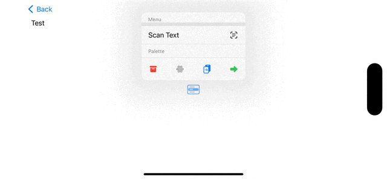
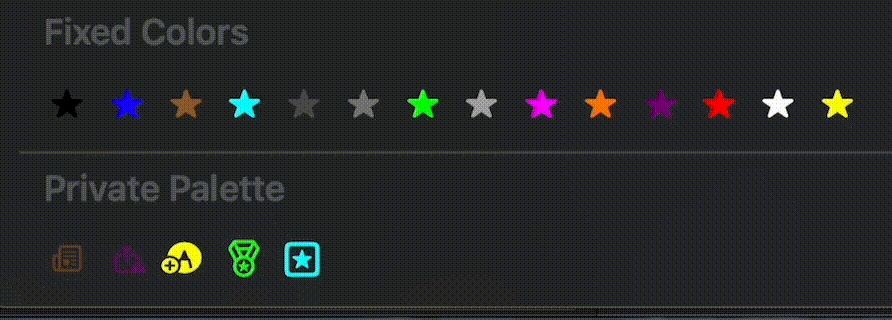

# [iOS 17, macOS 14] Symbols + Private API

[Symbols](https://developer.apple.com/documentation/symbols) Framework를 UIKit/AppKit의 Private API로 용도를 확장하는 방법을 소개합니다.

## Symbols 소개

- SF Symbols에 Effect, Transition 적용 가능함

- RenderBox라는 Private Framework로 작동

- Metal 기반

- Objective-C++로 작성

## UIKit

### UIButtonConfiguration에 적용하기


Objective-C를 사용합니다.

[SymbolButtonConfiguration](https://github.com/pookjw/SymbolButtonConfiguration)

### UIMenu + UIAction에 적용하기



Objective-C++를 사용합니다.

```objc
#import <UIKit/UIKit.h>
#import <objc/message.h>
#import <objc/runtime.h>
#import <vector>
#import <string>
#import <algorithm>
#import <ranges>

#pragma mark - Swizzling _UIContextMenuListView

/*
UIMenu는 내부적으로 UICollectionView를 사용한다. Cell에 UIAction의 속성에 맞게 업데이트 된 이후에 UIImageView에 Symbol Effect를 추가한다.
Symbol Effect는 UIAction에 할당된 Association Object에서 가져온다.
*/

namespace _UIContextMenuListView {
    namespace _configureCell_forElement_section_size {
        std::uint8_t *associationKey = nullptr;
        
        void (*original)(id, SEL, __kindof UICollectionViewCell *, __kindof UIMenuElement *, id, NSUInteger);
        void custom(id self, SEL _cmd, __kindof UICollectionViewCell *cell, __kindof UIMenuElement *element, id section, NSUInteger size) {
            original(self, _cmd, cell, element, section, size);
            
            auto symbolEffect = static_cast<__kindof NSSymbolEffect * _Nullable>(objc_getAssociatedObject(element, associationKey));
            if (!symbolEffect) return;
            
            // _UIContextMenuCellContentView
            __kindof UIView *contentView = cell.contentView;
            
            auto imageViews = std::vector<std::string> {
                "decorationImageView",
                "iconImageView",
                "emphasizediconImageView"
            } |
            std::views::transform([contentView](const std::string name) {
                return reinterpret_cast<id (*)(id, SEL)>(objc_msgSend)(contentView, sel_registerName(name.data()));
            });
            
            std::for_each(imageViews.begin(), imageViews.end(), [symbolEffect](UIImageView * _Nullable imageView) {
                if (!imageView) return;
                
                NSAutoreleasePool *pool = [NSAutoreleasePool new];
                
                [imageView addSymbolEffect:symbolEffect
                                   options:[NSSymbolEffectOptions optionsWithRepeating]
                                  animated:YES];
                
                [pool release];
            });
        }
    }
}

@implementation AppDelegate

+ (void)load {
    Method method_2 = class_getInstanceMethod(UIAction.class, @selector(copyWithZone:));
    _UIAction::copyWithZone::original = reinterpret_cast<id (*)(id, SEL, struct _NSZone *)>(method_getImplementation(method_2));
    method_setImplementation(method_2, reinterpret_cast<IMP>(_UIAction::copyWithZone::custom));
    
    //
 
    Method method_3 = class_getInstanceMethod(UIAction.class, NSSelectorFromString(@"_immutableCopy"));
    _UIAction::_immutableCopy::original = reinterpret_cast<id (*)(id, SEL)>(method_getImplementation(method_3));
    method_setImplementation(method_3, reinterpret_cast<IMP>(_UIAction::_immutableCopy::custom));
}

@end


#pragma mark - Swizzling UIAction

/*
UIAction이 복사될 때 Association Object도 복사되도록 한다.
*/

namespace _UIAction {
    namespace copyWithZone {
        id (*original)(id, SEL, struct _NSZone *);
        id custom(id self, SEL _cmd, struct _NSZone *zone) {
            id copy = original(self, _cmd, zone);
            
            id object = objc_getAssociatedObject(self, _UIContextMenuListView::_configureCell_forElement_section_size::associationKey);
            objc_setAssociatedObject(copy,
                                     _UIContextMenuListView::_configureCell_forElement_section_size::associationKey,
                                     object,
                                     OBJC_ASSOCIATION_COPY);
            
            return copy;
        }
    }
    
    namespace _immutableCopy {
        id (*original)(id, SEL);
        id custom(id self, SEL _cmd) {
            id copy = original(self, _cmd);
            
            id object = objc_getAssociatedObject(self, _UIContextMenuListView::_configureCell_forElement_section_size::associationKey);
            objc_setAssociatedObject(copy,
                                     _UIContextMenuListView::_configureCell_forElement_section_size::associationKey,
                                     object,
                                     OBJC_ASSOCIATION_COPY);
            
            return copy;
        }
    }
}

@implementation AppDelegate

+ (void)load {
    _UIContextMenuListView::_configureCell_forElement_section_size::associationKey = new std::uint8_t;
    
    Method method_1 = class_getInstanceMethod(NSClassFromString(@"_UIContextMenuListView"), NSSelectorFromString(@"_configureCell:forElement:section:size:"));
    _UIContextMenuListView::_configureCell_forElement_section_size::original = reinterpret_cast<void (*)(id, SEL, __kindof UICollectionViewCell *, __kindof UIMenuElement *, id, NSUInteger)>(method_getImplementation(method_1));
    method_setImplementation(method_1, reinterpret_cast<IMP>(_UIContextMenuListView::_configureCell_forElement_section_size::custom));
}

@end


#pragme mark - UIMenu 설정

UIAction *action = /* */;

objc_setAssociatedObject(action,
                         _UIContextMenuListView::_configureCell_forElement_section_size::associationKey,
                         [[NSSymbolBounceEffect bounceUpEffect] effectWithByLayer],
                         OBJC_ASSOCIATION_COPY);
                         
UIMenu *menu = [UIMenu menuWithChildren:@[action]];
```

## AppKit


Objective-C++를 사용합니다.

### NSButton에 적용하기

Symbol Effect만 지원합니다. Transition은 지원하지 않습니다.

```objc
#import <objc/message.h>

NSButton *button = /* Symbol Effect를 넣을 NSButton */;
button.image = /* Symbol Effect를 지원하는 NSImage */;

NSSymbolEffect *symbolEffect = /* 적용할 Symbol Effect */;
NSSymbolEffectOptions *options = /* Symbol Effect의 Options */;

auto cell = static_cast<NSButtonCell *>(button.cell);

// NSButtonImageView (<- _NSStoredImageSimpleImageView <- _NSSimpleImageView)
auto buttonImageView = reinterpret_cast<__kindof NSView * (*)(NSButtonCell *, SEL)>(objc_msgSend)(cell, NSSelectorFromString(@"_buttonImageView"));

// -[_NSSimpleImageView addSymbolEffect:options:animated:] 호출
reinterpret_cast<void (*)(__kindof NSView *, SEL, NSSymbolEffect *, NSSymbolEffectOptions *, BOOL)>(objc_msgSend)(buttonImageView, @selector(addSymbolEffect:options:animated:), symbolEffect, options, YES);
```

### NSToolbar에 적용하기

마찬가지로 Symbol Effect만 지원하며 Transition은 지원하지 않습니다.

```objc
#import <objc/message.h>

NSToolbarItem *toolbarItem = /* Symbol Effect를 넣을 NSToolbarItem */;

toolbarItem.image = /* Symbol Effect를 지원하는 NSImage */;

NSSymbolEffect *symbolEffect = /* 적용할 Symbol Effect */;
NSSymbolEffectOptions *options = /* Symbol Effect의 Options */;

// NSToolbarButton (<- NSButton)
auto _view = reinterpret_cast<NSButton * (*)(id, SEL)>(objc_msgSend)(toolbarItem, NSSelectorFromString(@"_view"));

// _NSToolbarButtonCell (<- NSButtonCell)
auto cell = static_cast<__kindof NSButtonCell *>(_view.cell);

// _NSToolbarButtonCell는 NSImageView를 필요할 때만 lazy하게 불러옵니다. effect를 적용하기 위해서는 당장 필요하니 불러옵니다.
// frame이 zero일 경우 내부적으로 NSIsEmptyRect로 인해 NSImageView가 안 불러오는 로직이기에, zero가 아닌 값을 주입합니다.
reinterpret_cast<void (*)(id, SEL, struct CGRect, id)>(objc_msgSend)(cell, NSSelectorFromString(@"_updateImageViewWithFrame:inView:"), CGRectMake(0.f, 0.f, 1.f, 1.f), _view);

// NSButtonImageView (<- _NSStoredImageSimpleImageView <- _NSSimpleImageView)
auto buttonImageView = reinterpret_cast<__kindof NSView * (*)(NSButtonCell *, SEL)>(objc_msgSend)(cell, NSSelectorFromString(@"_buttonImageView"));

// -[_NSSimpleImageView addSymbolEffect:options:animated:] 호출
reinterpret_cast<void (*)(__kindof NSView *, SEL, NSSymbolEffect *, NSSymbolEffectOptions *, BOOL)>(objc_msgSend)(buttonImageView, @selector(addSymbolEffect:options:animated:), symbolEffect, options, YES);
```

### NSMenuItem에 적용하기

Symbol Effect와 Transition 모두 지원합니다.

```objc
#import <objc/message.h>
#import <objc/runtime.h>

namespace NSMenuItemView {
    namespace _applyImage_withImageSize {
        static void (*original)(id, SEL, NSImage *, struct CGSize);
        
        static void custom(id self, SEL _cmd, NSImage *image, struct CGSize imageSize) {
            original(self, _cmd, image, imageSize);
            
            NSImageView * _Nullable imageView = nullptr;
            object_getInstanceVariable(self, "_imageView", reinterpret_cast<void **>(&imageView));
            
            if (imageView) {
                NSSymbolEffect *symbolEffect = /* 적용할 Symbol Effect */;
                NSSymbolEffectOptions *options = /* Symbol Effect의 Options */;
                
                [imageView addSymbolEffect:symbolEffect options:options animated:YES];
            }
        }
    }
}

@implementation AppDelegate

+ (void)load {
    Method method = class_getInstanceMethod(NSClassFromString(@"NSMenuItemView"), NSSelectorFromString(@"_applyImage:withImageSize:"));
    NSMenuItemView::_applyImage_withImageSize::original = reinterpret_cast<void (*)(id, SEL, NSImage *, struct CGSize)>(method_getImplementation(method));
    method_setImplementation(method, reinterpret_cast<IMP>(NSMenuItemView::_applyImage_withImageSize::custom));
}

@end
```

### NSPaletteMenuItemView에 적용하기



Symbol Effect와 Transition 모두 지원합니다.

```objc
#pragma mark - Swizzling NSPaletteMenuItemView

/*
NSMenu는 내부적으로 NSTableView를 사용한다. View가 layout 될 때마다 NSImageView에 Symbol Effect를 추가한다.
Symbol Effect는 NSPaletteMenuItem에 할당된 Association Object에서 가져온다.
*/
namespace NSPaletteMenuItemView {
    namespace layout {
        static std::uint8_t *associationKey;
        static void (*original)(id, SEL);
        static void custom(id self, SEL _cmd) {
            original(self, _cmd);
            
            // NSPaletteMenuItem
            auto menuItem = reinterpret_cast<__kindof NSMenuItem * _Nullable (*)(id, SEL)>(objc_msgSend)(self, @selector(menuItem));
            NSSymbolEffect *effect = objc_getAssociatedObject(menuItem, associationKey);
            
            if (effect) {
                [static_cast<__kindof NSView *>(self).subviews enumerateObjectsUsingBlock:^(__kindof NSView * _Nonnull obj, NSUInteger idx, BOOL * _Nonnull stop) {
                    if ([obj isKindOfClass:NSImageView.class]) {
                        auto imageView = static_cast<NSImageView *>(obj);
                        [imageView addSymbolEffect:effect options:[NSSymbolEffectOptions optionsWithRepeating] animated:YES];
                    }
                }];
            }
        }
    }
}

@implementation AppDelegate

+ (void)load {
    Method method_2 = class_getInstanceMethod(NSClassFromString(@"NSPaletteMenuItemView"), @selector(layout));
    NSPaletteMenuItemView::layout::original = reinterpret_cast<void (*)(id, SEL)>(method_getImplementation(method_2));
    method_setImplementation(method_2, reinterpret_cast<IMP>(NSPaletteMenuItemView::layout::custom));
}

@end

#pragma mark - NSMenu 설정

NSMenu *privatePaletteMenu = [NSMenu paletteMenuWithColors:@[]
                                                    titles:@[]
                                          selectionHandler:^(NSMenu * _Nonnull) {
    
}];

// NSPaletteMenuItem 생성
auto item = reinterpret_cast<__kindof NSMenuItem * (*)(id, SEL, id, id, id)>(objc_msgSend)([NSClassFromString(@"NSPaletteMenuItem") alloc], NSSelectorFromString(@"initWithColor:image:title:"), NSColor.redColor, [NSImage imageWithSystemSymbolName:@"star.square" accessibilityDescription:nil], nil);

// Effect 설정
objc_setAssociatedObject(item, NSPaletteMenuItemView::layout::associationKey, [[NSSymbolScaleEffect scaleUpEffect] effectWithWholeSymbol], OBJC_ASSOCIATION_COPY);
```
