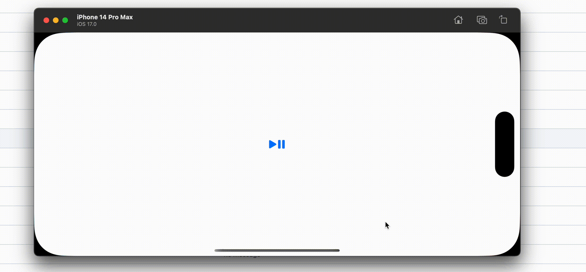
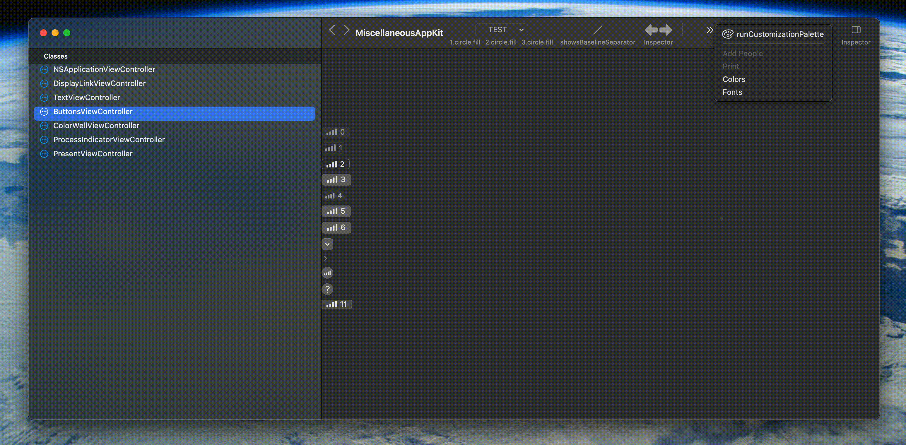

# [iOS 17, macOS 14] Symbols + Private API

[Symbols](https://developer.apple.com/documentation/symbols) Framework를 UIKit/AppKit의 Private API로 용도를 확장하는 방법을 소개합니다.

## UIKit

### UIButtonConfiguration에 적용하기



Objective-C를 사용합니다.

[SymbolButtonConfiguration](https://github.com/pookjw/SymbolButtonConfiguration)

## AppKit



Objective-C++를 사용합니다.

### NSButton에 적용하기

Symbol Effect만 지원합니다. Transition은 지원하지 않습니다.

```objc
#import <objc/message.h>

NSButton *button = /* Symbol Effect를 넣을 NSButton */;
button.image = /* Symbol Effect를 지원하는 NSImage */;

NSSymbolEffect *symbolEffect = /* 적용할 Symbol Effect */;
NSSymbolEffectOptions *options = /* Symbol Effect의 Options */;

auto cell = static_cast<NSButtonCell *>(button.cell);

// NSButtonImageView (<- _NSStoredImageSimpleImageView <- _NSSimpleImageView)
auto buttonImageView = reinterpret_cast<__kindof NSView * (*)(NSButtonCell *, SEL)>(objc_msgSend)(cell, NSSelectorFromString(@"_buttonImageView"));

// -[_NSSimpleImageView addSymbolEffect:options:animated:] 호출
reinterpret_cast<void (*)(__kindof NSView *, SEL, NSSymbolEffect *, NSSymbolEffectOptions *, BOOL)>(objc_msgSend)(buttonImageView, @selector(addSymbolEffect:options:animated:), symbolEffect, options, YES);
```

### NSToolbar에 적용하기

마찬가지로 Symbol Effect만 지원하며 Transition은 지원하지 않습니다.

```objc
NSToolbarItem *toolbarItem = /* Symbol Effect를 넣을 NSToolbarItem */;

toolbarItem.image = /* Symbol Effect를 지원하는 NSImage */;

NSSymbolEffect *symbolEffect = /* 적용할 Symbol Effect */;
NSSymbolEffectOptions *options = /* Symbol Effect의 Options */;

// NSToolbarButton (<- NSButton)
auto _view = reinterpret_cast<NSButton * (*)(id, SEL)>(objc_msgSend)(toolbarItem, NSSelectorFromString(@"_view"));

// _NSToolbarButtonCell (<- NSButtonCell)
auto cell = static_cast<__kindof NSButtonCell *>(_view.cell);

// _NSToolbarButtonCell는 NSImageView를 필요할 때만 lazy하게 불러옵니다. effect를 적용하기 위해 당장 불러옵니다.
// frame이 zero일 경우 내부적으로 NSIsEmptyRect로 인해 NSImageView가 안 불러오는 로직이기에, zero가 아닌 값을 주입합니다.
reinterpret_cast<void (*)(id, SEL, struct CGRect, id)>(objc_msgSend)(cell, NSSelectorFromString(@"_updateImageViewWithFrame:inView:"), CGRectMake(0.f, 0.f, 1.f, 1.f), _view);

// NSButtonImageView (<- _NSStoredImageSimpleImageView <- _NSSimpleImageView)
auto buttonImageView = reinterpret_cast<__kindof NSView * (*)(NSButtonCell *, SEL)>(objc_msgSend)(cell, NSSelectorFromString(@"_buttonImageView"));

// -[_NSSimpleImageView addSymbolEffect:options:animated:] 호출
reinterpret_cast<void (*)(__kindof NSView *, SEL, NSSymbolEffect *, NSSymbolEffectOptions *, BOOL)>(objc_msgSend)(buttonImageView, @selector(addSymbolEffect:options:animated:), symbolEffect, options, YES);
```

### NSMenuItem에 적용하기

Symbol Effect와 Transition 모두 지원합니다.

```objc
namespace NSMenuItemView {
    namespace _applyImage_withImageSize {
        static void (*original)(id, SEL, NSImage *, struct CGSize);
        
        static void custom(id self, SEL _cmd, NSImage *image, struct CGSize imageSize) {
            original(self, _cmd, image, imageSize);
            
            NSImageView * _Nullable imageView = nullptr;
            object_getInstanceVariable(self, "_imageView", reinterpret_cast<void **>(&imageView));
            
            if (imageView) {
                [imageView addSymbolEffect:[[NSSymbolBounceEffect bounceUpEffect] effectWithByLayer] options:[NSSymbolEffectOptions optionsWithRepeating] animated:YES];
            }
        }
    }
}

@implementation AppDelegate

+ (void)load {
    Method method = class_getInstanceMethod(NSClassFromString(@"NSMenuItemView"), NSSelectorFromString(@"_applyImage:withImageSize:"));
    NSMenuItemView::_applyImage_withImageSize::original = reinterpret_cast<void (*)(id, SEL, NSImage *, struct CGSize)>(method_getImplementation(method));
    method_setImplementation(method, reinterpret_cast<IMP>(NSMenuItemView::_applyImage_withImageSize::custom));
}

@end
```
