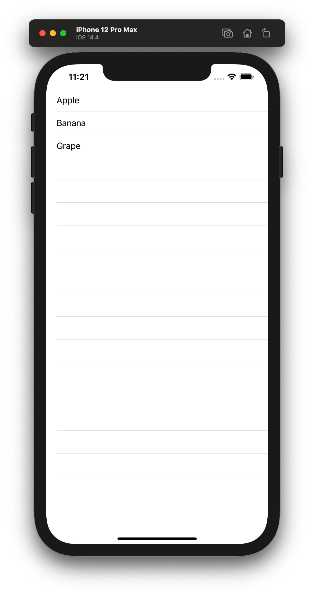
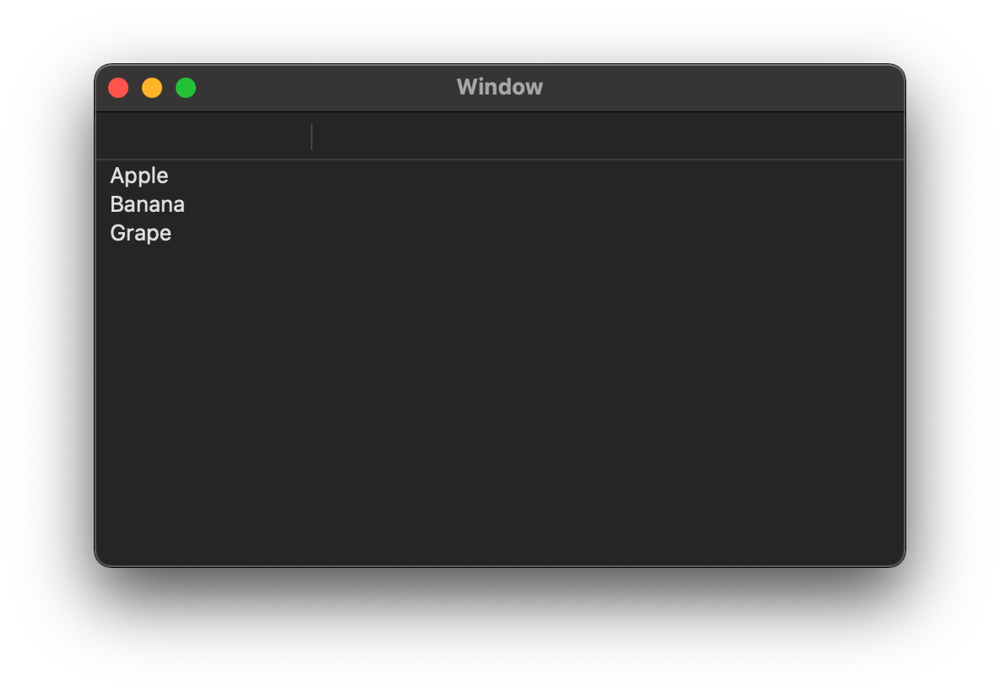

# NSDiffableDataSourceSnapshot, 그리고 Cocoa

macOS 11.0 이후로 Cocoa에 [NSTableViewDiffableDataSource](https://developer.apple.com/documentation/appkit/nstableviewdiffabledatasource), [NSCollectionViewDiffableDataSource](https://developer.apple.com/documentation/appkit/nscollectionviewdiffabledatasource?language=objc), 그리고 [NSDiffableDataSourceSnapshot](https://developer.apple.com/documentation/uikit/nsdiffabledatasourcesnapshot)가 추가되었습니다. 마찬가지로 UIKit에도 [UITableViewDiffableDataSource](https://developer.apple.com/documentation/uikit/uitableviewdiffabledatasource)와 [UICollectionViewDiffableDataSource](https://developer.apple.com/documentation/uikit/uicollectionviewdiffabledatasource)도 추가되었죠.

raywenderlich에서 이 사용법과 [UICollectionLayoutListConfiguration](https://developer.apple.com/documentation/uikit/uicollectionlayoutlistconfiguration)까지 한꺼번에 학습할 수 있는 매우 좋은 자료가 있습니다. [iOS 14 Tutorial: UICollectionView List (www.raywenderlich.com/)](https://www.raywenderlich.com/16906182-ios-14-tutorial-uicollectionview-list)

하지만 위 가이드는 iOS용입니다. 근데 macOS의 Cocoa도 대충 비슷하게 작동하지 않겠어??? 라는 생각으로 한 번 아래와 같이 짜봅시다.

```swift
import Cocoa

class ViewController: NSViewController {
    @IBOutlet weak var tableView: NSTableView!
    var viewModel: ViewModel = .init()
    
    override func viewDidLoad() {
        super.viewDidLoad()
        configureDataSource()
    }
    
    func configureDataSource() {
        viewModel.dataSource = makeDataSource()
        viewModel.updateData()
    }
    
    func makeDataSource() -> ViewModel.DataSource {
        return .init(tableView: tableView) { (tableView, column, row, item) -> NSView in
            let cell: NSTableCellView = tableView.makeView(withIdentifier: column.identifier, owner: self)! as! NSTableCellView
            cell.textField?.stringValue = item
            return cell
        }
    }
}

class ViewModel {
    typealias DataSource = NSTableViewDiffableDataSource<Int, String>
    typealias Snapshot = NSDiffableDataSourceSnapshot<Int, String>
    
    var dataSource: DataSource!
    
    func updateData() {
        var snapshot: Snapshot = dataSource.snapshot()
        
        snapshot.deleteAllItems()
        let section: Int = 0
        snapshot.appendSections([section])
        snapshot.appendItems(["Apple", "Banana", "Grape"], toSection: section)
        dataSource.apply(snapshot, animatingDifferences: true)
    }
}

```

실행해보면... 아래와 같이 런타임 에러가 발생하네요.

```
2021-04-03 00:02:52.891409+0900 DataSource[4935:102348] *** Assertion failure in -[NSTableViewDiffableDataSourceImpl _applyDifferencesFromSnapshot:completion:], _NSDiffableDataSourceImpl.m:919
2021-04-03 00:02:52.892007+0900 DataSource[4935:102348] Failed to set (contentViewController) user defined inspected property on (NSWindow): Invalid parameter not satisfying: snapshot
```

음... 검색해도 안 나오네요. 한 번 똑같은 로직을 iOS에도 적용해 볼게요.

```swift
import UIKit

class ViewController: UIViewController {
    @IBOutlet weak var tableView: UITableView!
    var viewModel: ViewModel = .init()
    
    override func viewDidLoad() {
        super.viewDidLoad()
        configureDataSource()
    }

    func configureDataSource() {
        viewModel.dataSource = makeDataSource()
        viewModel.updateData()
    }
    
    func makeDataSource() -> ViewModel.DataSource {
        return .init(tableView: tableView) { (tableView, indexPath, item) -> UITableViewCell? in
            let cell: UITableViewCell = .init()
            cell.textLabel?.text = item
            return cell
        }
    }
}

class ViewModel {
    typealias DataSource = UITableViewDiffableDataSource<Int, String>
    typealias Snapshot = NSDiffableDataSourceSnapshot<Int, String>
    
    var dataSource: DataSource!
    
    func updateData() {
        var snapshot: Snapshot = dataSource.snapshot()
        
        snapshot.deleteAllItems()
        let section: Int = 0
        snapshot.appendSections([section])
        snapshot.appendItems(["Apple", "Banana", "Grape"], toSection: section)
        dataSource.apply(snapshot, animatingDifferences: true)
    }
}
```



잘 나오네요. -_-; 로직에는 문제가 없다는 소리인데요. 여기서 한 번 고민을 해봅시다. 일단 lldb에서 `NSTableViewDiffableDataSourceImpl`가 뭐하는 놈인지 부터 알아봅시다.

```
(lldb) image lookup -rn NSTableViewDiffableDataSourceImpl
14 matches found in /System/Library/Frameworks/AppKit.framework/Versions/C/AppKit:
        Address: AppKit[0x00000001832b34c0] (AppKit.__TEXT.__text + 7499876)
        Summary: AppKit`-[NSTableViewDiffableDataSourceImpl initWithTableView:]        Address: AppKit[0x00000001832b356c] (AppKit.__TEXT.__text + 7500048)
        Summary: AppKit`-[NSTableViewDiffableDataSourceImpl dealloc]        Address: AppKit[0x00000001832b35d0] (AppKit.__TEXT.__text + 7500148)
        Summary: AppKit`-[NSTableViewDiffableDataSourceImpl hasSectionHeaderProvider]        Address: AppKit[0x00000001832b35e8] (AppKit.__TEXT.__text + 7500172)
        Summary: AppKit`-[NSTableViewDiffableDataSourceImpl setAppliedSnapshot:]        Address: AppKit[0x00000001832b3630] (AppKit.__TEXT.__text + 7500244)
        Summary: AppKit`-[NSTableViewDiffableDataSourceImpl tableViewSnapshot]        Address: AppKit[0x00000001832b3640] (AppKit.__TEXT.__text + 7500260)
        Summary: AppKit`-[NSTableViewDiffableDataSourceImpl setTableViewSnapshot:]        Address: AppKit[0x00000001832b3688] (AppKit.__TEXT.__text + 7500332)
        Summary: AppKit`-[NSTableViewDiffableDataSourceImpl numberOfItemsInSnapshot]        Address: AppKit[0x00000001832b36a0] (AppKit.__TEXT.__text + 7500356)
        Summary: AppKit`-[NSTableViewDiffableDataSourceImpl applyDifferencesFromSnapshot:animatingDifferences:completion:]        Address: AppKit[0x00000001832b3758] (AppKit.__TEXT.__text + 7500540)
        Summary: AppKit`-[NSTableViewDiffableDataSourceImpl dataSource]        Address: AppKit[0x00000001832b3768] (AppKit.__TEXT.__text + 7500556)
        Summary: AppKit`-[NSTableViewDiffableDataSourceImpl setDataSource:]        Address: AppKit[0x00000001832b3778] (AppKit.__TEXT.__text + 7500572)
        Summary: AppKit`-[NSTableViewDiffableDataSourceImpl(NSTableViewConversions) itemIdentifierForRow:]        Address: AppKit[0x00000001832b388c] (AppKit.__TEXT.__text + 7500848)
        Summary: AppKit`-[NSTableViewDiffableDataSourceImpl(NSTableViewConversions) rowForItemIdentifier:]        Address: AppKit[0x00000001832b397c] (AppKit.__TEXT.__text + 7501088)
        Summary: AppKit`-[NSTableViewDiffableDataSourceImpl(NSTableViewConversions) sectionIdentifierForRow:]        Address: AppKit[0x00000001832b3a90] (AppKit.__TEXT.__text + 7501364)
        Summary: AppKit`-[NSTableViewDiffableDataSourceImpl(NSTableViewConversions) rowForSectionIdentifier:]
```

보니까 `-[NSTableViewDiffableDataSourceImpl applyDifferencesFromSnapshot:animatingDifferences:completion:]`에서 문제가 생긴 것 같은데요. 여기서 Symbolic Breakpoint를 걸어주고 register를 읽어오면 (arm64 assembly)

```
(lldb) register read
General Purpose Registers:
        x0 = 0x000060000365f000
        x1 = 0x00000001dab3ae0d  
        x2 = 0x0000000000000000
        x3 = 0x0000000000000001
        x4 = 0x0000000000000000
        x5 = 0x00000001a8f79fc8  libswiftAppKit.dylib`AppKit.NSTableViewDiffableDataSource.apply(_: AppKit.NSDiffableDataSourceSnapshot<A, B>, animatingDifferences: Swift.Bool, completion: Swift.Optional<() -> ()>) -> ()
        x6 = 0x00000001ed8577f0  libswiftCore.dylib`protocol witness table for Swift.String : Swift.Hashable in Swift
        x7 = 0x888a0001ed8456b8
        x8 = 0x00000001dab3a000  
        x9 = 0xac26fe4110f7002e
       x10 = 0x0000600000d1d6c0
       x11 = 0x0000000037b33f3d
       x12 = 0x0000000000000000
       x13 = 0x0000000000000000
       x14 = 0x0000000000000000
       x15 = 0xffffffffffffffff
       x16 = 0x00000001ed009132  (void *)0x8ee800000001ed00
       x17 = 0x000000018553f6a0  AppKit`-[NSTableViewDiffableDataSourceImpl applyDifferencesFromSnapshot:animatingDifferences:completion:]
       x18 = 0x0000000000000000
       x19 = 0x0000000000000001
       x20 = 0x000060000365f000
       x21 = 0x0000000000000000
       x22 = 0x0000000000000000
       x23 = 0x00000001daa47335  
       x24 = 0x0000600002a794d0
       x25 = 0x0000000000000000
       x26 = 0x000060000365f000
       x27 = 0x0000000100000004
       x28 = 0x0000000000000001
        fp = 0x000000016ddaa180
        lr = 0x00000001a8f7a0dc  libswiftAppKit.dylib`AppKit.NSTableViewDiffableDataSource.apply(_: AppKit.NSDiffableDataSourceSnapshot<A, B>, animatingDifferences: Swift.Bool, completion: Swift.Optional<() -> ()>) -> () + 276
        sp = 0x000000016ddaa100
        pc = 0x000000018553f6a0  AppKit`-[NSTableViewDiffableDataSourceImpl applyDifferencesFromSnapshot:animatingDifferences:completion:]
      cpsr = 0x60000000
```

문제가 됐던 arg가 `applyDifferencesFromSnapshot`인데요, 그럼 register 값은 `x2` 일텐데 이걸 한 번 보면

```
(lldb) po $x2
<nil>
```

저기에 nil을 집어넣는 내부적인 버그가 있네요. -_- 자, 이걸 어떻게 해결해야 하냐 

- [NSTableViewDiffableDataSource](https://developer.apple.com/documentation/appkit/nstableviewdiffabledatasource)는 NSObject가 아닌 Swift Object이며, Swift 전용입니다. 다시 말해 Swift Object -> NSObject로 Bridging되는 로직이 내부적으로 존재합니다.
- 검색해보니 Objective-C로 작동하는 [NSTableViewDiffableDataSourceReference](https://developer.apple.com/documentation/appkit/nstableviewdiffabledatasourcereference)도 존재하네요. 즉, `NSTableViewDiffableDataSource`와 `NSTableViewDiffableDataSourceReference`의 Bridging 방식은 다르다는 것을 추측할 수 있으며, `NSTableViewDiffableDataSource`의 Bridging에서 버그가 있을 것이란 가설을 세웠습니다.

그럼 한 번 `NSTableViewDiffableDataSource` 대신에 `NSTableViewDiffableDataSourceReference`로 바꾸면 문제가 해결될지 볼까요? 그 전에 일단 알고 가야 할 점이 있습니다.

- `NSTableViewDiffableDataSource`는 `SectionIdentifierType`, `ItemIdentifierType`에 `Hashable`, `Equatable`를 conform하는 모든 Type이 들어갈 수 있습니다.
- 하지만 `NSTableViewDiffableDataSourceReference`는 NSObject만 가능합니다. Item 비교를 위해 `isEqual(_:)`와 `hash`를 override해야 합니다.

자 그럼 한 번 바꿔봅시다. `<Int, String>`에서 `<NSNumber, NSString>`으로 바뀐 걸 볼 수 있습니다.

```swift
import Cocoa

class ViewController: NSViewController {
    @IBOutlet weak var tableView: NSTableView!
    var viewModel: ViewModel = .init()
    
    override func viewDidLoad() {
        super.viewDidLoad()
        configureDataSource()
    }
    
    func configureDataSource() {
        viewModel.dataSource = makeDataSource()
        viewModel.updateData()
    }
    
    func makeDataSource() -> ViewModel.DataSource {
        return .init(tableView: tableView) { (tableView, column, row, item) -> NSView in
            let cell: NSTableCellView = tableView.makeView(withIdentifier: column.identifier, owner: self)! as! NSTableCellView
            cell.textField?.stringValue = item as! String
            return cell
        }
    }
}

class ViewModel {
    typealias DataSource = NSTableViewDiffableDataSourceReference<NSNumber, NSString>
    typealias Snapshot = NSDiffableDataSourceSnapshotReference
    
    var dataSource: DataSource!
    
    func updateData() {
        let snapshot: Snapshot = dataSource.snapshot()
        
        snapshot.deleteAllItems()
        let section: Int = 0
        snapshot.appendSections(withIdentifiers: [section])
        snapshot.appendItems(withIdentifiers: ["Apple", "Banana", "Grape"], intoSectionWithIdentifier: section)
        dataSource.applySnapshot(snapshot, animatingDifferences: true)
    }
}
```



잘 되네요.😕

다만 `animatingDifferences`도 `NSTableViewDiffableDataSourceReference`에 버그가 있으므로, 잘 살펴보시는 걸 추천합니다.
