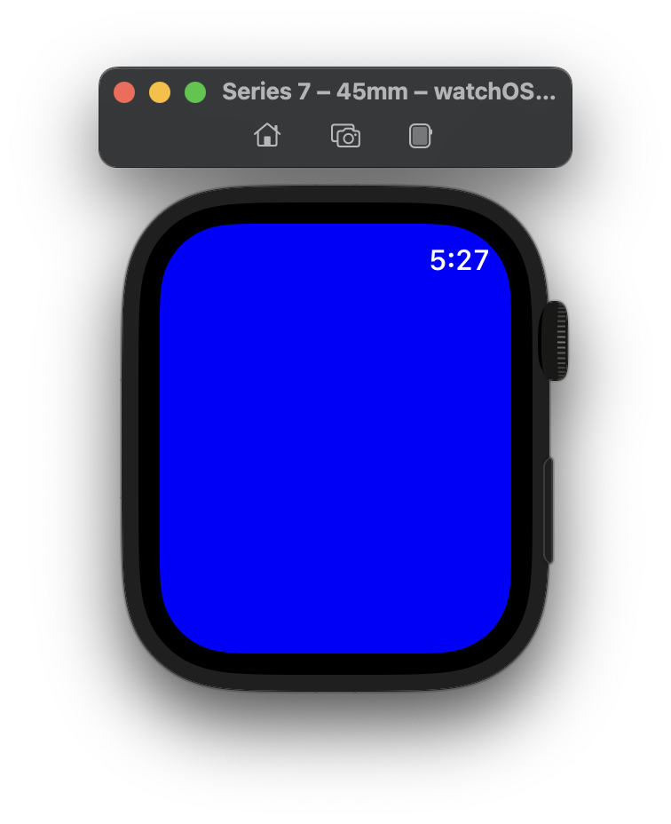

# watchOS에서 UIKit 사용

watchOS를 개발하기 위해서는 일반적으로 [WatchKit](https://developer.apple.com/documentation/watchkit)이나 [SwiftUI](https://developer.apple.com/documentation/swiftui/)를 씁니다.

하지만 [Native UIKit apps on Apple Watch](https://www.highcaffeinecontent.com/blog/20150912-Native-UIKit-apps-on-Apple-Watch)라는 watchOS에서 UIKit을 돌리는 방법이 있더군요. `injected_main`을 통해 `WKExtension`에서 내부적으로 작동하는 `main` 함수를 injection하는 방법인데요. 이렇게 하면 watchOS에서 iOS 어플을 개발하듯이 UIKit을 돌릴 수 있지만... 기존 WatchKit/ClockKit과 동시에 쓸 수 없는 문제가 발생합니다. 특히 Digital Crown의 rotation 이벤트를 받아 올 수 있는 `WKCrownSequencer`를 못 쓰게 되는게 불편하다고 느꼈어요.

이걸 해결하기 위해 `injected_main`은 쓰지 않고, WatchKit이랑 UIKit을 같이 쓰는 방법을 적으려고 합니다.

## WatchOS + UIKit

WatchKit 프로젝트를 하나 만들어서 `InterfaceController`의 `willActive` 부분을 아래와 같이 적어 봤습니다. `InterfaceController` 위에 파란색 화면을 추가하는 코드입니다.

```objc
#import <WatchKit/WatchKit.h>

@interface InterfaceController : WKInterfaceController
@end

@implementation InterfaceController

- (void)willActivate {
    [super willActivate];
    
    id window = [[[NSClassFromString(@"SPApplication") sharedApplication] delegate] window]; // watchOS에서는 UIApplication을 상속하는 SPApplication라는 것을 씁니다.
    id viewController = [NSClassFromString(@"SPViewController") new]; // 마찬가지로 UIViewController를 상속하는 SPViewController라는 것을 씁니다.
    [[viewController view] setBackgroundColor:UIColor.blueColor];

    [[window rootViewController] presentViewController:viewController animated:YES completion:^{}];

    [viewController release];
}

@end
```

실행해보면 정상적으로 파란색 화면이 뜨는 것을 볼 수 있습니다. 이런 식으로 WatchKit 앱에서 UIKit을 연계할 수 있습니다.



## WKCrownSequencer 사용하기

WatchKit에는 [WKCrownSequencer](https://developer.apple.com/documentation/watchkit/wkcrownsequencer)를 통해 Digital Crown의 rotation 이벤트를 받아 올 수 있습니다. 이걸 써보기 위해 `InterfaceController`의 코드를 아래와 같이 수정해 봤습니다.

```objc
#import <WatchKit/WatchKit.h>

@interface InterfaceController : WKInterfaceController <WKCrownDelegate>
@end

@implementation InterfaceController
- (void)willActivate {
    [super willActivate];
    
    id window = [[[NSClassFromString(@"SPApplication") sharedApplication] delegate] window];
    id viewController = [NSClassFromString(@"SPViewController") new];
    [[viewController view] setBackgroundColor:UIColor.blueColor];

    [[window rootViewController] presentViewController:viewController animated:YES completion:^{}];

    [viewController release];
    
    [self.crownSequencer focus];
    self.crownSequencer.delegate = self;
}

#pragma mark - WKCrownDelegate

- (void)crownDidRotate:(WKCrownSequencer *)crownSequencer rotationalDelta:(double)rotationalDelta {
    NSLog(@"%f", rotationalDelta);
}

@end
```

실행해서 Digital Crown을 돌려봐도 아무런 로그가 안 찍히네요. 아마 Responder가 바뀌어서 발생한 문제로 추측되는데요. View Controller 띄우는 부분을 [present:animated:completion:](https://developer.apple.com/documentation/uikit/uiviewcontroller/1621380-present)이 아닌, [addSubview:](https://developer.apple.com/documentation/uikit/uiview/1622616-addsubview)와 [addChildViewController:](https://developer.apple.com/documentation/appkit/nsviewcontroller/1434501-addchildviewcontroller)로 대체해 볼게요.

```objc
#import <WatchKit/WatchKit.h>

@interface InterfaceController : WKInterfaceController <WKCrownDelegate>
@end

@implementation InterfaceController
- (void)willActivate {
    [super willActivate];
    
    id window = [[[NSClassFromString(@"SPApplication") sharedApplication] delegate] window];
    id viewController = [NSClassFromString(@"SPViewController") new];
    [[viewController view] setBackgroundColor:UIColor.blueColor];

    // present:animated:completion: 대신
    [[[window rootViewController] view] addSubview:[viewController view]];
    [[window rootViewController] addChildViewController:viewController];

    [viewController release];
    
    [self.crownSequencer focus];
    self.crownSequencer.delegate = self;
}

#pragma mark - WKCrownDelegate

- (void)crownDidRotate:(WKCrownSequencer *)crownSequencer rotationalDelta:(double)rotationalDelta {
    NSLog(@"%f", rotationalDelta);
}

@end
```

이렇게 하니 로그가 잘 찍히네요.

```
2022-03-05 05:34:41.053310+0900 WatchKit Extension[35013:426425] 0.013750
2022-03-05 05:34:41.070209+0900 WatchKit Extension[35013:426425] 0.025000
2022-03-05 05:34:41.087137+0900 WatchKit Extension[35013:426425] 0.030000
2022-03-05 05:34:41.103803+0900 WatchKit Extension[35013:426425] 0.035000
2022-03-05 05:34:41.120474+0900 WatchKit Extension[35013:426425] 0.032500
```

## 여담

더 관심이 있으시다면 `PepperUICore`를 공부해 보시는 것을 추천합니다. 검색해도 나오는 정보가 거의 없긴 한데 이걸 공부하면 watchOS의 구조를 깊게 이해할 수 있습니다.
