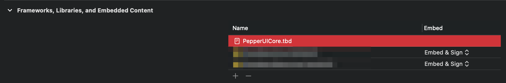
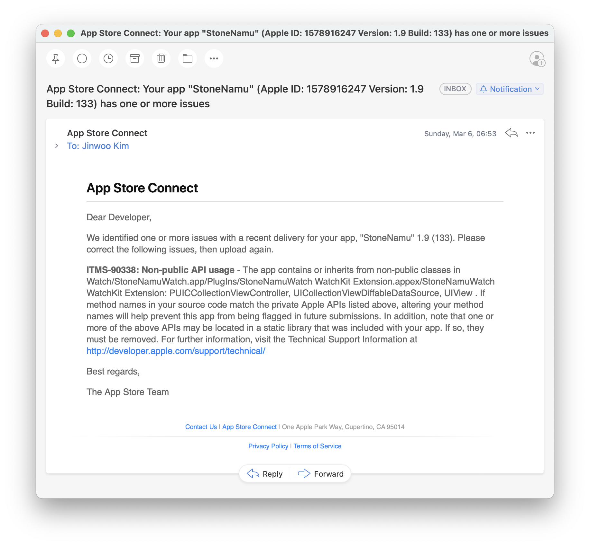

# watchOS에서 UICollectionView를 써보자 (PUICCollectionViewController)

이전 포스트 [watchOS에서 UIKit 사용](../Native_UIKit_watchOS/article.md)에 이어서... watchOS에서 `UICollectionView` (엄밀히 말하면 `PUICCollectionView`)를 써보는 방법을 소개하려고 해요.

이런 해괴한 짓을 하는 이유는 [WKInterfaceTable](https://developer.apple.com/documentation/watchkit/wkinterfacetable)로는 복잡한 레이아웃은 구현이 불가능하고 [NSDiffableDataSourceSnapshot](https://developer.apple.com/documentation/uikit/nsdiffabledatasourcesnapshot)도 쓸 수 있다는 엄청난 장점이 있어요. (사실 SwiftUI 쓰면 되긴 함...)

watchOS에는 `PepperUICore`라고 하는 Private Framework가 존재하고, 그 안에 `PUICCollectionViewController`가 있어요. 이걸 쓰기 위해 `PepperUICore.tbd`가 필요해요. 이걸 얻기 위해서는 제가 만든 [create_patched_sdk_watchos.sh](https://github.com/pookjw/sdks/blob/master/create_patched_sdk_watchos.sh)를 쓰시거나 [이 방법](https://stackoverflow.com/a/43969927/17473716)을 따라 하시면 되는데... 귀찮으면 제가 [여기](https://gist.github.com/pookjw/6fd860128d2ff3f43d539c47c4535f05)에 올려놨으니 받으셔도 돼요.

    watchOS Simalator를 쓰시는 경우, tdb 안에 있는 `install-name` 값을 RuntimeRoot애 있는 PepperUICore Mach-O 파일의 경로로 수정해 주셔야 할 수도 있어요.
    
그 다음에 아래 사진처럼 `PepperUICore.tbd`를 Xcode에서 아래처럼 등록해 주세요.



자 이제 `PUICCollectionViewController.h`를 아래처럼 만들어 주시고, `PUICCollectionViewController`를 subclassing해서 원하시는 View Controller를 만들어 보세요.

```objc
#import <Foundation/Foundation.h>

@interface PUICCollectionViewController : NSObject
@end

```

저는 `PUICCollectionViewController`를 subclassing하는 `CardBacksViewController`를 만들었는데요. 이제 이걸 `WKInterfaceController`에서 띄워볼게요.

```objc
#import <WatchKit/WatchKit.h>
#import "CardBacksViewController.h"

@interface InterfaceController : WKInterfaceController
@end

@implementation InterfaceController

- (void)willActivate {
    [super willActivate];
    
    id application = [NSClassFromString(@"SPApplication") sharedApplication];
    id delegate = [application delegate];
    id window = [delegate window];
    id rootViewController = [window rootViewController]; // PCUINavigationController
    
    CardBacksViewController *vc = [CardBacksViewController new];
    [rootViewController setViewControllers:@[vc] animated:NO];
    [vc release];
}

@end
```

이제 실행해보면...


[고화질 (YouTube)](https://youtu.be/PMwlyvA2kkA)

너무 잘 된다😭 PepperUICore에 대해 아는게 없고 검색해도 안 나오다보니 이거 성공시키려고 7시간 동안 삽질 ㅠㅠ `PUICCrownInputSequencer`도 자동으로 잘 붙어서 Digital Crown을 통한 스크롤도 잘 되는 걸 볼 수 있어요...

참고로 제 [StoneNamu 프로젝트](https://github.com/pookjw/StoneNamu/tree/develop)에서 해당 부분의 코드를 볼 수 있어요.

## 팁

`PUICCollectionView`는 `UICollectionView`에는 없는 전용 기능들이 존재하고, `UIScrollView(PUICAdditions)`라는 Category도 존재해요. `lldb`로 보시면 iOS에는 볼 수 없는 재밌는 것들이 여러가지 있어서 관심 있으시면 보시는 것도 좋아요.

## 여담

App Store에 올렸더니 Reject 당하네요... ㅎㅎ [Objective-C Runtime](https://developer.apple.com/documentation/objectivec/objective-c_runtime)로 꼼수부리면 피할 수 있을 것 같긴 하네요.


