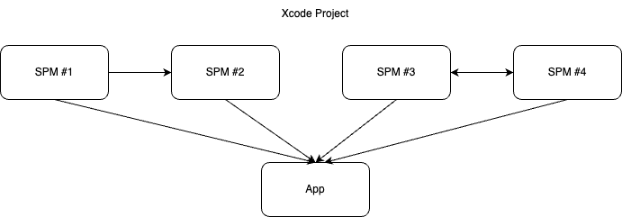
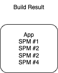
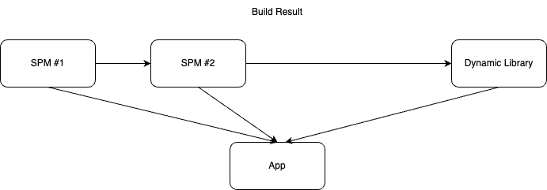
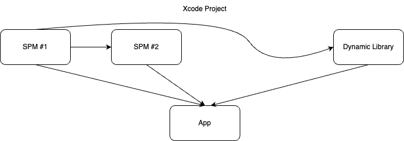
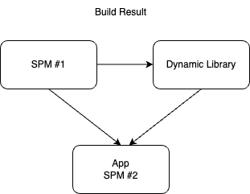

# SPM과 Dynamic Framework을 쓸 때 Framework 구조에 대해

Swift Package Manager (SPM)과 Dynamic Framework을 쓸 때 Framework 구조가 어떻게 생성되는지 적는 글

## SPM + App



만약 위 사진과 같이 Xcode Project가 구성되어 있다고 기정하자. SPM와 App만 있는 구조다.

그러면 App Binrary 안에 SPM 코드들이 다 때려 박혀서 컴파일된 것을 볼 수 있다.

아래처럼 App Bundle 내에 Frameworks 폴더가 생성되지 않을 것을 볼 수 있으며

```
MyApp.app % ls
Info.plist  MyApp    PkgInfo    _CodeSignature
```

SPM의 함수를 호출할 때 함수의 module이 App에 있는 것도 확인할 수 있다. 

```
MyApp`MyLibrary2.init():
    0x100ec1de0 <+0>:   sub    sp, sp, #0x40
    0x100ec1de4 <+4>:   stp    x29, x30, [sp, #0x30]
    0x100ec1de8 <+8>:   add    x29, sp, #0x30
    0x100ec1dec <+12>:  sub    x8, x29, #0x10
    0x100ec1df0 <+16>:  str    x8, [sp, #0x8]
    
MyApp`MyLibrary.init():
->  0x100ec1850 <+0>:   sub    sp, sp, #0x40
    0x100ec1854 <+4>:   stp    x29, x30, [sp, #0x30]
    0x100ec1858 <+8>:   add    x29, sp, #0x30
    0x100ec185c <+12>:  sub    x8, x29, #0x10
    0x100ec1860 <+16>:  str    x8, [sp, #0x8]
```

따라서 빌드 결과를 그림으로 표현하면 아래와 같다.



## SPM + Dynamic Library + App (1)


만약 위 사진과 같이 Xcode Project가 구성되어 있다고 기정하자. SPM와 Dynamic Framework와 App이 있는 구조다.

이러면 모든 SPM들은 Dynamic Framework로 생성된다.

```
% ls
Frameworks  Info.plist  MyApp    PkgInfo    _CodeSignature

ls Frameworks
MyFramework.framework
MyLibrary2_-4872836962210329_PackageProduct.framework
MyLibrary_-71ED4B7C0CDEC55C_PackageProduct.framework
```
SPM의 함수를 호출할 때 함수의 module도 새로 생성된 Frameworks에 있는 것도 확인할 수 있다. 

```
MyLibrary_-71ED4B7C0CDEC55C_PackageProduct`MyLibrary.init():
    0x1043729cc <+0>:   sub    sp, sp, #0x40
    0x1043729d0 <+4>:   stp    x29, x30, [sp, #0x30]
    0x1043729d4 <+8>:   add    x29, sp, #0x30
    
MyLibrary2_-4872836962210329_PackageProduct`MyLibrary2.init():
    0x1043829a8 <+0>:   sub    sp, sp, #0x40
    0x1043829ac <+4>:   stp    x29, x30, [sp, #0x30]
    0x1043829b0 <+8>:   add    x29, sp, #0x30
```

따라서 빌드 결과를 그림으로 표현하면 아래와 같다.



## SPM + Dynamic Library + App (2)



만약 위 사진과 같이 Xcode Project가 구성되어 있다고 기정하자. SPM와 Dynamic Framework와 App이 있는 구조다. 나만 SPM #2는 App에서만 참조된다.

그러면 SPM #2는 App Binary에 통합되며, SPM #1와 Dynamic Framework는 새로운 Framework로 생성된다.

```
% ls           
Frameworks  Info.plist  MyApp    PkgInfo    _CodeSignature

% ls Frameworks
MyFramework.framework
MyLibrary_-71ED4B7C0CDEC55C_PackageProduct.framework
pookjw@Mac-Studio MyApp.app % 
```

```
MyLibrary_-71ED4B7C0CDEC55C_PackageProduct`MyLibrary.init():
    0x100d569cc <+0>:   sub    sp, sp, #0x40
    0x100d569d0 <+4>:   stp    x29, x30, [sp, #0x30]
    0x100d569d4 <+8>:   add    x29, sp, #0x30
    0x100d569d8 <+12>:  sub    x8, x29, #0x10

MyApp`MyLibrary2.init():
    0x100c05e44 <+0>:   sub    sp, sp, #0x40
    0x100c05e48 <+4>:   stp    x29, x30, [sp, #0x30]
    0x100c05e4c <+8>:   add    x29, sp, #0x30
    0x100c05e50 <+12>:  sub    x8, x29, #0x10
```

따라서 빌드 결과를 그림으로 표현하면 아래와 같다.



## 결론

Xcode가 알아서 효율적으로 관리해 주니까 대충 관리해도 된다.
