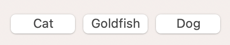
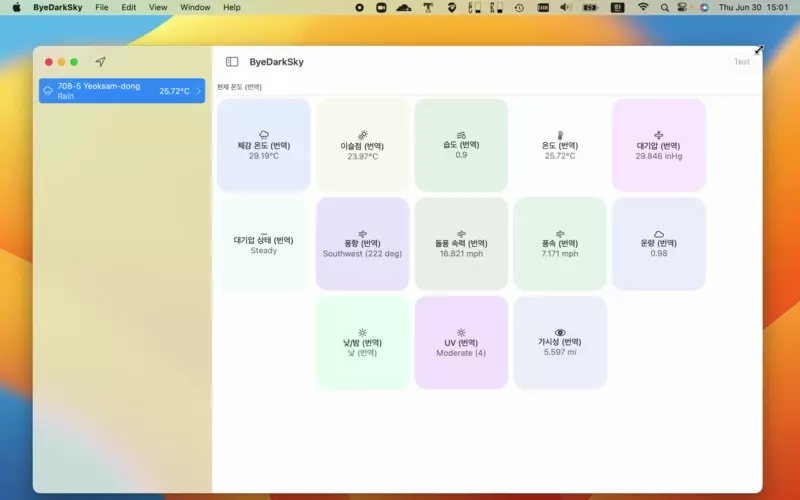

# iOS 16 - SwiftUI Layout의 Cache에 대해

iOS 16 SwiftUI에서 [Layout](https://developer.apple.com/documentation/swiftui/layout)이라는 커스텀 레이아웃을 짤 수 있게 하는 기능이 추가되었습니다. 본래는 [GeometryReader](https://developer.apple.com/documentation/swiftui/geometryreader)로 커스텀 레이아웃을 구현해야 했으나, 써보신 분은 아시겠지만 frame 변동 때문에 loop가 걸리는 문제가 있어 굉장히 버벅거리거나 무한 loop에 걸리는... 문제가 발생할 수 있어서 비효율적이었습니다. 이를 해결하기 위해 iOS 16 부터 Layout이 등장했습니다.

Layout은 [UICollectionViewLayout](https://developer.apple.com/documentation/uikit/uicollectionviewlayout)을 통한 커스텀 레이아웃을 짜는 것과 굉장히 유사하며 더 간단합니다. 또한 Layout은 Cache 기능을 지원해서 불필요한 레이아웃 연산을 줄여서 성능 향상을 이끌 수 있습니다. 하지만 WWDC22의 [Compose custom layouts with SwiftUI](https://developer.apple.com/videos/play/wwdc2022/10056/) 영상에서는 Cache 공부는 Documentation을 보고 알아서 공부하라고... 하네요.

    For many simple layouts, you won't need this, and I'm just going to ignore the cache for now. However, if profiling your app with Instruments shows that you need to improve the efficiency of your layout code, you can look into adding one. Check out the documentation for more information about that.
    
애플에서 제공하는 [샘플 프로젝트](https://developer.apple.com/documentation/swiftui/composing_custom_layouts_with_swiftui)에서는 Cache가 아래처럼 구현되어 있긴 한데요.

```swift
import SwiftUI

struct MyEqualWidthVStack: Layout {
    /* ... */
    
    /// A type that stores cached data.
    /// - Tag: CacheData
    struct CacheData {
        let maxSize: CGSize
        let spacing: [CGFloat]
        let totalSpacing: CGFloat
    }

    /// Creates a cache for a given set of subviews.
    ///
    /// When the subviews change, SwiftUI calls the `updateCache(_:subviews:)`
    /// method. The `MyEqualWidthVStack` layout relies on the default
    /// implementation of that method, which just calls `makeCache(subviews:)`
    /// to recreate the cache.
    /// - Tag: makeCache
    func makeCache(subviews: Subviews) -> CacheData {
        let maxSize = maxSize(subviews: subviews)
        let spacing = spacing(subviews: subviews)
        let totalSpacing = spacing.reduce(0) { $0 + $1 }

        return CacheData(
            maxSize: maxSize,
            spacing: spacing,
            totalSpacing: totalSpacing)
    }

    /* ... */
}
```



다만 이 코드는 View의 사이즈 변화, 다시 말해 [ProposedViewSize](https://developer.apple.com/documentation/swiftui/proposedviewsize) 변화에 대응하는 예시가 아닙니다. 아래 영상같은 레이아웃을 구성해서 View의 사이즈 변화에 따른 연산을 캐싱해서 중복된 연산을 줄이고 싶은건데 그거를 보여주는 코드가 아닌거죠.



위 영상은 아래 코드로 레이아웃을 구성했습니다. 코드를 다 이해하실 필요는 없고, 레이아웃 계산을 위해 연산이 많다고만 이해하시면 됩니다. 참고로 캐싱 기능은 구현되지 않은 상태이며, 캐싱 기능을 구현하는 방법을 소개하려고 합니다.

```swift
import SwiftUI
import ByeDarkSkyCore

struct WeatherLayout: Layout {
    enum ContentMode {
        case fill, fit
    }
    
    private let itemSize: CGSize
    private let horizontalContentMode: ContentMode
    
    init(itemSize: CGSize = .init(width: 150, height: 150), horizontalContentMode: ContentMode = .fit) {
        self.itemSize = itemSize
        self.horizontalContentMode = horizontalContentMode
    }
    
    func sizeThatFits(proposal: ProposedViewSize, subviews: Subviews, cache: inout ()) -> CGSize {
        let largestHorizontalSpacing: CGFloat = subviews.enumerated().reduce(.zero) { partialResult, enumeration in
            let currentIndex: Int = enumeration.offset
            let nextIndex: Int = currentIndex + 1
            
            guard nextIndex < subviews.count else {
                return partialResult
            }
            
            let currentSubview: LayoutSubview = enumeration.element
            let nextSubview: LayoutSubview = subviews[nextIndex]
            
            return max(partialResult, currentSubview.spacing.distance(to: nextSubview.spacing, along: .horizontal))
        }
        
        let width: CGFloat = proposal.width ?? .zero
        let spacedWidth: CGFloat = width + largestHorizontalSpacing
        let columnCount: Int = Int(trunc(spacedWidth / (itemSize.width + largestHorizontalSpacing)))
        guard columnCount > 0 else { return .zero }
        let rowCount: Int = (subviews.count / columnCount) + ((subviews.count % columnCount == .zero) ? .zero : 1)
        
        let totalVerticalSpacing: CGFloat = (0..<rowCount).reduce(.zero) { partialResult1, row in
            let startIndex: Int = row * columnCount
            let endIndex: Int = startIndex + columnCount - 1
            
            guard endIndex < subviews.count else {
                return partialResult1
            }
            
            let largestVerticalSpacing: CGFloat = (startIndex...endIndex).reduce(.zero) { partialResult2, index in
                let currentIndex: Int = index
                let nextIndex: Int = index + columnCount
                
                guard nextIndex < subviews.count else {
                    return partialResult2
                }
                
                let currentSubview: LayoutSubview = subviews[currentIndex]
                let nextSubview: LayoutSubview = subviews[nextIndex]
                
                return max(partialResult2, currentSubview.spacing.distance(to: nextSubview.spacing, along: .vertical))
            }
            
            return partialResult1 + largestVerticalSpacing
        }
        
        let finalSize: CGSize
        let finalHeight: CGFloat = (CGFloat(rowCount) * itemSize.height) + CGFloat(totalVerticalSpacing)
        
        switch horizontalContentMode {
        case .fit:
            let finalWidth: CGFloat = (CGFloat(columnCount) * itemSize.width) + (CGFloat(columnCount - 1) * largestHorizontalSpacing)
            finalSize = .init(width: finalWidth, height: finalHeight)
        case .fill:
            finalSize = .init(width: width, height: finalHeight)
        }
        
        return finalSize
    }
    
    func placeSubviews(in bounds: CGRect, proposal: ProposedViewSize, subviews: Subviews, cache: inout ()) {
        let largestHorizontalSpacing: CGFloat = subviews.enumerated().reduce(.zero) { partialResult, enumeration in
            let currentIndex: Int = enumeration.offset
            let nextIndex: Int = currentIndex + 1
            
            guard nextIndex < subviews.count else {
                return partialResult
            }
            
            let currentSubview: LayoutSubview = enumeration.element
            let nextSubview: LayoutSubview = subviews[nextIndex]
            
            return max(partialResult, currentSubview.spacing.distance(to: nextSubview.spacing, along: .horizontal))
        }
        
        let width: CGFloat = bounds.width
        let spacedWidth: CGFloat = width + largestHorizontalSpacing
        let columnCount: Int = Int(trunc(spacedWidth / (itemSize.width + largestHorizontalSpacing)))
        guard columnCount > 0 else { return }
        let rowCount: Int = (subviews.count / columnCount) + ((subviews.count % columnCount == .zero) ? .zero : 1)
        var yPosition: CGFloat = bounds.origin.y
        var locations: [CGPoint] = []
        
        (0..<rowCount).forEach { row in
            let firstColumn: Int = row * columnCount
            let lastColumn: Int = {
                // for last row
                let tmp: Int = firstColumn + columnCount - 1
                
                if tmp < subviews.count {
                    return tmp
                } else {
                    return subviews.count - 1
                }
            }()
            
            let totalWidth: CGFloat = (firstColumn...lastColumn).reduce(.zero) { partialResult, currentIndex in
                let nextIndex: Int = currentIndex + 1
                
                guard (currentIndex < lastColumn) && (nextIndex < subviews.count) else {
                    return partialResult + itemSize.width
                }
                
                let currentSubview: LayoutSubview = subviews[currentIndex]
                let nextSubview: LayoutSubview = subviews[nextIndex]
                let spacing: CGFloat = currentSubview.spacing.distance(to: nextSubview.spacing, along: .horizontal)
                
                return partialResult + itemSize.width + spacing
            }
            
            log.debug(totalWidth)
            
            let horizontalSpacing: CGFloat = (bounds.width - totalWidth) / CGFloat(2)
            let verticalSpacing: CGFloat = {
                let startIndex: Int = row * columnCount
                let endIndex: Int = startIndex + columnCount - 1
                
                guard endIndex < subviews.count else {
                    return .zero
                }
                
                let largestVerticalSpacing: CGFloat = (startIndex...endIndex).reduce(.zero) { partialResult2, index in
                    let currentIndex: Int = index
                    let nextIndex: Int = index + columnCount
                    
                    guard nextIndex < subviews.count else {
                        return partialResult2
                    }
                    
                    let currentSubview: LayoutSubview = subviews[currentIndex]
                    let nextSubview: LayoutSubview = subviews[nextIndex]
                    
                    return max(partialResult2, currentSubview.spacing.distance(to: nextSubview.spacing, along: .vertical))
                }
                
                return largestVerticalSpacing
            }()
            var xPosition: CGFloat = bounds.origin.x + horizontalSpacing
            
            (firstColumn...lastColumn).forEach { currentIndex in
                guard currentIndex < subviews.count else {
                    return
                }
                
                let currentSubview: LayoutSubview = subviews[currentIndex]
                currentSubview.place(at: .init(x: xPosition, y: yPosition), anchor: .topLeading, proposal: .init(itemSize))
                locations.append(.init(x: xPosition, y: yPosition))
                
                let nextIndex: Int = currentIndex + 1
                
                if (currentIndex < lastColumn) && (nextIndex < subviews.count) {
                    let nextSubview: LayoutSubview = subviews[nextIndex]
                    let spacing: CGFloat = currentSubview.spacing.distance(to: nextSubview.spacing, along: .horizontal)
                    xPosition += itemSize.width + spacing
                }
            }
            
            yPosition += itemSize.height + verticalSpacing
        }
    }
}
```

이제 캐싱 기능을 구현해 볼게요. `CacheStore`라는 캐싱 저장소를 만들고 `Layout.Cache`의 타입을 `CacheStore`로 지정할게요.

```swift
struct WeatherLayout: Layout {
    // NEW
    struct CacheStore {
        struct Geometry: Hashable {
            let bounds: CGRect?
            let proposal: ProposedViewSize
            
            func hash(into hasher: inout Hasher) {
                hasher.combine(bounds?.origin.x)
                hasher.combine(bounds?.origin.y)
                hasher.combine(bounds?.size.width)
                hasher.combine(bounds?.size.height)
                hasher.combine(proposal.width)
                hasher.combine(proposal.height)
            }
        }
        
        var sizes: [Geometry: CGSize] = [:]
        var locations: [Geometry: [CGPoint]] = [:]
    }
    
    typealias Cache = CacheStore
    
    // () -> UUID
    func sizeThatFits(proposal: ProposedViewSize, subviews: Subviews, cache: inout CacheStore) -> CGSize { /* ... */ }
    
    // () -> UUID
    func placeSubviews(in bounds: CGRect, proposal: ProposedViewSize, subviews: Subviews, cache: inout CacheStore) { /* ... */ }
    
    // NEW
    func makeCache(subviews: Subviews) -> CacheStore {
        let cache: UUID = .init()
        return cache
    }
    
    // NEW
    func updateCache(_ cache: inout CacheStore, subviews: Subviews) {
    
    }
```

이제 캐싱을 저장하고 불러오는 로직을 짜볼게요.

```swift
struct WeatherLayout: Layout {
    /* ... */
    
    func sizeThatFits(proposal: ProposedViewSize, subviews: Subviews, cache: inout CacheStore) -> CGSize {
        let geometry: WeatherLayoutCacheStore.Geometry = .init(bounds: nil, proposal: proposal)
        
        if let size: CGSize = cacheStore.sizes[geometry] {
            // 캐싱됨 - 불러 옴
            return size
        } else {
            /* 캐싱이 안 됨 - 새로 만들고 저장 */
            
            // 최종 사이즈
            let finalSize: CGSize = /* ... */
            
            // 캐시 저장
            cache.sizes[geometry] = finalSize
            
            return finalSize
        }
    }
    
    func placeSubviews(in bounds: CGRect, proposal: ProposedViewSize, subviews: Subviews, cache: inout UUID) {
        let geometry: CacheStore.Geometry = .init(bounds: bounds, proposal: proposal)
        
        if let locations: [CGPoint] = cache.locations[geometry] {
            // 캐싱됨 - 불러 옴
            subviews.enumerated().forEach { enumeration in
                let index: Int = enumeration.offset
                let subview: LayoutSubview = enumeration.element
                let location: CGPoint = locations[index]
                subview.place(at: location, anchor: .topLeading, proposal: .init(itemSize))
            }
        } else {
            /* 캐싱이 안 됨 - Subviews의 좌표를 새로 만들고 저장 */
             
            // Subviews의 좌표
            var locations: [CGPoint] = /* ... */
            
            // 캐시 저장
            cache.locations[geometry] = locations
        }
    }
}
```

이렇게 하면 View의 사이즈를 대응하는 캐싱이 구현됩니다! 최종 코드는 [여기](https://github.com/pookjw/ByeDarkSky/blob/main/ByeDarkSky/Weather/WeatherLayout.swift)에서 확인해 주세요.
