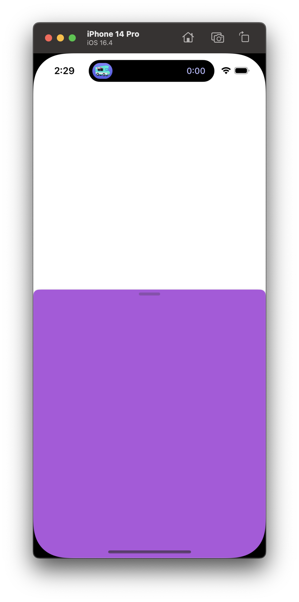

# Dive into SwiftUI Sheet Presentation

> - iOS 16.4 beta 1 (20E5212f) 기준입니다.



iOS 16.4 이후로 [`presentationBackgroundInteraction(_:)`](https://developer.apple.com/documentation/swiftui/view/presentationbackgroundinteraction(_:)?changes=_5)라는 API가 추가되었습니다. 이는 지도 앱 처럼 하단에 Sheet가 뜨면서 상위 View과의 Interaction을 허용합니다.

```swift
import SwiftUI

struct SheetView: View {
    @State private var isPresented: Bool = false
    
    var body: some View {
        Button("Toggle") {
            isPresented.toggle()
        }
            .sheet(isPresented: $isPresented) {
                Color
                    .purple
                    .ignoresSafeArea()
                    .presentationDetents([.medium, .large])
                    .presentationBackgroundInteraction(.enabled(upThrough: .medium))
            }
    }
}
```

이는 [`UISheetPresentationController`](https://developer.apple.com/documentation/uikit/uisheetpresentationcontroller)에는 존재하지 않는 API입니다. UIKit의 기본 API로는 (커스텀 없이는) 저러한 UI는 구현이 불가능하며 오직 SwiftUI에서만 가능한 것으로 보입니다. 이 원리가 궁금해 졌기에 글을 씁니다.

## SwiftUI.PresentationHostingController<Content: AnyView>에 대해 (1)

사진에 보이는 보라색 Sheet View는 `_TtGC7SwiftUI29PresentationHostingControllerVS_7AnyView`_라는 UIViewController를 통해 구현되었습니다. demangle을 하면 `SwiftUI.PresentationHostingController<Content: AnyView>`이 되겠네요.

UI Inspector를 통해 보라색 Sheet View의 메모리 주소를 얻어 온 뒤, `presentationController` selector를 전송하면

```
(lldb) expression -l objc -O -- [0x10c00a000 presentationController]
<_UIPageSheetPresentationController: 0x115604740>
```

`_UIPageSheetPresentationController`를 쓰고 있네요.` _UIPageSheetPresentationController` <- `_UIFormSheetPresentationController` <- `_UISheetPresentationController` <- `UISheetPresentationController` 순서로 subclassing하고 있습니다. UIKit에서 제공하는 Public API인 `UISheetPresentationController`를 커스텀해서 SwiftUI에 적용하고 있다는 것을 알 수 있습니다.

## _UIPageSheetPresentationController 활용

이제 `_UIPageSheetPresentationController`를 활용해서 UIKit에서도 [`presentationBackgroundInteraction(_:)`](https://developer.apple.com/documentation/swiftui/view/presentationbackgroundinteraction(_:)?changes=_5)의 기능을 활용해 봅시다.

