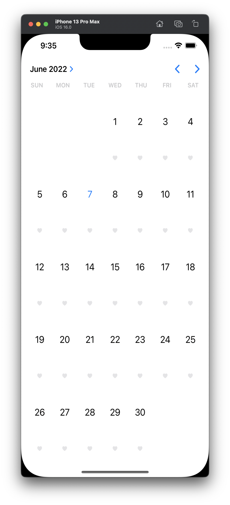
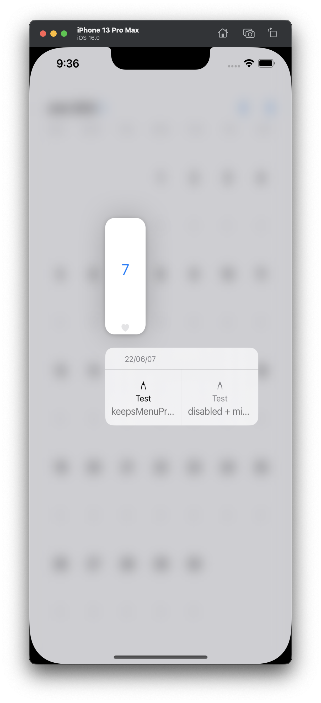

# UICalendarView



iOS 16에 [UICalendarView](https://developer.apple.com/documentation/uikit/uicalendarview)가 추가되었다.

말 그대로 달력을 띄우는 View이며 Decoration으로 날짜 밑에 Custom View, Image 등을 넣는다던지 등등 할 수 있다.

내부 구조는 `UICollectionView` + `UICollectionViewCompositionalLayout` + `UICollectionViewDiffableDataSource`로 작동하고 있다. 또한 `UICalendarView`는 `UICollectionViewDelegate`를 쓰고 있다.

```
(lldb) expression -l objc -O -- [UICalendarView _shortMethodDescription]
<UICalendarView: 0x10c6bdfc0>:
in UICalendarView:
    Properties:
        @property (retain, nonatomic) UIView* contentView;  (@synthesize contentView = _contentView;)
        @property (retain, nonatomic) _UICalendarHeaderView* headerView;  (@synthesize headerView = _headerView;)
        @property (retain, nonatomic) _UICalendarWeekdayView* weekdayView;  (@synthesize weekdayView = _weekdayView;)
        @property (retain, nonatomic) UICollectionView* collectionView;  (@synthesize collectionView = _collectionView;)
        @property (retain, nonatomic) _UICalendarViewDecorationSystem* decorationSystem;  (@synthesize decorationSystem = _decorationSystem;)
        @property (copy, nonatomic) NSDate* minimumDate;
        @property (copy, nonatomic) NSDate* maximumDate;
        @property (copy, nonatomic) NSDateComponents* minimumDateComponents;
        @property (copy, nonatomic) NSDateComponents* maximumDateComponents;
        @property (retain, nonatomic) UICalendarSelection* selection;
        @property (weak, nonatomic) <UICalendarViewDelegate>* delegate;  (@synthesize delegate = _delegate;)
        @property (retain, nonatomic) UICalendarSelection* selectionBehavior;  (@synthesize selectionBehavior = _selectionBehavior;)
        @property (retain, nonatomic) NSLocale* locale;
        @property (copy, nonatomic) NSCalendar* calendar;
        @property (retain, nonatomic) NSTimeZone* timeZone;
        @property (copy, nonatomic) NSString* fontDesign;
        @property (copy, nonatomic) NSDateInterval* availableDateRange;
        @property (copy, nonatomic) NSDateComponents* visibleDateComponents;
        @property (nonatomic) BOOL wantsDateDecorations;
        @property (readonly) unsigned long hash;
        @property (readonly) Class superclass;
        @property (readonly, copy) NSString* description;
        @property (readonly, copy) NSString* debugDescription;
    Instance Methods:
        - (id) initWithFrame:(struct CGRect)arg1; (0x104678744)
        - (id) initWithCoder:(id)arg1; (0x10467874c)
        - (void) _setupInitialValues; (0x10b278d80)
        - (void) _reloadDateFormatters; (0x10b278e34)
        - (void) _setupViewHierarchy; (0x10b278ed0)
        - (id) _dataModel; (0x10b2792a8)
        - (void) setFrame:(struct CGRect)arg1; (0x104678754)
        - (void) setBounds:(struct CGRect)arg1; (0x10467875c)
        - (void) traitCollectionDidChange:(id)arg1; (0x104678764)
        - (void) _setNeedsUpdateSizing; (0x10b279490)
        - (void) _updateSizing; (0x10b2794a8)
        - (void) layoutSubviews; (0x10467876c)
        - (id) _contentSizeCategoryForContentWidth:(double)arg1; (0x10b279800)
        - (void) _updateContentSizeLimitations; (0x10b279850)
        - (unsigned long) _axesForDerivingIntrinsicContentSizeFromLayoutSize; (0x10b2798ac)
        - (struct CGSize) sizeThatFits:(struct CGSize)arg1; (0x104678774)
        - (struct CGSize) _intrinsicSizeWithinSize:(struct CGSize)arg1; (0x10b2798b8)
        - (void) layoutMarginsDidChange; (0x10467877c)
        - (double) __dayAndWeekdayLabelWidth; (0x10b279b04)
        - (BOOL) _shouldUpdateDateViewForVisibleMonth:(id)arg1; (0x10b279c74)
        - (void) _updateDateViewForVisibleMonth:(id)arg1 animated:(BOOL)arg2; (0x10b279cd4)
        - (void) _updateVisibleMonth:(id)arg1 animated:(BOOL)arg2; (0x10b279ce4)
        - (void) headerViewDidStepForward:(id)arg1; (0x104678784)
        - (void) headerViewDidStepBackward:(id)arg1; (0x10467878c)
        - (void) headerViewDidSelect:(id)arg1; (0x104678794)
        - (void) _updateViewState:(long)arg1 animated:(BOOL)arg2; (0x10b279e0c)
        - (void) _destroyMonthYearSelector; (0x10b27a10c)
        - (void) _configureMonthYearSelector; (0x10b27a140)
        - (void) monthYearSelector:(id)arg1 didSelectMonth:(id)arg2; (0x10467879c)
        - (id) _configuedCellForCollectionView:(id)arg1 indexPath:(id)arg2 day:(id)arg3; (0x10b27a254)
        - (id) _delegateDecorationForDay:(id)arg1; (0x10b27a40c)
        - (void) _reloadCollectionViewLayout; (0x10b27a4ec)
        - (void) _reload; (0x10b27aaa4)
        - (void) _reloadDataSourceController; (0x10b27aad8)
        - (void) _reloadPossibleDayValues; (0x10b27abf8)
        - (void) setSelectionBehavior:(id)arg1; (0x1046787a4)
        - (id) selection; (0x1046787ac)
        - (void) setSelection:(id)arg1; (0x1046787b4)
        - (void) _selectDates:(id)arg1 animated:(BOOL)arg2; (0x10b27adf8)
        - (void) _deselectDates:(id)arg1 animated:(BOOL)arg2; (0x10b27afe8)
        - (BOOL) allowsMultipleSelection; (0x1046787bc)
        - (void) setAllowsMultipleSelection:(BOOL)arg1; (0x1046787c4)
        - (id) decorationSystem; (0x1046787cc)
        - (BOOL) _hasCellDecorations; (0x10b27b1b8)
        - (void) _reconfigureVisibleItems; (0x10b27b1d4)
        - (void) setDelegate:(id)arg1; (0x1046787d4)
        - (BOOL) wantsDateDecorations; (0x1046787dc)
        - (void) setWantsDateDecorations:(BOOL)arg1; (0x1046787e4)
        - (void) reloadDecorationsForDateComponents:(id)arg1 animated:(BOOL)arg2; (0x1046787ec)
        - (BOOL) _canSelectItemAtIndexPath:(id)arg1 forSelection:(BOOL)arg2; (0x10b27b670)
        - (BOOL) collectionView:(id)arg1 shouldHighlightItemAtIndexPath:(id)arg2; (0x1046787f4)
        - (BOOL) collectionView:(id)arg1 shouldSelectItemAtIndexPath:(id)arg2; (0x1046787fc)
        - (void) collectionView:(id)arg1 didSelectItemAtIndexPath:(id)arg2; (0x104678804)
        - (BOOL) collectionView:(id)arg1 shouldDeselectItemAtIndexPath:(id)arg2; (0x10467880c)
        - (void) collectionView:(id)arg1 didDeselectItemAtIndexPath:(id)arg2; (0x104678814)
        - (id) calendar; (0x10467881c)
        - (id) locale; (0x104678824)
        - (id) timeZone; (0x10467882c)
        - (id) fontDesign; (0x104678834)
        - (void) setCalendar:(id)arg1; (0x10467883c)
        - (void) setLocale:(id)arg1; (0x104678844)
        - (void) setTimeZone:(id)arg1; (0x10467884c)
        - (void) setFontDesign:(id)arg1; (0x104678854)
        - (id) availableDateRange; (0x10467885c)
        - (void) setAvailableDateRange:(id)arg1; (0x104678864)
        - (id) visibleDateComponents; (0x10467886c)
        - (void) setVisibleDateComponents:(id)arg1; (0x104678874)
        - (void) setVisibleDateComponents:(id)arg1 animated:(BOOL)arg2; (0x10467887c)
        - (void) _freezeContentOffset; (0x10b27c110)
        - (void) _restoreContentOffsetWithPageOffset:(long)arg1; (0x10b27c1b4)
        - (void) _setVisibleMonth:(id)arg1; (0x10b27c29c)
        - (void) _setVisibleMonth:(id)arg1 animated:(BOOL)arg2; (0x10b27c2a4)
        - (void) _setVisibleMonth:(id)arg1 animated:(BOOL)arg2 updateDataSource:(BOOL)arg3 updateCollectionView:(BOOL)arg4 notifyDelegate:(BOOL)arg5; (0x10b27c370)
        - (void) _shouldDifferentiateWithoutColorUpdated:(id)arg1; (0x10b27c4f0)
        - (void) _setNeedsCollectionViewSelectionUpdate; (0x10b27c500)
        - (void) _setNeedsCollectionViewScrollPositionUpdate; (0x10b27c518)
        - (void) _updateCollectionViewSelection:(BOOL)arg1; (0x10b27c530)
        - (void) _updateCollectionViewScrollPosition:(BOOL)arg1; (0x10b27c5ac)
        - (void) _updateCollectionViewContentInsets; (0x10b27c718)
        - (void) _notifyDelegateAboutVisibilityChange; (0x10b27c970)
        - (void) _performIgnoringScrollCallbacks:(^block)arg1; (0x10b27c974)
        - (void) _performIfNotIgnoringScrollCallbacks:(^block)arg1; (0x10b27ca20)
        - (void) _updateVisibleMonthIfNecessary; (0x10b27ca40)
        - (void) _cleanupDataIfNecessary; (0x10b27cd14)
        - (void) scrollViewDidScroll:(id)arg1; (0x104678884)
        - (void) scrollViewDidEndScrollingAnimation:(id)arg1; (0x10467888c)
        - (void) scrollViewDidEndDecelerating:(id)arg1; (0x104678894)
        - (id) minimumDate; (0x10467889c)
        - (void) setMinimumDate:(id)arg1; (0x1046788a4)
        - (id) maximumDate; (0x1046788ac)
        - (void) setMaximumDate:(id)arg1; (0x1046788b4)
        - (id) minimumDateComponents; (0x1046788bc)
        - (void) setMinimumDateComponents:(id)arg1; (0x1046788c4)
        - (id) maximumDateComponents; (0x1046788cc)
        - (void) setMaximumDateComponents:(id)arg1; (0x1046788d4)
        - (id) delegate; (0x1046788dc)
        - (id) selectionBehavior; (0x1046788e4)
        - (id) contentView; (0x1046788ec)
        - (void) setContentView:(id)arg1; (0x1046788f4)
        - (id) headerView; (0x1046788fc)
        - (void) setHeaderView:(id)arg1; (0x104678904)
        - (id) weekdayView; (0x10467890c)
        - (void) setWeekdayView:(id)arg1; (0x104678914)
        - (id) collectionView; (0x10467891c)
        - (void) setCollectionView:(id)arg1; (0x104678924)
        - (void) setDecorationSystem:(id)arg1; (0x10467892c)
        - (void) .cxx_destruct; (0x10b27d5a8)
(UIView ...)
```

만약에 `IndexPath`의 `Date`를 가져 오고 싶으면 아래와 같은 장난이 가능하다.

```swift
@MainActor
class MyCalendarView: UICalendarView, UICollectionViewDelegate {
    private var dataSource: UICollectionViewDiffableDataSourceReference { value(forKey: "_dataSource") as! UICollectionViewDiffableDataSourceReference }
    
    private func date(at indexPath: IndexPath) -> Date {
        let item: NSObject = dataSource.itemIdentifier(for: indexPath) as! NSObject
        let date: NSDate = item.value(forKey: "_date") as! NSDate
        return date as Date
    }
    
    func collectionView(_ collectionView: UICollectionView, didSelectItemAt indexPath: IndexPath) {
        print(date(at: indexPath))
    }
}
```

'[`UICalendarSelection`를 쓰면 되는데 왜 저렇게 복잡하게 함?](https://developer.apple.com/documentation/uikit/uicalendarselection)'이라고 생각할 수 있는데, `UIContextMenuConfiguration`를 추가하고 제목에 날짜를 넣는 장난을 치려면 `IndexPath`에서 `Date`를 가져오는 방법이 필요하기 때문이다.

```swift
@MainActor
class MyCalendarView: UICalendarView, UICollectionViewDelegate {
    private var dataSource: UICollectionViewDiffableDataSourceReference { value(forKey: "_dataSource") as! UICollectionViewDiffableDataSourceReference }
    
    private func date(at indexPath: IndexPath) -> Date {
        let item: NSObject = dataSource.itemIdentifier(for: indexPath) as! NSObject
        let date: NSDate = item.value(forKey: "_date") as! NSDate
        return date as Date
    }
    
    func collectionView(_ collectionView: UICollectionView, contextMenuConfigurationForItemsAt indexPaths: [IndexPath], point: CGPoint) -> UIContextMenuConfiguration? {
        let date: Date = date(at: indexPaths.first!)
        let formatter: DateFormatter = .init()
        formatter.dateFormat = "YY/MM/dd"
        let string: String = formatter.string(from: date as Date)
        
        let configuration: UIContextMenuConfiguration = .init(identifier: nil, previewProvider: nil, actionProvider: { elements -> UIMenu? in
            var elements: [UIMenuElement] = elements

            let test1: UIAction = .init(title: "Test", subtitle: "keepsMenuPresented", image: .init(systemName: "pencil.tip"), identifier: .init("Test1"), discoverabilityTitle: nil, attributes: [.keepsMenuPresented], state: .on) { _ in
                
            }
            
            let test2: UIAction = .init(title: "Test", subtitle: "disabled + mixed", image: .init(systemName: "pencil.tip"), identifier: .init("Test2"), discoverabilityTitle: nil, attributes: [.disabled], state: .mixed) { _ in
                
            }
            
            elements.append(test1)
            elements.append(test2)
            
            return .init(title: string, subtitle: "Test", image: .init(systemName: "pencil.tip"), identifier: .init("A"), options: [.displayInline], preferredElementSize: .medium, children: elements)
        })
        
        return configuration
    }
}
```


