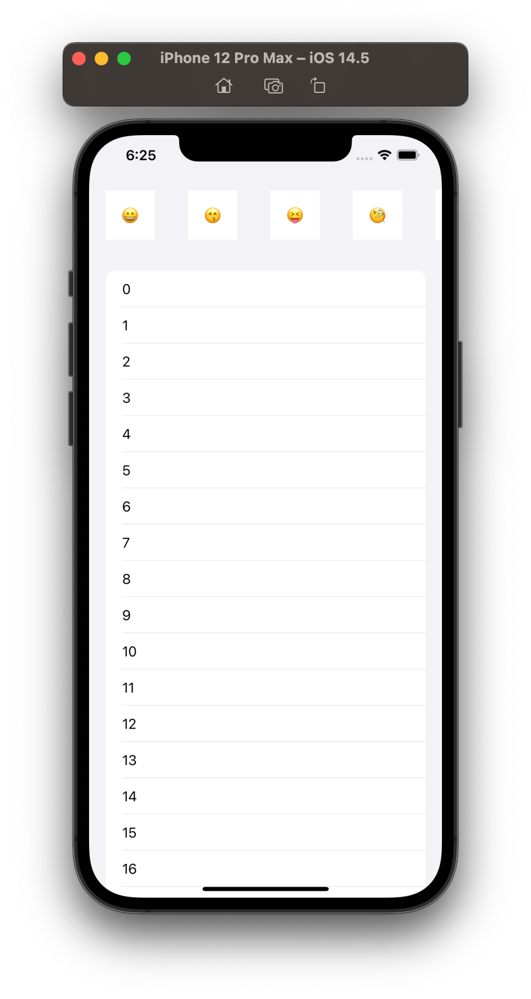

# UICollectionView.CellRegistration, 그리고 iOS 15와 iOS 16

## 서론

iOS 15와 iOS 16에서 `UICollectionView.CellRegistration`의 일부 바뀐 점을 설명합니다. 우선 `UIContentConfiguration`과 `UICollectionView.CellRegistration`이 무엇인지 설명드려야 할 것 같습니다.

### UIContentConfiguration이란

iOS 14 이후로 `UIContentConfiguration` ([Swift](https://developer.apple.com/documentation/uikit/uicontentconfiguration) / [Obj-C](https://developer.apple.com/documentation/uikit/uicontentconfiguration?language=objc))라는 protocol이 생겼습니다. `UITableViewCell` 및 `UICollectionViewCell`을 커스텀 할 때 subclassing을 해야 할 필요가 없어지며, View 컴퍼넌트를 새로 하나 만들었을 경우 아래 코드처럼 `UITableViewCell` 및 `UICollectionViewCell`에 손쉽게 주입할 수 있다는 장점이 있습니다.

```swift
let contentConfiguration: CustomContentConfiguration = /* */

let tableViewCell: UITableViewCell = /* */
tableViewCell.contentConfiguration = contentConfiguration

let collectionViewCell: UICollectionViewCell = /* */
collectionViewCell.contentConfiguration = contentConfiguration
```

이외에도 [`UIListSeparatorConfiguration`](https://developer.apple.com/documentation/uikit/uilistseparatorconfiguration), [`UIBackgroundConfiguration`](https://developer.apple.com/documentation/uikit/uibackgroundconfiguration), [`UIButtonConfiguration`](https://developer.apple.com/documentation/uikit/uibutton/configuration) 등이 있으나 이 글에서는 다루지 않겠습니다.

### UICollectionView.CellRegistration이란

또한 iOS 14 이후에는 Cell을 등록(registration)하거나 재사용(Reuse) 새로운 방법이 생겼습니다. 기존에는 `UICollectionView`에 Cell을 등록 및 재사용을 위해 아래와 같이 했어야 했습니다.

```swift
let collectionView: UICollectionView = /* */

// 등록
collectionView.register(CustomCollectionViewCell.self, forCellWithReuseIdentifier: "cell")

// 재사용
let indexPath: IndexPath = /* */
let cell: CustomCollectionViewCell? = collectionView.dequeueReusableCell(withReuseIdentifier: "cell", for: indexPath) as? CustomCollectionViewCell
```

Reuse Identifier를 써야 하고, `dequeueReusableCell(withReuseIdentifier:for:)`는 nullable이라서 귀찮다고 느끼셨을 겁니다. 이를 해결하기 위해 [Reusable](https://github.com/AliSoftware/Reusable)이라는 서드파티 라이브러리가 있긴 합니다.

이를 개선하기 위해 iOS 14에 `UICollectionView.CellRegistration` ([Swift](https://developer.apple.com/documentation/uikit/uicollectionview/cellregistration), [Obj-C](https://developer.apple.com/documentation/uikit/uicollectionviewcellregistration?language=objc))라는 API가 추가됩니다. 위에서 언급한 코드를 아래처럼 개선할 수 있게 되며, 이러한 Cell Registration 코드를 컴퍼넌트 처럼 사용할 수 있다는 장점도 있습니다.

```swift
// 최초 한 번만 생성되어야 함 - 여러 번 생성될 경우 Cell 재사용이 안 되거나 크래시
// ItemModel은 Cell에 주입할 데이터
let cellRegistration: UICollectionView.CellRegistration<CustomCollectionViewListCell, ItemModel> = {
    .init { cell, indexPath, itemIdentifier in
        // CustomCollectionViewListCell.configure(with:)
        cell.configure(with: itemIdentifier)
    }
}

// Cell 얻어 오기
func collectionView(_ collectionView: UICollectionView, cellForItemAt indexPath: IndexPath) -> UICollectionViewCell {
    let cell: UICollectionViewCell = collectionView.dequeueConfiguredReusableCell(using: cellRegistration, for: indexPath, item: itemIdentifier)
    return cell
}
``` 

## 예제 코드

이제 위에서 언급한 `UIContentConfiguration`과 `UICollectionView.CellRegistration`이 iOS 15와 iOS 16에서 어떻게 바뀌었는지 설명하겠습니다.

설명을 위해 아래 예제 코드를 준비했습니다. iOS 14에서만 정상 작동하며, iOS 15 및 iOS 16에서는 크래시가 발동되는 코드입니다.

아래 예제 코드의 구조를 간단히 설명해 드리자면

- `SectionModel` : `UICollectionViewDiffableDataSource`의 Section 데이터 입니다. 이모지와 숫자를 표시하는 Section으로 구성되어 있습니다.

- `ItemModel` : `UICollectionViewDiffableDataSource`의 Item 데이터 입니다.

- `ViewModel` : `UICollectionViewDiffableDataSource`을 관리하는 View Model 입니다.

- `CollectionViewLayout` : `UICollectionView`의 Layout 입니다. `UICollectionViewCompositionalLayout` 기반이며, 이모지 Section은 커스텀 레이아웃 / 숫자 Section은 `UICollectionLayoutListConfiguration`을 표시합니다.

- `EmojiContentConfiguration` : 이모지를 표시하는 Custom View를 위한 `UIContentConfiguration`

- `EmojiContentView` : 이모지를 표시하는 Custom View

- `ViewController` : 설명 생략



```swift
import UIKit

// MARK: SectionModel

enum SectionModel: Int, Equatable, Hashable {
    case emojis, numbers
}


// MARK: ItemModel

enum ItemModel: Equatable, Hashable {
    case emoji(String), number(Int)
    
    static func ==(lhs: ItemModel, rhs: ItemModel) -> Bool {
        switch (lhs, rhs) {
        case let (.emoji(lhsEmoji), .emoji(rhsEmoji)):
            return lhsEmoji == rhsEmoji
        case let (.number(lhsNumber), .number(rhsNumber)):
            return lhsNumber == rhsNumber
        default:
            return false
        }
    }
    
    func hash(into hasher: inout Hasher) {
        switch self {
        case let .emoji(emoji):
            hasher.combine(emoji)
        case let .number(number):
            hasher.combine(number)
        }
    }
}


// MARK: - ViewModel

actor ViewModel {
    typealias DataSource = UICollectionViewDiffableDataSource<SectionModel, ItemModel>
    
    let dataSource: DataSource
    
    init(dataSource: DataSource) {
        self.dataSource = dataSource
    }
    
    func request() {
        var snapshot: NSDiffableDataSourceSnapshot<SectionModel, ItemModel> = .init()
        
        snapshot.appendSections([.emojis, .numbers])
        snapshot.appendItems(
            ["😀", "😙", "😝", "🧐", "😫", "😶‍🌫️", "🥶", "😰", "🤫", "🫡", "😑", "😬", "🫥", "😴", "🤢", "😈", "👿"].map { .emoji($0) },
            toSection: .emojis
        )
        snapshot.appendItems((0...100).map { .number($0) }, toSection: .numbers)
        
        dataSource.apply(snapshot, animatingDifferences: false)
    }
}


// - MARK: CollectionViewLayout

@MainActor
protocol CollectionViewLayoutDelegate: AnyObject {
    func collectionViewLayoutSectionModel(for section: Int) -> SectionModel?
}

@MainActor
final class CollectionViewLayout: UICollectionViewCompositionalLayout {
    convenience init(delegate: CollectionViewLayoutDelegate) {
        self.init { [weak delegate] section, environment -> NSCollectionLayoutSection? in
            guard let sectionModel: SectionModel = delegate?.collectionViewLayoutSectionModel(for: section) else {
                return nil
            }
            
            switch sectionModel {
            case .emojis:
                let itemSize: NSCollectionLayoutSize = .init(
                    widthDimension: .fractionalWidth(1.0),
                    heightDimension: .fractionalWidth(1.0)
                )
                
                let item: NSCollectionLayoutItem = .init(layoutSize: itemSize)
                item.contentInsets = .init(
                    top: 20.0,
                    leading: 20.0,
                    bottom: 20.0,
                    trailing: 20.0
                )
                
                let groupSize: NSCollectionLayoutSize = .init(
                    widthDimension: .absolute(100.0),
                    heightDimension: .absolute(100.0)
                )
                
                let group: NSCollectionLayoutGroup
                if #available(iOS 16.0, *) {
                    group = .horizontal(layoutSize: groupSize, repeatingSubitem: item, count: 1)
                } else {
                    group = .horizontal(layoutSize: groupSize, subitem: item, count: 1)
                }
                
                let layoutSection: NSCollectionLayoutSection = .init(group: group)
                layoutSection.orthogonalScrollingBehavior = .continuousGroupLeadingBoundary
                return layoutSection
            case .numbers:
                let layoutConfiguration: UICollectionLayoutListConfiguration = .init(appearance: .insetGrouped)
                let layoutSession: NSCollectionLayoutSection = .list(using: layoutConfiguration, layoutEnvironment: environment)
                return layoutSession
            }
        }
    }
}


// MARK: - EmojiContentConfiguration

struct EmojiContentConfiguration: UIContentConfiguration {
    let emoji: String
    
    @MainActor func makeContentView() -> UIView & UIContentView {
        let contentView: EmojiContentView = .init(frame: .null)
        contentView.configuration = self
        return contentView
    }
    
    func updated(for state: UIConfigurationState) -> EmojiContentConfiguration {
        return self
    }
}


// MARK: - EmojiContentView

@MainActor
final class EmojiContentView: UIView {
    private var _configuration: EmojiContentConfiguration! {
        didSet {
            label.text = _configuration.emoji
        }
    }
    private let label: UILabel = .init(frame: .null)
    
    override init(frame: CGRect) {
        super.init(frame: frame)
        
        backgroundColor = .systemBackground
        
        //
        
        label.textAlignment = .center
        addSubview(label)
        label.translatesAutoresizingMaskIntoConstraints = false
        NSLayoutConstraint.activate([
            label.topAnchor.constraint(equalTo: topAnchor),
            label.leadingAnchor.constraint(equalTo: leadingAnchor),
            label.trailingAnchor.constraint(equalTo: trailingAnchor),
            label.bottomAnchor.constraint(equalTo: bottomAnchor)
        ])
    }
    
    @available(*, unavailable)
    required init?(coder: NSCoder) {
        fatalError("init(coder:) has not been implemented")
    }
}

extension EmojiContentView: UIContentView {
    var configuration: UIContentConfiguration {
        get {
            return _configuration
        }
        set(newValue) {
            _configuration = newValue as? EmojiContentConfiguration
        }
    }
    
    @available(iOS 16.0, *)
    func supports(_ configuration: UIContentConfiguration) -> Bool {
        configuration is EmojiContentConfiguration
    }
}


// MARK: - ViewController

@MainActor
final class ViewController: UIViewController {
    private var collectionView: UICollectionView!
    private var viewModel: ViewModel!
    private var requestionTask: Task<Void, Never>?
    
    private var cellRegistration: UICollectionView.CellRegistration<UICollectionViewListCell, ItemModel> {
        .init { cell, indexPath, itemIdentifier in
            switch itemIdentifier {
            case let .emoji(emoji):
                let configuration: EmojiContentConfiguration = .init(emoji: emoji)
                cell.contentConfiguration = configuration
            case let .number(number):
                var configuration: UIListContentConfiguration = cell.defaultContentConfiguration()
                configuration.text = "\(number)"
                cell.contentConfiguration = configuration
            }
        }
    }
    
    deinit {
        requestionTask?.cancel()
    }
    
    override func viewDidLoad() {
        super.viewDidLoad()
        
        //
        
        let collectionViewLayout: CollectionViewLayout = .init(delegate: self)
        let collectionView: UICollectionView = .init(frame: .null, collectionViewLayout: collectionViewLayout)
        
        collectionView.backgroundColor = .systemGroupedBackground
        view.addSubview(collectionView)
        collectionView.translatesAutoresizingMaskIntoConstraints = false
        NSLayoutConstraint.activate([
            collectionView.topAnchor.constraint(equalTo: view.topAnchor),
            collectionView.leadingAnchor.constraint(equalTo: view.leadingAnchor),
            collectionView.trailingAnchor.constraint(equalTo: view.trailingAnchor),
            collectionView.bottomAnchor.constraint(equalTo: view.bottomAnchor)
        ])
        
        //
        
        let dataSource: ViewModel.DataSource = .init(collectionView: collectionView) { collectionView, indexPath, itemIdentifier in
            let cellRegistration: UICollectionView.CellRegistration<UICollectionViewListCell, ItemModel> = self.cellRegistration
            let cell: UICollectionViewCell = collectionView.dequeueConfiguredReusableCell(using: cellRegistration, for: indexPath, item: itemIdentifier)
            
            return cell
        }
        let viewModel: ViewModel = .init(dataSource: dataSource)
        
        let requestionTask: Task<Void, Never> = .detached { [viewModel] in
            await viewModel.request()
        }
        
        //
        
        self.collectionView = collectionView
        self.viewModel = viewModel
        self.requestionTask = requestionTask
    }
}

extension ViewController: CollectionViewLayoutDelegate {
    func collectionViewLayoutSectionModel(for section: Int) -> SectionModel? {
        if #available(iOS 15.0, *) {
            return viewModel.dataSource.sectionIdentifier(for: section)
        } else {
            return viewModel.dataSource.snapshot().sectionIdentifiers[section]
        }
    }
}

```

## iOS 15

위 코드는 iOS 15 이상에서 아래처럼 Exception이 발생합니다.

```
2022-10-08 18:35:09.630295+0900 MyAppSwift[976:204942] *** Terminating app due to uncaught exception 'NSInternalInconsistencyException', reason: 'Attempted to dequeue a cell using a registration that was created inside -collectionView:cellForItemAtIndexPath: or inside a UICollectionViewDiffableDataSource cell provider. Creating a new registration each time a cell is requested will prevent reuse and cause created cells to remain inaccessible in memory for the lifetime of the collection view. Registrations should be created up front and reused. Registration: <UICollectionViewCellRegistration: 0x2807fc870>'
```

Cell을 재생성 할 때마다 registration을 만들지 말라는 소리같네요. 아래 부분이 문제 같습니다.

```swift
let dataSource: ViewModel.DataSource = .init(collectionView: collectionView) { collectionView, indexPath, itemIdentifier in
    let cellRegistration: UICollectionView.CellRegistration<UICollectionViewListCell, ItemModel> = self.cellRegistration
    let cell: UICollectionViewCell = collectionView.dequeueConfiguredReusableCell(using: cellRegistration, for: indexPath, item: itemIdentifier)
    
    return cell
}
```

위 코드를 아래처럼 수정하면 해결이 됩니다. registration을 최초 한 번만 생성하면 됩니다.

```swift
let cellRegistration: UICollectionView.CellRegistration<UICollectionViewListCell, ItemModel> = self.cellRegistration
    
let dataSource: ViewModel.DataSource = .init(collectionView: collectionView) { collectionView, indexPath, itemIdentifier in
    let cell: UICollectionViewCell = collectionView.dequeueConfiguredReusableCell(using: cellRegistration, for: indexPath, item: itemIdentifier)
    
    return cell
}
```

이는 Documentation에서도 명시되어 있는 부분입니다. [링크](https://developer.apple.com/documentation/uikit/uicollectionview/cellregistration)

    Don’t create your cell registration inside a UICollectionViewDiffableDataSource.CellProvider closure; doing so prevents cell reuse, and generates an exception in iOS 15 and higher.

## iOS 16

위에서 설명드린 iOS 15 코드를 적용하면 Exception은 발생하지 않으나, `UICollectionView`를 스크롤해서 Cell 재사용을 발동시키면 아래처럼 Warning이 발생합니다.

```
2022-10-08 18:39:58.908812+0900 MyAppSwift[982:208779] [ContentConfiguration] Warning: You are setting a new content configuration to a cell that has an existing content configuration, but the existing content view does not support the new configuration. This means the existing content view must be replaced with a new content view created from the new configuration, instead of updating the existing content view directly, which is expensive. Use separate registrations or reuse identifiers for different types of cells to avoid this. Make a symbolic breakpoint at UIContentConfigurationAlertForReplacedContentView to catch this in the debugger.
Cell: <UICollectionViewListCell: 0x10521b680; frame = (420 20; 60 60); layer = <CALayer: 0x2826c06a0>>;
Existing content configuration: <UIListContentConfiguration: 0x280dfc7e0; text = "31"; Base Style = Cell; directionalLayoutMargins = {11, 16, 11, 8}; axesPreservingSuperviewLayoutMargins = [Horizontal]; imageToTextPadding = 16; textToSecondaryTextVerticalPadding = 3>;
New content configuration: EmojiContentConfiguration(emoji: "😫")
```

하나의 Cell에 서로 다른 타입의 `UIContentConfiguration`을 적용하지 말라는 것 같습니다. 제가 작성했던 코드를 보시면 그렇게 하고 있습니다.

```swift
private var cellRegistration: UICollectionView.CellRegistration<UICollectionViewListCell, ItemModel> {
    .init { cell, indexPath, itemIdentifier in
        switch itemIdentifier {
        case let .emoji(emoji):
            let configuration: EmojiContentConfiguration = .init(emoji: emoji)
            cell.contentConfiguration = configuration
        case let .number(number):
            var configuration: UIListContentConfiguration = cell.defaultContentConfiguration()
            configuration.text = "\(number)"
            cell.contentConfiguration = configuration
        }
    }
}
```

이를 `defaultCellRegistration`와 `emojiCellRegistration`로 쪼갭시다.

```swift
private var defaultCellRegistration: UICollectionView.CellRegistration<UICollectionViewListCell, String> {
    .init { cell, indexPath, itemIdentifier in
        var configuration: UIListContentConfiguration = cell.defaultContentConfiguration()
        configuration.text = itemIdentifier
        cell.contentConfiguration = configuration
    }
}

private var emojiCellRegistration: UICollectionView.CellRegistration<UICollectionViewCell, String> {
    .init { cell, indexPath, itemIdentifier in
        let configuration: EmojiContentConfiguration = .init(emoji: itemIdentifier)
        cell.contentConfiguration = configuration
    }
}
```

또한 Cell을 재사용하는 코드에서 Registration 분기 처리가 필요해 보입니다.

```swift
let defaultCellRegistration: UICollectionView.CellRegistration<UICollectionViewListCell, String> = self.defaultCellRegistration
let emojiCellRegistration: UICollectionView.CellRegistration<UICollectionViewCell, String> = self.emojiCellRegistration
let dataSource: ViewModel.DataSource = .init(collectionView: collectionView) { collectionView, indexPath, itemIdentifier in
    
    let cell: UICollectionViewCell
    
    switch itemIdentifier {
    case let .emoji(emoji):
        cell = collectionView.dequeueConfiguredReusableCell(using: emojiCellRegistration, for: indexPath, item: emoji)
    case let .number(number):
        cell = collectionView.dequeueConfiguredReusableCell(using: defaultCellRegistration, for: indexPath, item: "\(number)")
    }
    
    return cell
}

```

이렇게 하니 iOS 16에서 문제가 없네요.

## 총평

iOS 14 때 나온 API들인데 애플은 이런 중요한 내용들을 이제야 고지하는 것인가... -_-

## 완성된 코드

```swift
import UIKit

// MARK: SectionModel

enum SectionModel: Int, Equatable, Hashable {
    case emojis, numbers
}


// MARK: ItemModel

enum ItemModel: Equatable, Hashable {
    case emoji(String), number(Int)
    
    static func ==(lhs: ItemModel, rhs: ItemModel) -> Bool {
        switch (lhs, rhs) {
        case let (.emoji(lhsEmoji), .emoji(rhsEmoji)):
            return lhsEmoji == rhsEmoji
        case let (.number(lhsNumber), .number(rhsNumber)):
            return lhsNumber == rhsNumber
        default:
            return false
        }
    }
    
    func hash(into hasher: inout Hasher) {
        switch self {
        case let .emoji(emoji):
            hasher.combine(emoji)
        case let .number(number):
            hasher.combine(number)
        }
    }
}


// MARK: - ViewModel

actor ViewModel {
    typealias DataSource = UICollectionViewDiffableDataSource<SectionModel, ItemModel>
    
    let dataSource: DataSource
    
    init(dataSource: DataSource) {
        self.dataSource = dataSource
    }
    
    func request() {
        var snapshot: NSDiffableDataSourceSnapshot<SectionModel, ItemModel> = .init()
        
        snapshot.appendSections([.emojis, .numbers])
        snapshot.appendItems(
            ["😀", "😙", "😝", "🧐", "😫", "😶‍🌫️", "🥶", "😰", "🤫", "🫡", "😑", "😬", "🫥", "😴", "🤢", "😈", "👿"].map { .emoji($0) },
            toSection: .emojis
        )
        snapshot.appendItems((0...100).map { .number($0) }, toSection: .numbers)
        
        dataSource.apply(snapshot, animatingDifferences: false)
    }
}


// - MARK: CollectionViewLayout

@MainActor
protocol CollectionViewLayoutDelegate: AnyObject {
    func collectionViewLayoutSectionModel(for section: Int) -> SectionModel?
}

@MainActor
final class CollectionViewLayout: UICollectionViewCompositionalLayout {
    convenience init(delegate: CollectionViewLayoutDelegate) {
        self.init { [weak delegate] section, environment -> NSCollectionLayoutSection? in
            guard let sectionModel: SectionModel = delegate?.collectionViewLayoutSectionModel(for: section) else {
                return nil
            }
            
            switch sectionModel {
            case .emojis:
                let itemSize: NSCollectionLayoutSize = .init(
                    widthDimension: .fractionalWidth(1.0),
                    heightDimension: .fractionalWidth(1.0)
                )
                
                let item: NSCollectionLayoutItem = .init(layoutSize: itemSize)
                item.contentInsets = .init(
                    top: 20.0,
                    leading: 20.0,
                    bottom: 20.0,
                    trailing: 20.0
                )
                
                let groupSize: NSCollectionLayoutSize = .init(
                    widthDimension: .absolute(100.0),
                    heightDimension: .absolute(100.0)
                )
                
                let group: NSCollectionLayoutGroup
                if #available(iOS 16.0, *) {
                    group = .horizontal(layoutSize: groupSize, repeatingSubitem: item, count: 1)
                } else {
                    group = .horizontal(layoutSize: groupSize, subitem: item, count: 1)
                }
                
                let layoutSection: NSCollectionLayoutSection = .init(group: group)
                layoutSection.orthogonalScrollingBehavior = .continuousGroupLeadingBoundary
                return layoutSection
            case .numbers:
                let layoutConfiguration: UICollectionLayoutListConfiguration = .init(appearance: .insetGrouped)
                let layoutSession: NSCollectionLayoutSection = .list(using: layoutConfiguration, layoutEnvironment: environment)
                return layoutSession
            }
        }
    }
}


// MARK: - EmojiContentConfiguration

struct EmojiContentConfiguration: UIContentConfiguration {
    let emoji: String
    
    @MainActor func makeContentView() -> UIView & UIContentView {
        let contentView: EmojiContentView = .init(frame: .null)
        contentView.configuration = self
        return contentView
    }
    
    func updated(for state: UIConfigurationState) -> EmojiContentConfiguration {
        return self
    }
}


// MARK: - EmojiContentView

@MainActor
final class EmojiContentView: UIView {
    private var _configuration: EmojiContentConfiguration! {
        didSet {
            label.text = _configuration.emoji
        }
    }
    private let label: UILabel = .init(frame: .null)
    
    override init(frame: CGRect) {
        super.init(frame: frame)
        
        backgroundColor = .systemBackground
        
        //
        
        label.textAlignment = .center
        addSubview(label)
        label.translatesAutoresizingMaskIntoConstraints = false
        NSLayoutConstraint.activate([
            label.topAnchor.constraint(equalTo: topAnchor),
            label.leadingAnchor.constraint(equalTo: leadingAnchor),
            label.trailingAnchor.constraint(equalTo: trailingAnchor),
            label.bottomAnchor.constraint(equalTo: bottomAnchor)
        ])
    }
    
    @available(*, unavailable)
    required init?(coder: NSCoder) {
        fatalError("init(coder:) has not been implemented")
    }
}

extension EmojiContentView: UIContentView {
    var configuration: UIContentConfiguration {
        get {
            return _configuration
        }
        set(newValue) {
            _configuration = newValue as? EmojiContentConfiguration
        }
    }
    
    @available(iOS 16.0, *)
    func supports(_ configuration: UIContentConfiguration) -> Bool {
        configuration is EmojiContentConfiguration
    }
}


// MARK: - ViewController

@MainActor
final class ViewController: UIViewController {
    private var collectionView: UICollectionView!
    private var viewModel: ViewModel!
    private var requestionTask: Task<Void, Never>?
    
    private var defaultCellRegistration: UICollectionView.CellRegistration<UICollectionViewListCell, String> {
        .init { cell, indexPath, itemIdentifier in
            var configuration: UIListContentConfiguration = cell.defaultContentConfiguration()
            configuration.text = itemIdentifier
            cell.contentConfiguration = configuration
        }
    }
    
    private var emojiCellRegistration: UICollectionView.CellRegistration<UICollectionViewCell, String> {
        .init { cell, indexPath, itemIdentifier in
            let configuration: EmojiContentConfiguration = .init(emoji: itemIdentifier)
            cell.contentConfiguration = configuration
        }
    }
    
    deinit {
        requestionTask?.cancel()
    }
    
    override func viewDidLoad() {
        super.viewDidLoad()
        
        //
        
        let collectionViewLayout: CollectionViewLayout = .init(delegate: self)
        let collectionView: UICollectionView = .init(frame: .null, collectionViewLayout: collectionViewLayout)
        
        collectionView.backgroundColor = .systemGroupedBackground
        view.addSubview(collectionView)
        collectionView.translatesAutoresizingMaskIntoConstraints = false
        NSLayoutConstraint.activate([
            collectionView.topAnchor.constraint(equalTo: view.topAnchor),
            collectionView.leadingAnchor.constraint(equalTo: view.leadingAnchor),
            collectionView.trailingAnchor.constraint(equalTo: view.trailingAnchor),
            collectionView.bottomAnchor.constraint(equalTo: view.bottomAnchor)
        ])
        
        //
        
        let defaultCellRegistration: UICollectionView.CellRegistration<UICollectionViewListCell, String> = self.defaultCellRegistration
        let emojiCellRegistration: UICollectionView.CellRegistration<UICollectionViewCell, String> = self.emojiCellRegistration
        let dataSource: ViewModel.DataSource = .init(collectionView: collectionView) { collectionView, indexPath, itemIdentifier in
            
            let cell: UICollectionViewCell
            
            switch itemIdentifier {
            case let .emoji(emoji):
                cell = collectionView.dequeueConfiguredReusableCell(using: emojiCellRegistration, for: indexPath, item: emoji)
            case let .number(number):
                cell = collectionView.dequeueConfiguredReusableCell(using: defaultCellRegistration, for: indexPath, item: "\(number)")
            }
            
            return cell
        }
        let viewModel: ViewModel = .init(dataSource: dataSource)
        
        let requestionTask: Task<Void, Never> = .detached { [viewModel] in
            await viewModel.request()
        }
        
        //
        
        self.collectionView = collectionView
        self.viewModel = viewModel
        self.requestionTask = requestionTask
    }
}

extension ViewController: CollectionViewLayoutDelegate {
    func collectionViewLayoutSectionModel(for section: Int) -> SectionModel? {
        if #available(iOS 15.0, *) {
            return viewModel.dataSource.sectionIdentifier(for: section)
        } else {
            return viewModel.dataSource.snapshot().sectionIdentifiers[section]
        }
    }
}

```
