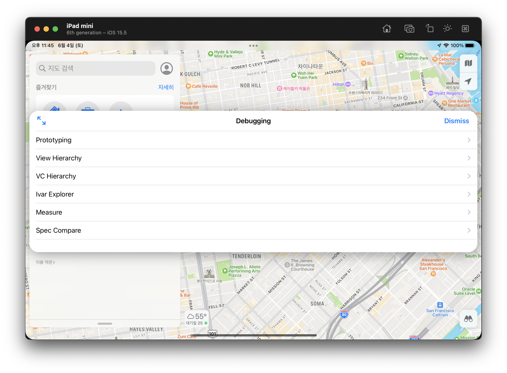
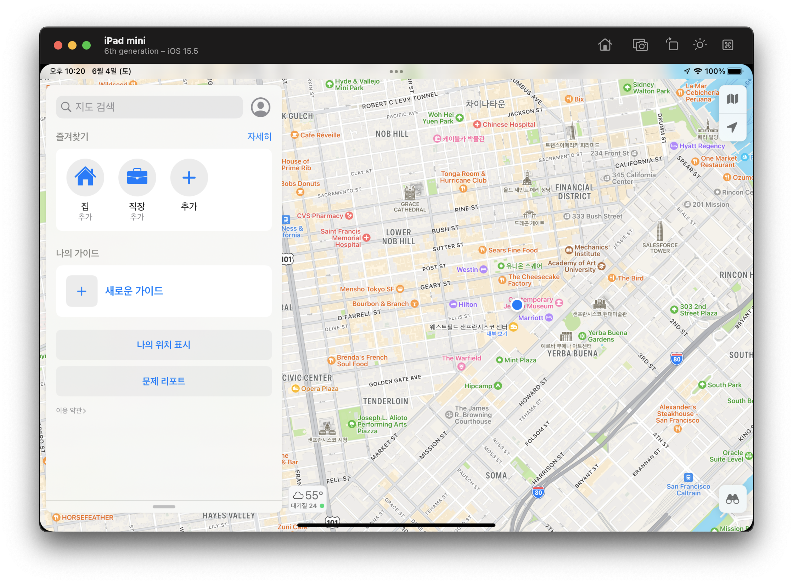
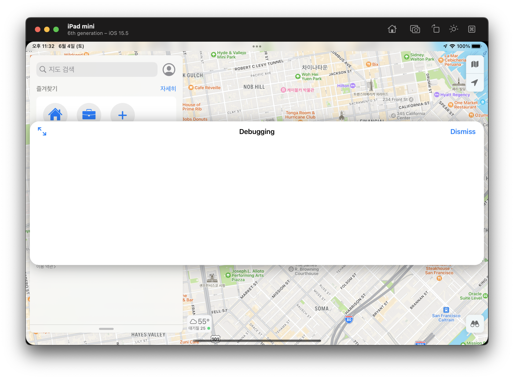

# UIDebuggingInformationOverlay를 iOS 15 arm64 환경에서 써보자



iOS에는 `UIDebuggingInformationOverlay`라는 내부 UI 디버깅 툴이 존재합니다. 이는 [Ryan Peterson](http://ryanipete.com/blog/ios/swift/objective-c/uidebugginginformationoverlay/)이 최초 발견한 것으로 보이며 iOS 9, iOS 10에서는 큰 문제가 없이 작동해 왔습니다.

iOS 11 이후로 애플은 `UIDebuggingInformationOverlay` 객체를 쉽게 만들지 못하도록 내부적으로 코드를 변경했으며 이걸 우회하는 가이드가 [Swizzling in iOS 11 with UIDebuggingInformationOverlay](https://www.raywenderlich.com/295-swizzling-in-ios-11-with-uidebugginginformationoverlay) 여기에 올라와 있습니다. 이 가이드는 [Advanced Apple Debugging & Reverse Engineering](https://www.raywenderlich.com/books/advanced-apple-debugging-reverse-engineering) 책의 일부 내용이기도 하며, 아마 이 책에서 가장 어려운 파트가 아닐까 싶습니다.

하지만 위 가이드는 iOS 11과 x86_64 기준으로 설명하고 있습니다. 요즘은 Apple Silicon의 등장으로 arm64용 가이드가 필요해 졌다고 생각합니다. 또한 위 가이드에서 소개하는 방법은 [UIWindowScene](https://developer.apple.com/documentation/uikit/uiwindowscene)의 등장으로 인해 iOS 13 이상에서 더 이상 작동하지 않습니다. `-[UIApplication statusBarWindow]`가 더 이상 제 역할을 하지 않는 것도 영향이 있습니다. 따라서 저는 iOS 15와 arm64에 맞게 가이드를 여기에 작성하겠습니다.

제 가이드는 iOS 15.5 (19F70) 기준입니다. 저는 CS 전공도 아니고 assembly를 전문적으로 배우지도 않은, 구글링 만으로 며칠만에 어설프게 assembly를 배운 사람입니다. 따라서 오류가 있을 수 있는 점 참고 부탁드립니다.

## 목차

- [UIDebuggingInformationOverlay 다루기](#handling-UIDebuggingInformationOverlay)
- [UIDebuggingInformationOverlayInvokeGestureHandler 다루기](#handling-UIDebuggingInformationOverlayInvokeGestureHandler)

### <a name="handling-UIDebuggingInformationOverlay">UIDebuggingInformationOverlay 다루기</a>



Simulator를 실행해서 지도 앱을 열어줍니다. 저희는 지도 앱에서 `UIDebuggingInformationOverlay`를 띄울겁니다.

이를 위해 지도 앱에 attach를 해야 합니다. Terminal을 열고 아래 명령어를 실행하면 attach가 됩니다.

```
% lldb -n Maps
```

attach가 되었으면 lldb에 아래 명령어를 실행해서 `UIDebuggingInformationOverlay`에서 구현된 method들과 method의 주소를 확인합니다.

```
(lldb) expression -l objc -O -- [NSClassFromString(@"UIDebuggingInformationOverlay") _shortMethodDescription]
<UIDebuggingInformationOverlay: 0x12ff51078>:
in UIDebuggingInformationOverlay:
    Class Methods:
        + (void) prepareDebuggingOverlay; (0x12f43d134)
        + (id) overlay; (0x12f43d240)
    Properties:
        @property (retain, nonatomic) UIEvent* lastTouch;  (@synthesize lastTouch = _lastTouch;)
        @property (nonatomic) struct CGPoint drawingOrigin;  (@synthesize drawingOrigin = _drawingOrigin;)
        @property (nonatomic) BOOL isFullscreen;  (@synthesize isFullscreen = _isFullscreen;)
        @property (readonly, nonatomic) UIDebuggingInformationOverlayViewController* overlayViewController;
        @property (retain, nonatomic) UIDebuggingInformationRootTableViewController* rootTableViewController;
        @property (nonatomic) BOOL checkingTouches;  (@synthesize checkingTouches = _checkingTouches;)
        @property (nonatomic) BOOL touchCaptureEnabled;  (@synthesize touchCaptureEnabled = _touchCaptureEnabled;)
        @property (retain, nonatomic) NSMutableArray* touchObservers;  (@synthesize touchObservers = _touchObservers;)
        @property (retain, nonatomic) UIWindow* inspectedWindow;  (@synthesize inspectedWindow = _inspectedWindow;)
    Instance Methods:
        - (id) init; (0x12f43cfe8)
        - (id) overlayViewController; (0x12f43d0dc)
        - (BOOL) isFullscreen; (0x12f43d0e8)
        - (void) _setHidden:(BOOL)arg1; (0x12f43d300)
        - (void) toggleVisibility; (0x12f43d668)
        - (void) toggleFullscreen; (0x12f43d700)
        - (id) hitTest:(struct CGPoint)arg1 withEvent:(id)arg2; (0x12f43d740)
        - (id) initWithFrame:(struct CGRect)arg1; (0x12f43dad8)
        - (id) rootTableViewController; (0x12f43db6c)
        - (void) setRootTableViewController:(id)arg1; (0x12f43dbc0)
        - (void) setIsFullscreen:(BOOL)arg1; (0x12f43dc2c)
        - (BOOL) checkingTouches; (0x12f43dc3c)
        - (void) setCheckingTouches:(BOOL)arg1; (0x12f43dc4c)
        - (BOOL) touchCaptureEnabled; (0x12f43dc5c)
        - (void) setTouchCaptureEnabled:(BOOL)arg1; (0x12f43dc6c)
        - (id) touchObservers; (0x12f43dc7c)
        - (void) setTouchObservers:(id)arg1; (0x12f43dc8c)
        - (id) inspectedWindow; (0x12f43dca0)
        - (void) setInspectedWindow:(id)arg1; (0x12f43dcb0)
        - (id) lastTouch; (0x12f43dcc4)
        - (void) setLastTouch:(id)arg1; (0x12f43dcd4)
        - (struct CGPoint) drawingOrigin; (0x12f43dce8)
        - (void) setDrawingOrigin:(struct CGPoint)arg1; (0x12f43dcfc)
        - (void) .cxx_destruct; (0x12f43dd10)
(UIWindow ...)
```

`UIDebuggingInformationOverlay`는 `UIWindow` subclassing하고 있네요. 저희는 `- (id) init; (0x12f43cfe8)` 이 부분을 파볼 예정입니다. lldb에 `disassemble -a`라는 명령어와 함께 주소를 입력하시면

```
(lldb) disassemble -a 0x12f43cfe8
UIKitCore`-[UIDebuggingInformationOverlay init]:
    0x12f43cfe8 <+0>:   sub    sp, sp, #0x30
    0x12f43cfec <+4>:   stp    x20, x19, [sp, #0x10]
    0x12f43cff0 <+8>:   stp    x29, x30, [sp, #0x20]
    0x12f43cff4 <+12>:  add    x29, sp, #0x20
    0x12f43cff8 <+16>:  mov    x19, x0
    0x12f43cffc <+20>:  adrp   x8, 2889
    0x12f43d000 <+24>:  ldr    x8, [x8, #0xc80]
    0x12f43d004 <+28>:  cmn    x8, #0x1
    0x12f43d008 <+32>:  b.ne   0x12f43d084               ; <+156>
    0x12f43d00c <+36>:  adrp   x8, 2888
    0x12f43d010 <+40>:  ldrb   w8, [x8, #0xc68]
    0x12f43d014 <+44>:  cbz    w8, 0x12f43d064           ; <+124>
    0x12f43d018 <+48>:  adrp   x8, 2748
    0x12f43d01c <+52>:  ldr    x8, [x8, #0x630]
    0x12f43d020 <+56>:  stp    x19, x8, [sp]
    0x12f43d024 <+60>:  adrp   x8, 2640
    0x12f43d028 <+64>:  ldr    x1, [x8, #0x2b0]
    0x12f43d02c <+68>:  mov    x0, sp
    0x12f43d030 <+72>:  bl     0x12f6a799c               ; symbol stub for: objc_msgSendSuper2
    0x12f43d034 <+76>:  mov    x19, x0
    0x12f43d038 <+80>:  cbz    x0, 0x12f43d050           ; <+104>
    0x12f43d03c <+84>:  adrp   x8, 2670
    0x12f43d040 <+88>:  ldr    x1, [x8, #0x988]
    0x12f43d044 <+92>:  mov    x0, x19
    0x12f43d048 <+96>:  mov    w2, #0x0
    0x12f43d04c <+100>: bl     0x12f6a7984               ; symbol stub for: objc_msgSend
    0x12f43d050 <+104>: mov    x0, x19
    0x12f43d054 <+108>: bl     0x12f6a79fc               ; symbol stub for: objc_retain
    0x12f43d058 <+112>: mov    x19, x0
    0x12f43d05c <+116>: mov    x20, x0
    0x12f43d060 <+120>: b      0x12f43d068               ; <+128>
    0x12f43d064 <+124>: mov    x20, #0x0
    0x12f43d068 <+128>: mov    x0, x19
    0x12f43d06c <+132>: bl     0x12f6a79f0               ; symbol stub for: objc_release
    0x12f43d070 <+136>: mov    x0, x20
    0x12f43d074 <+140>: ldp    x29, x30, [sp, #0x20]
    0x12f43d078 <+144>: ldp    x20, x19, [sp, #0x10]
    0x12f43d07c <+148>: add    sp, sp, #0x30
    0x12f43d080 <+152>: ret    
    0x12f43d084 <+156>: adrp   x0, 2888
    0x12f43d088 <+160>: add    x0, x0, #0xc80            ; _MergedGlobals.9 + 24
    0x12f43d08c <+164>: adrp   x1, 1996
    0x12f43d090 <+168>: add    x1, x1, #0xc0             ; __block_literal_global.101
    0x12f43d094 <+172>: bl     0x12f6a72ac               ; symbol stub for: dispatch_once
    0x12f43d098 <+176>: b      0x12f43d00c               ; <+36>
```

이렇게 `-[UIDebuggingInformationOverlay init]`의 assembly 코드가 나옵니다. 여기서 관심있게 봐야 할 부분은 `<+36>`, `<+40>`, `<+44>` 입니다. `<+36>`에서 메모리 주소를 계산해서 `x8`에 할당하고, `<+40>`에서 `x8`에 할당된 주소에서 offset을 더해서 값을 `w8`에 읽어 오고, `<+44>`에서 `w8`의 값이 0이면 `<+124>`로 jump를 시켜 버리네요. jump가 되면 epilogue가 불리면서 `<+152>`에서 `nil`을 return해 버립니다.

즉, 위 assembly 코드는 대략적으로 아래와 같다고 유추할 수 있습니다. 정확한건 아니니 참고만 해주세요.

(raywenderlich의 원래 글을 읽은 분이라면 `dispatch_once`도 아래 코드에 있어야 한다고 생각하실 수 있습니다. 하지만 이 가이드에서는 해당 부분을 언급할 필요가 없어서 생략했습니다.)

```objc
- (instancetype)init {
    static BOOL flag = /* */;
    if (!flag) return nil;
    
    self = [super init]; // <+72>에서 breakpoint를 찍으면 Selector가 `init`인 것을 알 수 있습니다. 이 부분은 나중에 자세히 다룹니다.
    return self;
}
```

시험삼아 한 번 `+[UIDebuggingInformationOverlay overlay]`를 불러 봅시다. `+[UIDebuggingInformationOverlay overlay]`는 `UIDebuggingInformationOverlay`의 singleton 객체를 가져오며, 최초 한 번 `-[UIDebuggingInformationOverlay init]`이 호출됩니다. 그 전에 `<+44>`와 `<+48>`, 그리고 `<+152>`에서 breakpoint를 걸어 봅시다.

```
(lldb) breakpoint set -a 0x12f43d014

(lldb) breakpoint set -a 0x12f43d018

(lldb) breakpoint set -a 0x12f43d080
```

이제 `+[UIDebuggingInformationOverlay overlay]`을 불러 봅시다. breakpoint에 걸리게 하기 위해 `-i0` 옵션도 같이 써줄게요.

```
(lldb) expression -i0 -O -- [NSClassFromString(@"UIDebuggingInformationOverlay") overlay]
error: Execution was interrupted, reason: breakpoint 3.1.
The process has been left at the point where it was interrupted, use "thread return -x" to return to the state before expression evaluation.
Process 9113 stopped
* thread #1, queue = 'com.apple.main-thread', stop reason = breakpoint 3.1
    frame #0: 0x000000012f43d014 UIKitCore` -[UIDebuggingInformationOverlay init]  + 44
UIKitCore`-[UIDebuggingInformationOverlay init]:
->  0x12f43d014 <+44>: cbz    w8, 0x12f43d064           ; <+124>
    0x12f43d018 <+48>: adrp   x8, 2748
    0x12f43d01c <+52>: ldr    x8, [x8, #0x630]
    0x12f43d020 <+56>: stp    x19, x8, [sp]
    0x12f43d024 <+60>: adrp   x8, 2640
    0x12f43d028 <+64>: ldr    x1, [x8, #0x2b0]
    0x12f43d02c <+68>: mov    x0, sp
    0x12f43d030 <+72>: bl     0x12f6a799c               ; symbol stub for: objc_msgSendSuper2
Target 0: (Maps) stopped.
```

`<+44>`에서 잘 멈춘 것을 확인할 수 있습니다. 여기서 `w8`의 값을 보면

```
(lldb) register read w8
      w8 = 0x00000000
```

0이네요. `finish`를 입력하면

```
(lldb) finish
Process 9113 stopped
* thread #1, queue = 'com.apple.main-thread', stop reason = breakpoint 5.1
    frame #0: 0x000000012f43d080 UIKitCore` -[UIDebuggingInformationOverlay init]  + 152
UIKitCore`-[UIDebuggingInformationOverlay init]:
->  0x12f43d080 <+152>: ret    
    0x12f43d084 <+156>: adrp   x0, 2888
    0x12f43d088 <+160>: add    x0, x0, #0xc80            ; _MergedGlobals.9 + 24
    0x12f43d08c <+164>: adrp   x1, 1996
    0x12f43d090 <+168>: add    x1, x1, #0xc0             ; __block_literal_global.101
    0x12f43d094 <+172>: bl     0x12f6a72ac               ; symbol stub for: dispatch_once
    0x12f43d098 <+176>: b      0x12f43d00c               ; <+36>
UIKitCore'UIDebuggingOverlayIsEnabled:    0x12f43d09c <+0>: stp    x29, x30, [sp, #-0x10]!
Target 0: (Maps) stopped.
```

`w8`이 0이어서 jump가 이뤄져서 `<+48>`은 불리지 않고 `<+152>`에서 breakpoint가 걸린 것을 확인할 수 있습니다. 이제 `Completed expression`라는 말이 나올 때까지 `finish`를 계속 입력하면

```
(lldb) finish
Completed expression: (id) $1 = nil
```

역시나 `nil`이 나온 것을 확인할 수 있습니다. 즉, 저희는 `<+44>`에서 jump가 일어나지 않도록 작업을 해야 합니다. `<+36>`, `<+40>`, `<+44>` assembly 코드를 다시 봅시다.

```
    0x12f43d00c <+36>:  adrp   x8, 2888
    0x12f43d010 <+40>:  ldrb   w8, [x8, #0xc68]
    0x12f43d014 <+44>:  cbz    w8, 0x12f43d064           ; <+124>
```

`<+36>`에서 `pc`에 `2888` 만큼의 offset을 붙인 메모리 주소를 가져와서, `<+40>`에서 그 주소의 `0xc68` 만큼의 offset 주소의 값을 `w8`에 할당하고 있습니다. 저희는 이 메모리 주소의 값을 수정할 것입니다.

우선 `adrp   x8, 2888`을 저희가 직접 계산하겠습니다. `pc`는 `0x12f43d00c`이므로,

```
(lldb) p/x (long)2888
(long) $8 = 0x0000000000000b48

(lldb) p/x (long)0x0000000000000b48 << 12
(long) $9 = 0x0000000000b48000

(lldb) p/x (long)(0x12f43d00c + 0x0000000000b48000)
(long) $11 = 0x000000012ff8500c

(lldb) p/x (long)0x000000012ff8500c >> 12
(long) $12 = 0x000000000012ff85

(lldb) p/x (long)0x000000000012ff85 << 12
(long) $14 = 0x000000012ff85000
```

즉, `adrp   x8, 2888`는 `x8`에 `0x000000012ff85000`을 할당한다는 것을 알 수 있고 `ldrb   w8, [x8, #0xc68]`을 보면

```
(lldb) p/x (long)0x000000012ff85000 + 0xc68
(long) $15 = 0x000000012ff85c68

(lldb) x/gx 0x000000012ff85c68
0x12ff85c68: 0x0000000000000000
```

`0x000000012ff85c68`이 `0x0000000000000000`이므로, `ldrb   w8, [x8, #0xc68]`는 `w8`에 `0x0000000000000000`을 할당하게 됩니다. 이거때문에 `<+44>`에서 `<+124>`로 jump하게 됩니다. 이 값을 `0x0000000000000000`이 아닌 값(`0xffffffffffffffff`)으로 설정하면 jump가 일어나지 않을 것입니다.

```
(lldb) mem write 0x000000012ff85c68 0xffffffffffffffff -s 8
(lldb) x/gx 0x000000012ff85c68
0x12ff85c68: 0xffffffffffffffff
```

이제 다시 해봅시다. 편의를 위해 breakpoint를 모두 지워주는 것도 해줍시다.

```
(lldb) breakpoint delete
About to delete all breakpoints, do you want to do that?: [Y/n] y
All breakpoints removed. (3 breakpoints)

(lldb) expression -i0 -O -- [NSClassFromString(@"UIDebuggingInformationOverlay") new]
<UIDebuggingInformationOverlay: 0x2a9008f50; frame = (0 0; 1133 744); hidden = YES; gestureRecognizers = <NSArray: 0x600000bb0c30>; layer = <UIWindowLayer: 0x600000bb00f0>>
```

`UIDebuggingInformationOverlay` 객체 생성이 잘 된 것을 볼 수 있습니다! 만약에 `nil`이 나왔다면 뭔가 잘못된 것입니다. 생성된 객체 주소는 `0x2a9008f50`이니, 여기에 `-[UIDebuggingInformationOverlay toggleVisibility]` Selector를 전송하면 마법이 일어나겠죠?

```
(lldb) po [0x2a9008f50 toggleVisibility]
0x0000000106f14000

(lldb) c
Process 9113 resuming
```

... 아무 일도 일어나지 않습니다. 저는 여기서 깊은 고민에 빠집니다. 혹시나 하는 마음에 [`UIWindowScene`을 쓰지 않는 샘플 앱](https://stackoverflow.com/a/59006569/17473716)을 만들어보니 잘 작동합니다. 저는 여기서 힌트를 얻었습니다. assembly 코드에서 `<+72>` 부분을 다시 봐줍시다.

```
    0x12f43d030 <+72>:  bl     0x12f6a799c               ; symbol stub for: objc_msgSendSuper2
```

저희는 **Simulator에서 지도 앱**으로 작업을 진행하고 있었습니다. 지도 앱은 `UIWindowScene`을 쓰고 있습니다. `UIWindowScene` 기반 앱에서는 작동하지 않고, `UIWindowScene`을 쓰지 않는 앱에서는 작동한다? 그리고 `UIDebuggingInformationOverlay`는 `UIWindow`를 subclassing하고 있다? 이거는 `<+72>`에서 [`-[UIWindow initWithWindowScene:]`](https://developer.apple.com/documentation/uikit/uiwindow/3197961-init)을 호출하지 않고 `-[UIWindow init]`을 호출하고 있다는 의심을 할 수 있습니다. 이를 확인하기 위해 `<+72>`에서 breakpoint를 찍어줍니다.


```
(lldb) breakpoint set -a 0x12f43d030
Breakpoint 6: where = UIKitCore`-[UIDebuggingInformationOverlay init] + 72, address = 0x000000012f43d030

(lldb) process interrupt

(lldb) expression -i0 -O -- [NSClassFromString(@"UIDebuggingInformationOverlay") overlay]
error: Execution was interrupted, reason: breakpoint 6.1.
The process has been left at the point where it was interrupted, use "thread return -x" to return to the state before expression evaluation.
Process 9113 stopped
* thread #1, queue = 'com.apple.main-thread', stop reason = breakpoint 6.1
    frame #0: 0x000000012f43d030 UIKitCore` -[UIDebuggingInformationOverlay overlay]  + 72
UIKitCore`-[UIDebuggingInformationOverlay init]:
->  0x12f43d030 <+72>:  bl     0x12f6a799c               ; symbol stub for: objc_msgSendSuper2
    0x12f43d034 <+76>:  mov    x19, x0
    0x12f43d038 <+80>:  cbz    x0, 0x12f43d050           ; <+104>
    0x12f43d03c <+84>:  adrp   x8, 2670
    0x12f43d040 <+88>:  ldr    x1, [x8, #0x988]
    0x12f43d044 <+92>:  mov    x0, x19
    0x12f43d048 <+96>:  mov    w2, #0x0
    0x12f43d04c <+100>: bl     0x12f6a7984               ; symbol stub for: objc_msgSend
Target 0: (Maps) stopped.
```

여기서 `x1`을 읽어 보면

```
(lldb) po (SEL)$x1
"init"
```

제 가설이 얼추 맞는 것 같습니다. 이제 `x1`에 `init` 대신 `initWithWindowScene:`을 넣어 줍니다.

```
(lldb) po NSSelectorFromString(@"initWithWindowScene:")
0x00000001cc51e56f

(lldb) register write x1 0x00000001cc51e56f
```

근데 `init`과 다르게 `initWithWindowScene:`는 `UIWindowScene` 형식의 argument를 요구합니다. 이는 `connectedScene`에서 대충 아무거나 하나 가져와서 넣어줍시다.

```
(lldb) po [[[[UIApplication sharedApplication] connectedScenes] allObjects] firstObject]
<UIWindowScene: 0x14cc2f9e0; scene = <FBSScene: 0x600002b55980; identifier: sceneID:com.apple.Maps-58E4D271-6E76-496C-9FCB-52D945626E0D>; persistentIdentifier = 58E4D271-6E76-496C-9FCB-52D945626E0D; activationState = UISceneActivationStateForegroundActive; settingsScene = <UIWindowScene: 0x14cc2f9e0>; windows = (
    "<EventSourceWindow: 0x14d007190; baseClass = UIWindow; frame = (0 0; 1133 744); autoresize = W+H; tintColor = <UIDynamicSystemColor: 0x600001049800; name = systemBlueColor>; gestureRecognizers = <NSArray: 0x600000b6c810>; layer = <UIWindowLayer: 0x600000b6c5d0>>",
    "<UITextEffectsWindow: 0x3578ba8f0; frame = (0 0; 1133 744); opaque = NO; autoresize = W+H; gestureRecognizers = <NSArray: 0x60000091d200>; layer = <UIWindowLayer: 0x60000091f300>>"
)>

(lldb) register write x2 0x14cc2f9e0
```

이제 `Completed expression`라는 말이 나올 때까지 `finish`를 계속 입력하면

```
(lldb) finish
Completed expression: (id) $22 = 0x000000014fc080a0
```

`0x000000014fc080a0`의 주소를 가진 `UIDebuggingInformationOverlay`이 생성되었습니다. 이제 다시 `-[UIDebuggingInformationOverlay toggleVisibility]`를 호출해주면

```
(lldb) po [[UIDebuggingInformationOverlay overlay] toggleVisibility]
0x0000000106f14000

(lldb) c
Process 9113 resuming
```

... 역시나 아무 일도 일어나지 않습니다. 아마 `+[UIDebuggingInformationOverlay overlay]`이 singleton이라 잘못 생성된 객체로 작동되고 있는 것 같습니다. 앱을 재실행해서 위에서 했던 내용을 다시 해야 할 것 같습니다. 정리하면

1. `(lldb) expression -l objc -O -- [NSClassFromString(@"UIDebuggingInformationOverlay") _shortMethodDescription]`를 통해 `-[UIDebuggingInformationOverlay init]`의 주소를 가져온다.

2. `(lldb) disassemble -a ${가져온 주소}`를 통해 `<+36>`, `<+40>`, `<+44>`의 offset을 보고 값을 `0xffffffffffffffff`로 설정한다.

3. `<+72>`에서 breakpoint를 설정하고 `+[UIDebuggingInformationOverlay overlay]`을 실행하고 breakpoint가 걸리면, `init`을 `initWithWindowScene:`로 바꿔주고 argumenr에 `UIWindowScene`을 넣어준다.

4. `+[UIDebuggingInformationOverlay overlay]`를 끝내고 `-[UIDebuggingInformationOverlay toggleVisibility]`를 호출한다.

제 콘솔 로그는 아래와 같습니다.

```
(lldb) expression -l objc -O -- [NSClassFromString(@"UIDebuggingInformationOverlay") _shortMethodDescription]
<UIDebuggingInformationOverlay: 0x130999078>:
in UIDebuggingInformationOverlay:
    Class Methods:
        + (void) prepareDebuggingOverlay; (0x12fe85134)
        + (id) overlay; (0x12fe85240)
    Properties:
        @property (retain, nonatomic) UIEvent* lastTouch;  (@synthesize lastTouch = _lastTouch;)
        @property (nonatomic) struct CGPoint drawingOrigin;  (@synthesize drawingOrigin = _drawingOrigin;)
        @property (nonatomic) BOOL isFullscreen;  (@synthesize isFullscreen = _isFullscreen;)
        @property (readonly, nonatomic) UIDebuggingInformationOverlayViewController* overlayViewController;
        @property (retain, nonatomic) UIDebuggingInformationRootTableViewController* rootTableViewController;
        @property (nonatomic) BOOL checkingTouches;  (@synthesize checkingTouches = _checkingTouches;)
        @property (nonatomic) BOOL touchCaptureEnabled;  (@synthesize touchCaptureEnabled = _touchCaptureEnabled;)
        @property (retain, nonatomic) NSMutableArray* touchObservers;  (@synthesize touchObservers = _touchObservers;)
        @property (retain, nonatomic) UIWindow* inspectedWindow;  (@synthesize inspectedWindow = _inspectedWindow;)
    Instance Methods:
        - (id) init; (0x12fe84fe8)
        - (id) overlayViewController; (0x12fe850dc)
        - (BOOL) isFullscreen; (0x12fe850e8)
        - (void) _setHidden:(BOOL)arg1; (0x12fe85300)
        - (void) toggleVisibility; (0x12fe85668)
        - (void) toggleFullscreen; (0x12fe85700)
        - (id) hitTest:(struct CGPoint)arg1 withEvent:(id)arg2; (0x12fe85740)
        - (id) initWithFrame:(struct CGRect)arg1; (0x12fe85ad8)
        - (id) rootTableViewController; (0x12fe85b6c)
        - (void) setRootTableViewController:(id)arg1; (0x12fe85bc0)
        - (void) setIsFullscreen:(BOOL)arg1; (0x12fe85c2c)
        - (BOOL) checkingTouches; (0x12fe85c3c)
        - (void) setCheckingTouches:(BOOL)arg1; (0x12fe85c4c)
        - (BOOL) touchCaptureEnabled; (0x12fe85c5c)
        - (void) setTouchCaptureEnabled:(BOOL)arg1; (0x12fe85c6c)
        - (id) touchObservers; (0x12fe85c7c)
        - (void) setTouchObservers:(id)arg1; (0x12fe85c8c)
        - (id) inspectedWindow; (0x12fe85ca0)
        - (void) setInspectedWindow:(id)arg1; (0x12fe85cb0)
        - (id) lastTouch; (0x12fe85cc4)
        - (void) setLastTouch:(id)arg1; (0x12fe85cd4)
        - (struct CGPoint) drawingOrigin; (0x12fe85ce8)
        - (void) setDrawingOrigin:(struct CGPoint)arg1; (0x12fe85cfc)
        - (void) .cxx_destruct; (0x12fe85d10)
(UIWindow ...)

(lldb) disassemble -a 0x12fe84fe8
UIKitCore`-[UIDebuggingInformationOverlay init]:
    0x12fe84fe8 <+0>:   sub    sp, sp, #0x30
    0x12fe84fec <+4>:   stp    x20, x19, [sp, #0x10]
    0x12fe84ff0 <+8>:   stp    x29, x30, [sp, #0x20]
    0x12fe84ff4 <+12>:  add    x29, sp, #0x20
    0x12fe84ff8 <+16>:  mov    x19, x0
    0x12fe84ffc <+20>:  adrp   x8, 2889
    0x12fe85000 <+24>:  ldr    x8, [x8, #0xc80]
    0x12fe85004 <+28>:  cmn    x8, #0x1
    0x12fe85008 <+32>:  b.ne   0x12fe85084               ; <+156>
    0x12fe8500c <+36>:  adrp   x8, 2888
    0x12fe85010 <+40>:  ldrb   w8, [x8, #0xc68]
    0x12fe85014 <+44>:  cbz    w8, 0x12fe85064           ; <+124>
    0x12fe85018 <+48>:  adrp   x8, 2748
    0x12fe8501c <+52>:  ldr    x8, [x8, #0x630]
    0x12fe85020 <+56>:  stp    x19, x8, [sp]
    0x12fe85024 <+60>:  adrp   x8, 2640
    0x12fe85028 <+64>:  ldr    x1, [x8, #0x2b0]
    0x12fe8502c <+68>:  mov    x0, sp
    0x12fe85030 <+72>:  bl     0x1300ef99c               ; symbol stub for: objc_msgSendSuper2
    0x12fe85034 <+76>:  mov    x19, x0
    0x12fe85038 <+80>:  cbz    x0, 0x12fe85050           ; <+104>
    0x12fe8503c <+84>:  adrp   x8, 2670
    0x12fe85040 <+88>:  ldr    x1, [x8, #0x988]
    0x12fe85044 <+92>:  mov    x0, x19
    0x12fe85048 <+96>:  mov    w2, #0x0
    0x12fe8504c <+100>: bl     0x1300ef984               ; symbol stub for: objc_msgSend
    0x12fe85050 <+104>: mov    x0, x19
    0x12fe85054 <+108>: bl     0x1300ef9fc               ; symbol stub for: objc_retain
    0x12fe85058 <+112>: mov    x19, x0
    0x12fe8505c <+116>: mov    x20, x0
    0x12fe85060 <+120>: b      0x12fe85068               ; <+128>
    0x12fe85064 <+124>: mov    x20, #0x0
    0x12fe85068 <+128>: mov    x0, x19
    0x12fe8506c <+132>: bl     0x1300ef9f0               ; symbol stub for: objc_release
    0x12fe85070 <+136>: mov    x0, x20
    0x12fe85074 <+140>: ldp    x29, x30, [sp, #0x20]
    0x12fe85078 <+144>: ldp    x20, x19, [sp, #0x10]
    0x12fe8507c <+148>: add    sp, sp, #0x30
    0x12fe85080 <+152>: ret    
    0x12fe85084 <+156>: adrp   x0, 2888
    0x12fe85088 <+160>: add    x0, x0, #0xc80            ; _MergedGlobals.9 + 24
    0x12fe8508c <+164>: adrp   x1, 1996
    0x12fe85090 <+168>: add    x1, x1, #0xc0             ; __block_literal_global.101
    0x12fe85094 <+172>: bl     0x1300ef2ac               ; symbol stub for: dispatch_once
    0x12fe85098 <+176>: b      0x12fe8500c               ; <+36>
    
(lldb) p/x (long)2888
(long) $1 = 0x0000000000000b48

(lldb) p/x (long)0x0000000000000b48 << 12
(long) $2 = 0x0000000000b48000

(lldb) p/x (long)(0x12fe8500c + 0x0000000000b48000)
(long) $3 = 0x00000001309cd00c

(lldb) p/x (long)0x00000001309cd00c >> 12
(long) $4 = 0x00000000001309cd

(lldb) p/x (long)0x00000000001309cd << 12
(long) $5 = 0x00000001309cd000

(lldb) p/x (long)0x00000001309cd000 + 0xc68
(long) $6 = 0x00000001309cdc68

(lldb) mem write 0x00000001309cdc68 0xffffffffffffffff -s 8

(lldb) breakpoint set -a 0x12fe85030
Breakpoint 1: where = UIKitCore`-[UIDebuggingInformationOverlay init] + 72, address = 0x000000012fe85030

(lldb) expression -i0 -O -- [NSClassFromString(@"UIDebuggingInformationOverlay") overlay]
error: Execution was interrupted, reason: breakpoint 1.1.
The process has been left at the point where it was interrupted, use "thread return -x" to return to the state before expression evaluation.
Process 10507 stopped
* thread #1, queue = 'com.apple.main-thread', stop reason = breakpoint 1.1
    frame #0: 0x000000012fe85030 UIKitCore` -[UIDebuggingInformationOverlay init]  + 72
UIKitCore`-[UIDebuggingInformationOverlay init]:
->  0x12fe85030 <+72>:  bl     0x1300ef99c               ; symbol stub for: objc_msgSendSuper2
    0x12fe85034 <+76>:  mov    x19, x0
    0x12fe85038 <+80>:  cbz    x0, 0x12fe85050           ; <+104>
    0x12fe8503c <+84>:  adrp   x8, 2670
    0x12fe85040 <+88>:  ldr    x1, [x8, #0x988]
    0x12fe85044 <+92>:  mov    x0, x19
    0x12fe85048 <+96>:  mov    w2, #0x0
    0x12fe8504c <+100>: bl     0x1300ef984               ; symbol stub for: objc_msgSend
Target 0: (Maps) stopped.

(lldb) po NSSelectorFromString(@"initWithWindowScene:")
0x00000001cc51e56f

(lldb) register write x1 0x00000001cc51e56f

(lldb) po [[[[UIApplication sharedApplication] connectedScenes] allObjects] firstObject]
<UIWindowScene: 0x14db07ca0; scene = <FBSScene: 0x600000409780; identifier: sceneID:com.apple.Maps-58E4D271-6E76-496C-9FCB-52D945626E0D>; persistentIdentifier = 58E4D271-6E76-496C-9FCB-52D945626E0D; activationState = UISceneActivationStateForegroundActive; settingsScene = <UIWindowScene: 0x14db07ca0>; windows = (
    "<EventSourceWindow: 0x14db0c5b0; baseClass = UIWindow; frame = (0 0; 1133 744); autoresize = W+H; tintColor = <UIDynamicSystemColor: 0x600003f0a080; name = systemBlueColor>; gestureRecognizers = <NSArray: 0x600002449920>; layer = <UIWindowLayer: 0x600002449710>>"
)>

(lldb) register write x2 0x14db07ca0

(lldb) finish
Process 10507 stopped
* thread #1, queue = 'com.apple.main-thread', stop reason = User Expression thread plan
Completed expression: (id) $9 = 0x000000014f204460

    frame #0: 0x00000001cc055fac libsystem_kernel.dylib` mach_msg_trap  + 8
libsystem_kernel.dylib`mach_msg_trap:
->  0x1cc055fac <+8>: ret    
libsystem_kernel.dylib'mach_msg_overwrite_trap:    0x1cc055fb0 <+0>: mov    x16, #-0x20
    0x1cc055fb4 <+4>: svc    #0x80
    0x1cc055fb8 <+8>: ret    
libsystem_kernel.dylib'semaphore_signal_trap:    0x1cc055fbc <+0>: mov    x16, #-0x21
    0x1cc055fc0 <+4>: svc    #0x80
    0x1cc055fc4 <+8>: ret    
libsystem_kernel.dylib'semaphore_signal_all_trap:    0x1cc055fc8 <+0>: mov    x16, #-0x22
Target 0: (Maps) stopped.

(lldb) po [[UIDebuggingInformationOverlay overlay] toggleVisibility]
0x000000010aee8000

(lldb) c
Process 10507 resuming
```



그러면 위 사진처럼 뭔가가 떴습니다! 하지만 아무 내용이 없네요. 이걸 고칠 차례입니다. 일단 **Dismiss** 버튼을 눌러 줍시다.

### <a name="handling-UIDebuggingInformationOverlayInvokeGestureHandler">UIDebuggingInformationOverlayInvokeGestureHandler 다루기</a>

저희는 아직 `UIDebuggingInformationOverlay`에서 표시할 데이터를 넣어주지 않았기 때문에 아무 내용도 안 뜹니다. 이는 `-[UIDebuggingInformationOverlayInvokeGestureHandler _handleActivationGesture:]`에서 `UIDebuggingInformationOverlay`에 표시할 내용을 넣어주는 역할을 하고 있어서 이걸 이용해야 합니다.

`UIDebuggingInformationOverlayInvokeGestureHandler`이 뭐하는 객체인지 한 번 보면

```
(lldb) expression -l objc -O -- [NSClassFromString(@"UIDebuggingInformationOverlayInvokeGestureHandler") _shortMethodDescription]
<UIDebuggingInformationOverlayInvokeGestureHandler: 0x130999050>:
in UIDebuggingInformationOverlayInvokeGestureHandler:
    Class Methods:
        + (id) mainHandler; (0x12fe84d10)
    Properties:
        @property (readonly) unsigned long hash;
        @property (readonly) Class superclass;
        @property (readonly, copy) NSString* description;
        @property (readonly, copy) NSString* debugDescription;
    Instance Methods:
        - (void) _handleActivationGesture:(id)arg1; (0x12fe84d7c)
        - (BOOL) gestureRecognizer:(id)arg1 shouldRecognizeSimultaneouslyWithGestureRecognizer:(id)arg2; (0x12fe84fe0)
(NSObject ...)
```

`+[UIDebuggingInformationOverlayInvokeGestureHandler mainHandler]`이라는 singleton이 있고, 제가 앞서 말씀드린 `-[UIDebuggingInformationOverlayInvokeGestureHandler _handleActivationGesture:]`와 [`-[UIGestureRecognizerDelegate gestureRecognizer:shouldRecognizeSimultaneouslyWithGestureRecognizer:]`](https://developer.apple.com/documentation/uikit/uigesturerecognizerdelegate/1624208-gesturerecognizer)도 구현하고 있는 것을 확인할 수 있습니다.

`-[UIDebuggingInformationOverlayInvokeGestureHandler _handleActivationGesture:]`를 발동시키기 위해 아래와 같이 `UITapGestureRecognizer`를 만들어 줍시다. `target`와 `delegate`에 `mainHandler`를 넣어 줍시다.

```
(lldb) po [UIDebuggingInformationOverlayInvokeGestureHandler mainHandler]
<UIDebuggingInformationOverlayInvokeGestureHandler: 0x600002820b20>

(lldb) po [[UITapGestureRecognizer alloc] initWithTarget:0x600002820b20 action:@selector(_handleActivationGesture:)]
<UITapGestureRecognizer: 0x14f20a340; state = Possible; view = <(null) 0x0>; target= <(action=_handleActivationGesture:, target=<UIDebuggingInformationOverlayInvokeGestureHandler 0x600002820b20>)>>

(lldb) po [0x14f20a340 setDelegate:0x600002820b20]
<UIDebuggingInformationOverlayInvokeGestureHandler: 0x600002820b20>
```

이제 `MKMapView`에 방금 만든 `UITapGestureRecognizer`를 붙여 줍시다.

```
(lldb) po [[[[[[[[UIApplication sharedApplication] connectedScenes] allObjects] firstObject] keyWindow] rootViewController] view] subviews]
<__NSArrayM 0x6000024b9710>(
<MKMapView: 0x152022400; frame = (0 0; 1133 744); clipsToBounds = YES; focused = YES; gestureRecognizers = <NSArray: 0x6000024b8360>; layer = <CALayer: 0x600002a21a40>>,
<MKPassthroughView: 0x14da17680; frame = (0 24; 1133 700); layer = <CALayer: 0x600002a77820>>,
<MKPassthroughView: 0x14da17b10; frame = (0 0; 1133 744); clipsToBounds = YES; layer = <CALayer: 0x600002a76c60>>,
<StatusBarBackgroundView: 0x14df082b0; frame = (0 0; 1133 24); layer = <CALayer: 0x600002a13ec0>>,
<PassThroughView: 0x14db49650; frame = (0 0; 1133 744); autoresize = W+H; layer = <CALayer: 0x600002a77b40>>
)

(lldb) po [0x152022400 addGestureRecognizer:0x14f20a340]
<UITapGestureRecognizer: 0x14f20a340; state = Possible; view = <MKMapView 0x152022400>; target= <(action=_handleActivationGesture:, target=<UIDebuggingInformationOverlayInvokeGestureHandler 0x600002820b20>)>>

(lldb) po [0x14f20a340 release]
<UITapGestureRecognizer: 0x14f20a340; state = Possible; view = <MKMapView 0x152022400>; target= <(action=_handleActivationGesture:, target=<UIDebuggingInformationOverlayInvokeGestureHandler 0x600002820b20>)>>

(lldb) c
Process 10507 resuming
```

이제 지도 화면을 누르면 `UIDebuggingInformationOverlay`이 아래처럼 정상적으로 뜨는 것을 확인할 수 있습니다! 내용이 많이 어려웠을텐데 여기까지 따라 오시느냐 고생 많으셨습니다.🎉


