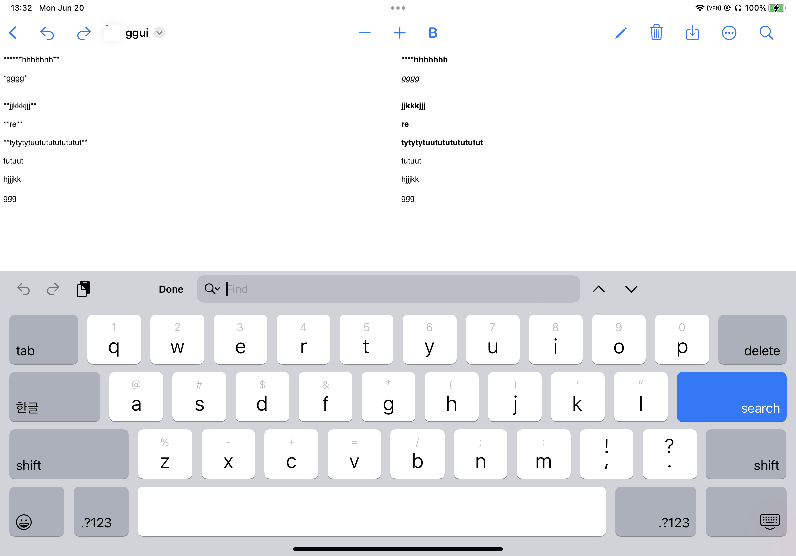

# iOS 16 - UIFindInteraction, 그리고 버그

**iOS 16.0 beta 1 (20A5283p) 기준입니다.**

iOS 16 부터 [UIFindInteraction](https://developer.apple.com/documentation/uikit/uifindinteraction?changes=latest_minor&language=_5)이 나왔습니다. 요약하면 [UIFindInteraction](https://developer.apple.com/documentation/uikit/uifindinteraction?changes=latest_minor&language=_5)는 검색 상태에 대한 컨트롤러 (present, dismiss, findNext, findPrevious 등), [UIFindSession](https://developer.apple.com/documentation/uikit/uifindsession?changes=latest_minor&language=_5)은 어떤 검색어가 검색됐는지, 어떻게 대체(replace)할 것인지가 있고 이는 반드시 subclassing을 해서 써야 합니다. 이를 subclassing해서 구현된 것으로는 [UITextSearchingFindSession](https://developer.apple.com/documentation/uikit/uitextsearchingfindsession?changes=latest_minor)이 있습니다.

`UITextView`, `UITextField`에서는 [findInteraction](https://developer.apple.com/documentation/uikit/uitextview/3975938-findinteraction)이 기본적으로 구현되어 있어서, [presentFindNavigatorShowingReplace:](https://developer.apple.com/documentation/uikit/uifindinteraction/3975832-presentfindnavigatorshowingrepla)만 호출하면 바로 검색 기능을 띄울 수 있습니다.

그러면 이걸 직접 커스텀을 해볼게요. `TestFindView`라는 Custom View를 아래처럼 만들어 볼게요.

```objc
#import <UIKit/UIKit.h>

@interface TestFindView : UIView
@property (retain, readonly, nonatomic) UIFindInteraction *findInteraction;
@end

@interface TestFindView () <UIFindInteractionDelegate, UITextSearching>
@end

@implementation TestFindView

- (instancetype)init {
    if (self = [super init]) {
        UIFindInteraction *findInteraction = [[UIFindInteraction alloc] initWithSessionDelegate:self];
        [self->_findInteraction release];
        self->_findInteraction = [findInteraction retain];
        [findInteraction release];
    }
    
    return self;
}

- (void)dealloc {
    [_findInteraction release];
    [super dealloc];
}

#pragma mark UIFindInteractionDelegate

- (UIFindSession *)findInteraction:(UIFindInteraction *)interaction sessionForView:(UIView *)view {
    UITextSearchingFindSession *session = [[UITextSearchingFindSession alloc] initWithSearchableObject:self];
    return [session autorelease];
}

- (void)findInteraction:(UIFindInteraction *)interaction didBeginFindSession:(UIFindSession *)session {
    
}

- (void)findInteraction:(UIFindInteraction *)interaction didEndFindSession:(UIFindSession *)session {
    
}

#pragma mark UITextSearching

- (void)performTextSearchWithQueryString:(NSString *)string usingOptions:(UITextSearchOptions *)options resultAggregator:(id<UITextSearchAggregator>)aggregator {
    
}

- (NSComparisonResult)compareFoundRange:(UITextRange *)foundRange toRange:(UITextRange *)toRange inDocument:(UITextSearchDocumentIdentifier)document {
    return NSOrderedSame;
}

- (NSComparisonResult)compareOrderFromDocument:(UITextSearchDocumentIdentifier)fromDocument toDocument:(UITextSearchDocumentIdentifier)toDocument {
    return NSOrderedSame;
}

- (void)decorateFoundTextRange:(UITextRange *)range inDocument:(UITextSearchDocumentIdentifier)document usingStyle:(UITextSearchFoundTextStyle)style {
    
}

- (void)clearAllDecoratedFoundText {
    
}

- (void)willHighlightFoundTextRange:(UITextRange *)range inDocument:(UITextSearchDocumentIdentifier)document {
    
}

- (void)scrollRangeToVisible:(UITextRange *)range inDocument:(UITextSearchDocumentIdentifier)document {
    
}

- (UITextRange *)selectedTextRange {
    return nil;
}

- (UITextSearchDocumentIdentifier)selectedTextSearchDocument {
    return @"";
}

- (void)replaceFoundTextInRange:(UITextRange *)range inDocument:(UITextSearchDocumentIdentifier)document withText:(NSString *)replacementText {
    
}

- (void)replaceAllOccurrencesOfQueryString:(NSString *)queryString usingOptions:(UITextSearchOptions *)options withText:(NSString *)replacementText {
    
}

- (BOOL)shouldReplaceFoundTextInRange:(UITextRange *)range inDocument:(UITextSearchDocumentIdentifier)document withText:(NSString *)replacementText {
    return YES;
}

@end
```

대충 이렇게 만들어보고... [presentFindNavigatorShowingReplace:](https://developer.apple.com/documentation/uikit/uifindinteraction/3975832-presentfindnavigatorshowingrepla)를 호출해보면

```
libc++abi: terminating with uncaught exception of type NSException
*** Terminating app due to uncaught exception 'NSInternalInconsistencyException', reason: 'Unable to find scene component for presenting find navigator. Is the view the find interaction is attached to in the view hierarchy?(View: (null), Window: (null), Scene: (null))'
terminating with uncaught exception of type NSException
```

???

`UIFindInteraction`은 자기가 속한 View를 알 수 없어서, `UIScene`을 찾을 수 없다는 뜻 같네요. 생각해보니 `UIFindInteraction`에 View를 넣어주는 걸 안 넣어줬으니 당연한 결과이긴 하네요...

근데 Documentation을 아무리 읽어봐도 이걸 넣어주는 기능이 없네요. 그러면 대체 scene 정의를 어떻게 하라는건지...??? `UITextView` 같이 기본적으로 `UIFindInteraction`을 지원하는 View는 잘 되는 걸 보아 분명 방법이 있을텐데요. 혹시나 하는 마음에 `+[UIFindInteraction _shortMethodDescription]`을 해보면

```
(lldb) expression -l objc -O -- [UIFindInteraction _shortMethodDescription]
<UIFindInteraction: 0x1e52788d0>:
in UIFindInteraction:
    Class Methods:
        + (void) _setGlobalFindBuffer:(id)arg1; (0x18a9a3f28)
        + (id) _globalFindBuffer; (0x18a9a3f38)
    Properties:
        @property (readonly, nonatomic, getter=isFindNavigatorVisible) BOOL findNavigatorVisible;
        @property (readonly, nonatomic) UIFindSession* activeFindSession;  (@synthesize activeFindSession = _activeFindSession;)
        @property (copy, nonatomic) NSString* searchText;  (@synthesize searchText = _searchText;)
        @property (copy, nonatomic) NSString* replacementText;  (@synthesize replacementText = _replacementText;)
        @property (copy, nonatomic) ^block optionsMenuProvider;  (@synthesize optionsMenuProvider = _optionsMenuProvider;)
        @property (readonly, weak, nonatomic) <UIFindInteractionDelegate>* delegate;  (@synthesize delegate = _delegate;)
        @property (readonly, weak, nonatomic) UIView* view;  (@synthesize view = _view;)
        @property (readonly) unsigned long hash;
        @property (readonly) Class superclass;
        @property (readonly, copy) NSString* description;
        @property (readonly, copy) NSString* debugDescription;
    Instance Methods:
        - (void) didMoveToView:(id)arg1; (0x18a9a3fb0)
        - (id) delegate; (0x18a9a489c)
        - (id) view; (0x18a9a4858)
        - (void) willMoveToView:(id)arg1; (0x18a9a3fac)
        - (void) .cxx_destruct; (0x18a9a48c8)
        - (id) initWithSessionDelegate:(id)arg1; (0x18a9a3f44)
        - (id) replacementText; (0x18a9a465c)
        - (void) setReplacementText:(id)arg1; (0x18a9a46a0)
        - (void) _sendDelegateDidBeginFindSession; (0x18a9a3fbc)
        - (void) _sendDelegateDidEndFindSession; (0x18a9a4054)
        - (id) _createActiveFindSessionIfNecessary; (0x18a9a40ec)
        - (id) _findNavigatorSceneComponent; (0x18a9a41f0)
        - (void) presentFindNavigatorShowingReplace:(BOOL)arg1; (0x18a9a424c)
        - (void) dismissFindNavigator; (0x18a9a43b4)
        - (id) _currentFindNavigatorController; (0x18a9a43fc)
        - (void) updateResultCount; (0x18a9a4448)
        - (void) findNext; (0x18a9a4488)
        - (void) findPrevious; (0x18a9a44cc)
        - (BOOL) isFindNavigatorVisible; (0x18a9a4510)
        - (id) searchText; (0x18a9a4548)
        - (void) setSearchText:(id)arg1; (0x18a9a458c)
        - (id) searchableObject; (0x18a9a4770)
        - (void) setSearchableObject:(id)arg1; (0x18a9a47d4)
        - (void) _presentFindNavigatorShowingReplace:(BOOL)arg1; (0x18a9a4854)
        - (id) activeFindSession; (0x18a9a4884)
        - (^block) optionsMenuProvider; (0x18a9a488c)
        - (void) setOptionsMenuProvider:(^block)arg1; (0x18a9a4894)
(NSObject ...)
```

내부적으로 `_view`라는 ivar가 존재하는데 아마 [UIInteraction.view](https://developer.apple.com/documentation/uikit/uiinteraction/2890990-view)와 synthesize하는 의도같네요. 근데 이걸 정의해주는 방법이 없네요...??? 한 번 KVC으로 강제로 주입해 볼게요.

```objc
@implementation TestFindView

- (instancetype)init {
    if (self = [super init]) {
        UIFindInteraction *findInteraction = [[UIFindInteraction alloc] initWithSessionDelegate:self];
        [findInteraction setValue:self forKey:@"_view"];
        [self->_findInteraction release];
        self->_findInteraction = [findInteraction retain];
        [findInteraction release];
    }
    
    return self;
}

@end
```

이렇게 하니까 잘 되네요. 뭔가 SDK 설계가 잘못 된 것 같은데;; 제가 잘못한 걸 수도 있겠지만 개선이 되어야 할 것 같네요.


