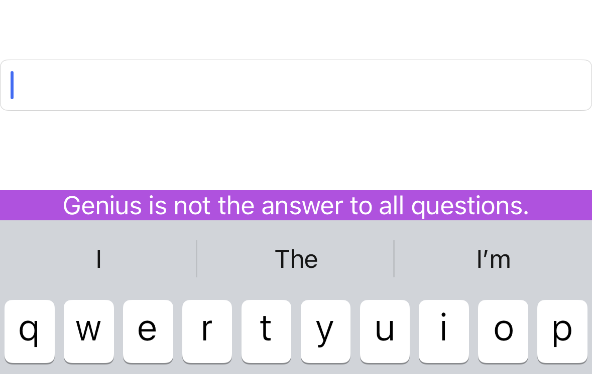
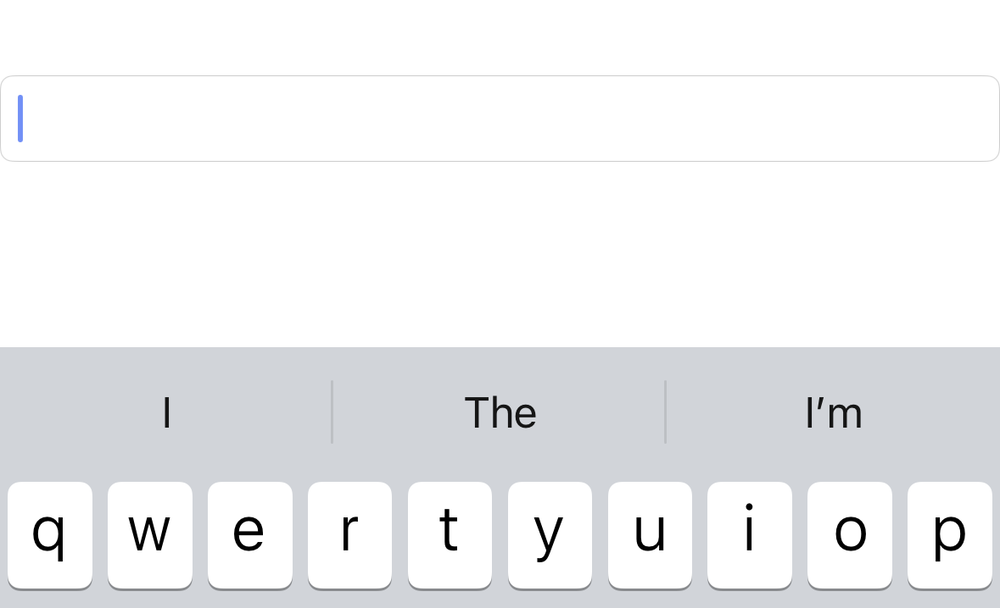
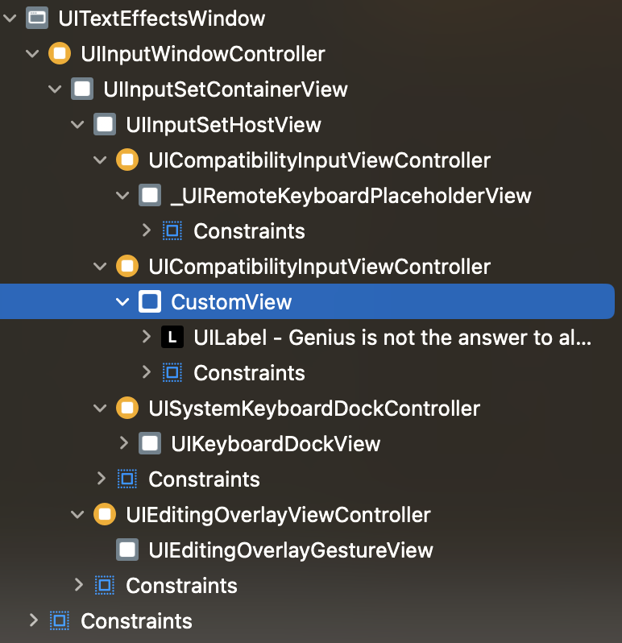
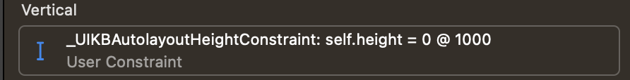

# inputAccessoryView에서 Layout이 안 잡히는 문제해결

> - step-by-step guide가 아닙니다.
>
> - 과정 다 필요 없고 해답만 원하시는 분에게 : `-[UIView setTranslatesAutoresizingMaskIntoConstraints:NO]` 호출하세요.

`UIResponder`에는 [`-[UIResponder inputAccessoryView]`](https://developer.apple.com/documentation/uikit/uiresponder/1621119-inputaccessoryview)라는 기능이 존재합니다. 예를 들어 `UITextField`의 경우 키보드가 올라 올 경우 (First Responder가 될 경우) 아래와 같이 키보드 위에 View를 띄울 수 있습니다.

```objc
@interface ViewController : UIViewController
@property (retain, nonatomic) IBOutlet UITextField *textField;
@end

@implementation ViewController

- (void)dealloc {
    [_textField release];
    [super dealloc];
}

- (void)viewDidLoad {
    [super viewDidLoad];
    
    UILabel *label = [UILabel new];
    label.text = @"Genius is not the answer to all questions.";
    label.textAlignment = NSTextAlignmentCenter;
    label.textColor = UIColor.whiteColor;
    label.backgroundColor = UIColor.systemPurpleColor;
    
    _textField.inputAccessoryView = label;
    [label sizeToFit];
    
    [label release];
}

@end
```



만약에 `UILabel` 대신에 Custom View를 넣어주면

```objc
@interface CustomView : UIView
@end

@implementation CustomView

- (instancetype)initWithFrame:(CGRect)frame {
    if (self = [super initWithFrame:frame]) {
        UILabel *label = [UILabel new];
        label.text = @"Genius is not the answer to all questions.";
        label.textAlignment = NSTextAlignmentCenter;
        label.textColor = UIColor.whiteColor;
        label.backgroundColor = UIColor.systemPurpleColor;
        label.translatesAutoresizingMaskIntoConstraints = NO;
        
        [self addSubview:label];
        [NSLayoutConstraint activateConstraints:@[
            [label.topAnchor constraintEqualToAnchor:self.topAnchor],
            [label.leadingAnchor constraintEqualToAnchor:self.leadingAnchor],
            [label.trailingAnchor constraintEqualToAnchor:self.trailingAnchor],
            [label.bottomAnchor constraintEqualToAnchor:self.bottomAnchor]
        ]];
        
        [label release];
    }
    
    return self;
}

@end

// ... -[ViewController viewDidLoad]에서

@implementation ViewController

- (void)viewDidLoad {
    [super viewDidLoad];
    
    CustomView *customView = [CustomView new];
    _textField.inputAccessoryView = customView;
    [customView layoutIfNeeded];
    [customView sizeToFit];
    
    [customView release];
}

@end
```

이렇게 넣어주면... 아래 사진처럼 작동하지 않습니다. (???)



하지만 아래 사진을 보면 분명 View는 추가되어 있습니다. 다만 Height가 0이 나오며, 이는 `_UIKBAutolayoutHeightConstraint`라는 identifier와 Height Attribute를 가졌으며 Constant가 0인 Constraint 때문에 발생하는 현상으로 보입니다.





lldb를 통해 해당 Constraint를 강제로 끄면 정상적으로 작동합니다. 하지만 이건 근본적인 문제해결 방법이 아닙니다.

```
(lldb) expression -l objc -O -- [0x600001a9bc50 setActive:NO]
0x0000000000000001
```


저는 두 가지 가설이 떠올랐습니다.

- UIKit에서는 `_UIKBAutolayoutHeightConstraint`라는 Constraint로 Accessory View의 높이를 강제한다. 하지만 무언가의 이유로 0이 나온다. 0이 안 나오게 해야 하는 방법을 찾아야 한다.
    - 하지만 내 코드는 Auto Layout에 문제가 없다. 그냥 Custom View 하나에 Label을 추가한 거잖아?
- `_UIKBAutolayoutHeightConstraint`라는 Constraint를 없애 버리는 방법이 있을 것이다. 내가 그 방법으로 위에서 해결했으니까.

우선 디버깅을 위해 아래처럼 breakpoint를 설정합니다. 해당 Constraint는 `_UIKBAutolayoutHeightConstraint`라는 identifier를 가지고 있기 때문에 `-[NSLayoutConstraint setIdetifier:]`가 불릴 것입니다.

> dyld 상에 Symbol Table이 load되지 않았다면 아래 명령어는 작동하지 않습니다. 이럴 경우 [`class_getMethodImplementation`](https://developer.apple.com/documentation/objectivec/1418811-class_getmethodimplementation)를 통해 IMP의 메모리 주소를 얻어 온 뒤, 메모리 주소를 기반으로 한 breakpoint를 생성하시면 됩니다.
>
> 아니면 `-[NSObject(IvarDescription) _shortMethodDescription]`를 통해 IMP 주소 얻어 오셔도 되고요.

```
(lldb) breakpoint set -n '-[NSLayoutConstraint setIdentifier:]' -c '(BOOL)[$x2 isEqualToString:@"_UIKBAutolayoutHeightConstraint"]'
```

확인해보면 예상대로 pause가 걸립니다. backtrace를 확인해보면

```
(lldb) bt
* thread #1, queue = 'com.apple.main-thread', stop reason = breakpoint 1.1
  * frame #0: 0x00000001a88ca8a8 CoreAutoLayout`-[NSLayoutConstraint setIdentifier:]
    frame #1: 0x000000010bc1b928 UIKitCore`-[UIView(UIKB_UIViewExtras) _convertToAutolayoutSizingIfNecessary] + 128
    frame #2: 0x000000010bc53514 UIKitCore`-[UICompatibilityInputViewController generateCompatibleSizeConstraintsIfNecessary] + 224
    
    # 생략...
```

`frame #1` (`-[UIView(UIKB_UIViewExtras) _convertToAutolayoutSizingIfNecessary]`)을 보면 될 것 같네요.

```
(lldb) frame select 1
frame #1: 0x000000010bc1b928 UIKitCore`-[UIView(UIKB_UIViewExtras) _convertToAutolayoutSizingIfNecessary] + 128
UIKitCore`-[UIView(UIKB_UIViewExtras) _convertToAutolayoutSizingIfNecessary]:
->  0x10bc1b928 <+128>: mov    x0, x19
    0x10bc1b92c <+132>: ldr    x2, [sp, #0x8]
    0x10bc1b930 <+136>: bl     0x10caee380               ; objc_msgSend$addConstraint:
    0x10bc1b934 <+140>: ldr    x0, [sp, #0x8]
    0x10bc1b938 <+144>: ldp    x29, x30, [sp, #0x30]
    0x10bc1b93c <+148>: ldp    x20, x19, [sp, #0x20]
    0x10bc1b940 <+152>: ldp    d9, d8, [sp, #0x10]
    0x10bc1b944 <+156>: add    sp, sp, #0x40
(lldb) p/x (long long)0x000000010bc1b928 - 128
(long) $0 = 0x000000010bc1b8a8
```

`-[UIView(UIKB_UIViewExtras) _convertToAutolayoutSizingIfNecessary]`의 IMP의 메모리 주소는 `0x000000010bc1b8a8`이므로 assembly를 보면

```
(lldb) disassemble -a 0x000000010bc1b8a8
UIKitCore`-[UIView(UIKB_UIViewExtras) _convertToAutolayoutSizingIfNecessary]:
    0x10bc1b8a8 <+0>:   sub    sp, sp, #0x40
    0x10bc1b8ac <+4>:   stp    d9, d8, [sp, #0x10]
    0x10bc1b8b0 <+8>:   stp    x20, x19, [sp, #0x20]
    0x10bc1b8b4 <+12>:  stp    x29, x30, [sp, #0x30]
    0x10bc1b8b8 <+16>:  add    x29, sp, #0x30
    0x10bc1b8bc <+20>:  mov    x19, x0
    0x10bc1b8c0 <+24>:  bl     0x10cbd5f40               ; objc_msgSend$translatesAutoresizingMaskIntoConstraints
    0x10bc1b8c4 <+28>:  cbz    w0, 0x10bc1b94c           ; <+164>
    0x10bc1b8c8 <+32>:  mov    x0, x19
    0x10bc1b8cc <+36>:  bl     0x10cafea60               ; objc_msgSend$bounds
    0x10bc1b8d0 <+40>:  fmov   d8, d3
    0x10bc1b8d4 <+44>:  mov    x0, x19
    0x10bc1b8d8 <+48>:  mov    w2, #0x0
    0x10bc1b8dc <+52>:  bl     0x10cbb6680               ; objc_msgSend$setTranslatesAutoresizingMaskIntoConstraints:
    0x10bc1b8e0 <+56>:  mov    x0, x19
    0x10bc1b8e4 <+60>:  bl     0x10caf97e0               ; objc_msgSend$autoresizingMask
    0x10bc1b8e8 <+64>:  tbnz   w0, #0x4, 0x10bc1b94c     ; <+164>
    0x10bc1b8ec <+68>:  adrp   x8, 4909
    0x10bc1b8f0 <+72>:  ldr    x0, [x8, #0x538]
    0x10bc1b8f4 <+76>:  movi   d0, #0000000000000000
    0x10bc1b8f8 <+80>:  mov    x2, x19
    0x10bc1b8fc <+84>:  mov    w3, #0x8
    0x10bc1b900 <+88>:  mov    x4, #0x0
    0x10bc1b904 <+92>:  mov    x5, #0x0
    0x10bc1b908 <+96>:  mov    x6, #0x0
    0x10bc1b90c <+100>: fmov   d1, d8
    0x10bc1b910 <+104>: bl     0x10cb0b8c0               ; objc_msgSend$constraintWithItem:attribute:relatedBy:toItem:attribute:multiplier:constant:
    0x10bc1b914 <+108>: bl     0x10c4d9e04               ; symbol stub for: objc_claimAutoreleasedReturnValue
    0x10bc1b918 <+112>: str    x0, [sp, #0x8]
    0x10bc1b91c <+116>: adrp   x2, 4183
    0x10bc1b920 <+120>: add    x2, x2, #0x970            ; @"_UIKBAutolayoutHeightConstraint"
    0x10bc1b924 <+124>: bl     0x10cb99260               ; objc_msgSend$setIdentifier:
->  0x10bc1b928 <+128>: mov    x0, x19
    0x10bc1b92c <+132>: ldr    x2, [sp, #0x8]
    0x10bc1b930 <+136>: bl     0x10caee380               ; objc_msgSend$addConstraint:
    0x10bc1b934 <+140>: ldr    x0, [sp, #0x8]
    0x10bc1b938 <+144>: ldp    x29, x30, [sp, #0x30]
    0x10bc1b93c <+148>: ldp    x20, x19, [sp, #0x20]
    0x10bc1b940 <+152>: ldp    d9, d8, [sp, #0x10]
    0x10bc1b944 <+156>: add    sp, sp, #0x40
    0x10bc1b948 <+160>: b      0x10c4d9f30               ; symbol stub for: objc_release
    0x10bc1b94c <+164>: ldp    x29, x30, [sp, #0x30]
    0x10bc1b950 <+168>: ldp    x20, x19, [sp, #0x20]
    0x10bc1b954 <+172>: ldp    d9, d8, [sp, #0x10]
    0x10bc1b958 <+176>: add    sp, sp, #0x40
    0x10bc1b95c <+180>: ret    
```

다행히 짧네요. 이해를 돕기 위해 pseudo code를 작성해보면 (대충 쓴거니 참고만)

```objc
@implementation UIView (UIKB_UIViewExtras)

- (void)_convertToAutolayoutSizingIfNecessary {
    if (!self.inputAccessoryView.translatesAutoresizingMaskIntoConstraints) return;
    
    CGRect inputAccessoryViewBounds = self.inputAccessoryView.bounds;
    self.inputAccessoryView.translatesAutoresizingMaskIntoConstraints = NO;
    
    UIViewAutoresizing autoresizingMask = self.inputAccessoryView.autoresizingMask;
    /* autoresizingMask 가져와서 어쩌구 저쩌구 하는듯? 중요한 부분은 아닌 것 같으니 생략 */
    
    // 높이 정해주는 constraint. 위에서 구한 bounds로 정하는듯?
    NSLayoutConstraint *constraint = [NSLayoutConstraint constraintWithItem:/* */
                                                                  attribute:/* */
                                                                  relatedBy:/* */
                                                                     toItem:/* */
                                                                  attribute:/* */
                                                                 multiplier:/* */
                                                                   constant:/* */];
    
    constraint.identifier = @"_UIKBAutolayoutHeightConstraint";
    [self.inputAccessoryView addConstraint:constraint];
}

@end

```

위처럼 `translatesAutoresizingMaskIntoConstraints`이 `NO`이면 `_UIKBAutolayoutHeightConstraint`의 생성을 막을 수 있는 것 같네요.

ㅇㅋ 해보죠

```objc
@implementation ViewController

- (void)viewDidLoad {
    [super viewDidLoad];
    
    CustomView *customView = [CustomView new];
    
    // 이렇게
    customView.translatesAutoresizingMaskIntoConstraints = NO;
    
    _textField.inputAccessoryView = customView;
    [customView layoutIfNeeded];
    [customView sizeToFit];
    
    [customView release];
}

@end
```


잘 되네요...

애플이 이 내용에 대해 문서화를 안해둔 것 같고 검색해보니 피해자가 많은 것 같네요.

iOS 8 이후로 발생한 문제같은데 아마 Custom Keyboard가 등장하면서 키보드 로직이 XPC로 옮겨지면서 리팩토링되면서 이런 문제가 발생한 것 같은데...

애플이 귀찮아서 안 고치는건지, 아니면 이게 정상동작인데 제가 UIKit에 대해 잘못 이해해서 그런건진 모르겠네요.
