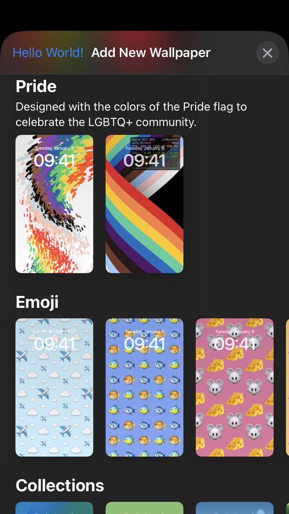

# iOS 16 - PosterBoard에 대해



iOS 16에서 배경화면 기능이 완전히 리뉴얼 되었습니다. 이전에는 배경화면 기능이 SpringBoard에서 담당하고 있었다면, iOS 16 부터는 PosterBoard가 담당합니다.

PosterBoard는 iOS 16에서 새로 추가된 [ExtensionFoundation](https://developer.apple.com/documentation/extensionfoundation)와 [ExtensionKit](https://developer.apple.com/documentation/extensionkit) API들 기반으로 작동합니다. XPC를 통해 Remote View 방식으로 배경화면이 랜더링되는 방식입니다.

이 글에서는 PosterBoard에 대해 조사한 정보들을 두서 없이 적는 글입니다. 😥

## 내용

- iOS 16.5 부터 새로 추가된 Pride 배경화면은 Metal 기반으로 작동한다.

    - fragment는 vertex 기반으로 결정된다. `/System/Library/PrivateFrameworks/PridePoster.framework/particle.usdc` 파일에서 vertex에 transform을 먹일 때마다 fragment가 바뀌는 것을 알 수 있다. 정확한 원리는 모르겠다. Metal Shader를 reverse engineering하는 방법은 아직 모르기에...
    
    - iOS 16.5 기준, `0x204e1f680`에서 rendering을 담당한다.
    
    - Accessibility에서 `Reduce Motion`이 활성화되어 있을 경우 애니메이션이 멈추는 구조다. 하지만 애니메이션이 멈춰 있어도 rendering을 계속 시도한다. 버그인듯? Battery Drain 발생할 것 같은데...
    
    - `-[_TtC20PridePosterExtension17DrawingController renderer:didUpdateEnvironment:withTransition:]`은 `PRPosterEnvironmentImpl`이 업데이트 될 때마다 불린다. 유저가 잠금해제 할 때의 애니메이션을 이걸로 구현하고 있다.
    
        ```
        (lldb) breakpoint set -a 0x1048f9ac8 -C 'expression -l objc -O -- $x3' -G1
        
        (lldb)  expression -l objc -O -- $x3
        <PRPosterEnvironmentImpl: 0x282e849a0{
            uiStyle: dark;
            mode: none;
            mode: Full;
            unlockProgress: 0.260;
            backlightProgress: 1.000;
            wakeSourceIsSwipeToUnlock: NO;
            significantEventsCounter: 0;
        }>
        (lldb)  expression -l objc -O -- $x3
        <PRPosterEnvironmentImpl: 0x282e98620{
            uiStyle: dark;
            mode: none;
            mode: Full;
            unlockProgress: 0.253;
            backlightProgress: 1.000;
            wakeSourceIsSwipeToUnlock: NO;
            significantEventsCounter: 0;
        }>
        (lldb)  expression -l objc -O -- $x3
        <PRPosterEnvironmentImpl: 0x282e956c0{
            uiStyle: dark;
            mode: none;
            mode: Full;
            unlockProgress: 0.235;
            backlightProgress: 1.000;
            wakeSourceIsSwipeToUnlock: NO;
            significantEventsCounter: 0;
        }>
        ```
        
- `com.apple.PosterBoardFramework`에 아래 코드 삽입하면 맨 위에 있는 사진처럼 `UIBarButtomItem` 추가할 수 있음 ㅎ

    ```objc
    #import <UIKit/UIKit.h>
    #import <substrate.h>

    namespace cppb {
        namespace PBFPosterGalleryPreviewViewController {
            namespace original {
                void (*viewDidLoad)(UIViewController *self, SEL _cmd);
            };

            namespace custom {
                void viewDidLoad(UIViewController *self, SEL _cmd) {
                    cppb::PBFPosterGalleryPreviewViewController::original::viewDidLoad(self, _cmd);

                    // __weak typeof(self) weakSelf = self;
                    UIAction *action = [UIAction actionWithTitle:@"Hello World!" image:nil identifier:nil handler:^(__kindof UIAction * _Nonnull action) {
                        
                    }];
                    
                    UIBarButtonItem *barButtonItem = [[UIBarButtonItem alloc] initWithPrimaryAction:action];
                    
                    [self.navigationItem setLeftBarButtonItem:barButtonItem];
                };
            };
        };
    };

    __attribute__((constructor)) static void init() {
        MSHookMessageEx(
            NSClassFromString(@"_PBFGalleryCollectionViewController"),
            @selector(viewDidLoad),
            reinterpret_cast<IMP>(&(cppb::PBFPosterGalleryPreviewViewController::custom::viewDidLoad)),
            reinterpret_cast<IMP *>(&(cppb::PBFPosterGalleryPreviewViewController::original::viewDidLoad))
            );
    }
    ```
    
- PosterBoard에 Custom Wallpaper를 제작하고 싶다면 아래 과정들이 있어야 한다.

    - Xcode에서 Host App와 아무 NSExtension Target을 생성한다.
    
        - Info.plist에 아래 정보들을 삽입한다.
        
            ```
            <key>NSExtension</key>
            <dict>
                <key>EXAppExtensionAttributes</key>
                <dict>
                    <key>EXExtensionPointIdentifier</key>
                    <string>com.apple.posterkit.provider</string>
                </dict>
                <key>NSExtensionPointIdentifier</key>
                <string>com.apple.posterkit.provider</string>
            </dict>
            <key>UIApplicationShowsViewsWhileLocked</key>
            <true/>
            ```
            
        - 아래와 같은 Private Entitlements를 탑재한다. nvram에 `amfi_get_out_of_my_way=0x1` flag가 있어야 할 것이다. 아마 PosterBoard에서 [`setCodeSigningRequirement(_:)`](https://developer.apple.com/documentation/foundation/nsxpcconnection/3943309-setcodesigningrequirement)를 통해 `com.apple.posterkit.provider`를 요구할 것이다.
        
            ```
            <key>com.apple.posterkit.provider</key>
            <true/>
            <key>com.apple.posterkit.enhanced-memory-limits</key>
            <true/>
            <key>com.apple.QuartzCore.secure-mode</key>
            <true/>
            ```
            
        - PosterKit (`/System/Library/PrivateFrameworks/PosterKit.framework`)을 탑재한다. 사용법은 나도 몰루 ㅎ
        
    - PosterBoard에서 위에서 생성한 NSExtension을 load해야 한다.
    
        - 난 이걸 어떻게 하는지 모르겠음. macOS의 경우 [`EXAppExtensionBrowserViewController`](https://developer.apple.com/documentation/extensionkit/exappextensionbrowserviewcontroller)로 쉽게 load 할 수 있지만 iOS는 Private API를 아무리 찾아봐도 도저히 발견을 못하겠음... 아마 Kernel 쪽을 직접 건드려야 할 것 같은데... 방법 아시는 분?
        
        - 일단 load하는 방법을 도저히 몰라서 포기한 상태 -_-;; 만약 load가 된다면 `-[PBFPosterExtensionDataStore knownExtensions]`를 통해 load된 extension들을 조회할 수 있음
            
            ```
            (lldb) expression -l objc -O -- [0x99d113390 knownExtensions]
            <__NSArrayI_Transfer 0x2827742c0>(
            <PRPosterExtension: 0x280528320; DFFD7A7D-0156-439B-AC9A-50222410D2D2; pr_posterExtensionBundleIdentifier: com.apple.GradientPoster.GradientPosterExtension; pr_localizedName: Color>,
            <PRPosterExtension: 0x280524e10; 39CFD4B6-DAAA-408D-AFE0-0DEDF06208D1; pr_posterExtensionBundleIdentifier: com.apple.WallpaperKit.CollectionsPoster; pr_localizedName: Collections>,
            <PRPosterExtension: 0x2805205a0; CD766E8A-484C-4334-8787-329AF5F73DE4; pr_posterExtensionBundleIdentifier: com.apple.WatchFacesWallpaperSupport.ExtragalacticPoster; pr_localizedName: Unity>,
            <PRPosterExtension: 0x280520410; 08BCBDDF-81BC-43E8-AE65-9F491EE42B45; pr_posterExtensionBundleIdentifier: com.apple.weather.poster; pr_localizedName: Weather>,
            <PRPosterExtension: 0x2805200f0; 40F3E4F0-C8D3-47A0-ABAA-63C916060164; pr_posterExtensionBundleIdentifier: com.apple.EmojiPoster.EmojiPosterExtension; pr_localizedName: Emoji>,
            <PRPosterExtension: 0x280528190; 1C8BAFC9-EAB9-4164-8DCA-C4FF010450D7; pr_posterExtensionBundleIdentifier: com.apple.NanoUniverse.AegirProxyApp.AegirPoster; pr_localizedName: Astronomy>,
            <PRPosterExtension: 0x2805202d0; 6CCEADF6-CA62-459B-89D5-3F39FE0E44D6; pr_posterExtensionBundleIdentifier: com.apple.PaperBoard.LegacyPoster; pr_localizedName: LegacyPoster>,
            <PRPosterExtension: 0x280520190; 74D5E79A-D811-48C9-8D34-CCD13129FC35; pr_posterExtensionBundleIdentifier: com.apple.PridePoster.PridePosterExtension; pr_localizedName: Pride>,
            <PRPosterExtension: 0x2805204b0; 93F2D564-F351-4DED-A1AD-E8656A4C9944; pr_posterExtensionBundleIdentifier: com.apple.UnityPoster.UnityPosterExtension; pr_localizedName: Unity>,
            <PRPosterExtension: 0x280524d20; 4D6F6813-50F7-42C0-9A34-DDF49DA546B6; pr_posterExtensionBundleIdentifier: com.apple.PhotosUIPrivate.PhotosPosterProvider; pr_localizedName: Photos>
            )
            ```

- PosterBoard의 사용자 데이터는 `/var/mobile/Containers/Data/Application/${UUID}/Library/Application Support/PBPosterExtensionDataSource`에 저장된다.

    - 위 URL은 `-[PBFPosterExtensionDataStore initWithURL:runtimeAssertionProvider:extensionProvider:observer:wasMigrationJustPerformed:]`에서 URL로 들어 온다.
    
    - 모든 데이터는 `NSKeyedArchiver`와 `NSKeyedUnarchiver`로 저장되며 `NSSecureCoding`을 지원한다.
    
    - `SelectedConfigurationIdentifier.plist`는 현재 선택된 Poster Configuration의 UUID를 가지고 있다. 현재 배경화면!
    
    - `SwitcherConfigurationOrdering.plist`는 모든 Poster Configuration의 UUID 목록을 담고 있다.
    
    - `Extensions` 폴더에서 모든 Extension들의 Poster Configuration 정보들을 볼 수 있다.
