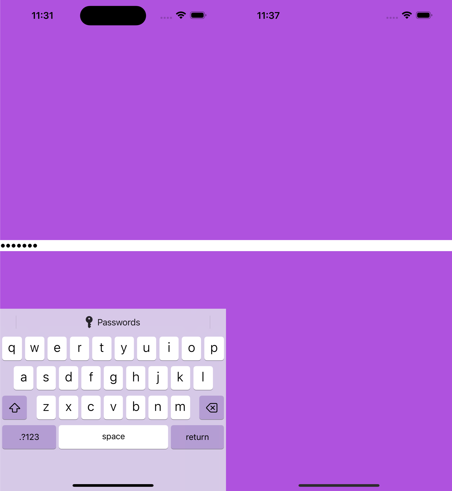
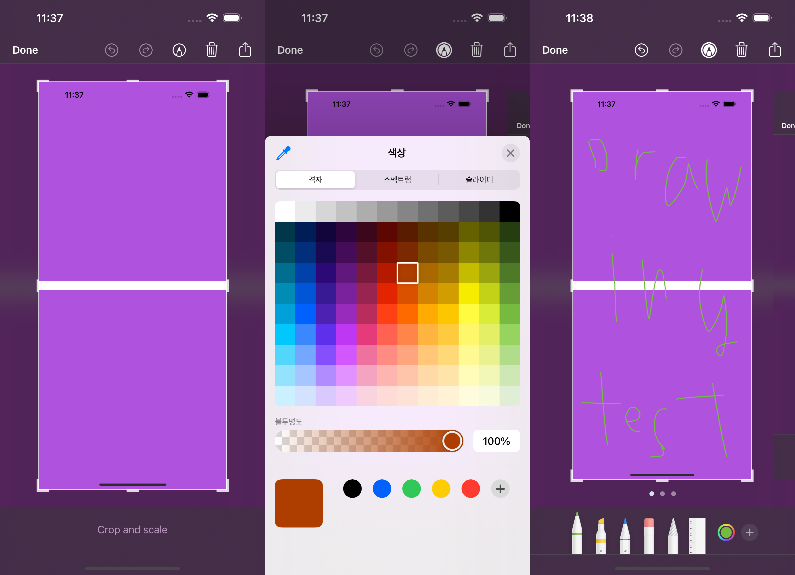

# iOS 16 - Screenshot 원리 학습

그냥 두서 없이 적는 글

## Legacy API

SpringBoard를 reverse engineering 해봤다면 알 사람은 알듯

iOS 16 기준으로 작동하는 API이긴 한데 호출하는 곳은 없어보임

### `SBScreenshotManager`

- `SpringBoard` (`UIApplication`)에서 `-[SpringBoard screenManager]`로 얻어 올 수 있음

- `-[SBScreenshotManager takeScreenshot]`하면 Screenshot 찍힘

### `SBScreenFlash`

`[[SBScreenFlash mainScreenFlasher] flashWhiteWithCompletion:nil]`로 화면 깜빡거리게 할 수 있고

`[[SBScreenFlash mainScreenFlasher] flashColor:[UIColor purpleColor] withCompletion:nil]` 이런 식으로 색 지정도 할 수 있음

## `ScreenshotService`

iOS 16 이후로 등장한 것 같은데 확실치 않음

홈버튼 + 전원버튼 눌러서 Screenshot 찍을 때 이 framework가 사용됨

Screenshot 찍는거 + 좌측 하단 thumbnail view + editor view 등의 역할을 가짐

### `SSScreenCapturer`

- `-[SSScreenCapturer takeScreenshot]` 발동하면 내부적으로 `-[SSScreenCapturer _preheatAndTakeScreenshotIfPossibleWithOptionsCollection:presentationOptions:appleInternalOptions:]` 발동됨

- 내부적으로 `_UIRenderDisplay`을 호출하는 구조인데 이게 뭔지 모르겠음. `_UIRenderDisplay`이 IOSurface를 반환하고, 이걸로 `-[UIImage _initWithIOSurface:scale:orientation:]`를 호출해서 Screenshot UIImage를 만드는 구조임

## 궁금증

- iOS 16에서 UITextField secureTextEntry 같은건 무슨 원리인지 모르겠음

- `_UIRenderDisplay`에서 IOSurface가 어떻게 만들어 지는지를 분석하면 될 것 같은데 TODO

## Simulator에서 실제 기기와 똑같은 Screenshot 찍기

Simulator에서 Screenshot을 찍으면 좌측처럼 Secure Field가 노출되고 Dynamic Island도 그대로 보이는데, 우측처럼 실제 기기에서 Screenhot 찍는 것 처럼 하려면 위에서 설명한 `SSScreenCapturer` 쓰면 됨

1. [SIP 비활성화](https://developer.apple.com/documentation/security/disabling_and_enabling_system_integrity_protection)

2. Simulator 실행 및 lldb attach : `lldb -n SpringBoard`

3. `process interrupt`

4. `expression -l objc -O -- [[UIApplication sharedApplication] takeScreenshot]`

5. `c`

6. 사진 추출 : https://stackoverflow.com/a/26158844/17473716

하면 Screenshot 찍힘

아래 사진처럼 실제 기기처럼 편집도 가능

