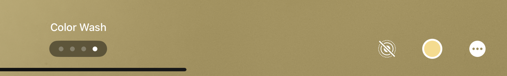

# [iOS 17] Live Photo 배경화면에 대해


iOS 17 부터 Live Photo를 배경화면으로 정할 수 있다. (사실 예전부터 있던거긴 한데 iOS 16 때 사라졌다가 다시 생김)

하지만 이상한 점을 발견했다.

- 구형 기기에서는 안 된다. (아니 원래 되던건데...?)

- 일부 Live Photo만 가능하다. [출처](https://www.clien.net/service/board/cm_iphonien/18200450)

Reverse Engineering을 해보니 `-[PIParallaxSegmentationItem isSettlingEffectAvailable]` (PhotoImaging API)에서 `YES`가 나올 때만 가능한 모양이다.

아마 Vision을 통해서 Live Photo 영상을 분석하여 배경화면으로 쓰기 적합한 부분만 Trim하고 시점을 변경해주는 것이 아닐까? 싶다. 암튼 이런 머신러닝이 들어가기 때문에 구형 기기에서는 안 되며, 부적합다고 판단되는 사진들은 배경화면으로 쓸 수 없는 것이다.

한 번 iPad Pro 10.5 (2017)에서 `-[PIParallaxSegmentationItem isSettlingEffectAvailable]`를 hooking해서 `YES`를 반환하도록 강제하니 튕겨버린다... 참고로 `PhotosPosterProvider` (`com.apple.PhotosUIPrivate.PhotosPosterProvider`) target을 hooking해야 한다.

```objc
#import <Foundation/Foundation.h>
#import <substrate.h>

namespace PUParallaxLayerStackViewModel {
    namespace canEnableSettlingEffect {
        BOOL (*original)(id, SEL);
        BOOL custom(id self, SEL _cmd) {
            return YES;
        }
    }

    namespace canCreateSettlingEffectLayerView {
        BOOL (*original)(id, SEL);
        BOOL custom(id self, SEL _cmd) {
            return YES;
        }
    }
}

namespace PUWallpaperPosterEditorController{
    namespace _canEnableDepthEffect {
        BOOL (*original)(id, SEL);
        BOOL custom(id self, SEL _cmd) {
            return YES;
        }
    }
}

namespace PIParallaxSegmentationItem{
    namespace isSettlingEffectAvailable {
        BOOL (*original)(id, SEL);
        BOOL custom(id self, SEL _cmd) {
            return YES;
        }
    }
}

__attribute__((constructor)) static void init() {
    @autoreleasepool {
        // MSHookMessageEx(
        //     NSClassFromString(@"PUParallaxLayerStackViewModel"),
        //     NSSelectorFromString(@"canEnableSettlingEffect"),
        //     reinterpret_cast<IMP>(PUParallaxLayerStackViewModel::canEnableSettlingEffect::custom),
        //     reinterpret_cast<IMP *>(PUParallaxLayerStackViewModel::canEnableSettlingEffect::original)
        //     );

        // MSHookMessageEx(
        //     NSClassFromString(@"PUParallaxLayerStackViewModel"),
        //     NSSelectorFromString(@"canCreateSettlingEffectLayerView"),
        //     reinterpret_cast<IMP>(PUParallaxLayerStackViewModel::canCreateSettlingEffectLayerView::custom),
        //     reinterpret_cast<IMP *>(PUParallaxLayerStackViewModel::canCreateSettlingEffectLayerView::original)
        //     );

        // MSHookMessageEx(
        //     NSClassFromString(@"PUWallpaperPosterEditorController"),
        //     NSSelectorFromString(@"_canEnableDepthEffect"),
        //     reinterpret_cast<IMP>(PUWallpaperPosterEditorController::_canEnableDepthEffect::custom),
        //     reinterpret_cast<IMP *>(PUWallpaperPosterEditorController::_canEnableDepthEffect::original)
        //     );

        MSHookMessageEx(
            NSClassFromString(@"PIParallaxSegmentationItem"),
            NSSelectorFromString(@"isSettlingEffectAvailable"),
            reinterpret_cast<IMP>(PIParallaxSegmentationItem::isSettlingEffectAvailable::custom),
            reinterpret_cast<IMP *>(PIParallaxSegmentationItem::isSettlingEffectAvailable::original)
            );
    }
}
```

하드웨어 이슈로 안 되는 것 같다... 포기 ㅎ

Reverse Engineering하면서 `PhotosPosterProvider`에 대해 알게 된 점을 적자면

## `-[PUParallaxLayerStackViewModel showsDebugHUD]`

Debug HUD를 볼 수 있음

[HUDEnablerPU](https://github.com/pookjw/HUDEnablerPU)


## `PhotosPosterProvider`

`PhotosPosterProvider`은 ExtensionKit 기반으로 작동하는 `PhotosUIPrivate` Extension이다. PosterBoard와 XPC로 통신한다.

`PhotosUIPrivate`은 `PhotosUI`의 Private Framework다. 엄청 방대한 Framework이며 Poster 기능을 포함한다.

### 하단 버튼들



위 사진을 보면 하단에 3개의 버튼이 있다. PosterKit에서는 하단에 3개의 버튼을 지원한다.

위는 `PREditorCombinedRootViewController`라는 View Controller이며 이는 `PREditorRootViewController`를 subclassing한다. `PREditorRootViewController`은 아래와 같이 3개의 버튼을 가진다.

```objc
-[PREditorRootViewController primaryActionButton]
-[PREditorRootViewController secondaryActionButton]
-[PREditorRootViewController actionsMenuButton]
```

모든 버튼들은 `UIAction`을 통해 속성을 정의한다.

`primaryActionButton`의 Action은 어디서 생성되는건지 모르겠다. `primaryActionButton`은 Live Photo (Settling Effect)을 toggle한다. 이 버튼의 Action은 `-[PUWallpaperPosterEditorController _toggleSettlingEffectAction]`에서 생성되며, 이 Action은 `target = self`,  `action = _toggleSettlingEffectEnabled`다.

`secondaryActionButton`와 `actionsMenuButton`의 Action은 `-[PUWallpaperPosterEditorController trailingMenuElementsForEditor:]`에서 생성된다. `NSMutableArray`를 반환한다. `secondaryActionButton`은 현재 페이지가 컬러 필터일 경우에만 생성되며, `actionsMenuButton`은 항상 생성된다. `-[PREditorRootViewController scrollView]`를 스크롤 할 때마다 reload 된다.

## `PUWallpaperPosterEditDebugViewController`

내부 개발용 View Controller인듯?

띄워봤더니 일반 View랑 똑같이 생김

`-tapToRadarAction`이라는게 있긴 한데 `nil` 반환함

## `-[PUWallpaperPosterEditorController _enableSettlingEffect]`

Settling Effect (Live Photo) 효과를 켜는 method

`-[PUParallaxLayerStackViewModel canEnableSettlingEffect]`가 YES일 때만 가능하며, `-canEnableSettlingEffect`은 위에서 설명한 `-[PIParallaxSegmentationItem isSettlingEffectAvailable]`로 가능하다.

`-isSettlingEffectAvailable`에 상관 없이 강제로 `-[PUParallaxLayerStackViewModel canEnableSettlingEffect]`에서 YES를 반환하도록 하면

```
(lldb) disassemble -a 0x1ba970634
PhotosUIPrivate`<redacted>:
    0x1ba970634 <+0>:   stp    x22, x21, [sp, #-0x30]!
    0x1ba970638 <+4>:   stp    x20, x19, [sp, #0x10]
    0x1ba97063c <+8>:   stp    x29, x30, [sp, #0x20]
    0x1ba970640 <+12>:  add    x29, sp, #0x20
    0x1ba970644 <+16>:  mov    x19, x0
    0x1ba970648 <+20>:  bl     0x1bad94420
    0x1ba97064c <+24>:  bl     0x1bb7dfa20
    0x1ba970650 <+28>:  mov    x20, x0
    0x1ba970654 <+32>:  bl     0x1bad7a2a0
    0x1ba970658 <+36>:  mov    x21, x0
    0x1ba97065c <+40>:  bl     0x1bb7dfb58
    0x1ba970660 <+44>:  cbz    w21, 0x1ba97068c          ; <+88>
    0x1ba970664 <+48>:  mov    x0, x19
    0x1ba970668 <+52>:  bl     0x1bad94420
    0x1ba97066c <+56>:  bl     0x1bb7dfa20
    0x1ba970670 <+60>:  mov    x19, x0
    0x1ba970674 <+64>:  bl     0x1badb0780
    0x1ba970678 <+68>:  bl     0x1bb7dde78
    0x1ba97067c <+72>:  mov    x20, x0
    0x1ba970680 <+76>:  bl     0x1bb7dfb40
    0x1ba970684 <+80>:  eor    w0, w20, #0x1
    0x1ba970688 <+84>:  b      0x1ba970690               ; <+92>
    0x1ba97068c <+88>:  mov    w0, #0x0
    0x1ba970690 <+92>:  ldp    x29, x30, [sp, #0x20]
    0x1ba970694 <+96>:  ldp    x20, x19, [sp, #0x10]
    0x1ba970698 <+100>: ldp    x22, x21, [sp], #0x30
    0x1ba97069c <+104>: ret    
```

`0x1ba97069c`에서 `register write x0 0x1`을 해주면 된다.


당연히 UI만 바뀌고 Live Photo 효과는 나오지 않는다 ㅎ
