# iOS 코드 난독화 간략하게 살펴본 후기

보안을 위해 코드 난독화를 많이 합니다. 안드로이드는 코드 난독화 솔루션이 많이 있는데 iOS는 안드로이드 만큼 솔루션이 많지 않다고 생각해요.

보통 국내 앱 개발사들 (금융이나 개인정보 다루는 앱들)은 B2B 솔루션을 많이 쓰는데요. 그 중 가장 유명한 국내 모 회사의 솔루션은 난독화를 어떻게 하는지 적는 글입니다.

## 일반적인 코드

만약 아래와 같은 조건문이 있다고 가정합시다.

```swift
let flag: Bool = foo()

if flag {

} else {

}
```

그러면 아래와 같은 assembly 구조가 짜여집니다.


그냥 assembly 문법을 알고 있으면 위 구조를 쉽게 이해할 수 있고 원래 코드를 머릿속에서 쉽게 연상할 수 있습니다.

따라서 `foo() 실행값 비교`에서 CPU Register에 할당된 값을 변경하면 if문 flow을 해커 마음대로 변경할 수 있게 됩니다. 해킹이 굉장히 쉬운 구조입니다.

## 난독화

아래와 같은 코드가 있다고 가정하면

```swift
let flag: Bool = foo()

if flag {

} else {

}
```
아래와 같은 assembly 구조가 짜여집니다.



보시다시피 jump를 담당하는 영역이 assembly 최하단에 위치하고 있습니다. 모든 jump는 저걸 통해서만 이뤄집니다.

또한 foo()의 메모리 주소를 얻어 오는 과정이나 jump 위치도 assembly에 평문으로 적혀 있지 않고 여러 불필요한 계산 로직으로 완성되도록 짜여져 있습니다. Reverse Engineering IDE에서 assembly 구조를 도식화하는 것을 막을 수 있고 사람이 읽을 때도 피로도가 상승합니다.

불필요한 malloc/dealloc 반복 + 불필요한 assembly를 마구 삽입 + 불필요하게 호출하여 assembly의 양을 부풀리고 flow를 복잡하게 하는 것도 있습니다.

물론 Runtime에서 성능이 안 좋아 지겠지만 요즘 기기들은 성능이 좋아서 저정도 가지고는 성능에 문제도 없을 것으로 생각하네요.

또한 CFString 같은 문자열이나 정수값 같은 것도 평문으로 배치하지 않고 쪼개서 배치한 다음 Runtime에서 계산을 통해 문자열 값을 완성하기도 합니다.
