# [macOS 14] NSMenuToolbarItem와 Palette Menu 사용하기


위 gif 처럼 NSMenuToolbarItem의 submenu에 Palette Menu를 넣는 방법을 소개한다.

## 방법, 그리고 문제

```objc
#import <Cocoa/Cocoa.h>

#pragma mark - MenuToolbarItem
/* NSToolbarItem의 title/image를 cliped menu item과 동일하게 맞춘다. */
@interface MenuToolbarItem : NSMenuToolbarItem
@end
@implementation MenuToolbarItem
- (NSMenuItem *)menuFormRepresentation {
    NSMenuItem *item = [super menuFormRepresentation];
    item.title = self.title;
    item.image = self.image;
    return item;
}
@end


#pragma mark - NSToolbarDelegate

- (NSToolbarItem *)toolbar:(NSToolbar *)toolbar itemForItemIdentifier:(NSToolbarItemIdentifier)itemIdentifier willBeInsertedIntoToolbar:(BOOL)flag {

    /* toolbarItem 생성 */
    MenuToolbarItem *toolbarItem = [[MenuToolbarItem alloc] initWithItemIdentifier:itemIdentifier];
    
    /* 최상위 menu 생성 */
    NSMenu *menu = [[NSMenu alloc] initWithTitle:@"Memu"];
    
    /* Palette Menu 생성 */
    NSMenu *paletteMenu = [NSMenu paletteMenuWithColors:@[NSColor.systemRedColor]
                                                 titles:@[]
                                       selectionHandler:^(NSMenu * _Nonnull menu) {
            
    }];
    
    /* Palette Menu를 띄울 Palette Menu Item 생성 */
    NSMenuItem *paletteMenuItem = [[NSMenuItem alloc] initWithTitle:@"Palette" action:nullptr keyEquivalent:@""];
    paletteMenuItem.submenu = paletteMenu;
    
    /* 최상위 menu에 Palette Menu Item 추가 */
    [menu addItem:paletteMenuItem];
    
    [paletteMenuItem release];
    
    /* toolbarItem에 최상위 menu 할당 */
    toolbarItem.menu = menu;
    [menu release];
    
    return [toolbarItem autorelease];
}
```

이렇게 하면 이론상 돼야 한다. 하지만 clipped menu를 띄우려는 순간 크래시가 발생한다.

```
Fatal error: Use of unimplemented initializer 'init(title:action:keyEquivalent:)' for class 'AppKit.NSPaletteMenuItem'

(lldb) bt
* thread #1, queue = 'com.apple.main-thread', stop reason = EXC_BREAKPOINT (code=1, subcode=0x18c8b66ec)
    frame #0: 0x000000018c8b66ec AppKit`___lldb_unnamed_symbol160988 + 44
    frame #1: 0x000000018c5be370 AppKit`-[NSMenuItem copyWithZone:] + 112
    frame #2: 0x000000018c5be254 AppKit`-[NSMenu copyWithZone:] + 348
    frame #3: 0x000000018c5be444 AppKit`-[NSMenuItem copyWithZone:] + 324
    frame #4: 0x000000018c5be254 AppKit`-[NSMenu copyWithZone:] + 348
    frame #5: 0x000000018c5be444 AppKit`-[NSMenuItem copyWithZone:] + 324
    frame #6: 0x000000018cf286a0 AppKit`-[NSToolbarClippedItemsIndicator _computeMenuForClippedItems] + 480
    frame #7: 0x0000000188d78830 CoreFoundation`__CFNOTIFICATIONCENTER_IS_CALLING_OUT_TO_AN_OBSERVER__ + 148
    frame #8: 0x0000000188e0c6a8 CoreFoundation`___CFXRegistrationPost_block_invoke + 88
    frame #9: 0x0000000188e0c5f0 CoreFoundation`_CFXRegistrationPost + 440
    frame #10: 0x0000000188d474b0 CoreFoundation`_CFXNotificationPost + 764
```

frame #1을 보자

```
(lldb) p/x (long)0x000000018c5be370 - 112
(long) 0x000000018c5be300
(lldb) disassemble -a 0x000000018c5be300
AppKit`-[NSMenuItem copyWithZone:]:
    /* 생략 */
    0x18c5be32c <+44>:   bl     0x18d2e1f98               ; symbol stub for: objc_opt_class
    0x18c5be330 <+48>:   mov    x2, x22
    0x18c5be334 <+52>:   bl     0x18d754060               ; objc_msgSend$allocWithZone:
    0x18c5be338 <+56>:   mov    x20, x0
    0x18c5be33c <+60>:   mov    x0, x19
    0x18c5be340 <+64>:   bl     0x18d7c9600               ; objc_msgSend$title
    0x18c5be344 <+68>:   mov    x21, x0
    0x18c5be348 <+72>:   mov    x0, x19    0x18c5be34c <+76>:   bl     0x18d750cc0               ; objc_msgSend$action
    /* 생략 */
    0x18c5be36c <+108>:  bl     0x18d780100               ; objc_msgSend$initWithTitle:action:keyEquivalent:
->  0x18c5be370 <+112>:  mov    x20, x0
```

위 assembly를 보고 `-[NSMenuItem copyWithZone:]`의 내부 코드를 적자면

```objc
@interface NSMenuItem : NSObject <NSCopying>
@end

@implementation NSMenuItem

- (id)copyWithZone:(struct _NSZone *zone) {
    id copy = [[[self class] allocWithZone:zone] initWithTitle:self.title
                                                        action:self.action
                                                 keyEquivalent:self.keyEquivalent];
    
    /* 생략 - 안 중요함 */
    
    return copy;
}

@end
```

대충 이렇게 되겠다. `frame #1`에서 `-initWithTitle:action:keyEquivalent:`를 호출하며, 이는 `___lldb_unnamed_symbol160988` (0x18c5be32c - 44 = 0x18c8b66c0)를 호출한다.

`0x18c8b66c0`은 `AppKit`에서 `0x00000001840466c0` 만큼의 offset 만큼을 가지며, 이 offset을 [`dyld_shared_cache_extract_dylibs_progress`](https://opensource.apple.com/source/dyld/dyld-635.2/launch-cache/dsc_extractor.cpp.auto.html)로 symbolize를 해보면 `-[NSPaletteMenuItem initWithTitle:action:keyEquivalent:]`인 것을 알 수 있다. (자세한 설명은 생략 ㅎ)

`NSPaletteMenuItem`은 [`-[NSMenu paletteMenuWithColors:titles:selectionHandler:]`](https://developer.apple.com/documentation/appkit/nsmenu/4179452-palettemenuwithcolors)를 이용하면 아래처럼 내부적으로 생성되는 `NSMenuItem`이다.

```objc
NSMenu *paletteMenu = [NSMenu paletteMenuWithColors:@[NSColor.systemRedColor]
                                             titles:@[]
                                   selectionHandler:^(NSMenu * _Nonnull menu) {
    
}];

[paletteMenu.itemArray enumerateObjectsUsingBlock:^(NSMenuItem * _Nonnull obj, NSUInteger idx, BOOL * _Nonnull stop) {
    NSLog(@"%@", obj); // NSPaletteMenuItem
}];
```

NSPaletteMenuItem의 assembly를 Swift로 변환하면 아래와 같다. 내부적으로 Swift로 구현되어 있다.

```swift
@objc(NSPaletteMenuItem)
open class NSPaletteMenuItem: NSMenuItem {
    internal let color: NSColor
    
    public override init(title string: String, action selector: Selector?, keyEquivalent charCode: String) {
        _swift_stdlib_reportUnimplementedInitializer(
            "AppKit.NSPaletteMenuItem".baseAddress!, CInt("AppKit.NSPaletteMenuItem".count),
            "init(title:action:keyEquivalent:)".baseAddress!, CInt("init(title:action:keyEquivalent:)".count),
        )
    }
    
    public required init(coder: NSCoder) {
        fatalError("init(coder:) has not been implemented")
    }
    
    public init(color: NSColor, image: NSImage, title: String) {
        self.color = color
        super.init(title: title, action: nil, keyEquivalent: "")
    }
    
    internal override _managedItemView: NSView? {
        NSPaletteMenuItemView(item: self)
    }
}
```

보시다시피 `-[NSPaletteMenuItem initWithTitle:action:keyEquivalent:]`이 호출되면서 `_swift_stdlib_reportUnimplementedInitializer`이 호출되어서 크래시가 발생한 것이다.

이 모든 상황을 그림으료 표현하면 아래와 같다.



## 해결

아래 그림처럼 제어 흐름을 변경하면 될 것 같다. `-[NSPaletteMenuItem initWithTitle:action:keyEquivalent:]`를 Swizzling해서 `_swift_stdlib_reportUnimplementedInitializer` 호출하는 것 대신 super를 호출하도록 하고,

`-[NSPaletteMenuItem copyWithZone:]`을 추가해서 color도 복사되게 하는 것이다.



ㅇㅋ 한 번 해보자

그 전에, 위에서 설명한 것 처럼 `NSPaletteMenuItem`은 Swift Property를 통해 `color`를 소유하고 있으므로

```swift
@objc(NSPaletteMenuItem)
open class NSPaletteMenuItem: NSMenuItem {
    internal let color: NSColor
    
    /* 생략 */
}
```

아래처럼 Mirror를 통해 internal property를 가져오는 기능을 구현하고, Objective-C에서 접근할 수 있게 하자

```swift
import AppKit

extension NSMenuItem {
    @objc var color: NSColor? {
        Mirror(reflecting: self)
            .children
            .first { $0.label == "color" }?
            .value as? NSColor
    }
}

```

이제 위에서 설명한 가설을 코드로 짜보자. 아래처럼 만들어진 `registerNSPaletteMenuItemCopyMethod` 함수를 대충 `+[AppDelegate load]`에서 호출해주면 된다.

```objc
#import <Cocoa/Cocoa.h>
#import <objc/runtime.h>
#import <objc/message.h>
#import "MiscellaneousAppKit-Swift.h"

namespace NSPaletteMenuItem {
    namespace initWithTitle_action_keyEquivalent {
        id (*original)(id, SEL, id, SEL, id);
        id custom(id self, SEL _cmd, id title, SEL action, id keyEquivalent) {
            struct objc_super superInfo = { self, [self superclass] };
            self = reinterpret_cast<id (*)(struct objc_super *, SEL, id, SEL, id)>(objc_msgSendSuper)(&superInfo, _cmd, title, action, keyEquivalent);
            
            return self;
        }
    }

    namespace copyWithZone {
        id custom(id self, SEL _cmd, struct _NSZone *zone) {
            struct objc_super superInfo = { self, [self superclass] };
            auto copy = reinterpret_cast<NSMenuItem * (*)(struct objc_super *, SEL, struct _NSZone *)>(objc_msgSendSuper)(&superInfo, _cmd, zone);
            
            id color = reinterpret_cast<id (*)(id, SEL)>(objc_msgSend)(self, @selector(color));
            
            copy = reinterpret_cast<id (*)(id, SEL, id, id, id)>(objc_msgSend)(copy, NSSelectorFromString(@"initWithColor:image:title:"), color, copy.image, copy.title);
            
            return copy;
        }
    }
}

void registerNSPaletteMenuItemCopyMethod() {
    // Swizzling initWithTitle_action_keyEquivalent:
    Method method_1 = class_getInstanceMethod(NSClassFromString(@"NSPaletteMenuItem"), @selector(initWithTitle:action:keyEquivalent:));
    NSPaletteMenuItem::initWithTitle_action_keyEquivalent::original = reinterpret_cast<id (*)(id, SEL, id, SEL, id)>(method_getImplementation(method_1));
    method_setImplementation(method_1, reinterpret_cast<IMP>(NSPaletteMenuItem::initWithTitle_action_keyEquivalent::custom));
    
    // Add copyWithZone:
    class_addMethod(NSClassFromString(@"NSPaletteMenuItem"), @selector(copyWithZone:), reinterpret_cast<IMP>(NSPaletteMenuItem::copyWithZone::custom), nullptr);
}
```

## 결론


위처럼 하니 잘 된다.

이는 `NSPaletteMenuItem`에서 `NSCopying`을 똑바로 지원하지 않아서 생긴 문제다. macOS 내부 버그다.

위 코드는 `NSCopying`을 지원하게 하는 것이다.
