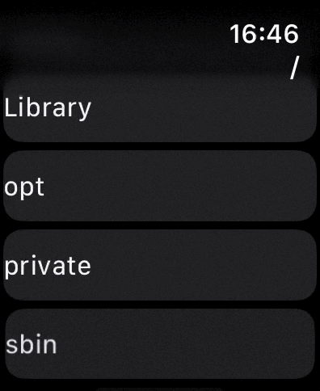
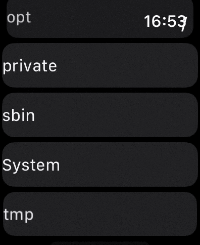
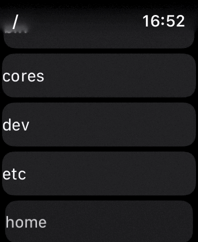

# watchOS 10 - PUICNavigationBarVisualProvider의 새로운 디자인

애플이 WWDC23에서 watchOS 10을 발표하면서 UI가 많이 바뀐다고 언급했고 이는 PepperUICore에 변화를 일으켰다. 그 중 PUICNavigationBarVisualProvider에도 변화가 생겼다. 기존에는 PUICNavigationBarVisualProvider에는 한 가지 디자인만 존재했는데, 이번에 세 가지 디자인으로 Private하게 등장했다.

이는 `-[PUICNavigationBarVisualProvider setNavigationBarDesign:]`으로 디자인을 Runtime 상에서 변경할 수 있다.

PepperUICore API (PUICNavigationController, PUICListCollectionView 등)를 직접 호출해서 만든 앱으로 해당 API를 활용해봄

아래는 기본 - 아마 SwiftUI의 기본 UI일듯

```
(lldb) expression -l objc -O -- [0x6000035040b0 setNavigationBarDesign:1]
```



아래는 상태바 무시한거

```
(lldb) expression -l objc -O -- [0x6000035040b0 setNavigationBarDesign:2]
```



아래는 Legacy 디자인

```
(lldb) expression -l objc -O -- [0x6000035040b0 setNavigationBarDesign:0]
```


